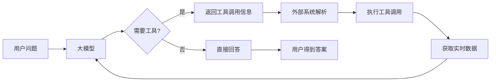

# 获取实时信息（Part 1）

## 课程概述

本课程讲解如何让大语言模型获取实时信息，解决基础聊天机器人无法访问实时数据的问题。通过工具调用机制，扩展大模型的能力边界。

## 核心问题

### 问题背景
目前的基础 Chat-GPT 版本聊天机器人存在局限性：
- 无法获取实时消息
- 无法访问外部数据源
- 知识截止于训练数据时间点

### 解决方案

#### 工具调用机制
大模型不会直接使用工具，而是返回【我要使用 XXX 工具】的信息，由外部系统解析并执行：



#### 工具箱设计方式

**早期方法：提示词工程**
- 将工具信息嵌入到系统提示词中
- 模型通过文本解析理解可用工具
- 依赖模型的推理能力选择合适工具

## 实战案例

### 1. 翻译工具实现

#### 百度翻译API集成

```javascript
// 对接百度翻译APi
const crypto = require("crypto");

const ID = process.env.BAIDU_APP_ID;
const KEY = process.env.BAIDU_SECRET_KEY;

async function translate({ input }) {
  // 学习阶段，仅支持中文翻译成英文
  const text = input.replace(/.*翻译.*?[：:]?\s*/, "").trim();
  const salt = Date.now();
  const sign = crypto
    .createHash("md5")
    .update(ID + text + salt + KEY)
    .digest("hex");

  const url = `https://fanyi-api.baidu.com/api/trans/vip/translate?q=${encodeURIComponent(
    text
  )}&from=zh&to=en&appid=${ID}&salt=${salt}&sign=${sign}`;

  const res = await fetch(url);
  const data = await res.json();
  
  if (data.trans_result?.length > 0) {
    return `翻译结果：${data.trans_result[0].dst}`;
  } else {
    return `翻译失败：${JSON.stringify(data)}`;
  }
}

module.exports = {
  translate,
};
```

#### 功能特点
- 支持中译英翻译
- 使用 MD5 签名验证
- 错误处理和结果格式化

### 2. 天气查询工具实现

#### 和风天气API集成

```javascript
// 提供天气服务的，同样是直接对接第三方服务平台
const HEFENG_API_KEY = process.env.HEFENG_API_KEY;

/**
 * 格式化天气日期
 * @param {*} text "今天"、"明天"...
 * @returns YYYY-MM-DD 格式日期
 */
function formatDate(text) {
  const today = new Date();

  if (text.includes("今天")) return today.toISOString().split("T")[0];
  if (text.includes("明天")) {
    const tomorrow = new Date(today.getTime() + 86400000);
    return tomorrow.toISOString().split("T")[0];
  }
  if (text.includes("后天")) {
    const dayAfter = new Date(today.getTime() + 2 * 86400000);
    return dayAfter.toISOString().split("T")[0];
  }

  // 英文日期格式支持
  if (text.toLowerCase().includes("today"))
    return today.toISOString().split("T")[0];
  if (text.toLowerCase().includes("tomorrow")) {
    const tomorrow = new Date(today.getTime() + 86400000);
    return tomorrow.toISOString().split("T")[0];
  }

  // 直接传入 yyyy-mm-dd 则不处理
  if (/^\d{4}-\d{2}-\d{2}$/.test(text)) return text;

  return null; // 暂不识别
}

/**
 * 获取城市位置信息
 * @param {*} city 城市的名称
 * @returns 城市的位置ID
 */
async function getCityLocation(city) {
  const url = `https://geoapi.qweather.com/v2/city/lookup?location=${encodeURIComponent(
    city
  )}&key=${HEFENG_API_KEY}`;
  
  const res = await fetch(url);
  const data = await res.json();

  if (data.code === "200" && data.location?.length > 0) {
    return data.location[0].id;
  }

  return null;
}

/**
 * 获取天气信息
 * @param {*} city 城市
 * @param {*} date 日期
 */
async function getWether({ city, date }) {
  const formattedDate = formatDate(date);
  if (!formattedDate) {
    return `无法识别日期格式："${date}"，请使用"今天"、"明天"或"后天"`;
  }

  const locationId = await getCityLocation(city);
  if (!locationId) {
    return `无法识别城市："${city}"`;
  }

  try {
    const url = `https://devapi.qweather.com/v7/weather/7d?location=${locationId}&key=${HEFENG_API_KEY}`;
    const res = await fetch(url);
    const data = await res.json();

    if (data.code !== "200") {
      return "获取天气数据失败";
    }

    const match = data.daily.find((d) => d.fxDate === formattedDate);
    if (!match) {
      return `暂无 ${formattedDate} 的天气数据`;
    }

    const result = `📍 ${city}（${formattedDate}）天气：${match.textDay}，气温 ${match.tempMin}°C ~ ${match.tempMax}°C`;
    return result;
  } catch (error) {
    return "天气查询服务暂时不可用";
  }
}

module.exports = {
  getWether,
};
```

#### 功能特点
- 智能日期解析（今天/明天/后天）
- 城市位置查询
- 7天天气预报数据获取
- 友好的错误处理

## 系统架构

### 聊天机器人后端架构

```javascript
const express = require("express");
const router = express.Router();

// 会话历史存储
const conversations = [];

// 核心问答接口
router.post("/ask", async (req, res) => {
  const question = req.body.question || "";

  // 构建包含历史记录的提示词
  const prompt = [
    "你是一个中文智能助手，请使用中文回答用户的问题。",
    ...conversations.map(
      (item) => `${item.role === "user" ? "用户" : "助手"}：${item.content}`
    ),
    `用户的问题：${question}`,
  ].join("\n");

  const response = await fetch("http://localhost:11434/api/generate", {
    method: "POST",
    headers: { "Content-Type": "application/json" },
    body: JSON.stringify({
      model: "llama3",
      prompt,
      stream: true,
    }),
  });

  // 设置SSE流响应
  res.setHeader("Content-Type", "text/event-stream");
  res.setHeader("Cache-Control", "no-cache");

  const reader = response.body.getReader();
  const decoder = new TextDecoder("utf-8");

  let fullResponse = "";

  // 处理流式响应
  while (true) {
    const { done, value } = await reader.read();
    if (done) break;

    const chunk = decoder.decode(value, { stream: true });
    const lines = chunk.split("\n").filter((line) => line.trim());

    for (const line of lines) {
      try {
        const data = JSON.parse(line);
        if (data.response) {
          fullResponse += data.response;
          res.write(`${JSON.stringify({ response: data.response })}\n`);
        }
      } catch (e) {
        console.error("JSON解析失败☹️", e.message);
      }
    }
  }

  // 保存会话历史
  conversations.push(
    { role: "user", content: question },
    { role: "assistant", content: fullResponse }
  );

  // 限制历史记录长度
  if (conversations.length > 20)
    conversations.splice(0, conversations.length - 20);

  res.end();
});
```

### 前端实现要点

#### 流式响应处理
```javascript
// Vue 3 组件中的流式响应处理
const reader = res.body?.getReader();
const decoder = new TextDecoder("utf-8");

let botMessage = "";
const newMessage = reactive({role: 'bot', text: ''});
messages.value.push(newMessage);

while(true){
  const {done, value} = await reader.read();
  if(done) break;

  const chunk = decoder.decode(value, { stream: true});
  const lines = chunk.split("\n").filter(line=>line.trim());

  for(const line of lines){
    try{
      const data = JSON.parse(line);
      if(data.response){
        if(loading.value){
          loading.value = false;
        }
        botMessage += data.response;
        newMessage.text = botMessage;
      }
    }catch(e){
      console.error("JSON解析失败☹️", e);
    }
  }
}
```

## 环境配置

### 必需的环境变量

```bash
# 百度翻译API配置
BAIDU_APP_ID=your_baidu_app_id
BAIDU_SECRET_KEY=your_baidu_secret_key

# 和风天气API配置  
HEFENG_API_KEY=your_hefeng_api_key
```

### API服务准备

1. **百度翻译API**
   - 注册百度翻译开放平台账号
   - 创建应用获取APP ID和密钥
   - 配置IP白名单（如需要）

2. **和风天气API**
   - 注册和风天气开发者账号
   - 创建应用获取API Key
   - 选择适当的API服务包

## 技术要点

### 1. 工具调用流程
```
用户输入 → 模型分析 → 工具选择 → 参数提取 → API调用 → 结果处理 → 用户响应
```

### 2. 错误处理策略
- API调用失败时的友好提示
- 参数验证和格式检查
- 日志记录便于调试

### 3. 性能优化
- 会话历史长度限制（20条）
- 流式响应提升用户体验
- 异步处理避免阻塞

## 扩展思路

### 可添加的工具类型
1. **信息查询类**
   - 股票价格查询
   - 新闻资讯获取
   - 百科知识检索

2. **计算处理类**
   - 数学计算工具
   - 数据分析工具
   - 图像处理工具

3. **生活服务类**
   - 快递查询
   - 餐厅推荐
   - 路线规划

## 总结

通过本课程学习，我们实现了：
- ✅ 大模型工具调用机制
- ✅ 实时翻译功能集成
- ✅ 天气查询功能实现
- ✅ 流式响应处理
- ✅ 会话历史管理

这为构建更强大的AI助手奠定了基础，下一步可以继续学习更高级的工具调用技巧和Function Calling功能。

---

**课程配套资源：**
- 课件资料：获取实时消息.md
- 课堂代码：chat-bot完整实现
- API文档：百度翻译、和风天气

**相关课程：**
- 下一节：获取实时信息part2（Function Calling）
- 前置课程：LLM基础知识、流式响应处理