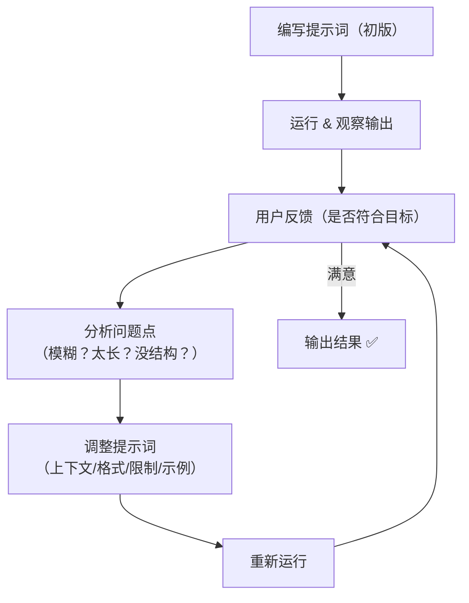

# 提示词工程：基于反馈迭代优化

在复杂任务中，单次提示往往难以得到理想结果。这时就需要用到"迭代优化技术"，即通过多轮修改和反馈，不断改进最初的提示词。

迭代优化主要分为两类：

1. **人工迭代**：由人类观察输出并调整提示词。
2. **智能迭代**：让模型自动提出改进建议。

## 人工迭代

人工迭代的核心思路是：**人类观察模型的输出 → 找出不足之处 → 修改提示词 → 再次生成 → 循环优化**。

这种方式适合在**风格、重点、结构**等方面有明确要求的任务。

### 示例一：产品介绍优化

**初始提示词（V1）**
```
请写一段学习机产品介绍。
```

**模型输出**
```
这是一款革命性的多功能学习设备，融合了AI技术与语音交互系统，能够有效提升学习效率......
```

**问题**：输出太长、太正式，不符合"轻松有趣"的目标。

**优化后的提示词（V2）**
```
用轻松有趣的语气，给大学生写一段产品介绍，不超过100字。
```

**模型输出**
```
考试周的救星来了！这款AI学习助手能语音陪聊、秒查资料，效率拉满，不卷白不卷！
```

### 示例二：财报分析优化

**初始提示词（V1）**
```
请分析以下财报数据。
```

**模型输出**
```
一大段模糊分析，遗漏关键财务指标。
```

**问题**：内容笼统，没有条理，缺少重点。

**优化后的提示词（V2）**
```
你是财务分析师，请从以下内容中提取：
1）营收增减
2）利润变化
3）核心业务亮点
用条列式输出。
```

**模型输出**
```
1. 营收同比增长12%  
2. 净利润下降5%，主要因研发投入增加  
3. 云服务业务增长显著，占总营收28%
```

### 反馈优化流程



### 提示词检查清单

- [ ] 明确任务目标（做什么）
- [ ] 指定输出形式（列表、段落、表格）
- [ ] 明确输出对象（面向谁）
- [ ] 控制输出范围（字数、限制条件）
- [ ] 给出示例或格式引导（few-shot）
- [ ] 使用上下文或背景信息
- [ ] 避免歧义（如"总结"应说明提取角度）
- [ ] 鼓励模型思考（如"分步骤"）

## 智能迭代

与人工迭代依赖人类反馈不同，**智能迭代**的核心思路是：让模型本身（或多个模型协作）自动提出提示词的改进方案。

### 多角色协作模式

一种常见做法是**角色分工**，让不同的角色分别承担不同任务：

- **审查者（Reviewer）**：对原始提示词进行打分与评价，指出不足之处
- **提问者（Asker）**：基于审查者的反馈，向用户提出澄清性问题，收集更多上下文
- **提示词生成者（Prompt Generator）**：结合原始提示词、审查意见和用户反馈，生成优化后的提示词

### 智能迭代示例

**初始提示词**
```
请阅读以下技术文章，并总结其中的关键点。
文章内容：【XXXX】
```

#### 角色 1：审查者（Reviewer）

**任务**：对当前提示词进行评价并打分。

```
评分：2/5
评价：提示词过于宽泛，没有定义"关键点"的标准，输出结果可能冗长或不聚焦；也未指定输出格式，可能导致难以阅读；没有指出受众是谁，无法判断输出该有多专业。
```

#### 角色 2：提问者（Asker）

**任务**：根据审查者反馈，提问者会询问用户更具体的一些信息。

```
什么样的信息应该被视为"关键点"？是技术原理、流程步骤，还是创新亮点？
我们是希望输出一个清单、摘要段落还是表格？
这个总结是写给谁的？是程序员、产品经理，还是普通用户？
```

#### 角色 3：提示词生成者（Prompt Generator）

**任务**：该角色会基于上面两位角色的反馈，以及原始的提示词，生成最终的提示词。

```
你是一名资深技术内容编辑，请阅读以下技术文章，并用条列方式总结关键内容，重点包括：
1）主要技术原理；
2）解决了什么问题；
3）文章中的创新亮点。
请将输出控制在200字以内，适合产品经理快速阅读。
文章内容【XXXX】
```

### 智能迭代总体流程

1. 初始提示词 → 审查者：对提示词进行评分与评价
2. 审查结果 → 提问者：基于不足提出澄清性问题，收集用户反馈
3. 提问者+用户反馈 → 提示词生成者：生成新的优化提示词
4. 终端用户确认：如果满意则交给模型执行；若不满意，则重复迭代

这种"多角色协作"的智能迭代方式，本质上是把人类反馈机制嵌入到模型对话中，让模型自己学会发现问题、提出问题、再改进提示词，从而在无需大量人工干预的情况下，实现 **自动化** 的提示词优化循环。
