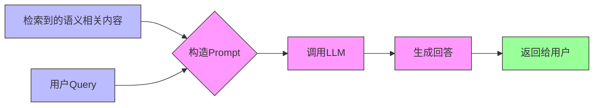

# 03-38. RAG基础知识

## 课程信息
- **课程编号**: 03-38
- **课程标题**: RAG基础知识
- **所属章节**: 第三章 - LLM基础知识
- **课时编号**: 38

## 核心概念

### 什么是RAG？
RAG，全称 **Retrieval-Augmented Generation**，中文：**检索增强生成**

**核心思想**: 为大模型补充来自于外部的相关数据与上下文，从而帮助大模型生成更丰富、更准确、更可靠的内容。

也就是 **临时给大模型外挂一个知识库**。

### 解决的问题

1. **知识更新问题**: 受限于已有知识库，无法快速新增语料信息
2. **训练成本问题**: 重新训练大模型需要很长的时间

## 实际应用案例

### 场景描述
开发一个在线的自助产品咨询工具，允许客户使用自然语言进行交互式的产品问答。

**产品示例**: 香蕉手机

**用户问题示例**:
```
请介绍一下您公司这款产品（香蕉手机）与XX产品的不同之处
```

### 直接使用通用大模型的问题
1. **知识缺失**: 大模型回答"我不知道什么是香蕉手机"
2. **幻觉问题**: 大模型胡编乱造一段回答

### 传统解决方案及其局限性
将公司资料作为提示词的一部分直接提供给大模型。

**局限性**: 如果需要外挂的知识库内容非常的多（例如一本小说几十万字），那么通过这种方式提供给大模型，大模型也不能精确的找到答案。

## RAG经典架构

简单的 RAG 应用从整体上分为两个阶段：

1. **数据索引**（Data Indexing）
2. **数据查询**（Query）
   - **检索**（Retrieval）
   - **生成**（Generation）

## 第一阶段：数据索引

### 数据索引的步骤

1. **加载文档**
2. **切分成 chunks**
3. **转化为向量嵌入**
4. **存入向量数据库**

### 文档切分策略

对输入的文档进行分割，分割成一个一个知识块（Chunk），从而为后续嵌入做准备。

#### 1. 语义结构维度
强调的是**语义完整性**，防止模型拿到"断句、不完整"的上下文。

可以按照句子的粒度进行切割，将每一段文本按句号、问号、叹号等 **标点符号** 分割。

**示例**:
- **原文**:
```
ChatGPT 是由 OpenAI 开发的大语言模型。它基于 Transformer 架构，具有强大的语言理解和生成能力。
```

- **切割后**:
```
ChatGPT 是由 OpenAI 开发的大语言模型。
```
```
它基于 Transformer 架构，具有强大的语言理解和生成能力。
```

#### 2. 实现策略维度
满足向量模型有最大词元限制，比如 OpenAI embedding 最大约 8192 词元数。

- **固定长度字符切分**: 每 N 字符为一段，适合规则性较强的文档
- **词元切分**: 每 N 个词元切一段，兼容模型的词元数限制

**注意**: 这两个策略可以组合着来使用。

### 向量转换

将每个 chunk 转换为一个"高维向量"，用来表达其语义。

每个向量通常是一个长度为 1536 或 768 的浮点数数组，例如：

```javascript
[0.112, -0.045, 0.203, ..., 0.087]  // 一个 chunk 的语义向量
```

### 向量数据库

一般会存储在功能全面的 **向量数据库** 里面，向量数据库会提供强大的向量检索算法与管理接口，这样可以很方便地对输入问题进行 **语义检索**。

#### 常见向量数据库对比

| 向量库            | 特点                       |
| ----------------- | -------------------------- |
| Supabase          | PostgreSQL + pgvector 扩展 |
| Weaviate          | 云服务 + 本地部署均可      |
| Pinecone          | 高性能、易接入             |
| Milvus            | 海量数据、高性能搜索       |
| MemoryVectorStore | 纯 JS 内存向量库（测试用） |

## 第二阶段：数据查询

数据查询阶段的两大核心阶段是 **检索** 与 **生成**。

### 检索阶段

分为下面几个步骤：

1. **向量化查询**: 将 Query（用户的问题） 转化为向量
2. **相似度检索**: 在向量数据库中进行相似度检索（语义检索）
   
   相似度的检索方式有：
   - **余弦相似度**
   - 欧氏距离
   - 点积

3. **结果准备**: 为生成阶段准备检索结果

### 生成阶段

**流程图**:


**提示词构造示例**:
```
[系统提示]：
你是一个智能客服助手，请基于以下资料回答用户的问题。

[资料内容]：
1. 本产品支持7天无理由退货。
2. 如存在质量问题，可申请退换货。
3. ...

[用户问题]：
我买的这个产品坏了还能退吗？

[你的回答]：
```

## 完整的RAG流程

1. **文档处理**: 原始文档 → 加载 → 切分 → 向量化 → 存储到向量数据库
2. **用户查询**: 用户提问 → 向量化 → 相似度检索 → 获取相关文档片段
3. **答案生成**: 将检索结果与用户问题组合 → 构造提示词 → 调用大模型 → 返回答案

## 课程总结

RAG技术通过以下方式解决了传统大模型的局限性：

1. **知识扩展**: 无需重新训练即可为模型添加新知识
2. **准确性提升**: 基于具体文档生成答案，减少幻觉
3. **成本效益**: 比重新训练模型更加经济高效
4. **实时更新**: 可以快速更新知识库内容

通过合理的数据索引和高效的检索策略，RAG技术为大模型应用提供了一个强大而灵活的知识增强方案。
