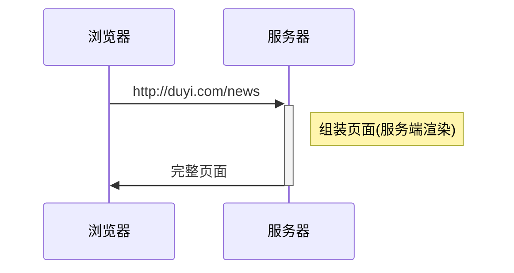
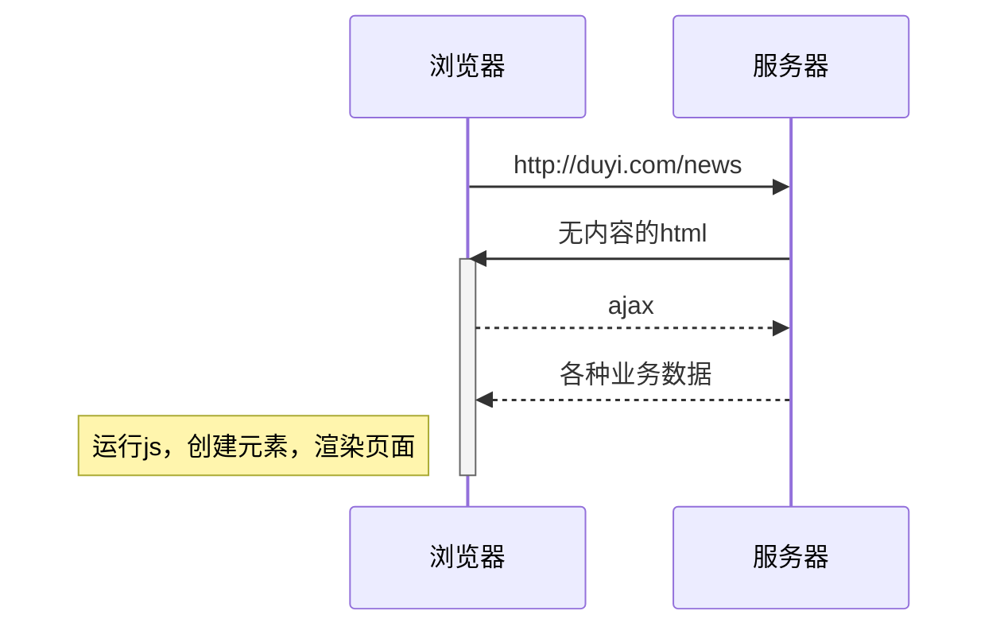
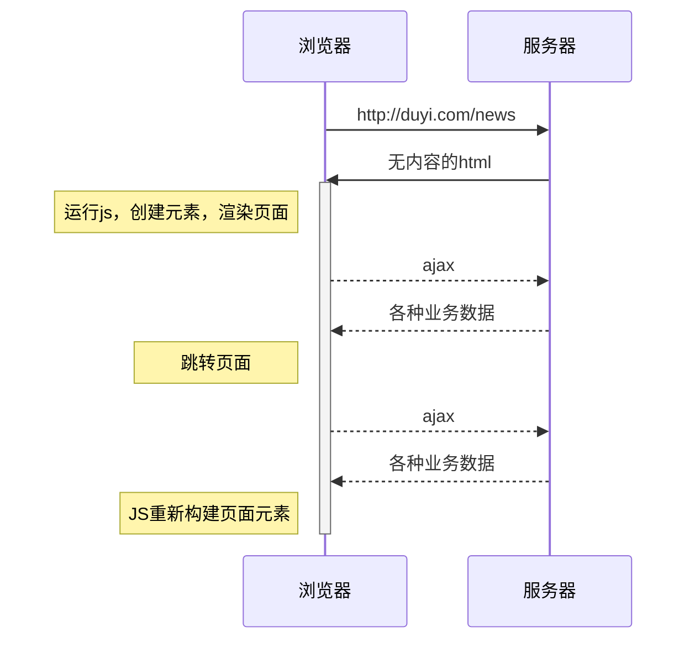
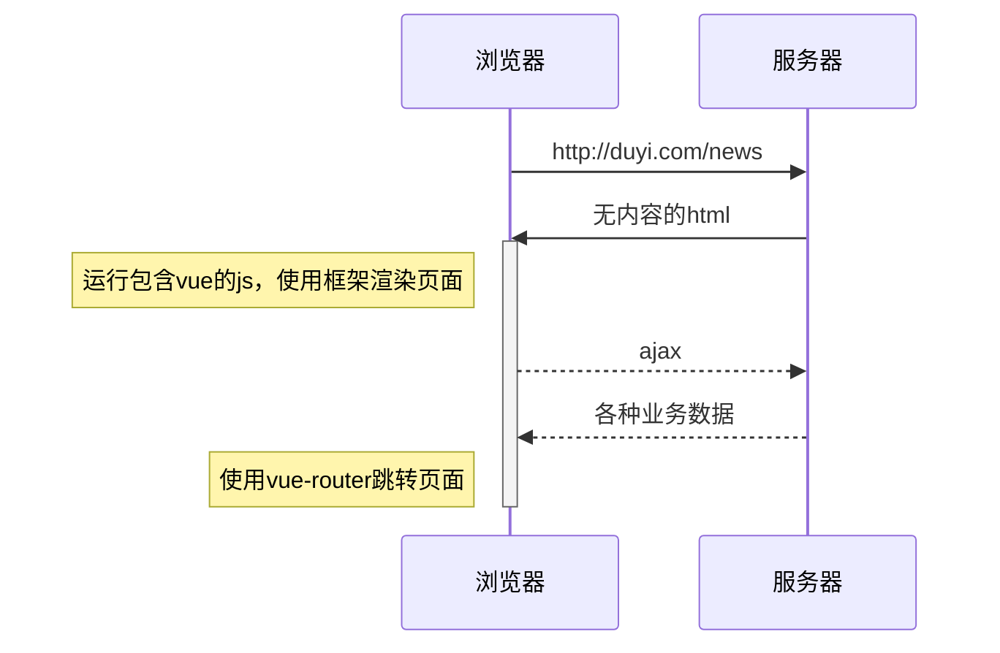

# 01. 前端框架的由来

> **Vue官网**: https://cn.vuejs.org/

## 📚 本节目标

- 理解前端开发模式的演变历程
- 掌握服务端渲染、前后端分离、单页应用的概念
- 了解为什么需要前端框架
- 理解Vue框架解决的问题

---

## 1.1 Web开发模式的演进

### 1.1.1 服务端渲染（SSR - Server Side Rendering）

**时代背景**: 早期Web开发，PHP、JSP、ASP.NET等

**工作原理**:



**特点**:
- 服务器端生成完整的HTML页面
- 浏览器直接渲染展示给用户
- 所有的业务逻辑在服务器端处理

**优点**:
- 首屏加载速度快
- SEO友好
- 对浏览器性能要求低

**缺点**:
- 服务器压力大
- 页面跳转需要重新请求整个页面
- 用户体验较差（每次跳转都有白屏）

**代码示例**（伪代码）:
```php
// 传统的服务端渲染
<?php
// 服务器端获取数据
$news = getNewsFromDatabase();

// 服务器端组装HTML
?>
<html>
<body>
    <h1>新闻列表</h1>
    <ul>
        <?php foreach($news as $item): ?>
            <li><?php echo $item['title']; ?></li>
        <?php endforeach; ?>
    </ul>
</body>
</html>
```

---

### 1.1.2 前后端分离

**时代背景**: AJAX技术成熟，Web 2.0时代

**工作原理**:



**特点**:
- 服务器只提供数据接口（API）
- 前端负责页面展示和用户交互
- 通过AJAX异步获取数据

**优点**:
- 职责分离，后端专注业务逻辑
- 前端可以独立开发和部署
- 数据获取不刷新页面，体验更好

**缺点**:
- 首屏加载需要等待JS执行
- SEO不友好
- 前端需要处理更多逻辑

**代码示例**:
```javascript
// 前后端分离模式
// HTML模板
<html>
<body>
    <h1>新闻列表</h1>
    <ul id="news-list"></ul>
    
    <script>
        // 前端通过AJAX获取数据
        fetch('/api/news')
            .then(response => response.json())
            .then(data => {
                // 前端负责DOM操作和渲染
                const list = document.getElementById('news-list');
                data.forEach(item => {
                    const li = document.createElement('li');
                    li.textContent = item.title;
                    list.appendChild(li);
                });
            });
    </script>
</body>
</html>
```

---

### 1.1.3 单页应用（SPA - Single Page Application）

**时代背景**: 复杂的Web应用需求

**工作原理**:



**特点**:
- 只加载一次HTML页面
- 页面切换不重新请求HTML
- 完全由JavaScript控制页面展示

**优点**:
- 页面切换流畅，无白屏
- 类似原生应用的体验
- 减少服务器请求

**缺点**:
- 首屏加载慢
- SEO困难
- 需要管理复杂的前端状态

**代码示例**:
```javascript
// 简单的SPA实现
class Router {
    constructor() {
        this.routes = {
            '/home': () => this.renderHome(),
            '/news': () => this.renderNews(),
            '/about': () => this.renderAbout()
        };
        
        // 监听路由变化
        window.addEventListener('hashchange', () => {
            this.handleRoute();
        });
        
        this.handleRoute(); // 初始路由
    }
    
    handleRoute() {
        const hash = window.location.hash.slice(1) || '/home';
        const handler = this.routes[hash];
        if (handler) handler();
    }
    
    navigate(path) {
        window.location.hash = path;
    }
    
    renderHome() {
        document.getElementById('app').innerHTML = '<h1>首页</h1>';
    }
    
    renderNews() {
        fetch('/api/news')
            .then(res => res.json())
            .then(data => {
                const html = data.map(item => `<li>${item.title}</li>`).join('');
                document.getElementById('app').innerHTML = `
                    <h1>新闻列表</h1>
                    <ul>${html}</ul>
                `;
            });
    }
    
    renderAbout() {
        document.getElementById('app').innerHTML = '<h1>关于我们</h1>';
    }
}

// 使用路由
const router = new Router();
```

---

## 1.2 为什么需要前端框架？

### 1.2.1 前端开发的痛点

随着Web应用越来越复杂，原生JavaScript开发面临以下问题：

1. **DOM操作繁琐**
   ```javascript
   // 原生JS需要大量DOM操作
   const list = document.getElementById('list');
   list.innerHTML = ''; // 清空
   data.forEach(item => {
       const li = document.createElement('li');
       li.textContent = item.title;
       li.className = 'news-item';
       
       const span = document.createElement('span');
       span.textContent = item.date;
       
       li.appendChild(span);
       list.appendChild(li);
   });
   ```

2. **状态管理困难**
   - 数据分散在各个变量中
   - 数据和视图不同步
   - 难以追踪状态变化

3. **组件化难以实现**
   - 代码重复严重
   - 组件间通信复杂
   - 样式和脚本耦合

4. **工程化问题**
   - 缺乏规范和最佳实践
   - 团队协作困难

### 1.2.2 前端框架的解决方案

**Vue框架的工作原理**:



**核心价值**:

1. **响应式数据绑定**
   ```vue
   <!-- Vue简化了数据和视图的绑定 -->
   <template>
     <ul>
       <li v-for="item in newsList" :key="item.id">
         {{ item.title }}
       </li>
     </ul>
   </template>
   
   <script>
   export default {
     data() {
       return {
         newsList: [] // 数据变化自动更新视图
       }
     },
     mounted() {
       fetch('/api/news').then(res => {
         this.newsList = res.data; // 直接赋值即可
       });
     }
   }
   </script>
   ```

2. **组件化开发**
   ```vue
   <!-- 组件复用变得简单 -->
   <template>
     <div>
       <NewsItem v-for="item in news" :key="item.id" :data="item" />
     </div>
   </template>
   ```

3. **路由管理**
   ```javascript
   // Vue Router提供了完善的路由方案
   const routes = [
     { path: '/home', component: Home },
     { path: '/news', component: News },
     { path: '/about', component: About }
   ];
   ```

4. **状态管理**
   ```javascript
   // Vuex/Pinia统一管理应用状态
   const store = createStore({
     state: {
       newsList: []
     },
     mutations: {
       setNews(state, payload) {
         state.newsList = payload;
       }
     }
   });
   ```

---

## 1.3 主流前端框架对比

### 1.3.1 Vue.js

**特点**:
- 渐进式框架，易学易用
- 双向数据绑定
- 组件化开发
- 中文文档完善

**适用场景**:
- 中小型项目
- 快速开发
- 团队Vue技术栈

### 1.3.2 React

**特点**:
- 单向数据流
- 虚拟DOM
- JSX语法
- Facebook维护

**适用场景**:
- 大型应用
- 需要灵活性的项目
- Facebook系公司

### 1.3.3 Angular

**特点**:
- 完整的解决方案
- TypeScript支持
- 依赖注入
- Google维护

**适用场景**:
- 企业级应用
- 大型团队
- 需要规范化

---

## 1.4 实践：对比原生JS和Vue

### 1.4.1 原生JS实现计数器

```javascript
<!DOCTYPE html>
<html>
<head>
    <title>计数器 - 原生JS</title>
</head>
<body>
    <div>
        <h1>计数: <span id="count">0</span></h1>
        <button id="increment">增加</button>
        <button id="decrement">减少</button>
        <button id="reset">重置</button>
    </div>
    
    <script>
        // 状态管理
        let count = 0;
        
        // DOM元素
        const countEl = document.getElementById('count');
        const incrementBtn = document.getElementById('increment');
        const decrementBtn = document.getElementById('decrement');
        const resetBtn = document.getElementById('reset');
        
        // 更新视图函数
        function updateView() {
            countEl.textContent = count;
        }
        
        // 事件绑定
        incrementBtn.addEventListener('click', () => {
            count++;
            updateView();
        });
        
        decrementBtn.addEventListener('click', () => {
            count--;
            updateView();
        });
        
        resetBtn.addEventListener('click', () => {
            count = 0;
            updateView();
        });
        
        // 初始化视图
        updateView();
    </script>
</body>
</html>
```

### 1.4.2 Vue实现计数器

```vue
<!DOCTYPE html>
<html>
<head>
    <title>计数器 - Vue</title>
    <script src="https://unpkg.com/vue@3/dist/vue.global.js"></script>
</head>
<body>
    <div id="app">
        <h1>计数: {{ count }}</h1>
        <button @click="increment">增加</button>
        <button @click="decrement">减少</button>
        <button @click="reset">重置</button>
    </div>
    
    <script>
        const { createApp } = Vue;
        
        createApp({
            data() {
                return {
                    count: 0
                }
            },
            methods: {
                increment() {
                    this.count++;
                },
                decrement() {
                    this.count--;
                },
                reset() {
                    this.count = 0;
                }
            }
        }).mount('#app');
    </script>
</body>
</html>
```

**对比总结**:

| 特性 | 原生JS | Vue |
|------|--------|-----|
| 代码量 | 较多 | 较少 |
| 数据绑定 | 手动更新 | 自动响应 |
| 代码结构 | 分散 | 集中 |
| 可维护性 | 一般 | 较好 |

---

## 1.5 本节总结

### 1.5.1 知识点回顾

1. **Web开发模式演变**
   - 服务端渲染 → 前后端分离 → 单页应用

2. **前端框架解决的问题**
   - 简化DOM操作
   - 响应式数据绑定
   - 组件化开发
   - 状态管理
   - 路由管理

3. **Vue的核心价值**
   - 渐进式学习曲线
   - 双向数据绑定
   - 组件化开发
   - 丰富的生态系统

### 1.5.2 下节预告

下一节我们将学习：
- Vue的基本语法
- 模板语法
- 计算属性和侦听器
- 条件渲染和列表渲染

---

## 1.6 练习题

### 1.6.1 理论题

1. 解释服务端渲染和前后端分离的区别。
2. 什么是单页应用？它有什么优缺点？
3. 为什么需要前端框架？

### 1.6.2 实践题

1. 使用原生JS实现一个待办事项列表（包含添加、删除、标记完成功能）。
2. 使用Vue 3实现相同功能，对比两者的代码差异。

---

## 参考资源

- [Vue官方文档](https://cn.vuejs.org/)
- [Vue GitHub](https://github.com/vuejs/vue)
- [前端框架发展史](https://www.infoq.cn/article/history-and-future-of-web-frameworks)
