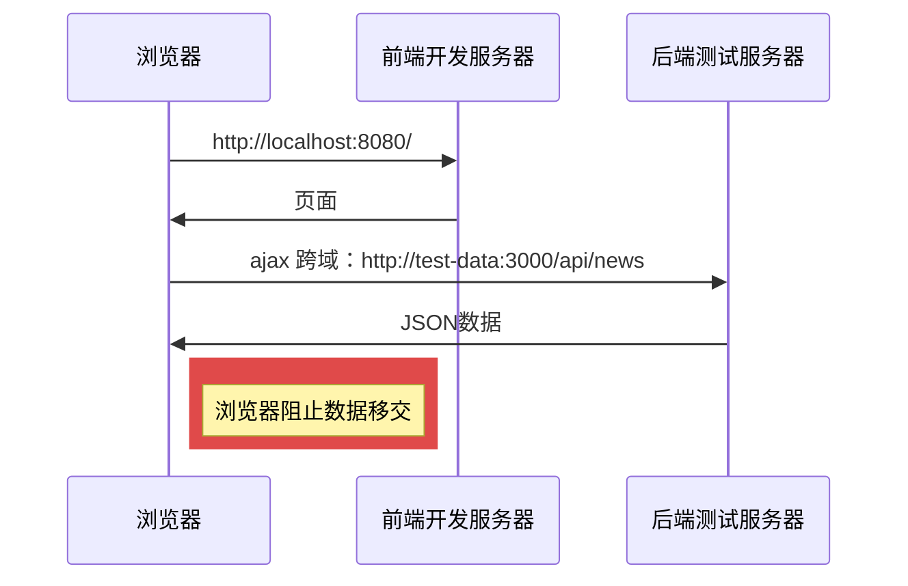
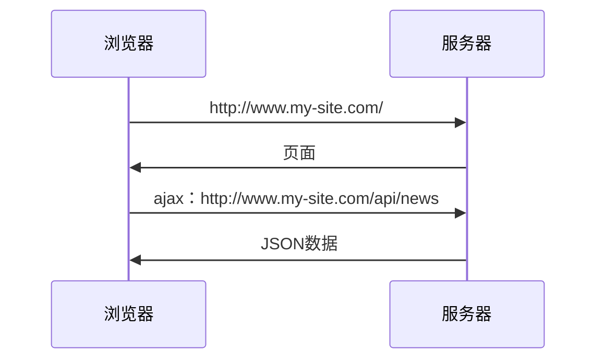
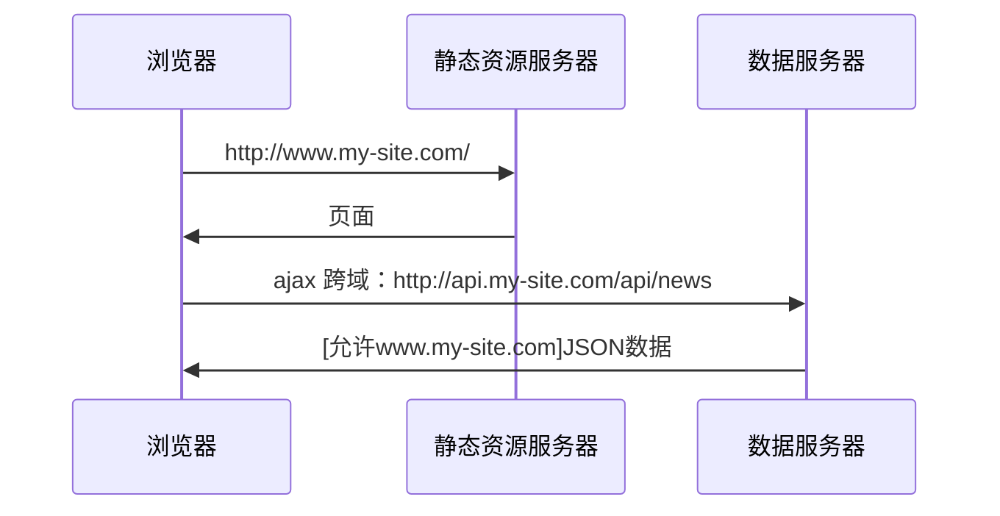
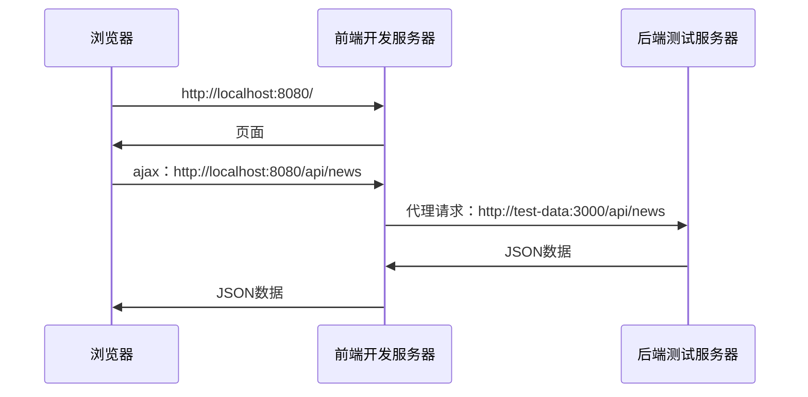
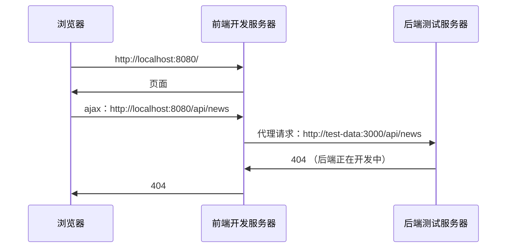
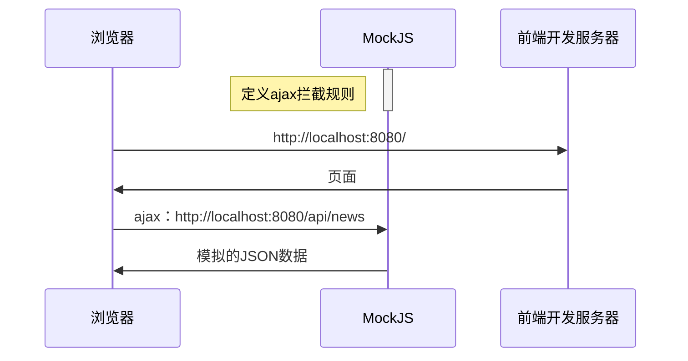

# 13. 获取远程数据

> 本节课内容和vue没有任何关系！
>
> 相关工具文档：
> - Vue CLI: https://cli.vuejs.org/zh/
> - Axios: https://github.com/axios/axios
> - MockJS: http://mockjs.com/

## 目录

1. [远程获取数据的意义](#远程获取数据的意义)
2. [开发环境的跨域问题](#开发环境的跨域问题)
3. [生产环境的跨域情况](#生产环境的跨域情况)
4. [解决开发环境的跨域问题](#解决开发环境的跨域问题)
5. [为什么要Mock数据](#为什么要mock数据)
6. [使用Axios进行HTTP请求](#使用axios进行http请求)
7. [拦截器的使用](#拦截器的使用)
8. [MockJS模拟数据](#mockjs模拟数据)

---

## 远程获取数据的意义

在现代Web应用中，前端需要从后端获取动态数据来渲染页面内容。

```
┌─────────────┐      ┌──────────────┐      ┌─────────────┐
│   浏览器    │─────>│  前端服务器  │─────>│  后端API   │
└─────────────┘      └──────────────┘      └─────────────┘
```

通过Ajax技术，前端可以异步获取数据，无需刷新页面。

---

## 开发环境的跨域问题

在开发环境中，前端开发服务器和后端API服务器通常是不同的域名或端口，这会导致跨域问题。



**跨域问题的本质**：浏览器的同源策略限制了不同源之间的请求。

---

## 生产环境的跨域情况

在生产环境中，跨域问题通常不存在或可以通过CORS解决。

### 情况1：同域请求



### 情况2：跨域但CORS允许



---

## 解决开发环境的跨域问题

使用代理服务器来解决开发环境的跨域问题。



**Vue CLI配置代理**（vue.config.js）：

```javascript
module.exports = {
  devServer: {
    proxy: {
      '/api': {
        target: 'http://test-data:3000',
        changeOrigin: true
      }
    }
  }
}
```

---

## 为什么要Mock数据

在后端API尚未开发完成时，前端可以使用Mock数据来继续开发。

### 没有Mock的问题



### 使用MockJS的好处



**MockJS的优势**：
- 前后端分离开发
- 不依赖后端API
- 可以模拟各种数据情况
- 提高开发效率

---

## 使用Axios进行HTTP请求

Axios是一个基于Promise的HTTP客户端，用于浏览器和node.js。

### 安装Axios

```bash
npm install axios
```

### 创建Axios实例

```javascript
// api/request.js
import axios from "axios";

// 创建一个axios的实例
const ins = axios.create();

export default ins;
```

### 封装API请求

```javascript
// api/banner.js
import request from "./request";

// 获取轮播图数据
export async function getBanners() {
  return await request.get("/api/banner");
}
```

### 在组件中使用

```javascript
import { getBanners } from "@/api/banner";

export default {
  async created() {
    const banners = await getBanners();
    console.log(banners);
  }
}
```

---

## 拦截器的使用

拦截器可以在请求或响应被then或catch处理前拦截它们。

### 响应拦截器

```javascript
// api/request.js
import axios from "axios";
import showMessage from "../utils/showMessage";

const ins = axios.create();

// 响应拦截器
ins.interceptors.response.use(
  function(resp) {
    // 统一处理响应数据
    if (resp.data.code !== 0) {
      // 显示错误消息
      showMessage({
        content: resp.data.msg,
        type: "error",
        duration: 1500,
      });
      return null;
    }
    // 返回实际数据
    return resp.data.data;
  }
);

export default ins;
```

### 拦截器的作用

1. **统一错误处理**：避免在每个请求中重复处理错误
2. **数据转换**：统一处理响应数据的格式
3. **请求配置**：可以添加统一的请求头、token等
4. **日志记录**：记录请求和响应信息

---

## MockJS模拟数据

### 安装MockJS

```bash
npm install mockjs
```

### 基本配置

```javascript
// mock/index.js
import Mock from "mockjs";

// 配置响应延迟，模拟网络请求
Mock.setup({
  timeout: "1000-2000", // 1-2秒延迟
});

// 导入各个模块的mock配置
import "./banner";
import "./blog";
```

### 模拟轮播图数据

```javascript
// mock/banner.js
import Mock from "mockjs";

Mock.mock("/api/banner", "get", {
  code: 0,
  msg: "",
  data: [
    {
      id: "1",
      midImg: "http://mdrs.yuanjin.tech/img/20201031141507.jpg",
      bigImg: "http://mdrs.yuanjin.tech/img/20201031141350.jpg",
      title: "凛冬将至",
      description: "人唯有恐惧的时候方能勇敢",
    },
    {
      id: "2",
      midImg: "http://mdrs.yuanjin.tech/img/20201031205550.jpg",
      bigImg: "http://mdrs.yuanjin.tech/img/20201031205551.jpg",
      title: "血火同源",
      description: "如果我回头，一切都完了",
    },
    {
      id: "3",
      midImg: "http://mdrs.yuanjin.tech/img/20201031204401.jpg",
      bigImg: "http://mdrs.yuanjin.tech/img/20201031204403.jpg",
      title: "听我怒吼",
      description: "兰尼斯特有债必偿",
    },
  ],
});
```

### 在入口文件中引入Mock

```javascript
// main.js
// 在最前面引入mock，确保mock能拦截请求
import "./mock";

import Vue from "vue";
import App from "./App.vue";
import router from "./router";

new Vue({
  router,
  render: (h) => h(App),
}).$mount("#app");
```

### MockJS的更多功能

```javascript
// 使用Mock.Random生成随机数据
import Mock from "mockjs";

const Random = Mock.Random;

Mock.mock("/api/users", "get", {
  code: 0,
  "data|10": [{  // 生成10条数据
    "id|+1": 1,  // id自增
    name: "@cname",  // 随机中文名
    email: "@email",  // 随机邮箱
    "age|18-60": 1,  // 18-60随机年龄
    avatar: function() {
      return Random.image("100x100", Random.color(), "#FFF", "Avatar");
    }
  }]
});
```

---

## 项目结构示例

```
my-site/
├── src/
│   ├── api/              # API接口封装
│   │   ├── request.js    # axios实例配置
│   │   └── banner.js     # 具体API接口
│   ├── mock/             # Mock数据配置
│   │   ├── index.js      # Mock入口配置
│   │   ├── banner.js     # 轮播图Mock
│   │   └── blog.js       # 博客Mock
│   ├── utils/            # 工具函数
│   │   └── showMessage.js # 消息提示
│   ├── views/            # 页面组件
│   └── main.js           # 入口文件
└── vue.config.js         # Vue CLI配置
```

---

## 最佳实践

1. **API封装**：将所有API请求封装到单独的模块中
2. **统一拦截**：使用拦截器统一处理响应和错误
3. **环境区分**：开发环境使用Mock，生产环境使用真实API
4. **错误处理**：统一的错误提示和处理机制
5. **类型规范**：保持API响应数据格式的一致性

---

## 总结

本节课我们学习了：

1. **跨域问题的原因**：浏览器的同源策略
2. **解决跨域的方法**：代理服务器和CORS
3. **使用Axios**：创建实例、封装API、配置拦截器
4. **MockJS的使用**：模拟后端API，提高开发效率
5. **项目组织**：合理的目录结构和模块划分

这些知识点为Vue项目的数据获取提供了完整的解决方案。
