---

<!-- Page 1 -->

Richards, Mark; Ford, Neal (2020-01-28).

## Fundamentals of Software Architecture

## Table of Contents for

## Fundamentals of Software Architecture

## Fundamentals of Software Architecture

by Neal Ford; Mark RichardsPublished by O'Reilly Media, Inc., 2020

1.  Preface: Invalidating Axioms (08:03 mins)

2.  1. Introduction (34:30 mins)

3.   I. Foundations (01:09 mins)

4.  2. Architectural Thinking (23:00 mins)

5.  3. Modularity (28:45 mins)

6.  4. Architecture Characteristics Defined (17:15 mins)

7.  5. Identifying Architectural Characteristics (20:42 mins)

8.  6. Measuring and Governing Architecture Characteristics (20:42 mins)

9.  7. Scope of Architecture Characteristics (13:48 mins)

10. 8. Component-Based Thinking (29:54 mins)

11. II. Architecture Styles (01:09 mins)

12. 9. Foundations (21:51 mins)

---

<!-- Page 2 -->

13. 10. Layered Architecture Style (17:15 mins)

14. 11. Pipeline Architecture Style (09:12 mins)

15. 12. Microkernel Architecture Style (20:42 mins)

16. 13. Service-Based Architecture Style (26:27 mins)

17. 14. Event-Driven Architecture Style (52:54 mins)

18. 15. Space-Based Architecture Style (40:15 mins)

19. 16. Orchestration-Driven Service-Oriented Architecture (12:39 mins)

20. 17. Microservices Architecture (29:54 mins)

21. 18. Choosing the Appropriate Architecture Style (17:15 mins)

22. III. Techniques and Soft Skills (01:09 mins)

23. 19. Architecture Decisions (28:45 mins)

24. 20. Analyzing Architecture Risk (31:03 mins)

25. 21. Diagramming and Presenting Architecture (16:06 mins)

26. 22. Making Teams Effective (36:48 mins)

27. 23. Negotiation and Leadership Skills (33:21 mins)

28. 24. Developing a Career Path (13:48 mins)

29. Self-Assessment Questions (11:30 mins)

30. Index (58:39 mins)

---

<!-- Page 3 -->

# Chapter 1. Introduction

The job “software architect” appears near the top of numerous lists of best jobs across the world. Yet
when readers look at the other jobs on those lists (like nurse practitioner or finance manager),
there’s a clear career path for them. Why is there no path for software architects?

First, the industry doesn’t have a good definition of software architecture itself. When we teach
foundational classes, students often ask for a concise definition of what a software architect does,
and we have adamantly refused to give one. And we’re not the only ones. In his famous
whitepaper “Who Needs an Architect?” Martin Fowler famously refused to try to define it, instead
falling back on the famous quote:

Architecture is about the important stuff…whatever that is.

## Ralph Johnson

When pressed, we created the mindmap shown in Figure 1-1, which is woefully incomplete but
indicative of the scope of software architecture. We will, in fact, offer our definition of software
architecture shortly.

Second, as illustrated in the mindmap, the role of software architect embodies a massive amount
and scope of responsibility that continues to expand. A decade ago, software architects dealt only
with the purely technical aspects of architecture, like modularity, components, and patterns. Since
then, because of new architectural styles that leverage a wider swath of capabilities (like
microservices), the role of software architect has expanded. We cover the many intersections of
architecture and the remainder of the organization in “Intersection of Architecture and…”.

---

<!-- Page 4 -->

Figure 1-1. The responsibilities of a software architect encompass technical abilities, soft skills,
operational awareness, and a host of others

Third, software architecture is a constantly moving target because of the rapidly evolving software
development ecosystem. Any definition cast today will be hopelessly outdated in a few years.
The Wikipedia definition of software architecture provides a reasonable overview, but many
statements are outdated, such as “Software architecture is about making fundamental structural
choices which are costly to change once implemented.” Yet architects designed modern architectural
styles like microservices with the idea of incremental built in—it is no longer expensive to make
structural changes in microservices. Of course, that capability means trade-offs with other concerns,
such as coupling. Many books on software architecture treat it as a static problem; once solved, we
can safely ignore it. However, we recognize the inherent dynamic nature of software architecture,
including the definition itself, throughout the book.

Fourth, much of the material about software architecture has only historical relevance. Readers of
the Wikipedia page won’t fail to notice the bewildering array of acronyms and cross-references to an
entire universe of knowledge. Yet, many of these acronyms represent outdated or failed attempts.
Even solutions that were perfectly valid a few years ago cannot work now because the context has
changed. The history of software architecture is littered with things architects have tried, only to
realize the damaging side effects. We cover many of those lessons in this book.

Why a book on software architecture fundamentals now? The scope of software architecture isn’t
the only part of the development world that constantly changes. New technologies, techniques,
capabilities…in fact, it’s easier to find things that haven’t changed over the last decade than to list all
the changes. Software architects must make decisions within this constantly changing ecosystem.
Because everything changes, including foundations upon which we make decisions, architects should
reexamine some core axioms that informed earlier writing about software architecture. For example,
earlier books about software architecture don’t consider the impact of DevOps because it didn’t exist
when these books were written.

When studying architecture, readers must keep in mind that, like much art, it can only be understood
in context. Many of the decisions architects made were based on realities of the environment they
found themselves in. For example, one of the major goals of late 20th-century architecture included
making the most efficient use of shared resources, because all the infrastructure at the time was
expensive and commercial: operating systems, application servers, database servers, and so
on. Imagine strolling into a 2002 data center and telling the head of operations “Hey, I have a great
idea for a revolutionary style of architecture, where each service runs on its own isolated machinery,
with its own dedicated database (describing what we now know as microservices). So, that means I’ll
need 50 licenses for Windows, another 30 application server licenses, and at least 50 database server
licenses.” In 2002, trying to build an architecture like microservices would be inconceivably
expensive. Yet, with the advent of open source during the intervening years, coupled with updated
engineering practices via the DevOps revolution, we can reasonably build an architecture as
described. Readers should keep in mind that all architectures are a product of their context.

## Defining Software Architecture

The industry as a whole has struggled to precisely define “software architecture.” Some architects
refer to software architecture as the blueprint of the system, while others define it as
the roadmap for developing a system. The issue with these common definitions is understanding
what the blueprint or roadmap actually contains. For example, what is analyzed when an
architect analyzes an architecture?

---

<!-- Page 5 -->

Figure 1-2 illustrates a way to think about software architecture. In this definition, software
architecture consists of the structure of the system (denoted as the heavy black lines supporting the
architecture), combined with architecture characteristics (“-ilities”) the system must
support, architecture decisions, and finally design principles.

Figure 1-2. Architecture consists of the structure combined with architecture characteristics (“-
ilities”), architecture decisions, and design principles

The structure of the system, as illustrated in Figure 1-3, refers to the type of architecture style (or
styles) the system is implemented in (such as microservices, layered, or microkernel). Describing an
architecture solely by the structure does not wholly elucidate an architecture. For example, suppose
an architect is asked to describe an architecture, and that architect responds “it’s a microservices
architecture.” Here, the architect is only talking about the structure of the system, but not
the architecture of the system. Knowledge of the architecture characteristics, architecture decisions,
and design principles is also needed to fully understand the architecture of the system.

---

<!-- Page 6 -->

Figure 1-3. Structure refers to the type of architecture styles used in the system

Architecture characteristics are another dimension of defining software architecture (see Figure 1-4).
The architecture characteristics define the success criteria of a system, which is generally orthogonal
to the functionality of the system. Notice that all of the characteristics listed do not require
knowledge of the functionality of the system, yet they are required in order for the system to
function properly. Architecture characteristics are so important that we’ve devoted several chapters
in this book to understanding and defining them.

---

<!-- Page 7 -->

Figure 1-4. Architecture characteristics refers to the “-ilities” that the system must support

The next factor that defines software architecture is architecture decisions. Architecture decisions
define the rules for how a system should be constructed. For example, an architect might make an
architecture decision that only the business and services layers within a layered architecture can
access the database (see Figure 1-5), restricting the presentation layer from making direct database
calls. Architecture decisions form the constraints of the system and direct the development teams on
what is and what isn’t allowed.

---

<!-- Page 8 -->

Figure 1-5. Architecture decisions are rules for constructing systems

If a particular architecture decision cannot be implemented in one part of the system due to some
condition or other constraint, that decision (or rule) can be broken through something called
a variance. Most organizations have variance models that are used by an architecture review board
(ARB) or chief architect. Those models formalize the process for seeking a variance to a particular
standard or architecture decision. An exception to a particular architecture decision is analyzed by
the ARB (or chief architect if no ARB exists) and is either approved or denied based on justifications
and trade-offs.

The last factor in the definition of architecture is design principles. A design principle differs from an
architecture decision in that a design principle is a guideline rather than a hard-and-fast rule. For
example, the design principle illustrated in Figure 1-6 states that the development teams should
leverage asynchronous messaging between services within a microservices architecture to increase
performance. An architecture decision (rule) could never cover every condition and option for
communication between services, so a design principle can be used to provide guidance for the
preferred method (in this case, asynchronous messaging) to allow the developer to choose a more
appropriate communication protocol (such as REST or gRPC) given a specific circumstance.

---

<!-- Page 9 -->

Figure 1-6. Design principles are guidelines for constructing systems

## Expectations of an Architect

Defining the role of a software architect presents as much difficulty as defining software
architecture. It can range from expert programmer up to defining the strategic technical direction for
the company. Rather than waste time on the fool’s errand of defining the role, we recommend
focusing on the expectations of an architect.

There are eight core expectations placed on a software architect, irrespective of any given role, title,
or job description:

•  Make architecture decisions

•   Continually analyze the architecture

•  Keep current with latest trends

•   Ensure compliance with decisions

•   Diverse exposure and experience

•  Have business domain knowledge

•   Possess interpersonal skills

•   Understand and navigate politics

The first key to effectiveness and success in the software architect role depends on understanding
and practicing each of these expectations.

---

<!-- Page 10 -->

## Make Architecture Decisions

An architect is expected to define the architecture decisions and design principles used to guide
technology decisions within the team, the department, or across the enterprise.

Guide is the key operative word in this first expectation. An architect should guide rather
than specify technology choices. For example, an architect might make a decision to use React.js for
frontend development. In this case, the architect is making a technical decision rather than an
architectural decision or design principle that will help the development team make choices. An
architect should instead instruct development teams to use a reactive-based framework for frontend
web development, hence guiding the development team in making the choice between Angular, Elm,
React.js, Vue, or any of the other reactive-based web frameworks.

Guiding technology choices through architecture decisions and design principles is difficult. The key
to making effective architectural decisions is asking whether the architecture decision is helping
to guide teams in making the right technical choice or whether the architecture decision makes the
technical choice for them. That said, an architect on occasion might need to make specific technology
decisions in order to preserve a particular architectural characteristic such as scalability,
performance, or availability. In this case it would be still considered an architectural decision, even
though it specifies a particular technology. Architects often struggle with finding the correct line,
so Chapter 19 is entirely about architecture decisions.

## Continually Analyze the Architecture

An architect is expected to continually analyze the architecture and current technology environment
and then recommend solutions for improvement.

This expectation of an architect refers to architecture vitality, which assesses how viable the
architecture that was defined three or more years ago is today, given changes in both business and
technology. In our experience, not enough architects focus their energies on continually analyzing
existing architectures. As a result, most architectures experience elements of structural decay, which
occurs when developers make coding or design changes that impact the required architectural
characteristics, such as performance, availability, and scalability.

Other forgotten aspects of this expectation that architects frequently forget are testing and release
environments. Agility for code modification has obvious benefits, but if it takes teams weeks to test
changes and months for releases, then architects cannot achieve agility in the overall architecture.

An architect must holistically analyze changes in technology and problem domains to determine the
soundness of the architecture. While this kind of consideration rarely appears in a job posting,
architects must meet this expectation to keep applications relevant.

## Keep Current with Latest Trends

An architect is expected to keep current with the latest technology and industry trends.

Developers must keep up to date on the latest technologies they use on a daily basis to remain
relevant (and to retain a job!). An architect has an even more critical requirement to keep current on
the latest technical and industry trends. The decisions an architect makes tend to be long-lasting and
difficult to change. Understanding and following key trends helps the architect prepare for the future
and make the correct decision.

---

<!-- Page 11 -->

Tracking trends and keeping current with those trends is hard, particularly for a software architect.
In Chapter 24 we discuss various techniques and resources on how to do this.

## Ensure Compliance with Decisions

An architect is expected to ensure compliance with architecture decisions and design principles.

Ensuring compliance means that the architect is continually verifying that development teams are
following the architecture decisions and design principles defined, documented, and communicated
by the architect. Consider the scenario where an architect makes a decision to restrict access to the
database in a layered architecture to only the business and services layers (and not the presentation
layer). This means that the presentation layer must go through all layers of the architecture to make
even the simplest of database calls. A user interface developer might disagree with this decision and
access the database (or the persistence layer) directly for performance reasons. However, the
architect made that architecture decision for a specific reason: to control change. By closing the
layers, database changes can be made without impacting the presentation layer. By not ensuring
compliance with architecture decisions, violations like this can occur, the architecture will not meet
the required architectural characteristics (“-ilities”), and the application or system will not work as
expected.

In Chapter 6 we talk more about measuring compliance using automated fitness functions and
automated tools.

## Diverse Exposure and Experience

An architect is expected to have exposure to multiple and diverse technologies, frameworks,
platforms, and environments.

This expectation does not mean an architect must be an expert in every framework, platform, and
language, but rather that an architect must at least be familiar with a variety of technologies. Most
environments these days are heterogeneous, and at a minimum an architect should know how to
interface with multiple systems and services, irrespective of the language, platform, and technology
those systems or services are written in.

One of the best ways of mastering this expectation is for the architect to stretch their comfort zone.
Focusing only on a single technology or platform is a safe haven. An effective software architect
should be aggressive in seeking out opportunities to gain experience in multiple languages,
platforms, and technologies. A good way of mastering this expectation is to focus on technical
breadth rather than technical depth. Technical breadth includes the stuff you know about, but not at
a detailed level, combined with the stuff you know a lot about. For example, it is far more valuable
for an architect to be familiar with 10 different caching products and the associated pros and cons of
each rather than to be an expert in only one of them.

## Have Business Domain Knowledge

An architect is expected to have a certain level of business domain expertise.

Effective software architects understand not only technology but also the business domain of a
problem space. Without business domain knowledge, it is difficult to understand the business
problem, goals, and requirements, making it difficult to design an effective architecture to meet the
requirements of the business. Imagine being an architect at a large financial institution and not
understanding common financial terms such as an average directional index, aleatory contracts, rates

---

<!-- Page 12 -->

rally, or even nonpriority debt. Without this knowledge, an architect cannot communicate with
stakeholders and business users and will quickly lose credibility.

The most successful architects we know are those who have broad, hands-on technical knowledge
coupled with a strong knowledge of a particular domain. These software architects are able to
effectively communicate with C-level executives and business users using the domain knowledge and
language that these stakeholders know and understand. This in turn creates a strong level of
confidence that the software architect knows what they are doing and is competent to create an
effective and correct architecture.

## Possess Interpersonal Skills

An architect is expected to possess exceptional interpersonal skills, including teamwork, facilitation,
and leadership.

Having exceptional leadership and interpersonal skills is a difficult expectation for most developers
and architects. As technologists, developers and architects like to solve technical problems, not
people problems. However, as Gerald Weinberg was famous for saying, “no matter what they tell
you, it’s always a people problem.” An architect is not only expected to provide technical guidance to
the team, but is also expected to lead the development teams through the implementation of the
architecture. Leadership skills are at least half of what it takes to become an effective software
architect, regardless of the role or title the architect has.

The industry is flooded with software architects, all competing for a limited number of architecture
positions. Having strong leadership and interpersonal skills is a good way for an architect to
differentiate themselves from other architects and stand out from the crowd. We’ve known many
software architects who are excellent technologists but are ineffective architects due to the inability
to lead teams, coach and mentor developers, and effectively communicate ideas and architecture
decisions and principles. Needless to say, those architects have difficulties holding a position or job.

## Understand and Navigate Politics

An architect is expected to understand the political climate of the enterprise and be able to navigate
the politics.

It might seem rather strange talk about negotiation and navigating office politics in a book about
software architecture. To illustrate how important and necessary negotiation skills are, consider the
scenario where a developer makes the decision to leverage the strategy pattern to reduce the overall
cyclomatic complexity of a particular piece of complex code. Who really cares? One might applaud
the developer for using such a pattern, but in almost all cases the developer does not need to seek
approval for such a decision.

Now consider the scenario where an architect, responsible for a large customer relationship
management system, is having issues controlling database access from other systems, securing
certain customer data, and making any database schema change because too many other systems
are using the CRM database. The architect therefore makes the decision to create what are
called application silos, where each application database is only accessible from the application
owning that database. Making this decision will give the architect better control over the customer
data, security, and change control. However, unlike the previous developer scenario, this decision
will also be challenged by almost everyone in the company (with the possible exception of the CRM
application team, of course). Other applications need the customer management data. If those
applications are no longer able to access the database directly, they must now ask the CRM system

---

<!-- Page 13 -->

for the data, requiring remote access calls through REST, SOAP, or some other remote access
protocol.

The main point is that almost every decision an architect makes will be challenged. Architectural
decisions will be challenged by product owners, project managers, and business stakeholders due to
increased costs or increased effort (time) involved. Architectural decisions will also be challenged by
developers who feel their approach is better. In either case, the architect must navigate the politics
of the company and apply basic negotiation skills to get most decisions approved. This fact can be
very frustrating to a software architect, because most decisions made as a developer did not require
approval or even a review. Programming aspects such as code structure, class design, design pattern
selection, and sometimes even language choice are all part of the art of programming. However, an
architect, now able to finally be able to make broad and important decisions, must justify and fight
for almost every one of those decisions. Negotiation skills, like leadership skills, are so critical and
necessary that we’ve dedicated an entire chapter in the book to understanding them
(see Chapter 23).

Intersection of Architecture and…

The scope of software architecture has grown over the last decade to encompass more and more
responsibility and perspective. A decade ago, the typical relationship between architecture and
operations was contractual and formal, with lots of bureaucracy. Most companies, trying to avoid the
complexity of hosting their own operations, frequently outsourced operations to a third-party
company, with contractual obligations for service-level agreements, such as uptime, scale,
responsiveness, and a host of other important architectural characteristics. Now, architectures such
as microservices freely leverage former solely operational concerns. For example, elastic scale was
once painfully built into architectures (see Chapter 15), while microservices handled it less painfully
via a liaison between architects and DevOps.

HISTORY: PETS.COM AND WHY WE HAVE ELASTIC SCALE

The history of software development contains rich lessons, both good and bad. We assume that
current capabilities (like elastic scale) just appeared one day because of some clever developer, but
those ideas were often born of hard lessons. Pets.com represents an early example of hard lessons
learned. Pets.com appeared in the early days of the internet, hoping to become the Amazon.com of
pet supplies. Fortunately, they had a brilliant marketing department, which invented a compelling
mascot: a sock puppet with a microphone that said irreverent things. The mascot became a
superstar, appearing in public at parades and national sporting events.

Unfortunately, management at Pets.com apparently spent all the money on the mascot, not on
infrastructure. Once orders started pouring in, they weren’t prepared. The website was slow,
transactions were lost, deliveries delayed, and so on…pretty much the worst-case scenario. So bad, in
fact, that the business closed shortly after its disastrous Christmas rush, selling the only remaining
valuable asset (the mascot) to a competitor.

What the company needed was elastic scale: the ability to spin up more instances of resources, as
needed. Cloud providers offer this feature as a commodity, but in the early days of the internet,
companies had to manage their own infrastructure, and many fell victim to a previously unheard of
phenomenon: too much success can kill the business. Pets.com and other similar horror stories led
engineers to develop the frameworks that architects enjoy now.

---

<!-- Page 14 -->

The following sections delve into some of the newer intersections between the role of architect and
other parts of an organization, highlighting new capabilities and responsibilities for architects.

## Engineering Practices

Traditionally, software architecture was separate from the development process used to create
software. Dozens of popular methodologies exist to build software, including Waterfall and many
flavors of Agile (such as Scrum, Extreme Programming, Lean, and Crystal), which mostly don’t impact
software architecture.

However, over the last few years, engineering advances have thrust process concerns upon software
architecture. It is useful to separate software development process from engineering practices.
By process, we mean how teams are formed and managed, how meetings are conducted, and
workflow organization; it refers to the mechanics of how people organize and interact.
Software engineering practices, on the other hand, refer to process-agnostic practices that have
illustrated, repeatable benefit. For example, continuous integration is a proven engineering practice
that doesn’t rely on a particular process.

## THE PATH FROM EXTREME PROGRAMMING TO CONTINUOUS DELIVERY

The origins of Extreme Programming (XP) nicely illustrate the difference
between process and engineering. In the early 1990s, a group of experienced software
developers, led by Kent Beck, started questioning the dozens of different development processes
popular at the time. In their experience, it seemed that none of them created repeatably good
outcomes. One of the XP founders said that choosing one of the extant processes was “no more
guarantee of project success than flipping a coin.” They decided to rethink how to build software,
and they started the XP project in March of 1996. To inform their process, they rejected the
conventional wisdom and focused on the practices that led to project success in the past, pushed to
the extreme. Their reasoning was that they’d seen a correlation on previous projects between more
tests and higher quality. Thus, the XP approach to testing took the practice to the extreme: do testfirst development, ensuring that all code is tested before it enters the code base.

XP was lumped into other popular Agile processes that shared similar perspectives, but it was one of
the few methodologies that included engineering practices such as automation, testing, continuous
integration, and other concrete, experienced-based techniques. The efforts to continue advancing
the engineering side of software development continued with the book Continuous
Delivery (Addison-Wesley Professional)—an updated version of many XP practices—and came to
fruition in the DevOps movement. In many ways, the DevOps revolution occurred when operations
adopted engineering practices originally espoused by XP: automation, testing, declarative single
source of truth, and others.

We strongly support these advances, which form the incremental steps that will eventually graduate
software development into a proper engineering discipline.

Focusing on engineering practices is important. First, software development lacks many of the
features of more mature engineering disciplines. For example, civil engineers can predict structural
change with much more accuracy than similarly important aspects of software structure. Second, one
of the Achilles heels of software development is estimation—how much time, how many resources,
how much money? Part of this difficulty lies with antiquated accounting practices that cannot
accommodate the exploratory nature of software development, but another part is because we’re
traditionally bad at estimation, at least in part because of unknown unknowns.

---

<!-- Page 15 -->

…because as we know, there are known knowns; there are things we know we know. We also know
there are known unknowns; that is to say we know there are some things we do not know. But there
are also unknown unknowns—the ones we don’t know we don’t know.

## Former United States Secretary of Defense Donald Rumsfeld

Unknown unknowns are the nemesis of software systems. Many projects start with a list of known
unknowns: things developers must learn about the domain and technology they know are upcoming.
However, projects also fall victim to unknown unknowns: things no one knew were going to crop up
yet have appeared unexpectedly. This is why all “Big Design Up Front” software efforts suffer:
architects cannot design for unknown unknowns. To quote Mark (one of your authors):

All architectures become iterative because of unknown unknowns, Agile just recognizes this and does
it sooner.

Thus, while process is mostly separate from architecture, an iterative process fits the nature of
software architecture better. Teams trying to build a modern system such as microservices using an
antiquated process like Waterfall will find a great deal of friction from an antiquated process that
ignores the reality of how software comes together.

Often, the architect is also the technical leader on projects and therefore determines the engineering
practices the team uses. Just as architects must carefully consider the problem domain before
choosing an architecture, they must also ensure that the architectural style and engineering practices
form a symbiotic mesh. For example, a microservices architecture assumes automated machine
provisioning, automated testing and deployment, and a raft of other assumptions. Trying to build
one of these architectures with an antiquated operations group, manual processes, and little testing
creates tremendous friction and challenges to success. Just as different problem domains lend
themselves toward certain architectural styles, engineering practices have the same kind of
symbiotic relationship.

The evolution of thought leading from Extreme Programming to Continuous Delivery continues.
Recent advances in engineering practices allow new capabilities within architecture. Neal’s most
recent book, Building Evolutionary Architectures (O’Reilly), highlights new ways to think about the
intersection of engineering practices and architecture, allowing better automation of architectural
governance. While we won’t summarize that book here, it gives an important new nomenclature and
way of thinking about architectural characteristics that will infuse much of the remainder of this
book. Neal’s book covers techniques for building architectures that change gracefully over time.
In Chapter 4, we describe architecture as the combination of requirements and additional concerns,
as illustrated in Figure 1-7.

Figure 1-7. The architecture for a software system consists of both requirements and all the other
architectural characteristics

As any experience in the software development world illustrates, nothing remains static. Thus,
architects may design a system to meet certain criteria, but that design must survive both
implementation (how can architects make sure that their design is implemented correctly) and the

---

<!-- Page 16 -->

inevitable change driven by the software development ecosystem. What we need is an evolutionary
architecture.

Building Evolutionary Architectures introduces the concept of using fitness functions to protect (and
govern) architectural characteristics as change occurs over time. The concept comes from
evolutionary computing. When designing a genetic algorithm, developers have a variety of
techniques to mutate the solution, evolving new solutions iteratively. When designing such an
algorithm for a specific goal, developers must measure the outcome to see if it is closer or further
away from an optimal solution; that measure is a fitness function. For example, if developers
designed a genetic algorithm to solve the traveling salesperson problem (whose goal is the shortest
route between various cities), the fitness function would look at the path length.

Building Evolutionary Architectures co-opts this idea to create architectural fitness functions: an
objective integrity assessment of some architectural characteristic(s). This assessment may include a
variety of mechanisms, such as metrics, unit tests, monitors, and chaos engineering. For example, an
architect may identify page load time as an importance characteristic of the architecture. To allow
the system to change without degrading performance, the architecture builds a fitness function as a
test that measures page load time for each page and then runs the test as part of the continuous
integration for the project. Thus, architects always know the status of critical parts of the
architecture because they have a verification mechanism in the form of fitness functions for each
part.

We won’t go into the full details of fitness functions here. However, we will point out opportunities
and examples of the approach where applicable. Note the correlation between how often fitness
functions execute and the feedback they provide. You’ll see that adopting Agile engineering practices
such as continuous integration, automated machine provisioning, and similar practices makes
building resilient architectures easier. It also illustrates how intertwined architecture has become
with engineering practices.

## Operations/DevOps

The most obvious recent intersection between architecture and related fields occurred with the
advent of DevOps, driven by some rethinking of architectural axioms. For many years, many
companies considered operations as a separate function from software development; they often
outsource operations to another company as a cost-saving measure. Many architectures designed
during the 1990s and 2000s assumed that architects couldn’t control operations and were built
defensively around that restriction (for a good example of this, see Space-Based Architecture
in Chapter 15).

However, a few years ago, several companies started experimenting with new forms of architecture
that combine many operational concerns with the architecture. For example, in older-style
architectures, such as ESB-driven SOA, the architecture was designed to handle things like elastic
scale, greatly complicating the architecture in the process. Basically, architects were forced to
defensively design around the limitations introduced because of the cost-saving measure of
outsourcing operations. Thus, they built architectures that could handle scale, performance,
elasticity, and a host of other capabilities internally. The side effect of that design was vastly more
complex architecture.

The builders of the microservices style of architecture realized that these operational concerns are
better handled by operations. By creating a liaison between architecture and operations, the
architects can simplify the design and rely on operations for the things they handle best. Thus,

---

<!-- Page 17 -->

realizing a misappropriation of resources led to accidental complexity, and architects and operations
teamed up to create microservices, the details of which we cover in Chapter 17.

## Process

Another axiom is that software architecture is mostly orthogonal to the software development
process; the way that you build software (process) has little impact on the software architecture
(structure). Thus, while the software development process a team uses has some impact on software
architecture (especially around engineering practices), historically they have been thought of as
mostly separate. Most books on software architecture ignore the software development process,
making specious assumptions about things like predictability. However, the process by which teams
develop software has an impact on many facets of software architecture. For example, many
companies over the last few decades have adopted Agile development methodologies because of the
nature of software. Architects in Agile projects can assume iterative development and therefore a
faster feedback loop for decisions. That in turn allows architects to be more aggressive about
experimentation and other knowledge that relies on feedback.

As the previous quote from Mark observes, all architecture becomes iterative; it’s only a matter of
time. Toward that end, we’re going assume a baseline of Agile methodologies throughout and call
out exceptions where appropriate. For example, it is still common for many monolithic architectures
to use older processes because of their age, politics, or other mitigating factors unrelated to
software.

One critical aspect of architecture where Agile methodologies shine is restructuring. Teams often find
that they need to migrate their architecture from one pattern to another. For example, a team
started with a monolithic architecture because it was easy and fast to bootstrap, but now they need
to move it to a more modern architecture. Agile methodologies support these kinds of changes
better than planning-heavy processes because of the tight feedback loop and encouragement of
techniques like the Strangler Pattern and feature toggles.

## Data

A large percentage of serious application development includes external data storage, often in the
form of a relational (or, increasingly, NoSQL) database. However, many books about software
architecture include only a light treatment of this important aspect of architecture. Code and data
have a symbiotic relationship: one isn’t useful without the other.

Database administrators often work alongside architects to build data architecture for complex
systems, analyzing how relationships and reuse will affect a portfolio of applications. We won’t delve
into that level of specialized detail in this book. At the same time, we won’t ignore the existence and
dependence on external storage. In particular, when we talk about the operational aspects of
architecture and architectural quantum (see Chapter 3), we include important external concerns such
as databases.

## Laws of Software Architecture

While the scope of software architecture is almost impossibly broad, unifying elements do exist. The
authors have first and foremost learned the First Law of Software Architecture by constantly
stumbling across it:

Everything in software architecture is a trade-off.

First Law of Software Architecture

---

<!-- Page 18 -->

Nothing exists on a nice, clean spectrum for software architects. Every decision must take into
account many opposing factors.

If an architect thinks they have discovered something that isn’t a trade-off, more likely they just
haven’t identified the trade-off yet.

## Corollary 1

We define software architecture in terms beyond structural scaffolding, incorporating principles,
characteristics, and so on. Architecture is broader than just the combination of structural elements,
reflected in our Second Law of Software Architecture:

Why is more important than how.

## Second Law of Software Architecture

The authors discovered the importance of this perspective when we tried keeping the results of
exercises done by students during workshop as they crafted architecture solutions. Because the
exercises were timed, the only artifacts we kept were the diagrams representing the topology. In
other words, we captured how they solved the problem but not why the team made particular
choices. An architect can look at an existing system they have no knowledge of and ascertain how the
structure of the architecture works, but will struggle explaining why certain choices were made
versus others.

Throughout the book, we highlight why architects make certain decisions along with trade-offs. We
also highlight good techniques for capturing important decisions in “Architecture Decision Records”.

You have 6 days left in your trial, Samjobara. Subscribe today. See pricing options.

---

<!-- Page 19 -->

# Chapter 2. Architectural Thinking

An architect sees things differently from a developer’s point of view, much in the same way a
meteorologist might see clouds differently from an artist’s point of view. This is called architectural
thinking. Unfortunately, too many architects believe that architectural thinking is simply just
“thinking about the architecture.”

Architectural thinking is much more than that. It is seeing things with an architectural eye, or an
architectural point of view. There are four main aspects of thinking like an architect. First, it’s
understanding the difference between architecture and design and knowing how to collaborate with
development teams to make architecture work. Second, it’s about having a wide breadth of technical
knowledge while still maintaining a certain level of technical depth, allowing the architect to see
solutions and possibilities that others do not see. Third, it’s about understanding, analyzing, and
reconciling trade-offs between various solutions and technologies. Finally, it’s about understanding
the importance of business drivers and how they translate to architectural concerns.

In this chapter we explore these four aspects of thinking like an architect and seeing things with an
architectural eye.

## Architecture Versus Design

The difference between architecture and design is often a confusing one. Where does architecture
end and design begin? What responsibilities does an architect have versus those of a developer?
Thinking like an architect is knowing the difference between architecture and design and seeing how
the two integrate closely to form solutions to business and technical problems.

Consider Figure 2-1, which illustrates the traditional responsibilities an architect has, as compared to
those of a developer. As shown in the diagram, an architect is responsible for things like analyzing
business requirements to extract and define the architectural characteristics (“-ilities”), selecting
which architecture patterns and styles would fit the problem domain, and creating components (the
building blocks of the system). The artifacts created from these activities are then handed off to the
development team, which is responsible for creating class diagrams for each component, creating
user interface screens, and developing and testing source code.

---

<!-- Page 20 -->

Figure 2-1. Traditional view of architecture versus design

There are several issues with the traditional responsibility model illustrated in Figure 2-1. As a matter
of fact, this illustration shows exactly why architecture rarely works. Specifically, it is the
unidirectional arrow passing though the virtual and physical barriers separating the architect from
the developer that causes all of the problems associated with architecture. Decisions an architect
makes sometimes never make it to the development teams, and decisions development teams make
that change the architecture rarely get back to the architect. In this model the architect is
disconnected from the development teams, and as such the architecture rarely provides what it was
originally set out to do.

To make architecture work, both the physical and virtual barriers that exist between architects and
developers must be broken down, thus forming a strong bidirectional relationship between
architects and development teams. The architect and developer must be on the same virtual team to
make this work, as depicted in Figure 2-2. Not only does this model facilitate strong bidirectional
communication between architecture and development, but it also allows the architect to provide
mentoring and coaching to developers on the team.

---

<!-- Page 21 -->

Figure 2-2. Making architecture work through collaboration

Unlike the old-school waterfall approaches to static and rigid software architecture, the architecture
of today’s systems changes and evolves every iteration or phase of a project. A tight collaboration
between the architect and the development team is essential for the success of any software project.
So where does architecture end and design begin? It doesn’t. They are both part of the circle of life
within a software project and must always be kept in synchronization with each other in order
to succeed.

## Technical Breadth

The scope of technological detail differs between developers and architects. Unlike a developer, who
must have a significant amount of technical depth to perform their job, a software architect must
have a significant amount of technical breadth to think like an architect and see things with an
architecture point of view. This is illustrated by the knowledge pyramid shown in Figure 2-3, which
encapsulates all the technical knowledge in the world. It turns out that the kind of information a
technologist should value differs with career stages.

---

<!-- Page 22 -->

Figure 2-3. The pyramid representing all knowledge

As shown in Figure 2-3, any individual can partition all their knowledge into three sections: stuff you
know, stuff you know you don’t know, and stuff you don’t know you don’t know.

Stuff you know includes the technologies, frameworks, languages, and tools a technologist uses on a
daily basis to perform their job, such as knowing Java as a Java programmer. Stuff you know you
don’t know includes those things a technologist knows a little about or has heard of but has little or
no expertise in. A good example of this level of knowledge is the Clojure programming language.
Most technologists have heard of Clojure and know it’s a programming language based on Lisp, but
they can’t code in the language. Stuff you don’t know you don’t know is the largest part of the
knowledge triangle and includes the entire host of technologies, tools, frameworks, and languages
that would be the perfect solution to a problem a technologist is trying to solve, but the technologist
doesn’t even know those things exist.

A developer’s early career focuses on expanding the top of the pyramid, to build experience and
expertise. This is the ideal focus early on, because developers need more perspective, working
knowledge, and hands-on experience. Expanding the top incidentally expands the middle section; as
developers encounter more technologies and related artifacts, it adds to their stock of stuff you know
you don’t know.

In Figure 2-4, expanding the top of the pyramid is beneficial because expertise is valued. However,
the stuff you know is also the stuff you must maintain—nothing is static in the software world. If a
developer becomes an expert in Ruby on Rails, that expertise won’t last if they ignore Ruby on Rails

---

<!-- Page 23 -->

for a year or two. The things at the top of the pyramid require time investment to maintain expertise.
Ultimately, the size of the top of an individual’s pyramid is their technical depth.

Figure 2-4. Developers must maintain expertise to retain it

However, the nature of knowledge changes as developers transition into the architect role. A large
part of the value of an architect is a broad understanding of technology and how to use it to solve
particular problems. For example, as an architect, it is more beneficial to know that five solutions
exist for a particular problem than to have singular expertise in only one. The most important parts
of the pyramid for architects are the top and middle sections; how far the middle section penetrates
into the bottom section represents an architect’s technical breadth, as shown in Figure 2-5.

---

<!-- Page 24 -->

Figure 2-5. What someone knows is technical depth, and how much someone knows is technical
breadth

As an architect, breadth is more important than depth. Because architects must make decisions that
match capabilities to technical constraints, a broad understanding of a wide variety of solutions is
valuable. Thus, for an architect, the wise course of action is to sacrifice some hard-won expertise and
use that time to broaden their portfolio, as shown in Figure 2-6. As illustrated in the diagram, some
areas of expertise will remain, probably in particularly enjoyable technology areas, while others
usefully atrophy.

---

<!-- Page 25 -->

Figure 2-6. Enhanced breadth and shrinking depth for the architect role

Our knowledge pyramid illustrates how fundamentally different the role of architect compares
to developer. Developers spend their whole careers honing expertise, and transitioning to the
architect role means a shift in that perspective, which many individuals find difficult. This in turn
leads to two common dysfunctions: first, an architect tries to maintain expertise in a wide variety of
areas, succeeding in none of them and working themselves ragged in the process. Second, it
manifests as stale expertise—the mistaken sensation that your outdated information is still cutting
edge. We see this often in large companies where the developers who founded the company have
moved into leadership roles yet still make technology decisions using ancient criteria (see “Frozen
Caveman Anti-Pattern”).

Architects should focus on technical breadth so that they have a larger quiver from which to draw
arrows. Developers transitioning to the architect role may have to change the way they view
knowledge acquisition. Balancing their portfolio of knowledge regarding depth versus breadth is
something every developer should consider throughout their career.

## FROZEN CAVEMAN ANTI-PATTERN

A behavioral anti-pattern commonly observed in the wild, the Frozen Caveman Anti-Pattern,
describes an architect who always reverts back to their pet irrational concern for every
architecture. For example, one of Neal’s colleagues worked on a system that featured a centralized
architecture. Yet, each time they delivered the design to the client architects, the persistent question

---

<!-- Page 26 -->

was “But what if we lose Italy?” Several years before, a freak communication problem had prevented
headquarters from communicating with its stores in Italy, causing great inconvenience. While the
chances of a reoccurrence were extremely small, the architects had become obsessed about this
particular architectural characteristic.

Generally, this anti-pattern manifests in architects who have been burned in the past by a poor
decision or unexpected occurrence, making them particularly cautious in the future. While risk
assessment is important, it should be realistic as well. Understanding the difference between
genuine versus perceived technical risk is part of the ongoing learning process for architects. Thinking
like an architect requires overcoming these “frozen caveman” ideas and experiences, seeing other
solutions, and asking more relevant questions.

## Analyzing Trade-Offs

Thinking like an architect is all about seeing trade-offs in every solution, technical or otherwise, and
analyzing those trade-offs to determine what is the best solution. To quote Mark (one of your
authors):

Architecture is the stuff you can’t Google.

Everything in architecture is a trade-off, which is why the famous answer to every architecture
question in the universe is “it depends.” While many people get increasingly annoyed at this answer,
it is unfortunately true. You cannot Google the answer to whether REST or messaging would be
better, or whether microservices is the right architecture style, because it does depend. It depends
on the deployment environment, business drivers, company culture, budgets, timeframes, developer
skill set, and dozens of other factors. Everyone’s environment, situation, and problem is different,
hence why architecture is so hard. To quote Neal (another one of your authors):

There are no right or wrong answers in architecture—only trade-offs.

For example, consider an item auction system, as illustrated in Figure 2-7, where someone places a
bid for an item up for auction.

Figure 2-7. Auction system example of a trade-off—queues or topics?

The Bid Producer service generates a bid from the bidder and then sends that bid amount to the Bid
Capture, Bid Tracking, and Bid Analytics services. This could be done by using queues in a point-topoint messaging fashion or by using a topic in a publish-and-subscribe messaging fashion. Which one
should the architect use? You can’t Google the answer. Architectural thinking requires the architect

---

<!-- Page 27 -->

to analyze the trade-offs associated with each option and select the best one given the
specific situation.

The two messaging options for the item auction system are shown in Figures 2-8 and 2-9,
with Figure 2-8 illustrating the use of a topic in a publish-and-subscribe messaging model,
and Figure 2-9 illustrating the use of queues in a point-to-point messaging model.

Figure 2-8. Use of a topic for communication between services

Figure 2-9. Use of queues for communication between services

The clear advantage (and seemingly obvious solution) to this problem in Figure 2-8 is that
of architectural extensibility. The Bid Producer service only requires a single connection to a topic,
unlike the queue solution in Figure 2-9 where the Bid Producer needs to connect to three different
queues. If a new service called Bid History were to be added to this system due to the requirement to
provide each bidder with a history of all the bids they made in each auction, no changes at all would
be needed to the existing system. When the new Bid History service is created, it could simply

---

<!-- Page 28 -->

subscribe to the topic already containing the bid information. In the queue option shown in Figure 2-
9, however, a new queue would be required for the Bid History service, and the Bid Producer would
need to be modified to add an additional connection to the new queue. The point here is that using
queues requires significant change to the system when adding new bidding functionality, whereas
with the topic approach no changes are needed at all in the existing infrastructure. Also, notice that
the Bid Producer is more decoupled in the topic option—the Bid Producer doesn’t know how the
bidding information will be used or by which services. In the queue option the Bid Producer knows
exactly how the bidding information is used (and by whom), and hence is more coupled to the
system.

With this analysis it seems clear that the topic approach using the publish-and-subscribe messaging
model is the obvious and best choice. However, to quote Rich Hickey, the creator of the Clojure
programming language:

Programmers know the benefits of everything and the trade-offs of nothing. Architects need to
understand both.

Thinking architecturally is looking at the benefits of a given solution, but also analyzing the negatives,
or trade-offs, associated with a solution. Continuing with the auction system example, a software
architect would analyze the negatives of the topic solution. In analyzing the differences, notice first
in Figure 2-8 that with a topic, anyone can access bidding data, which introduces a possible issue with
data access and data security. In the queue model illustrated in Figure 2-9, the data sent to the
queue can only be accessed by the specific consumer receiving that message. If a rogue service did
listen in on a queue, those bids would not be received by the corresponding service, and a
notification would immediately be sent about the loss of data (and hence a possible security breach).
In other words, it is very easy to wiretap into a topic, but not a queue.

In addition to the security issue, the topic solution in Figure 2-8 only supports homogeneous
contracts. All services receiving the bidding data must accept the same contract and set of bidding
data. In the queue option in Figure 2-9, each consumer can have its own contract specific to the data
it needs. For example, suppose the new Bid History service requires the current asking price along
with the bid, but no other service needs that information. In this case, the contract would need to be
modified, impacting all other services using that data. In the queue model, this would be a separate
channel, hence a separate contract not impacting any other service.

Another disadvantage of the topic model illustrated in Figure 2-8 is that it does not support
monitoring of the number of messages in the topic and hence auto-scaling capabilities. However,
with the queue option in Figure 2-9, each queue can be monitored individually, and programmatic
load balancing applied to each bidding consumer so that each can be automatically scaled
independency from one another. Note that this trade-off is technology specific in that the Advanced
Message Queuing Protocol (AMQP) can support programmatic load balancing and monitoring
because of the separation between an exchange (what the producer sends to) and a queue (what the
consumer listens to).

Given this trade-off analysis, now which is the better option? And the answer? It depends! Table 2-
1 summarizes these trade-offs.

---

<!-- Page 29 -->

## Topic advantages            Topic disadvantages

## Architectural extensibility    Data access and data security concerns

## Service decoupling        No heterogeneous contracts

## Monitoring and programmatic scalability

Table 2-1. Trade-offs between topics and queues

The point here is that everything in software architecture has a trade-off: an advantage and
disadvantage. Thinking like an architect is analyzing these trade-offs, then asking “which is more
important: extensibility or security?” The decision between different solutions will always depend on
the business drivers, environment, and a host of other factors.

## Understanding Business Drivers

Thinking like an architect is understanding the business drivers that are required for the success of
the system and translating those requirements into architecture characteristics (such as scalability,
performance, and availability). This is a challenging task that requires the architect to have some
level of business domain knowledge and healthy, collaborative relationships with key business
stakeholders. We’ve devoted several chapters in the book on this specific topic. In Chapter 4 we
define various architecture characteristics. In Chapter 5 we describe ways to identify and qualify
architecture characteristics. And in Chapter 6 we describe how to measure each of these
characteristics to ensure the business needs of the system are met.

## Balancing Architecture and Hands-On Coding

One of the difficult tasks an architect faces is how to balance hands-on coding with software
architecture. We firmly believe that every architect should code and be able to maintain a certain
level of technical depth (see “Technical Breadth”). While this may seem like an easy task, it is
sometimes rather difficult to accomplish.

The first tip in striving for a balance between hands-on coding and being a software architect is
avoiding the bottleneck trap. The bottleneck trap occurs when the architect has taken ownership of
code within the critical path of a project (usually the underlying framework code) and becomes a
bottleneck to the team. This happens because the architect is not a full-time developer and therefore
must balance between playing the developer role (writing and testing source code) and the architect
role (drawing diagrams, attending meetings, and well, attending more meetings).

One way to avoid the bottleneck trap as an effective software architect is to delegate the critical path
and framework code to others on the development team and then focus on coding a piece of
business functionality (a service or a screen) one to three iterations down the road. Three positive
things happen by doing this. First, the architect is gaining hands-on experience writing production
code while no longer becoming a bottleneck on the team. Second, the critical path and framework
code is distributed to the development team (where it belongs), giving them ownership and a better
understanding of the harder parts of the system. Third, and perhaps most important, the architect is
writing the same business-related source code as the development team and is therefore better able

---

<!-- Page 30 -->

to identify with the development team in terms of the pain they might be going through with
processes, procedures, and the development environment.

Suppose, however, that the architect is not able to develop code with the development team. How
can a software architect still remain hands-on and maintain some level of technical depth? There are
four basic ways an architect can still remain hands-on at work without having to “practice coding
from home” (although we recommend practicing coding at home as well).

The first way is to do frequent proof-of-concepts or POCs. This practice not only requires the
architect to write source code, but it also helps validate an architecture decision by taking the
implementation details into account. For example, if an architect is stuck trying to make a decision
between two caching solutions, one effective way to help make this decision is to develop a working
example in each caching product and compare the results. This allows the architect to see first-hand
the implementation details and the amount of effort required to develop the full solution. It also
allows the architect to better compare architectural characteristics such as scalability, performance,
or overall fault tolerance of the different caching solutions.

Our advice when doing proof-of-concept work is that, whenever possible, the architect should write
the best production-quality code they can. We recommend this practice for two reasons. First, quite
often, throwaway proof-of-concept code goes into the source code repository and becomes the
reference architecture or guiding example for others to follow. The last thing an architect would
want is for their throwaway, sloppy code to be a representation of their typical work. The second
reason is that by writing production-quality proof-of-concept code, the architect gets practice writing
quality, well-structured code rather than continually developing bad coding practices.

Another way an architect can remain hands-on is to tackle some of the technical debt stories or
architecture stories, freeing the development team up to work on the critical functional user
stories. These stories are usually low priority, so if the architect does not have the chance to
complete a technical debt or architecture story within a given iteration, it’s not the end of the world
and generally does not impact the success of the iteration.

Similarly, working on bug fixes within an iteration is another way of maintaining hands-on coding
while helping the development team as well. While certainly not glamorous, this technique allows
the architect to identify where issues and weakness may be within the code base and possibly the
architecture.

Leveraging automation by creating simple command-line tools and analyzers to help the
development team with their day-to-day tasks is another great way to maintain hands-on coding
skills while making the development team more effective. Look for repetitive tasks the development
team performs and automate the process. The development team will be grateful for the
automation. Some examples are automated source validators to help check for specific coding
standards not found in other lint tests, automated checklists, and repetitive manual code refactoring
tasks.

Automation can also be in the form of architectural analysis and fitness functions to ensure the
vitality and compliance of the architecture. For example, an architect can write Java code
in ArchUnit in the Java platform to automate architectural compliance, or write custom fitness
functions to ensure architectural compliance while gaining hands-on experience. We talk about these
techniques in Chapter 6.

---

<!-- Page 31 -->

# Chapter 3. Modularity

First, we want to untangle some common terms used and overused in discussions about architecture
surrounding modularity and provide definitions for use throughout the book.

95% of the words [about software architecture] are spent extolling the benefits of “modularity” and
that little, if anything, is said about how to achieve it.

Glenford J. Myers (1978)

Different platforms offer different reuse mechanisms for code, but all support some way of grouping
related code together into modules. While this concept is universal in software architecture, it has
proven slippery to define. A casual internet search yields dozens of definitions, with no consistency
(and some contradictions). As you can see from the quote from Myers, this isn’t a new problem.
However, because no recognized definition exists, we must jump into the fray and provide our own
definitions for the sake of consistency throughout the book.

Understanding modularity and its many incarnations in the development platform of choice is critical
for architects. Many of the tools we have to analyze architecture (such as metrics, fitness functions,
and visualizations) rely on these modularity concepts. Modularity is an organizing principle. If an
architect designs a system without paying attention to how the pieces wire together, they end up
creating a system that presents myriad difficulties. To use a physics analogy, software systems model
complex systems, which tend toward entropy (or disorder). Energy must be added to a physical
system to preserve order. The same is true for software systems: architects must constantly expend
energy to ensure good structural soundness, which won’t happen by accident.

Preserving good modularity exemplifies our definition of an implicit architecture characteristic:
virtually no project features a requirement that asks the architect to ensure good modular distinction
and communication, yet sustainable code bases require order and consistency.

## Definition

The dictionary defines module as “each of a set of standardized parts or independent units that can
be used to construct a more complex structure.” We use modularity to describe a logical grouping of
related code, which could be a group of classes in an object-oriented language or functions in a
structured or functional language. Most languages provide mechanisms for modularity (package in
Java, namespace in .NET, and so on). Developers typically use modules as a way to group related
code together. For example, the com.mycompany.customer package in Java should contain things
related to customers.

Languages now feature a wide variety of packaging mechanisms, making a developer’s chore of
choosing between them difficult. For example, in many modern languages, developers can define
behavior in functions/methods, classes, or packages/namespaces, each with different visibility and
scoping rules. Other languages complicate this further by adding programming constructs such as
the metaobject protocol to provide developers even more extension mechanisms.

Architects must be aware of how developers package things because it has important implications in
architecture. For example, if several packages are tightly coupled together, reusing one of them for
related work becomes more difficult.

---

<!-- Page 32 -->

## MODULAR REUSE BEFORE CLASSES

Developers who predate object-oriented languages may puzzle over why so many different
separation schemes commonly exist. Much of the reason has to do with backward compatibility, not
of code but rather for how developers think about things. In March of 1968, Edsger Dijkstra
published a letter in the Communications of the ACM entitled “Go To Statement Considered
Harmful.” He denigrated the common use of the GOTO statement common in programming
languages at the time that allowed non-linear leaping around within code, making reasoning and
debugging difficult.

This paper helped usher in the era of structured programming languages, exemplified by Pascal and
C, which encouraged deeper thinking about how things fit together. Developers quickly realized that
most of the languages had no good way to group like things together logically. Thus, the short era
of modular languages was born, such as Modula (Pascal creator Niklaus Wirth’s next language) and
Ada. These languages had the programming construct of a module, much as we think about packages
or namespaces today (but without the classes).

The modular programming era was short-lived. Object-oriented languages became popular because
they offered new ways to encapsulate and reuse code. Still, language designers realized the utility of
modules, retaining them in the form of packages, namespaces, etc. Many odd compatibility features
exist in languages to support these different paradigms. For example, Java supports modular (via
packages and package-level initialization using static initializers), object-oriented, and functional
paradigms, each programming style with its own scoping rules and quirks.

For discussions about architecture, we use modularity as a general term to denote a related grouping
of code: classes, functions, or any other grouping. This doesn’t imply a physical separation, merely a
logical one; the difference is sometimes important. For example, lumping a large number of classes
together in a monolithic application may make sense from a convenience standpoint. However,
when it comes time to restructure the architecture, the coupling encouraged by loose partitioning
becomes an impediment to breaking the monolith apart. Thus, it is useful to talk about modularity as
a concept separate from the physical separation forced or implied by a particular platform.

It is worth noting the general concept of namespace, separate from the technical implementation in
the .NET platform. Developers often need precise, fully qualified names for software assets to
separate different software assets (components, classes, and so on) from each other. The most
obvious example that people use every day is the internet: unique, global identifiers tied to IP
addresses. Most languages have some modularity mechanism that doubles as a namespace to
organize things: variables, functions, and/or methods. Sometimes the module structure is reflected
physically. For example, Java requires that its package structure must reflect the directory structure
of the physical class files.

A LANGUAGE WITH NO NAME CONFLICTS: JAVA 1.0

The original designers of Java had extensive experience dealing with name conflicts and clashes in
the various programming platforms at the time. The original design of Java used a clever hack to
avoid the possibility of ambiguity between two classes that had the same name. For example, what if
your problem domain included a catalog order and an installation order: both named order but with
very different connotations (and classes). The solution in Java was to create the package namespace
mechanism, along with the requirement that the physical directory structure just match the package
name. Because filesystems won’t allow the same named file to reside in the same directory, they

---

<!-- Page 33 -->

leveraged the inherent features of the operating system to avoid the possibility of ambiguity. Thus,
the original classpath in Java contained only directories, disallowing the possibility of name conflicts.

However, as the language designers discovered, forcing every project to have a fully formed directory
structure was cumbersome, especially as projects became larger. Plus, building reusable assets was
difficult: frameworks and libraries must be “exploded” into the directory structure. In the second
major release of Java (1.2, called Java 2), designers added the jar mechanism, allowing an archive file
to act as a directory structure on a classpath. For the next decade, Java developers struggled with
getting the classpath exactly right, as a combination of directories and JAR files. And, of course, the
original intent was broken: now two JAR files could create conflicting names on a classpath, leading
to numerous war stories of debugging class loaders.

## Measuring Modularity

Given the importance of modularity to architects, they need tools to understand it. Fortunately,
researchers created a variety of language-agnostic metrics to help architects understand modularity.
We focus on three key concepts: cohesion, coupling, and connascence.

## Cohesion

Cohesion refers to what extent the parts of a module should be contained within the same module.
In other words, it is a measure of how related the parts are to one another. Ideally, a cohesive
module is one where all the parts should be packaged together, because breaking them into smaller
pieces would require coupling the parts together via calls between modules to achieve useful results.

Attempting to divide a cohesive module would only result in increased coupling and decreased
readability.

## Larry Constantine

Computer scientists have defined a range of cohesion measures, listed here from best to worst:

## Functional cohesion

Every part of the module is related to the other, and the module contains everything essential to
function.

## Sequential cohesion

Two modules interact, where one outputs data that becomes the input for the other.

## Communicational cohesion

Two modules form a communication chain, where each operates on information and/or contributes
to some output. For example, add a record to the database and generate an email based on that
information.

## Procedural cohesion

Two modules must execute code in a particular order.

## Temporal cohesion

Modules are related based on timing dependencies. For example, many systems have a list of
seemingly unrelated things that must be initialized at system startup; these different tasks are
temporally cohesive.

---

<!-- Page 34 -->

## Logical cohesion

The data within modules is related logically but not functionally. For example, consider a module that
converts information from text, serialized objects, or streams. Operations are related, but the
functions are quite different. A common example of this type of cohesion exists in virtually every Java
project in the form of the StringUtils package: a group of static methods that operate on String but
are otherwise unrelated.

## Coincidental cohesion

Elements in a module are not related other than being in the same source file; this represents the
most negative form of cohesion.

Despite having seven variants listed, cohesion is a less precise metric than coupling. Often, the
degree of cohesiveness of a particular module is at the discretion of a particular architect. For
example, consider this module definition:

## Customer Maintenance

•  add customer

•   update customer

•   get customer

•   notify customer

•   get customer orders

•   cancel customer orders

Should the last two entries reside in this module or should the developer create two separate
modules, such as:

## Customer Maintenance

•  add customer

•   update customer

•   get customer

•   notify customer

## Order Maintenance

•   get customer orders

•   cancel customer orders

Which is the correct structure? As always, it depends:

•   Are those the only two operations for Order Maintenance? If so, it may make sense to
collapse those operations back into Customer Maintenance.

•    Is Customer Maintenance expected to grow much larger, encouraging developers to look for
opportunities to extract behavior?

---

<!-- Page 35 -->

•  Does Order Maintenance require so much knowledge of Customer information that
separating the two modules would require a high degree of coupling to make it functional?
This relates back to the Larry Constantine quote.

These questions represent the kind of trade-off analysis at the heart of the job of a software
architect.

Surprisingly, given the subjectiveness of cohesion, computer scientists have developed a good
structural metric to determine cohesion (or, more specifically, the lack of cohesion). A well-known
set of metrics named the Chidamber and Kemerer Object-oriented metrics suite was developed by
the eponymous authors to measure particular aspects of object-oriented software systems. The suite
includes many common code metrics, such as cyclomatic complexity (see “Cyclomatic Complexity”)
and several important coupling metrics discussed in “Coupling”.

The Chidamber and Kemerer Lack of Cohesion in Methods (LCOM) metric measures the structural
cohesion of a module, typically a component. The initial version appears in Equation 3-1.

Equation 3-1. LCOM, version 1

LCOM={|P|−|Q|,0,if|P|>|Q|otherwiseLCOM=|P|-|Q|,if|P|>|Q|0,otherwise

P increases by one for any method that doesn’t access a particular shared field and Q decreases by
one for methods that do share a particular shared field. The authors sympathize with those who
don’t understand this formulation. Worse, it has gradually gotten more elaborate over time. The
second variation introduced in 1996 (thus the name LCOM96B) appears in Equation 3-2.

Equation 3-2. LCOM 96b

LCOM96b=1a∑j=1am−μ(Aj)mLCOM96b=1a∑j=1am-μ(Aj)m

We wont bother untangling the variables and operators in Equation 3-2 because the following
written explanation is clearer. Basically, the LCOM metric exposes incidental coupling within classes.
Here’s a better definition of LCOM:

## LCOM

The sum of sets of methods not shared via sharing fields

Consider a class with private fields a and b. Many of the methods only access a, and many other
methods only access b. The sum of the sets of methods not shared via sharing fields (a and b) is high;
therefore, this class reports a high LCOM score, indicating that it scores high in lack of cohesion in
methods. Consider the three classes shown in Figure 3-1.

---

<!-- Page 36 -->

Figure 3-1. Illustration of the LCOM metric, where fields are octagons and methods are squares

In Figure 3-1, fields appear as single letters and methods appear as blocks. In Class X, the LCOM score
is low, indicating good structural cohesion. Class Y, however, lacks cohesion; each of the
field/method pairs in Class Y could appear in its own class without affecting behavior. Class Z shows
mixed cohesion, where developers could refactor the last field/method combination into its own
class.

The LCOM metric is useful to architects who are analyzing code bases in order to move from one
architectural style to another. One of the common headaches when moving architectures are shared
utility classes. Using the LCOM metric can help architects find classes that are incidentally coupled
and should never have been a single class to begin with.

Many software metrics have serious deficiencies, and LCOM is not immune. All this metric can find
is structural lack of cohesion; it has no way to determine logically if particular pieces fit together. This
reflects back on our Second Law of Software Architecture: prefer why over how.

## Coupling

Fortunately, we have better tools to analyze coupling in code bases, based in part on graph theory:
because the method calls and returns form a call graph, analysis based on mathematics becomes
possible. In 1979, Edward Yourdon and and Larry Constantine published Structured Design:
Fundamentals of a Discipline of Computer Program and Systems Design (Prentice-Hall), defining
many core concepts, including the metrics afferent and efferent coupling. Afferent coupling measures
the number of incoming connections to a code artifact (component, class, function, and so
on). Efferent coupling measures the outgoing connections to other code artifacts. For virtually every
platform tools exist that allow architects to analyze the coupling characteristics of code in order to
assist in restructuring, migrating, or understanding a code base.

WHY SUCH SIMILAR NAMES FOR COUPLING METRICS?

Why are two critical metrics in the architecture world that represent opposite concepts named
virtually the same thing, differing in only the vowels that sound the most alike? These terms originate
from Yourdon and Constantine’s Structured Design. Borrowing concepts from mathematics, they
coined the now-common afferent and efferent coupling terms, which should have been called
incoming and outgoing coupling. However, because the original authors leaned toward mathematical

---

<!-- Page 37 -->

symmetry rather than clarity, developers came up with several mnemonics to help out: a appears
before e in the English alphabet, corresponding to incoming being before outgoing, or the
observation that the letter e in efferent matches the initial letter in exit, corresponding to outgoing
connections.

## Abstractness, Instability, and Distance from the Main Sequence

While the raw value of component coupling has value to architects, several other derived metrics
allow a deeper evaluation. These metrics were created by Robert Martin for a C++ book, but are
widely applicable to other object-oriented languages.

Abstractness is the ratio of abstract artifacts (abstract classes, interfaces, and so on) to concrete
artifacts (implementation). It represents a measure of abstractness versus implementation. For
example, consider a code base with no abstractions, just a huge, single function of code (as in a
single main() method). The flip side is a code base with too many abstractions, making it difficult for
developers to understand how things wire together (for example, it takes developers a while to
figure out what to do with an AbstractSingletonProxyFactoryBean).

The formula for abstractness appears in Equation 3-3.

Equation 3-3. Abstractness

A=∑ma∑mcA=∑ma∑mc

In the equation, mama represents abstract elements (interfaces or abstract classes) with the module,
and mcmc represents concrete elements (nonabstract classes). This metric looks for the same
criteria. The easiest way to visualize this metric: consider an application with 5,000 lines of code, all
in one main() method. The abstractness numerator is 1, while the denominator is 5,000, yielding an
abstractness of almost 0. Thus, this metric measures the ratio of abstractions in your code.

Architects calculate abstractness by calculating the ratio of the sum of abstract artifacts to the sum of
the concrete ones.

Another derived metric, instability, is defined as the ratio of efferent coupling to the sum of both
efferent and afferent coupling, shown in Equation 3-4.

Equation 3-4. Instability

I=CeCe+CaI=CeCe+Ca

In the equation, cece represents efferent (or outgoing) coupling, and caca represents afferent (or
incoming) coupling.

The instability metric determines the volatility of a code base. A code base that exhibits high degrees
of instability breaks more easily when changed because of high coupling. For example, if a class calls
to many other classes to delegate work, the calling class shows high susceptibility to breakage if one
or more of the called methods change.

## Distance from the Main Sequence

One of the few holistic metrics architects have for architectural structure is distance from the main
sequence, a derived metric based on instability and abstractness, shown in Equation 3-5.

Equation 3-5. Distance from the main sequence

D=|A+I−1|D=|A+I-1|

---

<!-- Page 38 -->

In the equation, A = abstractness and I = instability.

Note that both abstractness and instability are ratios, meaning their result will always fall between 0
and 1. Thus, when graphing the relationship, we see the graph in Figure 3-2.

Figure 3-2. The main sequence defines the ideal relationship between abstractness and instability

The distance metric imagines an ideal relationship between abstractness and instability; classes that
fall near this idealized line exhibit a healthy mixture of these two competing concerns. For example,
graphing a particular class allows developers to calculate the distance from the main
sequence metric, illustrated in Figure 3-3.

---

<!-- Page 39 -->

Figure 3-3. Normalized distance from the main sequence for a particular class

In Figure 3-3, developers graph the candidate class, then measure the distance from the idealized
line. The closer to the line, the better balanced the class. Classes that fall too far into the upperrighthand corner enter into what architects call the zone of uselessness: code that is too abstract
becomes difficult to use. Conversely, code that falls into the lower-lefthand corner enter the zone of
pain: code with too much implementation and not enough abstraction becomes brittle and hard to
maintain, illustrated in Figure 3-4.

---

<!-- Page 40 -->

Figure 3-4. Zones of Uselessness and Pain

Tools exist in many platforms to provide these measures, which assist architects when analyzing code
bases because of unfamiliarity, migration, or technical debt assessment.

## LIMITATIONS OF METRICS

While the industry has a few code-level metrics that provide valuable insight into code bases, our
tools are extremely blunt compared to analysis tools from other engineering disciplines. Even metrics
derived directly from the structure of code require interpretation. For example, cyclomatic
complexity (see “Cyclomatic Complexity”) measures complexity in code bases but cannot distinguish
from essential complexity (because the underlying problem is complex) or accidental complexity (the
code is more complex than it should be). Virtually all code-level metrics require interpretation, but it
is still useful to establish baselines for critical metrics such as cyclomatic complexity so that architects
can assess which type they exhibit. We discuss setting up just such tests in “Governance and Fitness
Functions”.

Notice that the previously mentioned book by Edward Yourdon and and Larry Constantine
(Structured Design: Fundamentals of a Discipline of Computer Program and Systems Design) predates
the popularity of object-oriented languages, focusing instead on structured programming constructs,

---

<!-- Page 41 -->

such as functions (not methods). It also defined other types of coupling that we do not cover here
because they have been supplanted by connascence.

## Connascence

In 1996, Meilir Page-Jones published What Every Programmer Should Know About Object-Oriented
Design (Dorset House), refining the afferent and efferent coupling metrics and recasting them to
object-oriented languages with a concept he named connascence. Here’s how he defined the term:

Two components are connascent if a change in one would require the other to be modified in order to
maintain the overall correctness of the system.

## Meilir Page-Jones

He developed two types of connascence: static and dynamic.

## STATIC CONNASCENCE

Static connascence refers to source-code-level coupling (as opposed to execution-time coupling,
covered in “Dynamic connascence”); it is a refinement of the afferent and efferent couplings defined
by Structured Design. In other words, architects view the following types of static connascence as
the degree to which something is coupled, either afferently or efferently:

## Connascence of Name (CoN)

Multiple components must agree on the name of an entity.

Names of methods represents the most common way that code bases are coupled and the most
desirable, especially in light of modern refactoring tools that make system-wide name changes trivial.

## Connascence of Type (CoT)

Multiple components must agree on the type of an entity.

This type of connascence refers to the common facility in many statically typed languages to limit
variables and parameters to specific types. However, this capability isn’t purely a language feature—
some dynamically typed languages offer selective typing, notably Clojure and Clojure Spec.

Connascence of Meaning (CoM) or Connascence of Convention (CoC)

Multiple components must agree on the meaning of particular values.

The most common obvious case for this type of connascence in code bases is hard-coded numbers
rather than constants. For example, it is common in some languages to consider defining
somewhere int TRUE = 1; int FALSE = 0. Imagine the problems if someone flips those values.

## Connascence of Position (CoP)

Multiple entities must agree on the order of values.

This is an issue with parameter values for method and function calls even in languages that feature
static typing. For example, if a developer creates a method void updateSeat(String name, String
seatLocation) and calls it with the values updateSeat("14D", "Ford, N"), the semantics aren’t correct
even if the types are.

Connascence of Algorithm (CoA)

---

<!-- Page 42 -->

Multiple components must agree on a particular algorithm.

A common case for this type of connascence occurs when a developer defines a security hashing
algorithm that must run on both the server and client and produce identical results to authenticate
the user. Obviously, this represents a high form of coupling—if either algorithm changes any details,
the handshake will no longer work.

## DYNAMIC CONNASCENCE

The other type of connascence Page-Jones defined was dynamic connascence, which analyses calls at
runtime. The following is a description of the different types of dynamic connascence:

## Connascence of Execution (CoE)

The order of execution of multiple components is important.

## Consider this code:

email = new Email();

email.setRecipient("foo@example.com");

email.setSender("me@me.com");

email.send();

email.setSubject("whoops");

It won’t work correctly because certain properties must be set in order.

## Connascence of Timing (CoT)

The timing of the execution of multiple components is important.

The common case for this type of connascence is a race condition caused by two threads executing at
the same time, affecting the outcome of the joint operation.

## Connascence of Values (CoV)

Occurs when several values relate on one another and must change together.

Consider the case where a developer has defined a rectangle as four points, representing the
corners. To maintain the integrity of the data structure, the developer cannot randomly change one
of points without considering the impact on the other points.

The more common and problematic case involves transactions, especially in distributed systems.
When an architect designs a system with separate databases, yet needs to update a single value
across all of the databases, all the values must change together or not at all.

## Connascence of Identity (CoI)

Occurs when several values relate on one another and must change together.

The common example of this type of connascence involves two independent components that must
share and update a common data structure, such as a distributed queue.

Architects have a harder time determining dynamic connascence because we lack tools to analyze
runtime calls as effectively as we can analyze the call graph.

---

<!-- Page 43 -->

## CONNASCENCE PROPERTIES

Connascence is an analysis tool for architect and developers, and some properties of connascence
help developers use it wisely. The following is a description of each of these connascence properties:

## Strength

Architects determine the strength of connascence by the ease with which a developer can refactor
that type of coupling; different types of connascence are demonstrably more desirable, as shown
in Figure 3-5. Architects and developers can improve the coupling characteristics of their code base
by refactoring toward better types of connascence.

Architects should prefer static connascence to dynamic because developers can determine it by
simple source code analysis, and modern tools make it trivial to improve static connascence. For
example, consider the case of connascence of meaning, which developers can improve by refactoring
to connascence of name by creating a named constant rather than a magic value.

Figure 3-5. The strength on connascence provides a good refactoring guide

## Locality

The locality of connascence measures how proximal the modules are to each other in the code base.
Proximal code (in the same module) typically has more and higher forms of connascence than more
separated code (in separate modules or code bases). In other words, forms of connascence that
indicate poor coupling when far apart are fine when closer together. For example, if two classes in

---

<!-- Page 44 -->

the same component have connascence of meaning, it is less damaging to the code base than if two
components have the same form of connascence.

Developers must consider strength and locality together. Stronger forms of connascence found
within the same module represent less code smell than the same connascence spread apart.

## Degree

The degree of connascence relates to the size of its impact—does it impact a few classes or many?
Lesser degrees of connascence damage code bases less. In other words, having high dynamic
connascence isn’t terrible if you only have a few modules. However, code bases tend to grow,
making a small problem correspondingly bigger.

Page-Jones offers three guidelines for using connascence to improve systems modularity:

1.  Minimize overall connascence by breaking the system into encapsulated elements

2.  Minimize any remaining connascence that crosses encapsulation boundaries

3.  Maximize the connascence within encapsulation boundaries

The legendary software architecture innovator Jim Weirich repopularized the concept of
connascence and offers two great pieces of advice:

Rule of Degree: convert strong forms of connascence into weaker forms of connascence

Rule of Locality: as the distance between software elements increases, use weaker forms of
connascence

## Unifying Coupling and Connascence Metrics

So far, we’ve discussed both coupling and connascence, measures from different eras and with
different targets. However, from an architect’s point of view, these two views overlap. What Page-
Jones identifies as static connascence represents degrees of either incoming or outgoing coupling.
Structured programming only cares about in or out, whereas connascence cares about how things
are coupled together.

To help visualize the overlap in concepts, consider Figure 3-6. The structured programming coupling
concepts appear on the left, while the connascence characteristics appear on the right. What
structured programming called data coupling (method calls), connascence provides advice for how
that coupling should manifest. Structured programming didn’t really address the areas covered by
dynamic connascence; we encapsulate that concept shortly in “Architectural Quanta and
Granularity”.

---

<!-- Page 45 -->

Figure 3-6. Unifying coupling and connascence

## THE PROBLEMS WITH 1990S CONNASCENCE

Several problems exist for architects when applying these useful metrics for analyzing and designing
systems. First, these measures look at details at a low level of code, focusing on code quality and
hygiene than necessarily architectural structure. Architects tend to care more about how modules
are coupled rather than the degree of coupling. For example, an architect cares about synchronous
versus asynchronous communication, and doesn’t care so much about how that’s implemented.

The second problem with connascence lies with the fact that it doesn’t really address a fundamental
decision that many modern architects must make—synchronous or asynchronous communication in
distributed architectures like microservices? Referring back to the First Law of Software Architecture,
everything is a trade-off. After we discuss the scope of architecture characteristics in Chapter 7, we’ll
introduce new ways to think about modern connascence.

## From Modules to Components

We use the term module throughout as a generic name for a bundling of related code. However,
most platforms support some form of component, one of the key building blocks for software
architects. The concept and corresponding analysis of the logical or physical separation has existed
since the earliest days of computer science. Yet, with all the writing and thinking about components
and separation, developers and architects still struggle with achieving good outcomes.

We’ll discuss deriving components from problem domains in Chapter 8, but we must first discuss
another fundamental aspect of software architecture: architecture characteristics and their scope.

You have 6 days left in your trial, Samjobara. Subscribe today. See pricing options.

---

<!-- Page 46 -->

# Chapter 4. Architecture Characteristics Defined

A company decides to solve a particular problem using software, so it gathers a list of requirements
for that system. A wide variety of techniques exist for the exercise of requirements gathering,
generally defined by the software development process used by the team. But the architect must
consider many other factors in designing a software solution, as illustrated in Figure 4-1.

Figure 4-1. A software solution consists of both domain requirements and architectural
characteristics

Architects may collaborate on defining the domain or business requirements, but one key
responsibility entails defining, discovering, and otherwise analyzing all the things the software must
do that isn’t directly related to the domain functionality: architectural characteristics.

What distinguishes software architecture from coding and design? Many things, including the role
that architects have in defining architectural characteristics, the important aspects of the system
independent of the problem domain. Many organizations describe these features of software with a
variety of terms, including nonfunctional requirements, but we dislike that term because it is selfdenigrating. Architects created that term to distinguish architecture characteristics from functional
requirements, but naming something nonfunctional has a negative impact from a language
standpoint: how can teams be convinced to pay enough attention to something “nonfunctional”?
Another popular term is quality attributes, which we dislike because it implies after-the-fact quality
assessment rather than design. We prefer architecture characteristics because it describes concerns
critical to the success of the architecture, and therefore the system as a whole, without discounting
its importance.

## An architecture characteristic meets three criteria:

•   Specifies a nondomain design consideration

•   Influences some structural aspect of the design

•    Is critical or important to application success

These interlocking parts of our definition are illustrated in Figure 4-2.

---

<!-- Page 47 -->

Figure 4-2. The differentiating features of architecture characteristics

The definition illustrated in Figure 4-2 consists of the three components listed, in addition to a few
modifiers:

## Specifies a nondomain design consideration

When designing an application, the requirements specify what the application should do;
architecture characteristics specify operational and design criteria for success, concerning how to
implement the requirements and why certain choices were made. For example, a common important
architecture characteristic specifies a certain level of performance for the application, which often
doesn’t appear in a requirements document. Even more pertinent: no requirements document states
“prevent technical debt,” but it is a common design consideration for architects and developers. We
cover this distinction between explicit and implicit characteristics in depth in “Extracting Architecture
Characteristics from Domain Concerns”.

## Influences some structural aspect of the design

The primary reason architects try to describe architecture characteristics on projects concerns design
considerations: does this architecture characteristic require special structural consideration to
succeed? For example, security is a concern in virtually every project, and all systems must take a
baseline of precautions during design and coding. However, it rises to the level of architecture
characteristic when the architect needs to design something special. Consider two cases surrounding
payment in a example system:

Third-party payment processor

---

<!-- Page 48 -->

If an integration point handles payment details, then the architecture shouldn’t require special
structural considerations. The design should incorporate standard security hygiene, such as
encryption and hashing, but doesn’t require special structure.

## In-application payment processing

If the application under design must handle payment processing, the architect may design a specific
module, component, or service for that purpose to isolate the critical security concerns structurally.
Now, the architecture characteristic has an impact on both architecture and design.

Of course, even these two criteria aren’t sufficient in many cases to make this determination: past
security incidents, the nature of the integration with the third party, and a host of other criteria may
be present during this decision. Still, it shows some of the considerations architects must make when
determining how to design for certain capabilities.

## Critical or important to application success

Applications could support a huge number of architecture characteristics…but shouldn’t. Support for
each architecture characteristic adds complexity to the design. Thus, a critical job for architects lies in
choosing the fewest architecture characteristics rather than the most possible.

We further subdivide architecture characteristics into implicit versus explicit architecture
characteristics. Implicit ones rarely appear in requirements, yet they’re necessary for project success.
For example, availability, reliability, and security underpin virtually all applications, yet they’re rarely
specified in design documents. Architects must use their knowledge of the problem domain to
uncover these architecture characteristics during the analysis phase. For example, a high-frequency
trading firm may not have to specify low latency in every system, yet the architects in that problem
domain know how critical it is. Explicit architecture characteristics appear in requirements
documents or other specific instructions.

In Figure 4-2, the choice of a triangle is intentional: each of the definition elements supports the
others, which in turn support the overall design of the system. The fulcrum created by the triangle
illustrates the fact that these architecture characteristics often interact with one another, leading to
the pervasive use among architects of the term trade-off.

## Architectural Characteristics (Partially) Listed

Architecture characteristics exist along a broad spectrum of the software system, ranging from lowlevel code characteristics, such as modularity, to sophisticated operational concerns, such as
scalability and elasticity. No true universal standard exists despite attempts to codify ones in the
past. Instead, each organization creates its own interpretation of these terms. Additionally, because
the software ecosystem changes so fast, new concepts, terms, measures, and verifications constantly
appear, providing new opportunities for architecture characteristics definitions.

Despite the volume and scale, architects commonly separate architecture characteristics into broad
categories. The following sections describe a few, along with some examples.

## Operational Architecture Characteristics

Operational architecture characteristics cover capabilities such as performance, scalability, elasticity,
availability, and reliability. Table 4-1 lists some operational architecture characteristics.

---

<!-- Page 49 -->

## Term              Definition

Availability      How long the system will need to be available (if 24/7, steps need to be in place to
allow the system to be up and running quickly in case of any failure).

Continuity          Disaster recovery capability.

Performance       Includes stress testing, peak analysis, analysis of the frequency of functions used,
capacity required, and response times. Performance acceptance sometimes requires
an exercise of its own, taking months to complete.

Recoverability      Business continuity requirements (e.g., in case of a disaster, how quickly is the system
required to be on-line again?). This will affect the backup strategy and requirements
for duplicated hardware.

Reliability/safety   Assess if the system needs to be fail-safe, or if it is mission critical in a way that affects
lives. If it fails, will it cost the company large sums of money?

Robustness          Ability to handle error and boundary conditions while running if the internet
connection goes down or if there’s a power outage or hardware failure.

Scalability           Ability for the system to perform and operate as the number of users or requests
increases.

Table 4-1. Common operational architecture characteristics

Operational architecture characteristics heavily overlap with operations and DevOps concerns,
forming the intersection of those concerns in many software projects.

## Structural Architecture Characteristics

Architects must concern themselves with code structure. In many cases, the architect has sole or
shared responsibility for code quality concerns, such as good modularity, controlled coupling
between components, readable code, and a host of other internal quality assessments. Table 4-2 lists
a few structural architecture characteristics.

## Term                   Definition

Configurability           Ability for the end users to easily change aspects of the software’s configuration
(through usable interfaces).

---

<!-- Page 50 -->

## Term                   Definition

Extensibility        How important it is to plug new pieces of functionality in.

Installability           Ease of system installation on all necessary platforms.

Leverageability/reuse    Ability to leverage common components across multiple products.

Localization            Support for multiple languages on entry/query screens in data fields; on reports,
multibyte character requirements and units of measure or currencies.

Maintainability      How easy it is to apply changes and enhance the system?

Portability            Does the system need to run on more than one platform? (For example, does the
frontend need to run against Oracle as well as SAP DB?

Supportability        What level of technical support is needed by the application? What level of
logging and other facilities are required to debug errors in the system?

Upgradeability           Ability to easily/quickly upgrade from a previous version of this
application/solution to a newer version on servers and clients.

Table 4-2. Structural architecture characteristics

## Cross-Cutting Architecture Characteristics

While many architecture characteristics fall into easily recognizable categories, many fall outside or
defy categorization yet form important design constraints and considerations. Table 4-3 describes a
few of these.

## Term                    Definition

Accessibility            Access to all your users, including those with disabilities like colorblindness or
hearing loss.

Archivability             Will the data need to be archived or deleted after a period of time? (For example,
customer accounts are to be deleted after three months or marked as obsolete
and archived to a secondary database for future access.)

---

<!-- Page 51 -->

## Term                    Definition

Authentication          Security requirements to ensure users are who they say they are.

Authorization            Security requirements to ensure users can access only certain functions within
the application (by use case, subsystem, webpage, business rule, field level, etc.).

Legal               What legislative constraints is the system operating in (data protection, Sarbanes
Oxley, GDPR, etc.)? What reservation rights does the company require? Any
regulations regarding the way the application is to be built or deployed?

Privacy                    Ability to hide transactions from internal company employees (encrypted
transactions so even DBAs and network architects cannot see them).

Security              Does the data need to be encrypted in the database? Encrypted for network
communication between internal systems? What type of authentication needs to
be in place for remote user access?

Supportability        What level of technical support is needed by the application? What level of
logging and other facilities are required to debug errors in the system?

Usability/achievability   Level of training required for users to achieve their goals with the
application/solution. Usability requirements need to be treated as seriously as
any other architectural issue.

Table 4-3. Cross-cutting architecture characteristics

Any list of architecture characteristics will necessarily be an incomplete list; any software may invent
important architectural characteristics based on unique factors (see “Italy-ility” for an example).

## ITALY-ILITY

One of Neal’s colleagues recounts a story about the unique nature of architectural
characteristics. She worked for a client whose mandate required a centralized architecture. Yet, for
each proposed design, the first question from the client was “But what happens if we loose Italy?”
Years ago, because of a freak communication outage, the head office had lost communication with
the Italian branches, and it was organizationally traumatic. Thus, a firm requirement of all future
architectures insisted upon what the team eventually called Italy-ility, which they all knew meant a
unique combination of availability, recoverability, and resilience.

Additionally, many of the preceding terms are imprecise and ambiguous, sometimes because of
subtle nuance or the lack of objective definitions. For example, interoperability and compatibility may
appear equivalent, which will be true for some systems. However, they differ
because interoperability implies ease of integration with other systems, which in turn implies

---

<!-- Page 52 -->

published, documented APIs. Compatibility, on the other hand, is more concerned with industry and
domain standards. Another example is learnability. One definition is how easy it is for users to learn
to use the software, and another definition is the level at which the system can automatically learn
about its environment in order to become self-configuring or self-optimizing using machine learning
algorithms.

Many of the definitions overlap. For example, consider availability and reliability, which seem to
overlap in almost all cases. Yet consider the internet protocol UDP, which underlies TCP. UDP is
available over IP but not reliable: the packets may arrive out of order, and the receiver may have to
ask for missing packets again.

No complete list of standards exists. The International Organization for Standards (ISO) publishes
a list organized by capabilities, overlapping many of the ones we’ve listed, but mainly establishing an
incomplete category list. The following are some of the ISO definitions:

## Performance efficiency

Measure of the performance relative to the amount of resources used under known conditions. This
includes time behavior (measure of response, processing times, and/or throughput rates), resource
utilization (amounts and types of resources used), and capacity (degree to which the maximum
established limits are exceeded).

## Compatibility

Degree to which a product, system, or component can exchange information with other products,
systems, or components and/or perform its required functions while sharing the same hardware or
software environment. It includes coexistence (can perform its required functions efficiently while
sharing a common environment and resources with other products) and interoperability (degree to
which two or more systems can exchange and utilize information).

## Usability

Users can use the system effectively, efficiently, and satisfactorily for its intended purpose. It
includes appropriateness recognizability (users can recognize whether the software is appropriate for
their needs), learnability (how easy users can learn how to use the software), user error
protection (protection against users making errors), and accessibility (make the software available to
people with the widest range of characteristics and capabilities).

## Reliability

Degree to which a system functions under specified conditions for a specified period of time. This
characteristic includes subcategories such as maturity (does the software meet the reliability needs
under normal operation), availability (software is operational and accessible), fault tolerance (does
the software operate as intended despite hardware or software faults), and recoverability (can the
software recover from failure by recovering any affected data and reestablish the desired state of the
system.

## Security

Degree the software protects information and data so that people or other products or systems have
the degree of data access appropriate to their types and levels of authorization. This family of
characteristics includes confidentiality (data is accessible only to those authorized to have
access), integrity (the software prevents unauthorized access to or modification of software or

---

<!-- Page 53 -->

data), nonrepudiation, (can actions or events be proven to have taken place), accountability (can user
actions of a user be traced), and authenticity (proving the identity of a user).

## Maintainability

Represents the degree of effectiveness and efficiency to which developers can modify the software
to improve it, correct it, or adapt it to changes in environment and/or requirements. This
characteristic includes modularity (degree to which the software is composed of discrete
components), reusability (degree to which developers can use an asset in more than one system or in
building other assets), analyzability (how easily developers can gather concrete metrics about the
software), modifiability (degree to which developers can modify the software without introducing
defects or degrading existing product quality), and testability (how easily developers and others can
test the software).

## Portability

Degree to which developers can transfer a system, product, or component from one hardware,
software, or other operational or usage environment to another. This characteristic includes the
subcharacteristics of adaptability (can developers effectively and efficiently adapt the software for
different or evolving hardware, software, or other operational or usage
environments), installability (can the software be installed and/or uninstalled in a specified
environment), and replaceability (how easily developers can replace the functionality with other
software).

The last item in the ISO list addresses the functional aspects of software, which we do not believe
belongs in this list:

## Functional suitability

This characteristic represents the degree to which a product or system provides functions that meet
stated and implied needs when used under specified conditions. This characteristic is composed of
the following subcharacteristics:

## Functional completeness

Degree to which the set of functions covers all the specified tasks and user objectives.

## Functional correctness

Degree to which a product or system provides the correct results with the needed degree of
precision.

## Functional appropriateness

Degree to which the functions facilitate the accomplishment of specified tasks and objectives. These
are not architecture characteristics but rather the motivational requirements to build the software.
This illustrates how thinking about the relationship between architecture characteristics and the
problem domain has evolved. We cover this evolution in Chapter 7.

## THE MANY AMBIGUITIES IN SOFTWARE ARCHITECTURE

A consistent frustration amongst architects is the lack of clear definitions of so many critical things,
including the activity of software architecture itself! This leads companies to define their own terms
for common things, which leads to industry-wide confusion because architects either use opaque
terms or, worse yet, use the same terms for wildly different meanings. As much as we’d like, we can’t

---

<!-- Page 54 -->

impose a standard nomenclature on the software development world. However, we do follow and
recommend the advice from domain-driven design to establish and use a ubiquitous language
amongst fellow employees to help ensure fewer term-based misunderstandings.

## Trade-Offs and Least Worst Architecture

Applications can only support a few of the architecture characteristics we’ve listed for a variety of
reasons. First, each of the supported characteristics requires design effort and perhaps structural
support. Second, the bigger problem lies with the fact that each architecture characteristic often has
an impact on others. For example, if an architect wants to improve security, it will almost certainly
negatively impact performance: the application must do more on-the-fly encryption, indirection for
secrets hiding, and other activities that potentially degrade performance.

A metaphor will help illustrate this interconnectivity. Apparently, pilots often struggle learning to fly
helicopters because it requires a control for each hand and each foot, and changing one impacts the
others. Thus, flying a helicopter is a balancing exercise, which nicely describes the trade-off process
when choosing architecture characteristics. Each architecture characteristic that an architect designs
support for potentially complicates the overall design.

Thus, architects rarely encounter the situation where they are able to design a system and maximize
every single architecture characteristic. More often, the decisions come down to trade-offs between
several competing concerns.

## TIP

Never shoot for the best architecture, but rather the least worst architecture.

Too many architecture characteristics leads to generic solutions that are trying to solve every
business problem, and those architectures rarely work because the design becomes unwieldy.

This suggests that architects should strive to design architecture to be as iterative as possible. If you
can make changes to the architecture more easily, you can stress less about discovering the exact
correct thing in the first attempt. One of the most important lessons of Agile software development
is the value of iteration; this holds true at all levels of software development, including architecture.

You have 6 days left in your trial, Samjobara. Subscribe today. See pricing options.

---

<!-- Page 55 -->

# Chapter 5. Identifying Architectural Characteristics

Identifying the driving architectural characteristics is one of the first steps in creating an architecture
or determining the validity of an existing architecture. Identifying the correct architectural
characteristics (“-ilities”) for a given problem or application requires an architect to not only
understand the domain problem, but also collaborate with the problem domain stakeholders to
determine what is truly important from a domain perspective.

An architect uncovers architecture characteristics in at least three ways by extracting from domain
concerns, requirements, and implicit domain knowledge. We previously discussed implicit
characteristics and we cover the other two here.

## Extracting Architecture Characteristics from Domain Concerns

An architect must be able to translate domain concerns to identify the right architectural
characteristics. For example, is scalability the most important concern, or is it fault tolerance,
security, or performance? Perhaps the system requires all four characteristics combined.
Understanding the key domain goals and domain situation allows an architect to translate those
domain concerns to “-ilities,” which then forms the basis for correct and justifiable architecture
decisions.

One tip when collaborating with domain stakeholders to define the driving architecture
characteristics is to work hard to keep the final list as short as possible. A common anti-pattern in
architecture entails trying to design a generic architecture, one that supports all the architecture
characteristics. Each architecture characteristic the architecture supports complicates the overall
system design; supporting too many architecture characteristics leads to greater and greater
complexity before the architect and developers have even started addressing the problem domain,
the original motivation for writing the software. Don’t obsess over the number of charateristics, but
rather the motivation to keep design simple.

## CASE STUDY: THE VASA

The original story of over-specifying architecture characteristics and ultimately killing a project must
be the Vasa. It was a Swedish warship built between 1626 and 1628 by a king who wanted the most
magnificent ship ever created. Up until that time, ships were either troop transports or gunships—
the Vasa would be both! Most ships had one deck—the Vasa had two! All the cannons were twice
the size of those on similar ships. Despite some trepidation by the expert ship builders (who
ultimately couldn’t say no to King Adolphus), the shipbuilders finished the construction. In
celebration, the ship sailed out into the harbor and shot a cannon salute off one side. Unfortunately,
because the ship was top-heavy, it capsized and sank to the bottom of the bay in Sweden. In the
early 20th century, salvagers rescued the ship, which now resides in a museum in Stockholm.

Many architects and domain stakeholders want to prioritize the final list of architecture
characteristics that the application or system must support. While this is certainly desirable, in most
cases it is a fool’s errand and will not only waste time, but also produce a lot of unnecessary
frustration and disagreement with the key stakeholders. Rarely will all stakeholders agree on the
priority of each and every characteristic. A better approach is to have the domain stakeholders select
the top three most important characteristics from the final list (in any order). Not only is this much

---

<!-- Page 56 -->

easier to gain consensus on, but it also fosters discussions about what is most important and helps
the architect analyze trade-offs when making vital architecture decisions.

Most architecture characteristics come from listening to key domain stakeholders and collaborating
with them to determine what is important from a domain perspective. While this may seem like a
straightforward activity, the problem is that architects and domain stakeholders speak different
languages. Architects talk about scalability, interoperability, fault tolerance, learnability, and
availability. Domain stakeholders talk about mergers and acquisitions, user satisfaction, time to
market, and competitive advantage. What happens is a “lost in translation” problem where the
architect and domain stakeholder don’t understand each other. Architects have no idea how to
create an architecture to support user satisfaction, and domain stakeholders don’t understand why
there is so much focus and talk about availability, interoperability, learnability, and fault tolerance in
the application. Fortunately, there is usually a translation from domain concerns to architecture
characteristics. Table 5-1 shows some of the more common domain concerns and the corresponding
“-ilities” that support them.

## Domain concern           Architecture characteristics

Mergers and                Interoperability, scalability, adaptability, extensibility
acquisitions

## Time to market               Agility, testability, deployability

User satisfaction          Performance, availability, fault tolerance, testability, deployability, agility,
security

Competitive advantage      Agility, testability, deployability, scalability, availability, fault tolerance

## Time and budget            Simplicity, feasibility

Table 5-1. Translation of domain concerns to architecture characteristics

One important thing to note is that agility does not equal time to market. Rather, it is agility +
testability + deployability. This is a trap many architects fall into when translating domain concerns.
Focusing on only one of the ingredients is like forgetting to put the flour in the cake batter. For
example, a domain stakeholder might say something like “Due to regulatory requirements, it is
absolutely imperative that we complete end-of-day fund pricing on time.” An ineffective architect
might just focus on performance because that seems to be the primary focus of that domain
concern. However, that architect will fail for many reasons. First, it doesn’t matter how fast the
system is if it isn’t available when needed. Second, as the domain grows and more funds are created,
the system must be able to also scale to finish end-of-day processing in time. Third, the system must
not only be available, but must also be reliable so that it doesn’t crash as end-of-day fund prices are
being calculated. Forth, what happens if the end-of-day fund pricing is about 85% complete and the
system crashes? It must be able to recover and restart where the pricing left off. Finally, the system
may be fast, but are the fund prices being calculated correctly? So, in addition to performance, the

---

<!-- Page 57 -->

architect must also equally place a focus on availability, scalability, reliability, recoverability, and
auditability.

## Extracting Architecture Characteristics from Requirements

Some architecture characteristics come from explicit statements in requirements documents. For
example, explicit expected numbers of users and scale commonly appear in domain or domain
concerns. Others come from inherent domain knowledge by architects, one of the many reasons that
domain knowledge is always beneficial for architects. For example, suppose an architect designs an
application that handles class registration for university students. To make the math easy, assume
that the school has 1,000 students and 10 hours for registration. Should an architect design a system
assuming consistent scale, making the implicit assumption that the students during the registration
process will distribute themselves evenly over time? Or, based on knowledge of university students
habits and proclivities, should the architect design a system that can handle all 1,000 students
attempting to register in the last 10 minutes? Anyone who understands how much students
stereotypically procrastinate knows the answer to this question! Rarely will details like this appear in
requirements documents, yet they do inform the design decisions.

## THE ORIGIN OF ARCHITECTURE KATAS

A few years ago, Ted Neward, a well-known architect, devised architecture katas, a clever method to
allow nascent architects a way to practice deriving architecture characteristics from domain-targeted
descriptions. From Japan and martial arts, a kata is an individual training exercise, where the
emphasis lies on proper form and technique.

How do we get great designers? Great designers design, of course.

## Fred Brooks

So how are we supposed to get great architects if they only get the chance to architect fewer than a
half dozen times in their career?

To provide a curriculum for aspiring architects, Ted created the first architecture katas site, which
your authors Neal and Mark adapted and updated. The basic premise of the kata exercise provides
architects with a problem stated in domain terms and additional context (things that might not
appear in requirements yet impact design). Small teams work for 45 minutes on a design, then show
results to the other groups, who vote on who came up with the best architecture. True to its original
purpose, architecture katas provide a useful laboratory for aspiring architects.

## Each kata has predefined sections:

## Description

The overall domain problem the system is trying to solve

## Users

The expected number and/or types of users of the system

## Requirements

Domain/domain-level requirements, as an architect might expect from domain users/domain experts

Neal updated the format a few years later on his blog to add the additional context section to each
kata with important additional considerations, making the exercises more realistic.

---

<!-- Page 58 -->

## Additional context

Many of the considerations an architect must make aren’t explicitly expressed in requirements but
rather by implicit knowledge of the problem domain

We encourage burgeoning architects to use the site to do their own kata exercise. Anyone can host a
brown-bag lunch where a team of aspiring architects can solve a problem and get an experienced
architect to evaluate the design and trade-off analysis, either on the spot or from a short analysis
after the fact. The design won’t be elaborate because the exercise is timeboxed. Team members
ideally get feedback from the experienced architecture about missed trade-offs and alternative
designs.

## Case Study: Silicon Sandwiches

To illustrate several concepts, we use an architecture kata (see “The Origin of Architecture Katas” for
the origin of the concept). To show how architects derive architecture characteristics from
requirements, we introduce the Silicon Sandwiches kata.

## Description

A national sandwich shop wants to enable online ordering (in addition to its current call-in service).

## Users

## Thousands, perhaps one day millions

## Requirements

•   Users will place their order, then be given a time to pick up their sandwich and directions to
the shop (which must integrate with several external mapping services that include traffic
information)

•    If the shop offers a delivery service, dispatch the driver with the sandwich to the user

•   Mobile-device accessibility

•   Offer national daily promotions/specials

•   Offer local daily promotions/specials

•   Accept payment online, in person, or upon delivery

## Additional context

•   Sandwich shops are franchised, each with a different owner

•   Parent company has near-future plans to expand overseas

•   Corporate goal is to hire inexpensive labor to maximize profit

Given this scenario, how would an architect derive architecture characteristics? Each part of the
requirement might contribute to one or more aspects of architecture (and many will not). The
architect doesn’t design the entire system here—considerable effort must still go into crafting code
to solve the domain statement. Instead, the architect looks for things that influence or impact the
design, particularly structural.

First, separate the candidate architecture characteristics into explicit and implicit characteristics.

---

<!-- Page 59 -->

## Explicit Characteristics

Explicit architecture characteristics appear in a requirements specification as part of the necessary
design. For example, a shopping website may aspire to support a particular number of concurrent
users, which domain analysts specify in the requirements. An architect should consider each part of
the requirements to see if it contributes to an architecture characteristic. But first, an architect
should consider domain-level predictions about expected metrics, as represented in the Users
section of the kata.

One of the first details that should catch an architect’s eye is the number of users: currently
thousands, perhaps one day millions (this is a very ambitious sandwich shop!). Thus, scalability—the
ability to handle a large number of concurrent users without serious performance degradation—is
one of the top architecture characteristics. Notice that the problem statement didn’t explicitly ask for
scalability, but rather expressed that requirement as an expected number of users. Architects must
often decode domain language into engineering equivalents.

However, we also probably need elasticity—the ability to handle bursts of requests. These two
characteristics often appear lumped together, but they have different constraints. Scalability looks
like the graph shown in Figure 5-1.

Figure 5-1. Scalability measures the performance of concurrent users

Elasticity, on the other hand, measures bursts of traffic, as shown in Figure 5-2.

---

<!-- Page 60 -->

Figure 5-2. Elastic systems must withstand bursts of users

Some systems are scalable but not elastic. For example, consider a hotel reservation system. Absent
special sales or events, the number of users is probably consistent. In contrast, consider a concert
ticket booking system. As new tickets go on sale, fervent fans will flood the site, requiring high
degrees of elasticity. Often, elastic systems also need scalability: the ability to handle bursts and high
numbers of concurrent users.

The requirement for elasticity did not appear in the Silicon Sandwiches requirements, yet the
architect should identify this as an important consideration. Requirements sometimes state
architecture characteristics outright, but some lurk inside the problem domain. Consider a sandwich
shop. Is its traffic consistent throughout the day? Or does it endure bursts of traffic around
mealtimes? Almost certainly the latter. Thus, a good architect should identify this potential
architecture characteristic.

An architect should consider each of these business requirements in turn to see if architecture
characteristics exist:

1.  Users will place their order, then be given a time to pick up their sandwich and directions to
the shop (which must provide the option to integrate with external mapping services that
include traffic information).

External mapping services imply integration points, which may impact aspects such as reliability. For
example, if a developer builds a system that relies on a third-party system, yet calling it fails, it
impacts the reliability of the calling system. However, architects must also be wary of over-specifying
architecture characteristics. What if the external traffic service is down? Should the Silicon

---

<!-- Page 61 -->

Sandwiches site fail, or should it just offer slightly less efficiency without traffic information?
Architects should always guard against building unnecessary brittleness or fragility into designs.

2.   If the shop offers a delivery service, dispatch the driver with the sandwich to the user.

No special architecture characteristics seem necessary to support this requirement.

3.  Mobile-device accessibility.

This requirement will primarily affect the design of the application, pointing toward building either a
portable web application or several native web applications. Given the budget constraints and
simplicity of the application, an architect would likely deem it overkill to build multiple applications,
so the design points toward a mobile-optimized web application. Thus, the architect may want to
define some specific performance architecture characteristics for page load time and other mobilesensitive characteristics. Notice that the architect shouldn’t act alone in situations like this, but
should instead collaborate with user experience designers, domain stakeholders, and other
interested parties to vet decisions like this.

4.  Offer national daily promotions/specials.

5.  Offer local daily promotions/specials.

Both of these requirements specify customizability across both promotions and specials. Notice that
requirement 1 also implies customized traffic information based on address. Based on all three of
these requirements, the architect may consider customizability as an architecture characteristic. For
example, an architecture style such as microkernel architecture supports customized behavior
extremely well by defining a plug-in architecture. In this case, the default behavior appears in the
core, and developers write the optional customized parts, based on location, via plug-ins. However, a
traditional design can also accommodate this requirement via design patterns (such as Template
Method). This conundrum is common in architecture and requires architects to constantly weight
trade-offs between competing options. We discuss particular trade-off in more detail in “Design
Versus Architecture and Trade-Offs”.

6.  Accept payment online, in person, or upon delivery.

Online payments imply security, but nothing in this requirement suggests a particularly heightened
level of security beyond what’s implicit.

7.  Sandwich shops are franchised, each with a different owner.

This requirement may impose cost restrictions on the architecture—the architect should check the
feasibility (applying constraints like cost, time, and staff skill set) to see if a simple or sacrificial
architecture is warranted.

8.  Parent company has near-future plans to expand overseas.

This requirement implies internationalization, or i18n. Many design techniques exist to handle this
requirement, which shouldn’t require special structure to accommodate. This will, however, certainly
drive design decisions.

9.  Corporate goal is to hire inexpensive labor to maximize profit.

This requirement suggests that usability will be important, but again is more concerned with design
than architecture characteristics.

---

<!-- Page 62 -->

The third architecture characteristic we derive from the preceding requirements is performance: no
one wants to buy from a sandwich shop that has poor performance, especially at peak
times. However, performance is a nuanced concept—what kind of performance should the architect
design for? We cover the various nuances of performance in Chapter 6.

We also want to define performance numbers in conjunction with scalability numbers. In other
words, we must establish a baseline of performance without particular scale, as well as determine
what an acceptable level of performance is given a certain number of users. Quite often, architecture
characteristics interact with one another, forcing architects to define them in relation to one
another.

## Implicit Characteristics

Many architecture characteristics aren’t specified in requirements documents, yet they make up an
important aspect of the design. One implicit architecture characteristic the system might want to
support is availability: making sure users can access the sandwich site. Closely related to availability
is reliability: making sure the site stays up during interactions—no one wants to purchase from a site
that continues dropping connections, forcing them to log in again.

Security appears as an implicit characteristic in every system: no one wants to create insecure
software. However, it may be prioritized depending on criticality, which illustrates the interlocking
nature of our definition. An architect considers security an architecture characteristic if it influences
some structural aspect of the design and is critical or important to the application.

For Silicon Sandwiches, an architect might assume that payments should be handled by a third party.
Thus, as long as developers follow general security hygiene (not passing credit card numbers as plain
text, not storing too much information, and so on), the architect shouldn’t need any special
structural design to accommodate security; good design in the application will suffice. Each
architecture characteristic interacts with the others, leading to the common pitfall of architects of
over-specifying architecture characteristics, which is just as damaging as under-specifying them
because it overcomplicates the system design.

The last major architecture characteristic that Silicon Sandwiches needs to support encompasses
several details from the requirements: customizability. Notice that several parts of the problem
domain offer custom behavior: recipes, local sales, and directions that may be locally overridden.
Thus, the architecture should support the ability to facilitate custom behavior. Normally, this would
fall into the design of the application. However, as our definition specifies, a part of the problem
domain that relies on custom structure to support it moves into the realm of an architecture
characteristic. This design element isn’t critical to the success of the application though. It
is important to note that there are no correct answers in choosing architecture characteristics, only
incorrect ones (or, as Mark notes in one of his well-known quotes):

There are no wrong answers in architecture, only expensive ones.

## DESIGN VERSUS ARCHITECTURE AND TRADE-OFFS

In the Silicon Sandwiches kata, an architect would likely identify customizability as a part of the
system, but the question then becomes: architecture or design? The architecture implies some
structural component, whereas design resides within the architecture. In the customizability case of
Silicon Sandwiches, the architect could choose an architecture style like microkernel and build
structural support for customization. However, if the architect chose another style because of
competing concerns, developers could implement the customization using the Template Method

---

<!-- Page 63 -->

design pattern, which allows parent classes to define workflow that can be overridden in child
classes. Which design is better?

Like in all architecture, it depends on a number of factors. First, are there good reasons, such as
performance and coupling, not to implement a microkernel architecture? Second, are other desirable
architecture characteristics more difficult in one design versus the other? Third, how much would it
cost to support all the architecture characteristics in each design versus pattern? This type of
architectural trade-off analysis makes up an important part of an architect’s role.

Above all, it is critical for the architect to collaborate with the developers, project manager,
operations team, and other co-constructors of the software system. No architecture decision should
be made isolated from the implementation team (which leads to the dreaded Ivory Tower
Architect anti-pattern). In the case of Silicon Sandwiches, the architect, tech lead, developers, and
domain analysts should collaborate to decide how best to implement customizability.

An architect could design an architecture that doesn’t accommodate customizability structurally,
requiring the design of the application itself to support that behavior (see “Design Versus
Architecture and Trade-Offs”). Architects shouldn’t stress too much about discovering the exactly
correct set of architecture characteristics—developers can implement functionality in a variety of
ways. However, correctly identifying important structural elements may facilitate a simpler or more
elegant design. Architects must remember: there is no best design in architecture, only a least worst
collection of trade-offs.

Architects must also prioritize these architecture characteristics toward trying to find the simplest
required sets. A useful exercise once the team has made a first pass at identifying the architecture
characteristics is to try to determine the least important one—if you must eliminate one, which
would it be? Generally, architects are more likely to cull the explicit architecture characteristics, as
many of the implicit ones support general success. The way we define what’s critical or important to
success assists architects in determining if the application truly requires each architecture
characteristic. By attempting to determine the least applicable one, architects can help determine
critical necessity. In the case of Silicon Sandwiches, which architecture characteristic that we have
identified is least important? Again, no absolute correct answer exists. However, in this case, the
solution could lose either customizability or performance. We could eliminate customizability as an
architecture characteristic and plan to implement that behavior as part of application design. Of the
operational architecture characteristics, performance is likely the least critical for success. Of course,
the developers don’t mean to build an application that has terrible performance, but rather one that
doesn’t prioritize performance over other characteristics, such as scalability or availability.

You have 6 days left in your trial, Samjobara. Subscribe today. See pricing options.

---

<!-- Page 64 -->

# Chapter 6. Measuring and Governing Architecture Characteristics

Architects must deal with the extraordinarily wide variety of architecture characteristics across all
different aspects of software projects. Operational aspects like performance, elasticity, and
scalability comingle with structural concerns such as modularity and deployability. This chapter
focuses on concretely defining some of the more common architecture characteristics and building
governance mechanisms for them.

## Measuring Architecture Characteristics

Several common problems exist around the definition of architecture characteristics in organizations:

They aren’t physics

Many architecture characteristics in common usage have vague meanings. For example, how does an
architect design for agility or deployability? The industry has wildly differing perspectives on common
terms, sometimes driven by legitimate differing contexts, and sometimes accidental.

## Wildly varying definitions

Even within the same organization, different departments may disagree on the definition of critical
features such as performance. Until developers, architecture, and operations can unify on a common
definition, a proper conversation is difficult.

## Too composite

Many desirable architecture characteristics comprise many others at a smaller scale. For example,
developers can decompose agility into characteristics such as modularity, deployability, and
testability.

Objective definitions for architecture characteristics solve all three problems: by agreeing
organization-wide on concrete definitions for architecture characteristics, teams create a ubiquitous
language around architecture. Also, by encouraging objective definitions, teams can unpack
composite characteristics to uncover measurable features they can objectively define.

## Operational Measures

Many architecture characteristics have obvious direct measurements, such as performance or
scalability. However, even these offer many nuanced interpretations, depending on the team’s goals.
For example, perhaps a team measures the average response time for certain requests, a good
example of an operational architecture characteristics measure. But if teams only measure the
average, what happens if some boundary condition causes 1% of requests to take 10 times longer
than others? If the site has enough traffic, the outliers may not even show up. Therefore, a team may
also want to measure the maximum response times to catch outliers.

## THE MANY FLAVORS OF PERFORMANCE

Many of the architecture characteristics we describe have multiple, nuanced
definitions. Performance is a great example. Many projects look at general performance: for
example, how long request and response cycles take for a web application. However, architects and
DevOps engineers have performed a tremendous amount of work on establishing performance
budgets: specific budgets for specific parts of the application. For example, many organizations have
researched user behavior and determined that the optimum time for first-page render (the first

---

<!-- Page 65 -->

visible sign of progress for a webpage, in a browser or mobile device) is 500 ms—half a second; Most
applications fall in the double-digit range for this metric. But, for modern sites that attempt to
capture as many users as possible, this is an important metric to track, and the organizations behind
them have built extremely nuanced measures.

Some of these metrics have additional implications for the design of applications. Many forwardthinking organizations place K-weight budgets for page downloads: a maximum number of bytes’
worth of libraries and frameworks allowed on a particular page. Their rationale behind this structure
derives from physics constraints: only so many bytes can travel over a network at a time, especially
for mobile devices in high-latency areas.

High-level teams don’t just establish hard performance numbers; they base their definitions on
statistical analysis. For example, say a video streaming service wants to monitor scalability. Rather
than set an arbitrary number as the goal, engineers measure the scale over time and build statistical
models, then raise alarms if the real-time metrics fall outside the prediction models. A failure can
mean two things: the model is incorrect (which teams like to know) or something is amiss (which
teams also like to know).

The kinds of characteristics that teams can now measure are evolving rapidly, in conjunction with
tools and nuanced understanding. For example, many teams recently focused on performance
budgets for metrics such as first contentful paint and first CPU idle, both of which speak volumes
about performance issues for users of webpages on mobile devices. As devices, targets, capabilities,
and myriad other things change, teams will find new things and ways to measure.

## Structural Measures

Some objective measures are not so obvious as performance. What about internal structural
characteristics, such as well-defined modularity? Unfortunately, comprehensive metrics for internal
code quality don’t yet exist. However, some metrics and common tools do allow architects to
address some critical aspects of code structure, albeit along narrow dimensions.

An obvious measurable aspect of code is complexity, defined by the cyclomatic complexity metric.

## CYCLOMATIC COMPLEXITY

Cyclomatic Complexity (CC) is a code-level metric designed to provide an object measure for the
complexity of code, at the function/method, class, or application level, developed by Thomas
McCabe, Sr., in 1976.

It is computed by applying graph theory to code, specifically decision points, which cause different
execution paths. For example, if a function has no decision statements (such as if statements),
then CC = 1. If the function had a single conditional, then CC = 2 because two possible execution
paths exist.

The formula for calculating the CC for a single function or method is CC=E−N+2CC=E-N+2,
where N represents nodes (lines of code), and E represents edges (possible decisions). Consider the
C-like code shown in Example 6-1.

Example 6-1. Sample code for cyclomatic complexity evaluation

public void decision(int c1, int c2) {

if (c1 < 100)

---

<!-- Page 66 -->

return 0;

else if (c1 + C2 > 500)

return 1;

else

return -1;

}

The cyclomatic complexity for Example 6-1 is 3 (=3 – 2 + 2); the graph appears in Figure 6-1.

Figure 6-1. Cyclomatic Complexity for the decision function

The number 2 appearing in the cyclomatic complexity formula represents a simplification for a single
function/method. For fan-out calls to other methods (known as connected components in graph
theory), the more general formula is CC=E−N+2PCC=E-N+2P, where P represents the number of
connected components.

Architects and developers universally agree that overly complex code represents a code smell; it
harms virtually every one of the desirable characteristics of code bases: modularity, testability,
deployability, and so on. Yet if teams don’t keep an eye on gradually growing complexity, that
complexity will dominate the code base.

WHAT’S A GOOD VALUE FOR CYCLOMATIC COMPLEXITY?

---

<!-- Page 67 -->

A common question the authors receive when talking about this subject is: what’s a good threshold
value for CC? Of course, like all answers in software architecture: it depends! It depends on the
complexity of the problem domain. For example, if you have an algorithmically complex problem, the
solution will yield complex functions. Some of the key aspects of CC for architects to monitor: are
functions complex because of the problem domain or because of poor coding? Alternatively, is the
code partitioned poorly? In other words, could a large method be broken down into smaller, logical
chunks, distributing the work (and complexity) into more well-factored methods?

In general, the industry thresholds for CC suggest that a value under 10 is acceptable, barring other
considerations such as complex domains. We consider that threshold very high and would prefer
code to fall under five, indicating cohesive, well-factored code. A metrics tool in the Java
world, Crap4J, attempts to determine how poor (crappy) your code is by evaluating a combination of
CC and code coverage; if CC grows to over 50, no amount of code coverage rescues that code from
crappiness. The most terrifying professional artifact Neal ever encountered was a single C function
that served as the heart of a commercial software package whose CC was over 800! It was a single
function with over 4,000 lines of code, including the liberal use of GOTO statements (to escape
impossibly deeply nested loops).

Engineering practices like test-driven development have the accidental (but positive) side effect of
generating smaller, less complex methods on average for a given problem domain. When practicing
TDD, developers try to write a simple test, then write the smallest amount of code to pass the test.
This focus on discrete behavior and good test boundaries encourages well-factored, highly cohesive
methods that exhibit low CC.

## Process Measures

Some architecture characteristics intersect with software development processes. For example,
agility often appears as a desirable feature. However, it is a composite architecture characteristic
that architects may decompose into features such as testability, and deployability.

Testability is measurable through code coverage tools for virtually all platforms that assess the
completeness of testing. Like all software checks, it cannot replace thinking and intent. For example,
a code base can have 100% code coverage yet poor assertions that don’t actually provide confidence
in code correctness. However, testability is clearly an objectively measurable characteristic. Similarly,
teams can measure deployability via a variety of metrics: percentage of successful to failed
deployments, how long deployments take, issues/bugs raised by deployments, and a host of others.
Each team bears the responsibility to arrive at a good set of measurements that capture useful data
for their organization, both in quality and quantity. Many of these measures come down to team
priorities and goals.

Agility and its related parts clearly relate to the software development process. However, that
process may impact the structure of the architecture. For example, if ease of deployment and
testability are high priorities, then an architect would place more emphasis on good modularity and
isolation at the architecture level, an example of an architecture characteristic driving a structural
decision. Virtually anything within the scope of a software project may rise to the level of an
architecture characteristic if it manages to meet our three criteria, forcing an architect to make
design decisions to account for it.

Governance and Fitness Functions

---

<!-- Page 68 -->

Once architects have established architecture characteristics and prioritized them, how can they
make sure that developers will respect those priorities? Modularity is a great example of an aspect of
architecture that is important but not urgent; on many software projects, urgency dominates, yet
architects still need a mechanism for governance.

## Governing Architecture Characteristics

Governance, derived from the Greek word kubernan (to steer) is an important responsibility of the
architect role. As the name implies, the scope of architecture governance covers any aspect of the
software development process that architects (including roles like enterprise architects) want to
exert an influence upon. For example, ensuring software quality within an organization falls under
the heading of architectural governance because it falls within the scope of architecture, and
negligence can lead to disastrous quality problems.

Fortunately, increasingly sophisticated solutions exist to relieve this problem from architects, a good
example of the incremental growth in capabilities within the software development ecosystem. The
drive toward automation on software projects spawned by Extreme Programming created
continuous integration, which led to further automation into operations, which we now call DevOps,
continuing through to architectural governance. The book Building Evolutionary
Architectures (O’Reilly) describes a family of techniques, called fitness functions, used to automate
many aspects of architecture governance.

## Fitness Functions

The word “evolutionary” in Building Evolutionary Architectures comes more from evolutionary
computing than biology. One of the authors, Dr. Rebecca Parsons, spent some time in the
evolutionary computing space, including tools like genetic algorithms. A genetic algorithm executes
and produces an answer and then undergoes mutation by well-known techniques defined within the
evolutionary computing world. If a developer tries to design a genetic algorithm to produce some
beneficial outcome, they often want to guide the algorithm, providing an objective measure
indicating the quality of the outcome. That guidance mechanism is called a fitness function: an object
function used to assess how close the output comes to achieving the aim. For example, suppose a
developer needed to solve the traveling salesperson problem, a famous problem used as a basis for
machine learning. Given a salesperson and a list of cities they must visit, with distances between
them, what is the optimum route? If a developer designs a genetic algorithm to solve this problem,
one fitness function might evaluate the length of the route, as the shortest possible one represents
highest success. Another fitness function might be to evaluate the overall cost associated with the
route and attempt to keep cost at a minimum. Yet another might be to evaluate the time the
traveling salesperson is away and optimize to shorten the total travel time.

Practices in evolutionary architecture borrow this concept to create an architecture fitness function:

## Architecture fitness function

Any mechanism that provides an objective integrity assessment of some architecture characteristic
or combination of architecture characteristics

Fitness functions are not some new framework for architects to download, but rather a new
perspective on many existing tools. Notice in the definition the phrase any mechanism—the
verification techniques for architecture characteristics are as varied as the characteristics are. Fitness
functions overlap many existing verification mechanisms, depending on the way they are used: as
metrics, monitors, unit testing libraries, chaos engineering, and so on, illustrated in Figure 6-2.

---

<!-- Page 69 -->

Figure 6-2. The mechanisms of fitness functions

Many different tools may be used to implement fitness functions, depending on the architecture
characteristics. For example, in “Coupling” we introduced metrics to allow architects to assess
modularity. Here are a couple of examples of fitness functions that test various aspects of
modularity.

## CYCLIC DEPENDENCIES

Modularity is an implicit architecture characteristic that most architects care about, because poorly
maintained modularity harms the structure of a code base; thus, architects should place a high
priority on maintaining good modularity. However, forces work against the architect’s good
intentions on many platforms. For example, when coding in any popular Java or .NET development
environment, as soon as a developer references a class not already imported, the IDE helpfully
presents a dialog asking the developers if they would like to auto-import the reference. This occurs
so often that most programmers develop the habit of swatting the auto-import dialog away like a
reflex action. However, arbitrarily importing classes or components between one another spells
disaster for modularity. For example, Figure 6-3 illustrates a particularly damaging anti-pattern that
architects aspire to avoid.

---

<!-- Page 70 -->

Figure 6-3. Cyclic dependencies between components

In Figure 6-3, each component references something in the others. Having a network of components
such as this damages modularity because a developer cannot reuse a single component without also
bringing the others along. And, of course, if the other components are coupled to other components,
the architecture tends more and more toward the Big Ball of Mud anti-pattern. How can architects
govern this behavior without constantly looking over the shoulders of trigger-happy
developers? Code reviews help but happen too late in the development cycle to be effective. If an
architect allows a development team to rampantly import across the code base for a week until the
code review, serious damage has already occurred in the code base.

The solution to this problem is to write a fitness function to look after cycles, as shown in Example 6-
2.

Example 6-2. Fitness function to detect component cycles

public class CycleTest {

private JDepend jdepend;

@BeforeEach

void init() {

jdepend = new JDepend();

jdepend.addDirectory("/path/to/project/persistence/classes");

jdepend.addDirectory("/path/to/project/web/classes");

jdepend.addDirectory("/path/to/project/thirdpartyjars");

}

---

<!-- Page 71 -->

@Test

void testAllPackages() {

Collection packages = jdepend.analyze();

assertEquals("Cycles exist", false, jdepend.containsCycles());

}

}

In the code, an architect uses the metrics tool JDepend to check the dependencies between
packages. The tool understands the structure of Java packages and fails the test if any cycles exist. An
architect can wire this test into the continuous build on a project and stop worrying about the
accidental introduction of cycles by trigger-happy developers. This is a great example of a fitness
function guarding the important rather than urgent practices of software development: it’s an
important concern for architects yet has little impact on day-to-day coding.

## DISTANCE FROM THE MAIN SEQUENCE FITNESS FUNCTION

In “Coupling”, we introduced the more esoteric metric of distance from the main sequence, which
architects can also verify using fitness functions, as shown in Example 6-3.

Example 6-3. Distance from the main sequence fitness function

@Test

void AllPackages() {

double ideal = 0.0;

double tolerance = 0.5; // project-dependent

Collection packages = jdepend.analyze();

Iterator iter = packages.iterator();

while (iter.hasNext()) {

JavaPackage p = (JavaPackage)iter.next();

assertEquals("Distance exceeded: " + p.getName(),

ideal, p.distance(), tolerance);

}

}

In the code, the architect uses JDepend to establish a threshold for acceptable values, failing the test
if a class falls outside the range.

This is both an example of an objective measure for an architecture characteristic and the
importance of collaboration between developers and architects when designing and implementing
fitness functions. The intent is not for a group of architects to ascend to an ivory tower and develop
esoteric fitness functions that developers cannot understand.

TIP

---

<!-- Page 72 -->

Architects must ensure that developers understand the purpose of the fitness function before
imposing it on them.

The sophistication of fitness function tools has increased over the last few years, including some
special purpose tools. One such tool is ArchUnit, a Java testing framework inspired by and using
several parts of the JUnit ecosystem. ArchUnit provides a variety of predefined governance rules
codified as unit tests and allows architects to write specific tests that address modularity. Consider
the layered architecture illustrated in Figure 6-4.

Figure 6-4. Layered architecture

When designing a layered monolith such as the one in Figure 6-4, the architect defines the layers for
good reason (motivations, trade-offs, and other aspects of the layered architecture are described
in Chapter 10). However, how can the architect ensure that developers will respect those layers?
Some developers may not understand the importance of the patterns, while others may adopt a
“better to ask forgiveness than permission” attitude because of some overriding local concern such
as performance. But allowing implementers to erode the reasons for the architecture hurts the longterm health of the architecture.

ArchUnit allows architects to address this problem via a fitness function, shown in Example 6-4.

Example 6-4. ArchUnit fitness function to govern layers

layeredArchitecture()

.layer("Controller").definedBy("..controller..")

.layer("Service").definedBy("..service..")

---

<!-- Page 73 -->

.layer("Persistence").definedBy("..persistence..")

.whereLayer("Controller").mayNotBeAccessedByAnyLayer()

.whereLayer("Service").mayOnlyBeAccessedByLayers("Controller")

.whereLayer("Persistence").mayOnlyBeAccessedByLayers("Service")

In Example 6-4, the architect defines the desirable relationship between layers and writes a
verification fitness function to govern it.

A similar tool in the .NET space, NetArchTest, allows similar tests for that platform; a layer
verification in C# appears in Example 6-5.

Example 6-5. NetArchTest for layer dependencies

// Classes in the presentation should not directly reference repositories

var result = Types.InCurrentDomain()

.That()

.ResideInNamespace("NetArchTest.SampleLibrary.Presentation")

.ShouldNot()

.HaveDependencyOn("NetArchTest.SampleLibrary.Data")

.GetResult()

.IsSuccessful;

Another example of fitness functions is Netflix’s Chaos Monkey and the attendant Simian Army. In
particular, the Conformity, Security, and Janitor Monkeys exemplify this approach. The Conformity
Monkey allows Netflix architects to define governance rules enforced by the monkey in production.
For example, if the architects decided that each service should respond usefully to all RESTful verbs,
they build that check into the Conformity Monkey. Similarly, the Security Monkey checks each
service for well-known security defects, like ports that shouldn’t be active and configuration errors.
Finally, the Janitor Monkey looks for instances that no other services route to anymore. Netflix has
an evolutionary architecture, so developers routinely migrate to newer services, leaving old services
running with no collaborators. Because services running on the cloud consume money, the Janitor
Monkey looks for orphan services and disintegrates them out of production.

## THE ORIGIN OF THE SIMIAN ARMY

When Netflix decided to move its operations to Amazon’s cloud, the architects worried over the fact
that they no longer had control over operations—what happens if a defect appears operationally? To
solve this problem, they spawned the discipline of Chaos Engineering with the original Chaos
Monkey, and eventually the Simian Army. The Chaos Monkey simulated general chaos within the
production environment to see how well their system would endure it. Latency was a problem with
some AWS instances, thus the Chaos Monkey would simulate high latency (which was such a
problem, they eventually created a specialized monkey for it, the Latency Monkey). Tools such as the
Chaos Kong, which simulates an entire Amazon data center failure, helped Netflix avoid such outages
when they occured for real.

---

<!-- Page 74 -->

Chaos engineering offers an interesting new perspective on architecture: it’s not a question of if
something will eventually break, but when. Anticipating those breakages and tests to prevent them
makes systems much more robust.

A few years ago, the influential book The Checklist Manifesto by Atul Gawande (Picador) described
how professions such as airline pilots and surgeons use checklists (sometimes legally mandated). It’s
not because those professionals don’t know their jobs or are forgetful. Rather, when professionals do
a highly detailed job over and over, it becomes easy for details to slip by; a succinct checklist forms
an effective reminder. This is the correct perspective on fitness functions—rather than a heavyweight
governance mechanism, fitness functions provide a mechanism for architects to express important
architectural principles and automatically verify them. Developers know that they shouldn’t release
insecure code, but that priority competes with dozens or hundreds of other priorities for busy
developers. Tools like the Security Monkey specifically, and fitness functions generally, allow
architects to codify important governance checks into the substrate of the architecture.

You have 6 days left in your trial, Samjobara. Subscribe today. See pricing options.

---

<!-- Page 75 -->

# Chapter 7. Scope of Architecture Characteristics

A prevailing axiomatic assumption in the software architecture world had traditionally placed the
scope of architecture characteristics at the system level. For example, when architects talk about
scalability, they generally couch that discussion around the scalability of the entire system. That was
a safe assumption a decade ago, when virtually all systems were monolithic. With the advent of
modern engineering techniques and the architecture styles they enabled, such as microservices, the
scope of architecture characteristics has narrowed considerably. This is a prime example of an axiom
slowly becoming outdated as the software development ecosystem continues its relentless
evolution.

During the writing of the Building Evolutionary Architectures book, the authors needed a technique
to measure the structural evolvability of particular architecture styles. None of the existing measures
offered the correct level of detail. In “Structural Measures”, we discuss a variety of code-level metrics
that allow architects to analyze structural aspects of an architecture. However, all these metrics only
reveal low-level details about the code, and cannot evaluate dependent components (such as
databases) outside the code base that still impact many architecture characteristics, especially
operational ones. For example, no matter how much an architect puts effort into designing a
performant or elastic code base, if the system uses a database that doesn’t match those
characteristics, the application won’t be successful.

When evaluating many operational architecture characteristics, an architect must consider
dependent components outside the code base that will impact those characteristics. Thus, architects
need another method to measure these kinds of dependencies. That lead the Building Evolutionary
Architectures authors to define the term architecture quantum. To understand the architecture
quantum definition, we must preview one key metric here, connascence.

## Coupling and Connascence

Many of the code-level coupling metrics, such as afferent and efferent coupling (described
in “Structural Measures”), reveal details at a too fine-grained level for architectural analysis. In 1996,
Meilir Page-Jones published a book titled What Every Programmer Should Know About Object
Oriented Design (Dorset House) that included several new measures of coupling he
named connascence, which is defined as follows:

## Connascence

Two components are connascent if a change in one would require the other to be modified in order
to maintain the overall correctness of the system

He defined two types of connascence: static, discoverable via static code analysis, and dynamic,
concerning runtime behavior. To define the architecture quantum, we needed a measure of how
components are “wired” together, which corresponds to the connascence concept. For example, if
two services in a microservices architecture share the same class definition of some class,
like address, we say they are statically connascent with each other—changing the shared class
requires changes to both services.

For dynamic connascence, we define two types: synchronous and asynchronous. Synchronous calls
between two distributed services have the caller wait for the response from the callee. On the other

---

<!-- Page 76 -->

hand, asynchronous calls allow fire-and-forget semantics in event-driven architectures, allowing two
different services to differ in operational architecture

## Architectural Quanta and Granularity

Component-level coupling isn’t the only thing that binds software together. Many business
concepts semantically bind parts of the system together, creating functional cohesion. To successfully
design, analyze, and evolve software, developers must consider all the coupling points that could
break.

Many science-literate developers know of the concept of quantum from physics, the minimum
amount of any physical entity involved in an interaction. The word quantum derives from Latin,
meaning “how great” or “how much.” We have adopted this notion to define an architecture
quantum:

## Architecture quantum

An independently deployable artifact with high functional cohesion and synchronous connascence

## This definition contains several parts, dissected here:

## Independently deployable

An architecture quantum includes all the necessary components to function independently from
other parts of the architecture. For example, if an application uses a database, it is part of the
quantum because the system won’t function without it. This requirement means that virtually all
legacy systems deployed using a single database by definition form a quantum of one. However, in
the microservices architecture style, each service includes its own database (part of the bounded
context driving philosophy in microservices, described in detail in Chapter 17), creating multiple
quanta within that architecture.

## High functional cohesion

Cohesion in component design refers to how well the contained code is unified in purpose. For
example, a Customer component with properties and methods all pertaining to a Customer entity
exhibits high cohesion; whereas a Utility component with a random collection of miscellaneous
methods would not.

High functional cohesion implies that an architecture quantum does something purposeful. This
distinction matters little in traditional monolithic applications with a single database. However, in
microservices architectures, developers typically design each service to match a single workflow
(a bounded context, as described in “Domain-Driven Design’s Bounded Context”), thus exhibiting high
functional cohesion.

## Synchronous connascence

Synchronous connascence implies synchronous calls within an application context or between
distributed services that form this architecture quantum. For example, if one service in a
microservices architecture calls another one synchronously, each service cannot exhibit extreme
differences in operational architecture characteristics. If the caller is much more scalable than the
callee, timeouts and other reliability concerns will occur. Thus, synchronous calls create dynamic
connascence for the length of the call—if one is waiting for the other, their operational architecture
characteristics must be the same for the duration of the call.

---

<!-- Page 77 -->

Back in Chapter 6, we defined the relationship between traditional coupling metrics and
connascence, which didn’t include our new communication connascence measure. We update this
diagram in Figure 7-1.

Figure 7-1. Adding quantum connascence to the unified diagram

For another example, consider a microservices architecture with a Payment service and
an Auction service. When an auction ends, the Auction service sends payment information to
the Payment service. However, let’s say that the payment service can only handle a payment every
500 ms—what happens when a large number of auctions end at once? A poorly designed
architecture would allow the first call to go through and allow the others to time out. Alternatively,
an architect might design an asynchronous communication link between Payment and Auction,
allowing the message queue to temporarily buffer differences. In this case, asynchronous
connascence creates a more flexible architecture. We cover this subject in great detail in Chapter 14.

DOMAIN-DRIVEN DESIGN’S BOUNDED CONTEXT

Eric Evans’ book Domain-Driven Design (Addison-Wesley Professional) has deeply influenced modern
architectural thinking. Domain-driven design (DDD) is a modeling technique that allows for organized
decomposition of complex problem domains. DDD defines the bounded context, where everything
related to the domain is visible internally but opaque to other bounded contexts. Before DDD,
developers sought holistic reuse across common entities within the organization. Yet creating
common shared artifacts causes a host of problems, such as coupling, more difficult coordination,
and increased complexity. The bounded context concept recognizes that each entity works best
within a localized context. Thus, instead of creating a unified Customer class across the entire
organization, each problem domain can create its own and reconcile differences at integration
points.

The architecture quantum concept provides the new scope for architecture characteristics. In
modern systems, architects define architecture characteristics at the quantum level rather than
system level. By looking at a narrower scope for important operational concerns, architects may
identify architectural challenges early, leading to hybrid architectures. To illustrate scoping provided
by the architecture quantum measure, consider another architecture kata, Going, Going, Gone.

Case Study: Going, Going, Gone

---

<!-- Page 78 -->

In Chapter 5, we introduced the concept of an architecture kata. Consider this one, concerning an
online auction company. Here is the description of the architecture kata:

## Description

An auction company wants to take its auctions online to a nationwide scale. Customers choose the
auction to participate in, wait until the auction begins, then bid as if they are there in the room with
the auctioneer.

## Users

Scale up to hundreds of participants per auction, potentially up to thousands of participants, and as
many simultaneous auctions as possible.

## Requirements

•   Auctions must be as real-time as possible.

•   Bidders register with a credit card; the system automatically charges the card if the bidder
wins.

•   Participants must be tracked via a reputation index.

•   Bidders can see a live video stream of the auction and all bids as they occur.

•   Both online and live bids must be received in the order in which they are placed.

## Additional context

•   Auction company is expanding aggressively by merging with smaller competitors.

•   Budget is not constrained. This is a strategic direction.

•  Company just exited a lawsuit where it settled a suit alleging fraud.

Just as in “Case Study: Silicon Sandwiches”, an architect must consider each of these requirements to
ascertain architecture characteristics:

1.  “Nationwide scale,” “scale up to hundreds of participants per auction, potentially up to
thousands of participants, and as many simultaneous auctions as possible,” “auctions must
be as real-time as possible.”

Each of these requirements implies both scalability to support the sheer number of users and
elasticity to support the bursty nature of auctions. While the requirements explicitly call out
scalability, elasticity represents an implicit characteristics based on the problem domain. When
considering auctions, do users all politely spread themselves out during the course of bidding, or do
they become more frantic near the end? Domain knowledge is crucial for architects to pick up
implicit architecture characteristics. Given the real-time nature of auctions, an architect will certainly
consider performance a key architecture characteristic.

2.  “Bidders register with a credit card; the system automatically charges the card if the bidder
wins,” “company just exited a lawsuit where it settled a suit alleging fraud.”

Both these requirements clearly point to security as an architecture characteristic. As covered
in Chapter 5, security is an implicit architecture characteristic in virtually every application. Thus,
architects rely on the second part of the definition of architecture characteristics, that they influence

---

<!-- Page 79 -->

some structural aspect of the design. Should an architect design something special to accommodate
security, or will general design and coding hygiene suffice? Architects have developed techniques for
handling credit cards safely via design without necessarily building special structure. For example, as
long as developers make sure not to store credit card numbers in plain text, to encrypt while in
transit, and so on, then the architect shouldn’t have to build special considerations for security.

However, the second phrase should make an architect pause and ask for further clarification. Clearly,
some aspect of security (fraud) was a problem in the past, thus the architect should ask for further
input no matter what level of security they design.

3.  “Participants must be tracked via a reputation index.”

This requirement suggests some fanciful names such as “anti-trollability,” but the track part of the
requirement might suggest some architecture characteristics such as auditability and loggability. The
deciding factor again goes back to the defining characteristic—is this outside the scope of the
problem domain? Architects must remember that the analysis to yield architecture characteristics
represents only a small part of the overall effort to design and implement an application—a lot of
design work happens past this phase! During this part of architecture definition, architects look for
requirements with structural impact not already covered by the domain.

Here’s a useful litmus test architects use to make the determination between domain versus
architecture characteristics is: does it require domain knowledge to implement, or is it an abstract
architecture characteristic? In the Going, Going, Gone kata, an architect upon encountering the
phrase “reputation index” would seek out a business analyst or other subject matter expert to
explain what they had in mind. In other words, the phrase “reputation index” isn’t a standard
definition like more common architecture characteristics. As a counter example, when architects
discuss elasticity, the ability to handle bursts of users, they can talk about the architecture
characteristic purely in the abstract—it doesn’t matter what kind of application they consider:
banking, catalog site, streaming video, and so on. Architects must determine whether a requirement
isn’t already encompassed by the domain and requires particular structure, which elevates a
consideration to architecture characteristic.

4.  “Auction company is expanding aggressively by merging with smaller competitors.”

While this requirement may not have an immediate impact on application design, it might become
the determining factor in a trade-off between several options. For example, architects must often
choose details such as communication protocols for integration architecture: if integration with
newly merged companies isn’t a concern, it frees the architect to choose something highly specific to
the problem. On the other hand, an architect may choose something that’s less than perfect to
accommodate some additional trade-off, such as interoperability. Subtle implicit architecture
characteristics such as this pervade architecture, illustrating why doing the job well presents
challenges.

5.  “Budget is not constrained. This is a strategic direction.”

Some architecture katas impose budget restrictions on the solution to represent a common realworld trade-off. However, in the Going, Going, Gone kata, it does not. This allows the architect to
choose more elaborate and/or special-purpose architectures, which will be beneficial given the next
requirements.

6.  “Bidders can see a live video stream of the auction and all bids as they occur,” “both online
and live bids must be received in the order in which they are placed.”

---

<!-- Page 80 -->

This requirement presents an interesting architectural challenge, definitely impacting the structure of
the application and exposing the futility of treating architecture characteristics as a system-wide
evaluation. Consider availability—is that need uniform throughout the architecture? In other words,
is the availability of the one bidder more important than availability for one of the hundreds of
bidders? Obviously, the architect desires good measures for both, but one is clearly more critical: if
the auctioneer cannot access the site, online bids cannot occur for anyone. Reliability commonly
appears with availability; it addresses operational aspects such as uptime, as well as data integrity
and other measures of how reliable an application is. For example, in an auction site, the architect
must ensure that the message ordering is reliably correct, eliminating race conditions and other
problems.

This last requirement in the Going, Going, Gone kata highlights the need for a more granular scope in
architecture than the system level. Using the architecture quantum measure, architects scope
architecture characteristics at the quantum level. For example, in Going, Going, Gone, an architect
would notice that different parts of this architecture need different characteristics: streaming bids,
online bidders, and the auctioneer are three obvious choices. Architects use the architecture
quantum measure as a way to think about deployment, coupling, where data should reside, and
communication styles within architectures. In this kata, an architect can analyze the differing
architecture characteristics per architecture quantum, leading to hybrid architecture design earlier in
the process.

Thus, for Going, Going, Gone, we identified the following quanta and corresponding architecture
characteristics:

## Bidder feedback

Encompasses the bid stream and video stream of bids

•   Availability

•   Scalability

•   Performance

## Auctioneer

## The live auctioneer

•   Availability

•   Reliability

•   Scalability

•   Elasticity

•   Performance

•   Security

## Bidder

## Online bidders and bidding

•   Reliability

---

<!-- Page 81 -->

•   Availability

•   Scalability

•   Elasticity

You have 6 days left in your trial, Samjobara. Subscribe today. See pricing options.

# Chapter 8. Component-Based Thinking

In Chapter 3, we discussed modules as a collection of related code. However, architects typically
think in terms of components, the physical manifestation of a module.

Developers physically package modules in different ways, sometimes depending on their
development platform. We call physical packaging of modules components. Most languages support
physical packaging as well: jar files in Java, dll in .NET, gem in Ruby, and so on. In this chapter, we
discuss architectural considerations around components, ranging from scope to discovery.

## Component Scope

Developers find it useful to subdivide the concept of component based on a wide host of factors, a
few of which appear in Figure 8-1.

Components offer a language-specific mechanism to group artifacts together, often nesting them to
create stratification. As shown in Figure 8-1, the simplest component wraps code at a higher level of
modularity than classes (or functions, in nonobject-oriented languages). This simple wrapper is often
called a library, which tends to run in the same memory address as the calling code and
communicate via language function call mechanisms. Libraries are usually compile-time
dependencies (with notable exceptions like dynamic link libraries [DLLs] that were the bane of
Windows users for many years).

---

<!-- Page 82 -->

Figure 8-1. Different varieties of components

Components also appear as subsystems or layers in architecture, as the deployable unit of work for
many event processors. Another type of component, a service, tends to run in its own address space
and communicates via low-level networking protocols like TCP/IP or higher-level formats like REST or
message queues, forming stand-alone, deployable units in architectures like microservices.

Nothing requires an architect to use components—it just so happens that it’s often useful to have a
higher level of modularity than the lowest level offered by the language. For example, in
microservices architectures, simplicity is one of the architectural principles. Thus, a service may
consist of enough code to warrant components or may be simple enough to just contain a small bit
of code, as illustrated in Figure 8-2.

Components form the fundamental modular building block in architecture, making them a critical
consideration for architects. In fact, one of the primary decisions an architect must make concerns
the top-level partitioning of components in the architecture.

---

<!-- Page 83 -->

Figure 8-2. A microservice might have so little code that components aren’t necessary

## Architect Role

Typically, the architect defines, refines, manages, and governs components within an
architecture. Software architects, in collaboration with business analysts, subject matter experts,
developers, QA engineers, operations, and enterprise architects, create the initial design for
software, incorporating the architecture characteristics discussed in Chapter 4 and the requirements
for the software system.

Virtually all the details we cover in this book exist independently from whatever software
development process teams use: architecture is independent from the development process. The
primary exception to this rule entails the engineering practices pioneered in the various flavors of
Agile software development, particularly in the areas of deployment and automating governance.
However, in general, software architecture exists separate from the process. Thus, architects
ultimately don’t care where requirements originate: a formal Joint Application Design (JAD) process,
lengthy waterfall-style analysis and design, Agile story cards…or any hybrid variation of those.

Generally the component is the lowest level of the software system an architect interacts directly
with, with the exception of many of the code quality metrics discussed in Chapter 6 that affect code
bases holistically. Components consist of classes or functions (depending on the implementation
platform), whose design falls under the responsibility of tech leads or developers. It’s not that
architects shouldn’t involve themselves in class design (particularly when discovering or applying
design patterns), but they should avoid micromanaging each decision from top to bottom in the

---

<!-- Page 84 -->

system. If architects never allow other roles to make decisions of consequence, the organization will
struggle with empowering the next generation of architects.

An architect must identify components as one of the first tasks on a new project. But before an
architect can identify components, they must know how to partition the architecture.

## Architecture Partitioning

The First Law of Software Architecture states that everything in software is a trade-off, including how
architects create components in an architecture. Because components represent a general
containership mechanism, an architect can build any type of partitioning they want. Several common
styles exist, with different sets of trade-offs. We discuss architecture styles in depth in Part II. Here
we discuss an important aspect of styles, the top-level partitioning in an architecture.

Consider the two types of architecture styles shown in Figure 8-3.

Figure 8-3. Two types of top-level architecture partitioning: layered and modular

In Figure 8-3, one type of architecture familiar to many is the layered monolith (discussed in detail
in Chapter 10). The other is an architecture style popularized by Simon Brown called a modular
monolith, a single deployment unit associated with a database and partitioned around domains
rather than technical capabilities. These two styles represent different ways to top-level partition the
architecture. Note that in each variation, each of the top-level components (layers or components)
likely has other components embedded within. The top-level partitioning is of particular interest to
architects because it defines the fundamental architecture style and way of partitioning code.

Organizing architecture based on technical capabilities like the layered architecture
represents technical top-level partitioning. A common version of this appears in Figure 8-4.

---

<!-- Page 85 -->

Figure 8-4. Two types of top-level partitioning in architecture

In Figure 8-4, the architect has partitioned the functionality of the system into technical capabilities:
presentation, business rules, services, persistence, and so on. This way of organizing a code base
certainly makes sense. All the persistence code resides in one layer in the architecture, making it easy
for developers to find persistence-related code. Even though the basic concept of layered
architecture predates it by decades, the Model-View-Controller design pattern matches with this
architectural pattern, making it easy for developers to understand. Thus, it is often the default
architecture in many organizations.

An interesting side effect of the predominance of the layered architecture relates to how companies
seat different project roles. When using a layered architecture, it makes some sense to have all the
backend developers sit together in one department, the DBAs in another, the presentation team in
another, and so on. Because of Conway’s law, this makes some sense in those organizations.

CONWAY’S LAW

Back in the late 1960s, Melvin Conway made an observation that has become known as Conway’s
law:

Organizations which design systems … are constrained to produce designs which are copies of the
communication structures of these organizations.

Paraphrased, this law suggests that when a group of people designs some technical artifact, the
communication structures between the people end up replicated in the design. People at all levels of
organizations see this law in action, and they sometimes make decisions based on it. For example, it
is common for organizations to partition workers based on technical capabilities, which makes sense
from a pure organizational sense but hampers collaboration because of artificial separation of
common concerns.

---

<!-- Page 86 -->

A related observation coined by Jonny Leroy of ThoughtWorks is the Inverse Conway Maneuver,
which suggests evolving team and organizational structure together to promote the desired
architecture.

The other architectural variation in Figure 8-4 represents domain partitioning, inspired by the Eric
Evan book Domain-Driven Design, which is a modeling technique for decomposing complex software
systems. In DDD, the architect identifies domains or workflows independent and decoupled from
each other. The microservices architecture style (discussed in Chapter 17) is based on this
philosophy. In a modular monolith, the architect partitions the architecture around domains or
workflows rather than technical capabilities. As components often nest within one another, each of
the components in Figure 8-4 in the domain partitioning (for example, CatalogCheckout) may use a
persistence library and have a separate layer for business rules, but the top-level partitioning
revolves around domains.

One of the fundamental distinctions between different architecture patterns is what type of top-level
partitioning each supports, which we cover for each individual pattern. It also has a huge impact on
how an architect decides how to initially identify components—does the architect want to partition
things technically or by domain?

Architects using technical partitioning organize the components of the system by technical
capabilities: presentation, business rules, persistence, and so on. Thus, one of the organizing
principles of this architecture is separation of technical concerns. This in turn creates useful levels of
decoupling: if the service layer is only connected to the persistence layer below and business rules
layer above, then changes in persistence will only potentially affect those layers. This style of
partitioning provides a decoupling technique, reducing rippling side effects on dependent
components. We cover more details of this architecture style in the layered architecture pattern
in Chapter 10. It is certainly logical to organize systems using technical partitioning, but, like all things
in software architecture, this offers some trade-offs.

The separation enforced by technical partitioning enables developers to find certain categories of the
code base quickly, as it is organized by capabilities. However, most realistic software systems require
workflows that cut across technical capabilities. Consider the common business workflow
of CatalogCheckout. The code to handle CatalogCheckout in the technically layered architecture
appears in all the layers, as shown in Figure 8-5.

---

<!-- Page 87 -->

Figure 8-5. Where domains/workflows appear in technical- and domain-partitioned architectures

In Figure 8-5, in the technically partitioned architecture, CatalogCheckout appears in all the layers;
the domain is smeared across the technical layers. Contrast this with domain partitioning, which uses
a top-level partitioning that organizes components by domain rather than technical capabilities.
In Figure 8-5, architects designing the domain-partitioned architecture build top-level components
around workflows and/or domains. Each component in the domain partitioning may have
subcomponents, including layers, but the top-level partitioning focuses on domains, which better
reflects the kinds of changes that most often occur on projects.

Neither of these styles is more correct than the other—refer to the First Law of Software
Architecture. That said, we have observed a decided industry trend over the last few years toward
domain partitioning for the monolithic and distributed (for example, microservices) architectures.
However, it is one of the first decisions an architect must make.

## Case Study: Silicon Sandwiches: Partitioning

Consider the case of one of our example katas, “Case Study: Silicon Sandwiches”. When
deriving components, one of the fundamental decisions facing an architect is the top-level
partitioning. Consider the first of two different possibilities for Silicon Sandwiches, a domain
partitioning, illustrated in Figure 8-6.

---

<!-- Page 88 -->

Figure 8-6. A domain-partitioned design for Silicon Sandwiches

In Figure 8-6, the architect has designed around domains (workflows), creating discrete components
for Purchase, Promotion, MakeOrder, ManageInventory, Recipes, Delivery, and Location. Within
many of these components resides a subcomponent to handle the various types of customization
required, covering both common and local variations.

An alternative design isolates the common and local parts into their own partition, illustrated
in Figure 8-7. Common and Local represent top-level components,
with Purchase and Delivery remaining to handle the workflow.

Which is better? It depends! Each partitioning offers different advantages and drawbacks.

Figure 8-7. A technically partitioned design for Silicon Sandwiches

## DOMAIN PARTITIONING

Domain-partitioned architectures separate top-level components by workflows and/or domains.

Advantages

---

<!-- Page 89 -->

•  Modeled more closely toward how the business functions rather than an implementation
detail

•   Easier to utilize the Inverse Conway Maneuver to build cross-functional teams around
domains

•   Aligns more closely to the modular monolith and microservices architecture styles

•  Message flow matches the problem domain

•   Easy to migrate data and components to distributed architecture

## Disadvantage

•   Customization code appears in multiple places

## TECHNICAL PARTITIONING

Technically partitioned architectures separate top-level components based on technical capabilities
rather than discrete workflows. This may manifest as layers inspired by Model-View-Controller
separation or some other ad hoc technical partitioning. Figure 8-7 separates components based on
customization.

## Advantages

•   Clearly separates customization code.

•   Aligns more closely to the layered architecture pattern.

## Disadvantages

•   Higher degree of global coupling. Changes to either the Common or Local component will
likely affect all the other components.

•   Developers may have to duplicate domain concepts in both common and local layers.

•   Typically higher coupling at the data level. In a system like this, the application and data
architects would likely collaborate to create a single database, including customization and
domains. That in turn creates difficulties in untangling the data relationships if the architects
later want to migrate this architecture to a distributed system.

Many other factors contribute to an architect’s decision on what architecture style to base their
design upon, covered in Part II.

## Developer Role

Developers typically take components, jointly designed with the architect role, and further subdivide
them into classes, functions, or subcomponents. In general, class and function design is the shared
responsibility of architects, tech leads, and developers, with the lion’s share going to developer roles.

Developers should never take components designed by architects as the last word; all software
design benefits from iteration. Rather, that initial design should be viewed as a first draft, where
implementation will reveal more details and refinements.

Component Identification Flow

---

<!-- Page 90 -->

Component identification works best as an iterative process, producing candidates and refinements
through feedback, illustrated in Figure 8-8.

Figure 8-8. Component identification cycle

This cycle describes a generic architecture exposition cycle. Certain specialized domains may insert
other steps in this process or change it altogether. For example, in some domains, some code must
undergo security or auditing steps in this process. Descriptions of each step in Figure 8-8 appear in
the following sections.

## Identifying Initial Components

Before any code exists for a software project, the architect must somehow determine what top-level
components to begin with, based on what type of top-level partitioning they choose. Outside that, an
architect has the freedom to make up whatever components they want, then map domain
functionality to them to see where behavior should reside. While this may sound arbitrary, it’s hard
to start with anything more concrete if an architect designs a system from scratch. The likelihood of
achieving a good design from this initial set of components is disparagingly small, which is why
architects must iterate on component design to improve it.

## Assign Requirements to Components

Once an architect has identified initial components, the next step aligns requirements (or user
stories) to those components to see how well they fit. This may entail creating new components,
consolidating existing ones, or breaking components apart because they have too much
responsibility. This mapping doesn’t have to be exact—the architect is attempting to find a good
coarse-grained substrate to allow further design and refinement by architects, tech leads, and/or
developers.

## Analyze Roles and Responsibilities

When assigning stories to components, the architect also looks at the roles and responsibilities
elucidated during the requirements to make sure that the granularity matches. Thinking about both
the roles and behaviors the application must support allows the architect to align the component
and domain granularity. One of the greatest challenges for architects entails discovering the correct
granularity for components, which encourages the iterative approach described here.

Analyze Architecture Characteristics

---

<!-- Page 91 -->

When assigning requirements to components, the architect should also look at the
architecture characteristics discovered earlier in order to think about how they might impact
component division and granularity. For example, while two parts of a system might deal with user
input, the part that deals with hundreds of concurrent users will need different architecture
characteristics than another part that needs to support only a few. Thus, while a purely functional
view of component design might yield a single component to handle user interaction, analyzing the
architecture characteristics will lead to a subdivision.

## Restructure Components

Feedback is critical in software design. Thus, architects must continually iterate on their component
design with developers. Designing software provides all kinds of unexpected difficulties—no one can
anticipate all the unknown issues that usually occur during software projects. Thus, an iterative
approach to component design is key. First, it’s virtually impossible to account for all the different
discoveries and edge cases that will arise that encourage redesign. Secondly, as the architecture and
developers delve more deeply into building the application, they gain a more nuanced understanding
of where behavior and roles should lie.

## Component Granularity

Finding the proper granularity for components is one of an architect’s most difficult tasks. Too finegrained a component design leads to too much communication between components to achieve
results. Too coarse-grained components encourage high internal coupling, which leads to difficulties
in deployability and testability, as well as modularity-related negative side effects.

## Component Design

No accepted “correct” way exists to design components. Rather, a wide variety of techniques exist,
all with various trade-offs. In all processes, an architect takes requirements and tries to determine
what coarse-grained building blocks will make up the application. Lots of different techniques exist,
all with varying trade-offs and coupled to the software development process used by the team and
organization. Here, we talk about a few general ways to discover components and traps to avoid.

## Discovering Components

Architects, often in collaboration with other roles such as developers, business analysts, and subject
matter experts, create an initial component design based on general knowledge of the system and
how they choose to decompose it, based on technical or domain partitioning. The team goal is an
initial design that partitions the problem space into coarse chunks that take into account differing
architecture characteristics.

## ENTITY TRAP

While there is no one true way to ascertain components, a common anti-pattern lurks: the entity
trap. Say that an architect is working on designing components for our kata Going, Going, Gone and
ends up with a design resembling Figure 8-9.

---

<!-- Page 92 -->

Figure 8-9. Building an architecture as an object-relational mapping

In Figure 8-9, the architect has basically taken each entity identified in the requirements and made
a Manager component based on that entity. This isn’t an architecture; it’s a component-relational
mapping of a framework to a database. In other words, if a system only needs simple database CRUD
operations (create, read, update, delete), then the architect can download a framework to create
user interfaces directly from the database.

## NAKED OBJECTS AND SIMILAR FRAMEWORKS

More than a decade ago, a family of frameworks appeared that makes building simple CRUD
applications trivial, exemplified by Naked Objects (which has since split into two projects, a .NET
version still called NakedObjects, and a Java version that moved to the Apache open source
foundation under the name Isis). The premise behind these frameworks offers to build a user
interface frontend on database entities. For example, in Naked Objects, the developer points the
framework to database tables, and the framework builds a user interface based on the tables and
their defined relationships.

Several other popular frameworks exist that basically provide a default user interface based on
database table structure: the scaffolding feature of the Ruby on Rails framework provides the same
kind of default mappings from website to database (with many options to extend and add
sophistication to the resulting application).

If an architect’s needs require merely a simple mapping from a database to a user interface, fullblown architecture isn’t necessary; one of these frameworks will suffice.

The entity trap anti-pattern arises when an architect incorrectly identifies the database relationships
as workflows in the application, a correspondence that rarely manifests in the real world. Rather, this
anti-pattern generally indicates lack of thought about the actual workflows of the application.
Components created with the entity trap also tend to be too coarse-grained, offering no guidance
whatsoever to the development team in terms of the packaging and overall structuring of the source
code.

## ACTOR/ACTIONS APPROACH

The actor/actions approach is a popular way that architects use to map requirements to
components. In this approach, originally defined by the Rational Unified Process, architects identify
actors who perform activities with the application and the actions those actors may perform. It
provides a technique for discovering the typical users of the system and what kinds of things they
might do with the system.

---

<!-- Page 93 -->

The actor/actions approach became popular in conjunction with particular software development
processes, especially more formal processes that favor a significant portion of upfront design. It is
still popular and works well when the requirements feature distinct roles and the kinds of actions
they can perform. This style of component decomposition works well for all types of systems,
monolithic or distributed.

## EVENT STORMING

Event storming as a component discovery technique comes from domain-driven design (DDD) and
shares popularity with microservices, also heavily influenced by DDD. In event storming, the architect
assumes the project will use messages and/or events to communicate between the various
components. To that end, the team tries to determine which events occur in the system based on
requirements and identified roles, and build components around those event and message handlers.
This works well in distributed architectures like microservices that use events and messages, because
it helps architects define the messages used in the eventual system.

## WORKFLOW APPROACH

An alternative to event storming offers a more generic approach for architects not using DDD or
messaging. The workflow approach models the components around workflows, much like event
storming, but without the explicit constraints of building a message-based system. A workflow
approach identifies the key roles, determines the kinds of workflows these roles engage in, and
builds components around the identified activities.

None of these techniques is superior to the others; all offer a different set of trade-offs. If a team
uses a waterfall approach or other older software development processes, they might prefer the
Actor/Actions approach because it is general. When using DDD and corresponding architectures like
microservices, event storming matches the software development process exactly.

## Case Study: Going, Going, Gone: Discovering Components

If a team has no special constraints and is looking for a good general-purpose component
decomposition, the Actor/Actions approach works well as a generic solution. It’s the one we use in
our case study for Going, Going, Gone.

In Chapter 7, we introduced the architecture kata for Going, Going, Gone (GGG) and discovered
architecture characteristics for this system. This system has three obvious roles: the bidder,
the auctioneer, and a frequent participant in this modeling technique, the system, for internal
actions. The roles interact with the application, represented here by the system, which identifies
when the application initiates an event rather than one of the roles. For example, in GGG, once the
auction is complete, the system triggers the payment system to process payments.

We can also identify a starting set of actions for each of these roles:

## Bidder

View live video stream, view live bid stream, place a bid

## Auctioneer

Enter live bids into system, receive online bids, mark item as sold

## System

Start auction, make payment, track bidder activity

---

<!-- Page 94 -->

Given these actions, we can iteratively build a set of starter components for GGG; one such solution
appears in Figure 8-10.

Figure 8-10. Initial set of components for Going, Going, Gone

In Figure 8-10, each of the roles and actions maps to a component, which in turn may need to
collaborate on information. These are the components we identified for this solution:

## VideoStreamer

Streams a live auction to users.

## BidStreamer

Streams bids as they occur to the users. Both VideoStreamer and BidStreamer offer read-only views
of the auction to the bidder.

## BidCapture

This component captures bids from both the auctioneer and bidders.

## BidTracker

Tracks bids and acts as the system of record.

## AuctionSession

Starts and stops an auction. When the bidder ends the auction, performs the payment and resolution
steps, including notifying bidders of ending.

Payment

---

<!-- Page 95 -->

Third-party payment processor for credit card payments.

Referring to the component identification flow diagram in Figure 8-8, after the initial identification of
components, the architect next analyzes architecture characteristics to determine if that will change
the design. For this system, the architect can definitely identify different sets of architecture
characteristics. For example, the current design features a BidCapture component to capture bids
from both bidders and the auctioneer, which makes sense functionally: capturing bids from anyone
can be handled the same. However, what about architecture characteristics around bid capture? The
auctioneer doesn’t need the same level of scalability or elasticity as potentially thousands of
bidders. By the same token, an architect must ensure that architecture characteristics like reliability
(connections don’t drop) and availability (the system is up) for the auctioneer could be higher than
other parts of the system. For example, while it’s bad for business if a bidder can’t log in to the site or
if they suffer from a dropped connection, it’s disastrous to the auction if either of those things
happen to the auctioneer.

Because they have differing levels of architecture characteristics, the architect decides to split the Bid
Capture component into Bid Capture and Auctioneer Capture so that each of the two components
can support differing architecture characteristics. The updated design appears in Figure 8-11.

The architect creates a new component for Auctioneer Capture and updates information links to
both Bid Streamer (so that online bidders see the live bids) and Bid Tracker, which is managing the
bid streams. Note that Bid Tracker is now the component that will unify the two very different
information streams: the single stream of information from the auctioneer and the multiple streams
from bidders.

Figure 8-11. Incorporating architecture characteristics into GGG component design

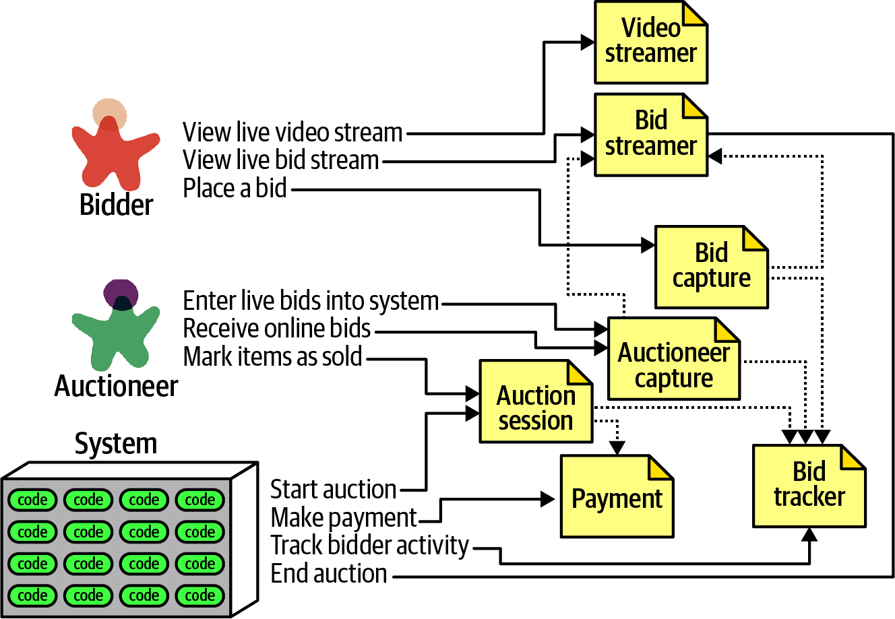

---

<!-- Page 96 -->

The design shown in Figure 8-11 isn’t likely the final design. More requirements must be uncovered
(how do people register, administration functions around payment, and so on). However, this
example provides a good starting point to start iterating further on the design.

This is one possible set of components to solve the GGG problem—but it’s not necessarily correct,
nor is it the only one. Few software systems have only one way that developers can implement them;
every design has different sets of trade-offs. As an architect, don’t obsess over finding the one true
design, because many will suffice (and less likely overengineered). Rather, try to objectively assess
the trade-offs between different design decisions, and choose the one that has the least worst set of
trade-offs.

Architecture Quantum Redux: Choosing Between Monolithic Versus Distributed Architectures

Recalling the discussion defining architecture quantum in “Architectural Quanta and Granularity”, the
architecture quantum defines the scope of architecture characteristics. That in turn leads an
architect toward an important decision as they finish their initial component design: should the
architecture be monolithic or distributed?

A monolithic architecture typically features a single deployable unit, including all functionality of the
system that runs in the process, typically connected to a single database. Types of monolithic
architectures include the layered and modular monolith, discussed fully in Chapter 10.
A distributed architecture is the opposite—the application consists of multiple services running in
their own ecosystem, communicating via networking protocols. Distributed architectures may
feature finer-grained deployment models, where each service may have its own release cadence and
engineering practices, based on the development team and their priorities.

Each architecture style offers a variety of trade-offs, covered in Part II. However, the fundamental
decision rests on how many quanta the architecture discovers during the design process. If the
system can manage with a single quantum (in other words, one set of architecture characteristics),
then a monolith architecture offers many advantages. On the other hand, differing architecture
characteristics for components, as illustrated in the GGG component analysis, requires a distributed
architecture to accommodate differing architecture characteristics. For example,
the VideoStreamer and BidStreamer both offer read-only views of the auction to bidders. From a
design standpoint, an architect would rather not deal with read-only streaming mixed with high-scale
updates. Along with the aforementioned differences between bidder and auctioneer, these differing
characteristics lead an architect to choose a distributed architecture.

The ability to determine a fundamental design characteristic of architecture (monolith versus
distributed) early in the design process highlights one of the advantages of using the architecture
quantum as a way of analyzing architecture characteristics scope and coupling.

You have 6 days left in your trial, Samjobara. Subscribe today. See pricing options.

---

<!-- Page 97 -->

Part II. Architecture Styles

The difference between an architecture style and an architecture pattern can be confusing. We
define an architecture style as the overarching structure of how the user interface and backend
source code are organized (such as within layers of a monolithic deployment or separately deployed
services) and how that source code interacts with a datastore. Architecture patterns, on the other
hand, are lower-level design structures that help form specific solutions within an architecture style
(such as how to achieve high scalability or high performance within a set of operations or between
sets of services).

Understanding architecture styles occupies much of the time and effort for new architects because
they share importance and abundance. Architects must understand the various styles and the tradeoffs encapsulated within each to make effective decisions; each architecture style embodies a wellknown set of trade-offs that help an architect make the right choice for a particular business
problem.

---

<!-- Page 98 -->

# Chapter 9. Foundations

Architecture styles, sometimes called architecture patterns, describe a named relationship of
components covering a variety of architecture characteristics. An architecture style name, similar to
design patterns, creates a single name that acts as shorthand between experienced architects. For
example, when an architect talks about a layered monolith, their target in the conversation
understands aspects of structure, which kinds of architecture characteristics work well (and which
ones can cause problems), typical deployment models, data strategies, and a host of other
information. Thus, architects should be familiar with the basic names of fundamental generic
architecture styles.

Each name captures a wealth of understood detail, one of the purposes of design patterns. An
architecture style describes the topology, assumed and default architecture characteristics, both
beneficial and detrimental. We cover many common modern architecture patterns in the remainder
of this section of the book (Part II). However, architects should be familiar with several fundamental
patterns that appear embedded within the larger patterns.

## Fundamental Patterns

Several fundamental patterns appear again and again throughout the history of software
architecture because they provide a useful perspective on organizing code, deployments, or other
aspects of architecture. For example, the concept of layers in architecture, separating different
concerns based on functionality, is as old as software itself. Yet, the layered pattern continues to
manifest in different guises, including modern variants discussed in Chapter 10.

## Big Ball of Mud

Architects refer to the absence of any discernible architecture structure as a Big Ball of Mud, named
after the eponymous anti-pattern defined in a paper released in 1997 by Brian Foote and Joseph
## Yoder:

A Big Ball of Mud is a haphazardly structured, sprawling, sloppy, duct-tape-and-baling-wire,
spaghetti-code jungle. These systems show unmistakable signs of unregulated growth, and repeated,
expedient repair. Information is shared promiscuously among distant elements of the system, often to
the point where nearly all the important information becomes global or duplicated.

The overall structure of the system may never have been well defined.

If it was, it may have eroded beyond recognition. Programmers with a shred of architectural
sensibility shun these quagmires. Only those who are unconcerned about architecture, and, perhaps,
are comfortable with the inertia of the day-to-day chore of patching the holes in these failing dikes,
are content to work on such systems.

## Brian Foote and Joseph Yoder

In modern terms, a big ball of mud might describe a simple scripting application with event handlers
wired directly to database calls, with no real internal structure. Many trivial applications start like this
then become unwieldy as they continue to grow.

In general, architects want to avoid this type of architecture at all costs. The lack of structure makes
change increasingly difficult. This type of architecture also suffers from problems in deployment,
testability, scalability, and performance.

---

<!-- Page 99 -->

Unfortunately, this architecture anti-pattern occurs quite commonly in the real world. Few architects
intend to create one, but many projects inadvertently manage to create a mess because of lack of
governance around code quality and structure. For example, Neal worked with a client project whose
structure appears in Figure 9-1.

The client (whose name is withheld for obvious reasons) created a Java-based web application as
quickly as possible over several years. The technical visualization1 shows their architectural coupling:
each dot on the perimeter of the circle represents a class, and each line represents connections
between the classes, where bolder lines indicate stronger connections. In this code base, any change
to a class makes it difficult to predict rippling side effects to other classes, making change a terrifying
affair.

Figure 9-1. A Big Ball of Mud architecture visualized from a real code base

## Unitary Architecture

When software originated, there was only the computer, and software ran on it. Through the various
eras of hardware and software evolution, the two started as a single entity, then split as the need for

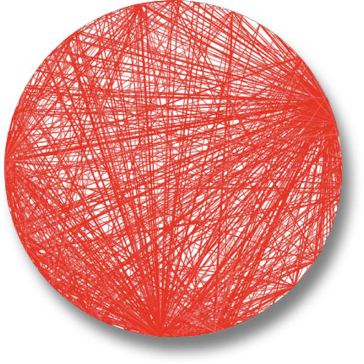

---

<!-- Page 100 -->

more sophisticated capabilities grew. For example, mainframe computers started as singular
systems, then gradually separated data into its own kind of system. Similarly, when personal
computers first appeared, much of the commercial development focused on single machines. As
networking PCs became common, distributed systems (such as client/server) appeared.

Few unitary architectures exist outside embedded systems and other highly constrained
environments. Generally, software systems tend to grow in functionality over time, requiring
separation of concerns to maintain operational architecture characteristics, such as performance and
scale.

## Client/Server

Over time, various forces required partitioning away from a single system; how to do that forms the
basis for many of these styles. Many architecture styles deal with how to efficiently separate parts of
the system.

A fundamental style in architecture separates technical functionality between frontend and backend,
called a two-tier, or client/server, architecture. Many different flavors of this architecture exist,
depending on the era and computing capabilities.

DESKTOP + DATABASE SERVER

An early personal computer architecture encouraged developers to write rich desktop applications in
user interfaces like Windows, separating the data into a separate database server. This architecture
coincided with the appearance of standalone database servers that could connect via standard
network protocols. It allowed presentation logic to reside on the desktop, while the more
computationally intense action (both in volume and complexity) occurred on more robust database
servers.

BROWSER + WEB SERVER

Once modern web development arrived, the common split became web browser connected to web
server (which in turn was connected to a database server). The separation of responsibilities was
similar to the desktop variant but with even thinner clients as browsers, allowing a wider distribution
both inside and outside firewalls. Even though the database is separate from the web server,
architects often still consider this a two-tier architecture because the web and database servers run
on one class of machine within the operations center and the user interface runs on the user’s
browser.

## THREE-TIER

An architecture that became quite popular during the late 1990s was a three-tier architecture, which
provided even more layers of separation. As tools like application servers became popular in Java and
.NET, companies started building even more layers in their topology: a database tier using an
industrial-strength database server, an application tier managed by an application server, frontend
coded in generated HTML, and increasingly, JavaScript, as its capabilities expanded.

The three-tier architecture corresponded with network-level protocols such as Common Object
Request Broker Architecture (CORBA) and Distributed Component Object Model (DCOM) that
facilitated building distributed architectures.

Just as developers today don’t worry about how network protocols like TCP/IP work (they just work),
most architects don’t have to worry about this level of plumbing in distributed architectures. The

---

<!-- Page 101 -->

capabilities offered by such tools in that era exist today as either tools (like message queues) or
architecture patterns (such as event-driven architecture, covered in Chapter 14).

## THREE-TIER, LANGUAGE DESIGN, AND LONG-TERM IMPLICATIONS

During the era in which the Java language was designed, three-tier computing was all the rage. Thus,
it was assumed that, in the future, all systems would be three-tier architectures. One of the common
headaches with existing languages such as C++ was how cumbersome it was to move objects over
the network in a consistent way between systems. Thus, the designers of Java decided to build this
capability into the core of the language using a mechanism called serialization. Every Object in Java
implements an interface that requires it to support serialization. The designers figured that since
three-tiered architecture would forever be the architecture style, baking it into the language would
offer a great convenience. Of course, that architectural style came and went, yet the leftovers appear
in Java to this day, greatly frustrating the language designer who wants to add modern features that,
for backward compatibility, must support serialization, which virtually no one uses today.

Understanding the long-term implications of design decisions has always eluded us, in software, as in
other engineering disciplines. The perpetual advice to favor simple designs is in many ways defense
against future consequences.

## Monolithic Versus Distributed Architectures

Architecture styles can be classified into two main types: monolithic (single deployment unit of all
code) and distributed (multiple deployment units connected through remote access protocols). While
no classification scheme is perfect, distributed architectures all share a common set of challenges
and issues not found in the monolithic architecture styles, making this classification scheme a good
separation between the various architecture styles. In this book we will describe in detail the
following architecture styles:

## Monolithic

•   Layered architecture (Chapter 10)

•   Pipeline architecture (Chapter 11)

•   Microkernel architecture (Chapter 12)

## Distributed

•   Service-based architecture (Chapter 13)

•   Event-driven architecture (Chapter 14)

•   Space-based architecture (Chapter 15)

•   Service-oriented architecture (Chapter 16)

•   Microservices architecture (Chapter 17)

Distributed architecture styles, while being much more powerful in terms of performance, scalability,
and availability than monolithic architecture styles, have significant trade-offs for this power. The
first group of issues facing all distributed architectures are described in the fallacies of distributed
computing, first coined by L. Peter Deutsch and other colleagues from Sun Microsystems in 1994.
A fallacy is something that is believed or assumed to be true but is not. All eight of the fallacies of

---

<!-- Page 102 -->

distributed computing apply to distributed architectures today. The following sections describe each
fallacy.

Fallacy #1: The Network Is Reliable

Figure 9-2. The network is not reliable

Developers and architects alike assume that the network is reliable, but it is not. While networks
have become more reliable over time, the fact of the matter is that networks still remain generally
unreliable. This is significant for all distributed architectures because all distributed architecture
styles rely on the network for communication to and from services, as well as between services. As
illustrated in Figure 9-2, Service B may be totally healthy, but Service A cannot reach it due to a
network problem; or even worse, Service A made a request to Service B to process some data and
does not receive a response because of a network issue. This is why things like timeouts and circuit
breakers exist between services. The more a system relies on the network (such as microservices
architecture), the potentially less reliable it becomes.

Fallacy #2: Latency Is Zero

Figure 9-3. Latency is not zero

As Figure 9-3 shows, when a local call is made to another component via a method or function call,
that time (t_local) is measured in nanoseconds or microseconds. However, when that same call is
made through a remote access protocol (such as REST, messaging, or RPC), the time measured to
access that service (t_remote) is measured in milliseconds. Therefore, t_remote will always be
greater that t_local. Latency in any distributed architecture is not zero, yet most architects ignore this
fallacy, insisting that they have fast networks. Ask yourself this question: do you know what the

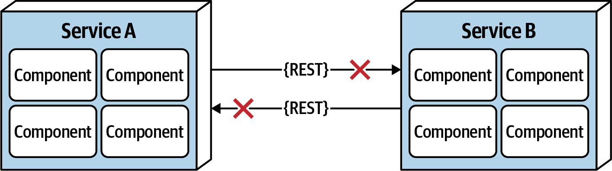

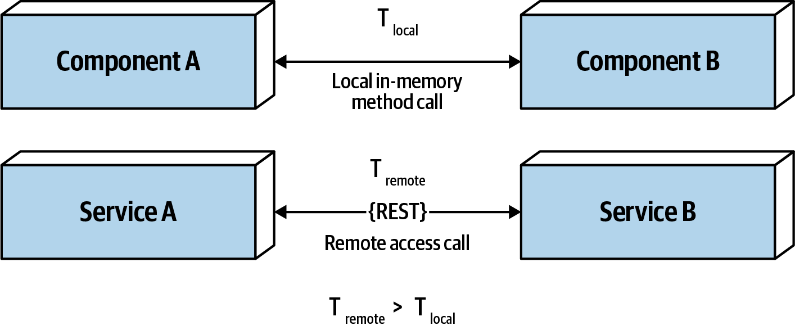

---

<!-- Page 103 -->

average round-trip latency is for a RESTful call in your production environment? Is it 60 milliseconds?
Is it 500 milliseconds?

When using any distributed architecture, architects must know this latency average. It is the only way
of determining whether a distributed architecture is feasible, particularly when considering
microservices (see Chapter 17) due to the fine-grained nature of the services and the amount of
communication between those services. Assuming an average of 100 milliseconds of latency per
request, chaining together 10 service calls to perform a particular business function adds 1,000
milliseconds to the request! Knowing the average latency is important, but even more important is
also knowing the 95th to 99th percentile. While an average latency might yield only 60 milliseconds
(which is good), the 95th percentile might be 400 milliseconds! It’s usually this “long tail” latency that
will kill performance in a distributed architecture. In most cases, architects can get latency values
from a network administrator (see “Fallacy #6: There Is Only One Administrator”).

Fallacy #3: Bandwidth Is Infinite

Figure 9-4. Bandwidth is not infinite

Bandwidth is usually not a concern in monolithic architectures, because once processing goes into a
monolith, little or no bandwidth is required to process that business request. However, as shown
in Figure 9-4, once systems are broken apart into smaller deployment units (services) in a distributed
architecture such as microservices, communication to and between these services significantly
utilizes bandwidth, causing networks to slow down, thus impacting latency (fallacy #2) and reliability
(fallacy #1).

To illustrate the importance of this fallacy, consider the two services shown in Figure 9-4. Let’s say
the lefthand service manages the wish list items for the website, and the righthand service manages
the customer profile. Whenever a request for a wish list comes into the lefthand service, it must
make an interservice call to the righthand customer profile service to get the customer name
because that data is needed in the response contract for the wish list, but the wish list service on the
lefthand side doesn’t have the name. The customer profile service returns 45 attributes totaling 500
kb to the wish list service, which only needs the name (200 bytes). This is a form of coupling referred
to as stamp coupling. This may not sound significant, but requests for the wish list items happen
about 2,000 times a second. This means that this interservice call from the wish list service to the
customer profile service happens 2,000 times a second. At 500 kb for each request, the amount of
bandwidth used for that one interservice call (out of hundreds being made that second) is 1 Gb!

Stamp coupling in distributed architectures consumes significant amounts of bandwidth. If the
customer profile service were to only pass back the data needed by the wish list service (in this case
200 bytes), the total bandwidth used to transmit the data is only 400 kb. Stamp coupling can be
resolved in the following ways:

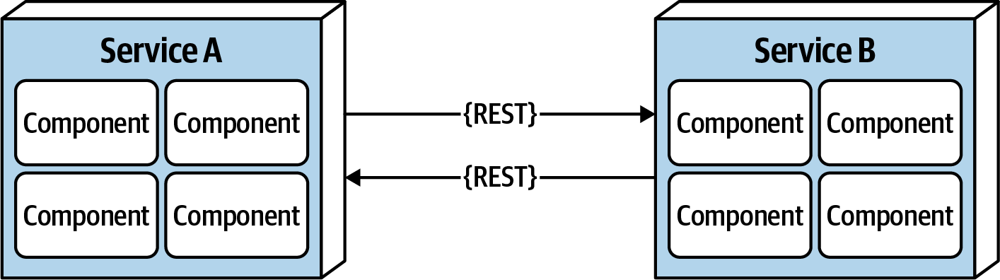

---

<!-- Page 104 -->

•   Create private RESTful API endpoints

•  Use field selectors in the contract

•  Use GraphQL to decouple contracts

•  Use value-driven contracts with consumer-driven contracts (CDCs)

•  Use internal messaging endpoints

Regardless of the technique used, ensuring that the minimal amount of data is passed between
services or systems in a distributed architecture is the best way to address this fallacy.

Fallacy #4: The Network Is Secure

Figure 9-5. The network is not secure

Most architects and developers get so comfortable using virtual private networks (VPNs), trusted
networks, and firewalls that they tend to forget about this fallacy of distributed computing: the
network is not secure. Security becomes much more challenging in a distributed architecture. As
shown in Figure 9-5, each and every endpoint to each distributed deployment unit must be secured
so that unknown or bad requests do not make it to that service. The surface area for threats and
attacks increases by magnitudes when moving from a monolithic to a distributed architecture.
Having to secure every endpoint, even when doing interservice communication, is another reason
performance tends to be slower in synchronous, highly-distributed architectures such as
microservices or service-based architecture.

Fallacy #5: The Topology Never Changes

Figure 9-6. The network topology always changes

This fallacy refers to the overall network topology, including all of the routers, hubs, switches,
firewalls, networks, and appliances used within the overall network. Architects assume that the

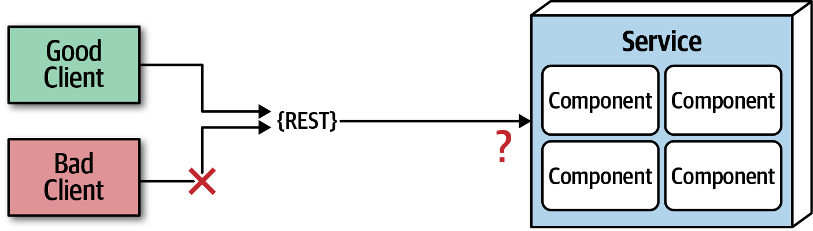

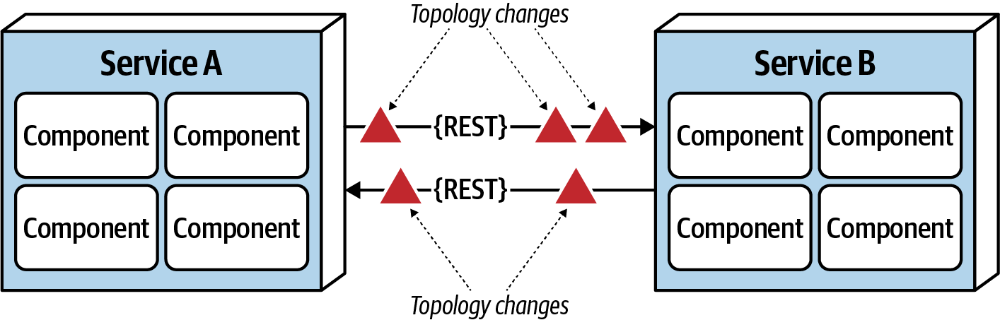

---

<!-- Page 105 -->

topology is fixed and never changes. Of course it changes. It changes all the time. What is the
significance of this fallacy?

Suppose an architect comes into work on a Monday morning, and everyone is running around like
crazy because services keep timing out in production. The architect works with the teams, frantically
trying to figure out why this is happening. No new services were deployed over the weekend. What
could it be? After several hours the architect discovers that a minor network upgrade happened at 2
a.m. that morning. This supposedly “minor” network upgrade invalidated all of the latency
assumptions, triggering timeouts and circuit breakers.

Architects must be in constant communication with operations and network administrators to know
what is changing and when so that they can make adjustments accordingly to reduce the type of
surprise previously described. This may seem obvious and easy, but it is not. As a matter of fact, this
fallacy leads directly to the next fallacy.

Fallacy #6: There Is Only One Administrator

Figure 9-7. There are many network administrators, not just one

Architects all the time fall into this fallacy, assuming they only need to collaborate and communicate
with one administrator. As shown in Figure 9-7, there are dozens of network administrators in a
typical large company. Who should the architect talk to with regard to latency (“Fallacy #2: Latency Is
Zero”) or topology changes (“Fallacy #5: The Topology Never Changes”)? This fallacy points to the
complexity of distributed architecture and the amount of coordination that must happen to get
everything working correctly. Monolithic applications do not require this level of communication and
collaboration due to the single deployment unit characteristics of those architecture styles.

Fallacy #7: Transport Cost Is Zero

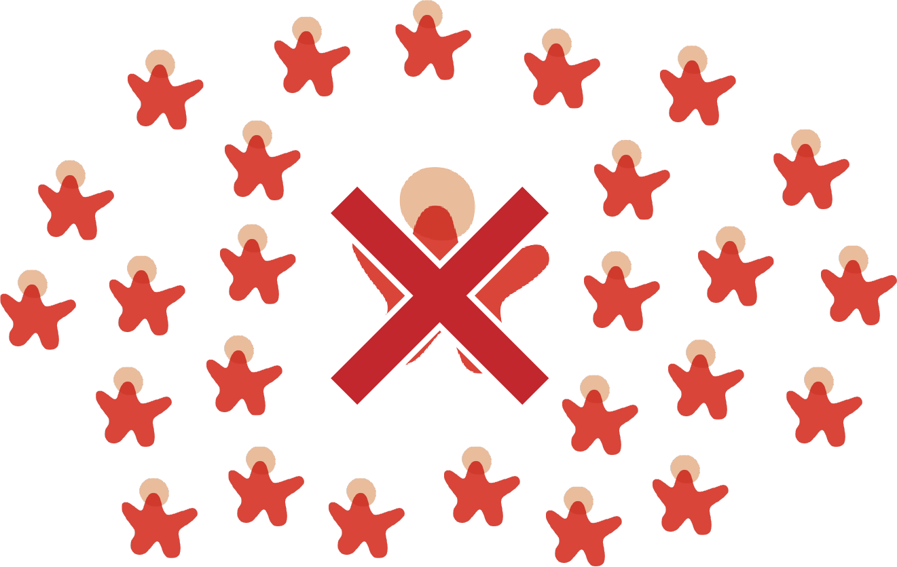

---

<!-- Page 106 -->

Figure 9-8. Remote access costs money

Many software architects confuse this fallacy for latency (“Fallacy #2: Latency Is Zero”). Transport
cost here does not refer to latency, but rather to actual cost in terms of money associated with
making a “simple RESTful call.” Architects assume (incorrectly) that the necessary infrastructure is in
place and sufficient for making a simple RESTful call or breaking apart a monolithic application. It is
usually not. Distributed architectures cost significantly more than monolithic architectures, primarily
due to increased needs for additional hardware, servers, gateways, firewalls, new subnets, proxies,
and so on.

Whenever embarking on a distributed architecture, we encourage architects to analyze the current
server and network topology with regard to capacity, bandwidth, latency, and security zones to not
get caught up in the trap of surprise with this fallacy.

Fallacy #8: The Network Is Homogeneous

Figure 9-9. The network is not homogeneous

Most architects and developers assume a network is homogeneous—made up by only one network
hardware vendor. Nothing could be farther from the truth. Most companies have multiple network
hardware vendors in their infrastructure, if not more.

So what? The significance of this fallacy is that not all of those heterogeneous hardware vendors play
together well. Most of it works, but does Juniper hardware seamlessly integrate with Cisco
hardware? Networking standards have evolved over the years, making this less of an issue, but the
fact remains that not all situations, load, and circumstances have been fully tested, and as such,
network packets occasionally get lost. This in turn impacts network reliability (“Fallacy #1: The
Network Is Reliable”), latency assumptions and assertions (“Fallacy #2: Latency Is Zero”), and
assumptions made about the bandwidth (“Fallacy #3: Bandwidth Is Infinite”). In other words, this
fallacy ties back into all of the other fallacies, forming an endless loop of confusion and frustration
when dealing with networks (which is necessary when using distributed architectures).

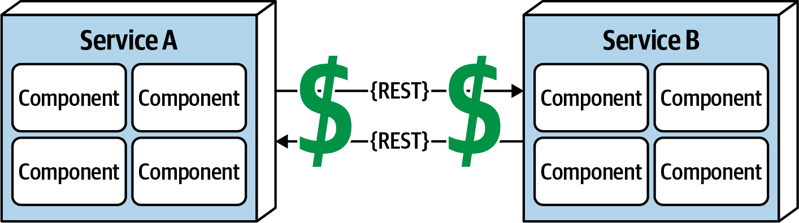

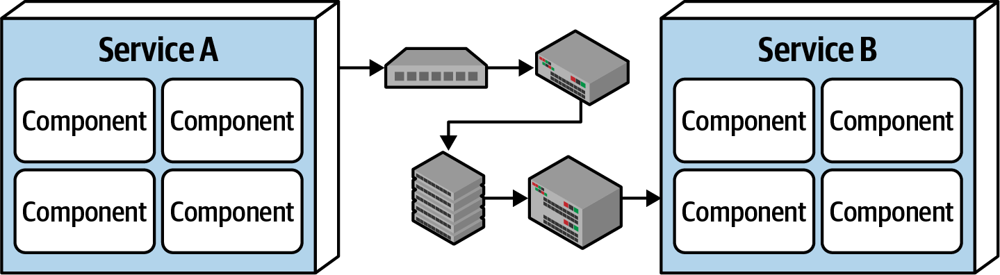

---

<!-- Page 107 -->

## Other Distributed Considerations

In addition to the eight fallacies of distributed computing previously described, there are other issues
and challenges facing distributed architecture that aren’t present in monolithic
architectures. Although the details of these other issues are out of scope for this book, we list and
summarize them in the following sections.

## DISTRIBUTED LOGGING

Performing root-cause analysis to determine why a particular order was dropped is very difficult and
time-consuming in a distributed architecture due to the distribution of application and system
logs. In a monolithic application there is typically only one log, making it easier to trace a request and
determine the issue. However, distributed architectures contain dozens to hundreds of different
logs, all located in a different place and all with a different format, making it difficult to track down a
problem.

Logging consolidation tools such as Splunk help to consolidate information from various sources and
systems together into one consolidated log and console, but these tools only scratch the surface of
the complexities involved with distributed logging. Detailed solutions and patterns for distributed
logging are outside the scope of this book.

## DISTRIBUTED TRANSACTIONS

Architects and developers take transactions for granted in a monolithic architecture world because
they are so straightforward and easy to manage. Standard commits and rollbacks executed from
persistence frameworks leverage ACID (atomicity, consistency, isolation, durability) transactions to
guarantee that the data is updated in a correct way to ensure high data consistency and
integrity. Such is not the case with distributed architectures.

Distributed architectures rely on what is called eventual consistency to ensure the data processed by
separate deployment units is at some unspecified point in time all synchronized into a consistent
state. This is one of the trade-offs of distributed architecture: high scalability, performance, and
availability at the sacrifice of data consistency and data integrity.

Transactional sagas are one way to manage distributed transactions. Sagas utilize either event
sourcing for compensation or finite state machines to manage the state of transaction. In addition to
sagas, BASE transactions are used. BASE stands for (B)asic availability, (S)oft state, and (E)ventual
consistency. BASE transactions are not a piece of software, but rather a technique. Soft state in BASE
refers to the transit of data from a source to a target, as well as the inconsistency between data
sources. Based on the basic availability of the systems or services involved, the systems
will eventually become consistent through the use of architecture patterns and messaging.

## CONTRACT MAINTENANCE AND VERSIONING

Another particularly difficult challenge within distributed architecture is contract creation,
maintenance, and versioning. A contract is behavior and data that is agreed upon by both the client
and the service. Contract maintenance is particularly difficult in distributed architectures, primarily
due to decoupled services and systems owned by different teams and departments. Even more
complex are the communication models needed for version deprecation.

1 Made with a now-retired tool called XRay, an Eclipse plug-in.

You have 6 days left in your trial, Samjobara. Subscribe today. See pricing options.

---

<!-- Page 108 -->

# Chapter 10. Layered Architecture Style

The layered architecture, also known as the n-tiered architecture style, is one of the most common
architecture styles. This style of architecture is the de facto standard for most applications, primarily
because of its simplicity, familiarity, and low cost. It is also a very natural way to develop applications
due to Conway’s law, which states that organizations that design systems are constrained to produce
designs which are copies of the communication structures of these organizations. In most
organizations there are user interface (UI) developers, backend developers, rules developers, and
database experts (DBAs). These organizational layers fit nicely into the tiers of a traditional layered
architecture, making it a natural choice for many business applications. The layered architecture style
also falls into several architectural anti-patterns, including the architecture by implication antipattern and the accidental architecture anti-pattern. If a developer or architect is unsure which
architecture style they are using, or if an Agile development team “just starts coding,” chances are
good that it is the layered architecture style they are implementing.

## Topology

Components within the layered architecture style are organized into logical horizontal layers, with
each layer performing a specific role within the application (such as presentation logic or business
logic). Although there are no specific restrictions in terms of the number and types of layers that
must exist, most layered architectures consist of four standard layers: presentation, business,
persistence, and database, as illustrated in Figure 10-1. In some cases, the business layer and
persistence layer are combined into a single business layer, particularly when the persistence logic
(such as SQL or HSQL) is embedded within the business layer components. Thus, smaller applications
may have only three layers, whereas larger and more complex business applications may contain five
or more layers.

Figure 10-1. Standard logical layers within the layered architecture style

Figure 10-2 illustrates the various topology variants from a physical layering (deployment)
perspective. The first variant combines the presentation, business, and persistence layers into a
single deployment unit, with the database layer typically represented as a separate external physical

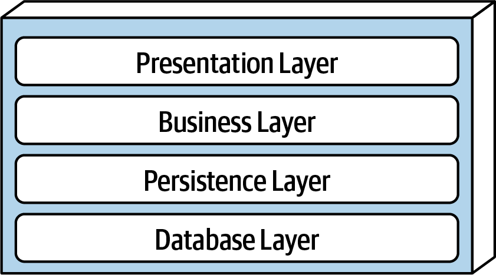

---

<!-- Page 109 -->

database (or filesystem). The second variant physically separates the presentation layer into its own
deployment unit, with the business and persistence layers combined into a second deployment unit.
Again, with this variant, the database layer is usually physically separated through an external
database or filesystem. A third variant combines all four standard layers into a single deployment,
including the database layer. This variant might be useful for smaller applications with either an
internally embedded database or an in-memory database. Many on-premises (“on-prem”) products
are built and delivered to customers using this third variant.

Figure 10-2. Physical topology (deployment) variants

Each layer of the layered architecture style has a specific role and responsibility within the
architecture. For example, the presentation layer would be responsible for handling all user interface
and browser communication logic, whereas the business layer would be responsible for executing
specific business rules associated with the request. Each layer in the architecture forms an
abstraction around the work that needs to be done to satisfy a particular business request. For
example, the presentation layer doesn’t need to know or worry about how to get customer data; it
only needs to display that information on a screen in a particular format. Similarly, the business layer
doesn’t need to be concerned about how to format customer data for display on a screen or even
where the customer data is coming from; it only needs to get the data from the persistence layer,
perform business logic against the data (such as calculating values or aggregating data), and pass that
information up to the presentation layer.

This separation of concerns concept within the layered architecture style makes it easy to build
effective roles and responsibility models within the architecture. Components within a specific layer
are limited in scope, dealing only with the logic that pertains to that layer. For example, components
in the presentation layer only handle presentation logic, whereas components residing in the
business layer only handle business logic. This allows developers to leverage their particular technical
expertise to focus on the technical aspects of the domain (such as presentation logic or persistence
logic). The trade-off of this benefit, however, is a lack of overall agility (the ability to respond quickly
to change).

The layered architecture is a technically partitioned architecture (as opposed to a domainpartitioned architecture). Groups of components, rather than being grouped by domain (such as
customer), are grouped by their technical role in the architecture (such as presentation or
business). As a result, any particular business domain is spread throughout all of the layers of the

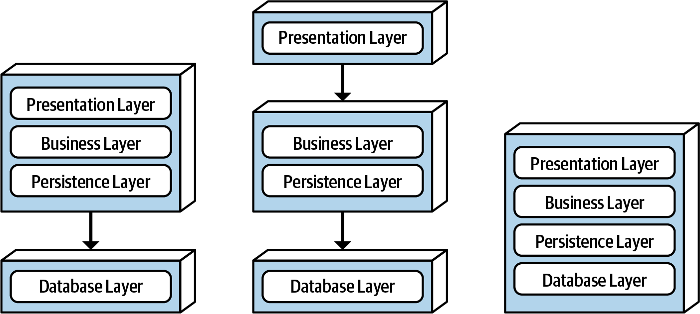

---

<!-- Page 110 -->

architecture. For example, the domain of “customer” is contained in the presentation layer, business
layer, rules layer, services layer, and database layer, making it difficult to apply changes to that
domain. As a result, a domain-driven design approach does not work as well with the layered
architecture style.

## Layers of Isolation

Each layer in the layered architecture style can be either closed or open. A closed layer means that as
a request moves top-down from layer to layer, the request cannot skip any layers, but rather must go
through the layer immediately below it to get to the next layer (see Figure 10-3). For example, in a
closed-layered architecture, a request originating from the presentation layer must first go through
the business layer and then to the persistence layer before finally making it to the database layer.

Figure 10-3. Closed layers within the layered architecture

Notice that in Figure 10-3 it would be much faster and easier for the presentation layer to access the
database directly for simple retrieval requests, bypassing any unnecessary layers (what used to be
known in the early 2000s as the fast-lane reader pattern). For this to happen, the business and
persistence layers would have to be open, allowing requests to bypass other layers. Which is better—
open layers or closed layers? The answer to this question lies in a key concept known as layers of
isolation.

The layers of isolation concept means that changes made in one layer of the architecture generally
don’t impact or affect components in other layers, providing the contracts between those layers
remain unchanged. Each layer is independent of the other layers, thereby having little or no
knowledge of the inner workings of other layers in the architecture. However, to support layers of
isolation, layers involved with the major flow of the request necessarily have to be closed. If the
presentation layer can directly access the persistence layer, then changes made to the persistence
layer would impact both the business layer and the presentation layer, producing a very tightly

---

<!-- Page 111 -->

coupled application with layer interdependencies between components. This type of architecture
then becomes very brittle, as well as difficult and expensive to change.

The layers of isolation concept also allows any layer in the architecture to be replaced without
impacting any other layer (again, assuming well-defined contracts and the use of the business
delegate pattern). For example, you can leverage the layers of isolation concept within the layered
architecture style to replace your older JavaServer Faces (JSF) presentation layer with React.js
without impacting any other layer in the application.

## Adding Layers

While closed layers facilitate layers of isolation and therefore help isolate change within the
architecture, there are times when it makes sense for certain layers to be open. For example,
suppose there are shared objects within the business layer that contain common functionality for
business components (such as date and string utility classes, auditing classes, logging classes, and so
on). Suppose there is an architecture decision stating that the presentation layer is restricted from
using these shared business objects. This constraint is illustrated in Figure 10-4, with the dotted line
going from a presentation component to a shared business object in the business layer. This scenario
is difficult to govern and control because architecturally the presentation layer has access to the
business layer, and hence has access to the shared objects within that layer.

Figure 10-4. Shared objects within the business layer

One way to architecturally mandate this restriction is to add to the architecture a new services layer
containing all of the shared business objects. Adding this new layer now architecturally restricts the
presentation layer from accessing the shared business objects because the business layer is closed
(see Figure 10-5). However, the new services layer must be marked as open; otherwise the business
layer would be forced to go through the services layer to access the persistence layer. Marking the

---

<!-- Page 112 -->

services layer as open allows the business layer to either access that layer (as indicated by the solid
arrow), or bypass the layer and go to the next one down (as indicated by the dotted arrow
in Figure 10-5).

Figure 10-5. Adding a new services layer to the architecture

Leveraging the concept of open and closed layers helps define the relationship between architecture
layers and request flows. It also provides developers with the necessary information and guidance to
understand various layer access restrictions within the architecture. Failure to document or properly
communicate which layers in the architecture are open and closed (and why) usually results in tightly
coupled and brittle architectures that are very difficult to test, maintain, and deploy.

## Other Considerations

The layered architecture makes for a good starting point for most applications when it is not known
yet exactly which architecture style will ultimately be used. This is a common practice for many
microservices efforts when architects are still determining whether microservices is the right
architecture choice, but development must begin. However, when using this technique, be sure to
keep reuse at a minimum and keep object hierarchies (depth of inheritance tree) fairly shallow so as
to maintain a good level of modularity. This will help facilitate the move to another architecture style
later on.

One thing to watch out for with the layered architecture is the architecture sinkhole antipattern. This anti-pattern occurs when requests move from layer to layer as simple pass-through
processing with no business logic performed within each layer. For example, suppose the
presentation layer responds to a simple request from the user to retrieve basic customer data (such
as name and address). The presentation layer passes the request to the business layer, which does
nothing but pass the request on to the rules layer, which in turn does nothing but pass the request
on to the persistence layer, which then makes a simple SQL call to the database layer to retrieve the

---

<!-- Page 113 -->

customer data. The data is then passed all the way back up the stack with no additional processing or
logic to aggregate, calculate, apply rules, or transform the data. This results in unnecessary object
instantiation and processing, impacting both memory consumption and performance.

Every layered architecture will have at least some scenarios that fall into the architecture sinkhole
anti-pattern. The key to determining whether the architecture sinkhole anti-pattern is at play is to
analyze the percentage of requests that fall into this category. The 80-20 rule is usually a good
practice to follow. For example, it is acceptable if only 20 percent of the requests are sinkholes.
However, if 80 percent of the requests are sinkholes, it a good indicator that the layered architecture
is not the correct architecture style for the problem domain. Another approach to solving the
architecture sinkhole anti-pattern is to make all the layers in the architecture open, realizing, of
course, that the trade-off is increased difficulty in managing change within the architecture.

## Why Use This Architecture Style

The layered architecture style is a good choice for small, simple applications or websites. It is also a
good architecture choice, particularly as a starting point, for situations with very tight budget and
time constraints. Because of the simplicity and familiarity among developers and architects, the
layered architecture is perhaps one of the lowest-cost architecture styles, promoting ease of
development for smaller applications. The layered architecture style is also a good choice when an
architect is still analyzing business needs and requirements and is unsure which architecture style
would be best.

As applications using the layered architecture style grow, characteristics like maintainability, agility,
testability, and deployability are adversely affected. For this reason, large applications and systems
using the layered architecture might be better suited for other, more modular architecture styles.

## Architecture Characteristics Ratings

A one-star rating in the characteristics ratings table (shown in Figure 10-6) means the specific
architecture characteristic isn’t well supported in the architecture, whereas a five-star rating means
the architecture characteristic is one of the strongest features in the architecture style. The definition
for each characteristic identified in the scorecard can be found in Chapter 4.

---

<!-- Page 114 -->

Figure 10-6. Layered architecture characteristics ratings

Overall cost and simplicity are the primary strengths of the layered architecture style. Being
monolithic in nature, layered architectures don’t have the complexities associated with distributed
architecture styles, are simple and easy to understand, and are relatively low cost to build and
maintain. However, as a cautionary note, these ratings start to quickly diminish as monolithic layered
architectures get bigger and consequently more complex.

Both deployability and testability rate very low for this architecture style. Deployability rates low due
to the ceremony of deployment (effort to deploy), high risk, and lack of frequent deployments. A
simple three-line change to a class file in the layered architecture style requires the entire
deployment unit to be redeployed, taking in potential database changes, configuration changes, or
other coding changes sneaking in alongside the original change. Furthermore, this simple three-line

---

<!-- Page 115 -->

change is usually bundled with dozens of other changes, thereby increasing deployment risk even
further (as well as increasing the frequency of deployment). The low testability rating also reflects
this scenario; with a simple three-line change, most developers are not going to spend hours
executing the entire regression test suite (even if such a thing were to exist in the first place),
particularly along with dozens of other changes being made to the monolithic application at the
same time. We gave testability a two-star rating (rather than one star) due to the ability to mock or
stub components (or even an entire layer), which eases the overall testing effort.

Overall reliability rates medium (three stars) in this architecture style, mostly due to the lack of
network traffic, bandwidth, and latency found in most distributed architectures. We only gave the
layered architecture three stars for reliability because of the nature of the monolithic deployment,
combined with the low ratings for testability (completeness of testing) and deployment risk.

Elasticity and scalability rate very low (one star) for the layered architecture, primarily due to
monolithic deployments and the lack of architectural modularity. Although it is possible to make
certain functions within a monolith scale more than others, this effort usually requires very complex
design techniques such as multithreading, internal messaging, and other parallel processing
practices, techniques this architecture isn’t well suited for. However, because the layered
architecture is always a single system quantum due to the monolithic user interface, backend
processing, and monolithic database, applications can only scale to a certain point based on the
single quantum.

Performance is always an interesting characteristic to rate for the layered architecture. We gave it
only two stars because the architecture style simply does not lend itself to high-performance systems
due to the lack of parallel processing, closed layering, and the sinkhole architecture anti-pattern. Like
scalability, performance can be addressed through caching, multithreading, and the like, but it is not
a natural characteristic of this architecture style; architects and developers have to work hard to
make all this happen.

Layered architectures don’t support fault tolerance due to monolithic deployments and the lack of
architectural modularity. If one small part of a layered architecture causes an out-of-memory
condition to occur, the entire application unit is impacted and crashes. Furthermore, overall
availability is impacted due to the high mean-time-to-recovery (MTTR) usually experienced by most
monolithic applications, with startup times ranging anywhere from 2 minutes for smaller
applications, up to 15 minutes or more for most large applications.

You have 6 days left in your trial, Samjobara. Subscribe today. See pricing options.

---

<!-- Page 116 -->

# Chapter 11. Pipeline Architecture Style

One of the fundamental styles in software architecture that appears again and again is
the pipeline architecture (also known as the pipes and filters architecture). As soon as developers and
architects decided to split functionality into discrete parts, this pattern followed. Most developers
know this architecture as this underlying principle behind Unix terminal shell languages, such
as Bash and Zsh.

Developers in many functional programming languages will see parallels between language
constructs and elements of this architecture. In fact, many tools that utilize
the MapReduce programming model follow this basic topology. While these examples show a lowlevel implementation of the pipeline architecture style, it can also be used for higher-level business
applications.

## Topology

The topology of the pipeline architecture consists of pipes and filters, illustrated in Figure 11-1.

Figure 11-1. Basic topology for pipeline architecture

The pipes and filters coordinate in a specific fashion, with pipes forming one-way communication
between filters, usually in a point-to-point fashion.

## Pipes

Pipes in this architecture form the communication channel between filters. Each pipe is typically
unidirectional and point-to-point (rather than broadcast) for performance reasons, accepting input
from one source and always directing output to another. The payload carried on the pipes may be
any data format, but architects favor smaller amounts of data to enable high performance.

## Filters

Filters are self-contained, independent from other filters, and generally stateless. Filters should
perform one task only. Composite tasks should be handled by a sequence of filters rather than a
single one.

Four types of filters exist within this architecture style:

## Producer

The starting point of a process, outbound only, sometimes called the source.

---

<!-- Page 117 -->

## Transformer

Accepts input, optionally performs a transformation on some or all of the data, then forwards it to
the outbound pipe. Functional advocates will recognize this feature as map.

## Tester

Accepts input, tests one or more criteria, then optionally produces output, based on the
test. Functional programmers will recognize this as similar to reduce.

## Consumer

The termination point for the pipeline flow. Consumers sometimes persist the final result of the
pipeline process to a database, or they may display the final results on a user interface screen.

The unidirectional nature and simplicity of each of the pipes and filters encourages compositional
reuse. Many developers have discovered this ability using shells. A famous story from the blog “More
Shell, Less Egg” illustrates just how powerful these abstractions are. Donald Knuth was asked to write
a program to solve this text handling problem: read a file of text, determine the n most frequently
used words, and print out a sorted list of those words along with their frequencies. He wrote a
program consisting of more than 10 pages of Pascal, designing (and documenting) a new algorithm
along the way. Then, Doug McIlroy demonstrated a shell script that would easily fit within a Twitter
post that solved the problem more simply, elegantly, and understandably (if you understand shell
commands):

tr -cs A-Za-z '\n' |

tr A-Z a-z |

sort |

uniq -c |

sort -rn |

sed ${1}q

Even the designers of Unix shells are often surprised at the inventive uses developers have wrought
with their simple but powerfully composite abstractions.

## Example

The pipeline architecture pattern appears in a variety of applications, especially tasks that facilitate
simple, one-way processing. For example, many Electronic Data Interchange (EDI) tools use this
pattern, building transformations from one document type to another using pipes and filters. ETL
tools (extract, transform, and load) leverage the pipeline architecture as well for the flow and
modification of data from one database or data source to another. Orchestrators and mediators such
as Apache Camel utilize the pipeline architecture to pass information from one step in a business
process to another.

To illustrate how the pipeline architecture can be used, consider the following example, as illustrated
in Figure 11-2, where various service telemetry information is sent from services via streaming
to Apache Kafka.

---

<!-- Page 118 -->

Figure 11-2. Pipeline architecture example

Notice in Figure 11-2 the use of the pipeline architecture style to process the different kinds of data
streamed to Kafka. The Service Info Capture filter (producer filter) subscribes to the Kafka topic and
receives service information. It then sends this captured data to a tester filter called Duration
Filter to determine whether the data captured from Kafka is related to the duration (in milliseconds)
of the service request. Notice the separation of concerns between the filters; the Service Metrics
Capture filter is only concerned about how to connect to a Kafka topic and receive streaming data,
whereas the Duration Filter is only concerned about qualifying the data and optionally routing it to
the next pipe. If the data is related to the duration (in milliseconds) of the service request, then
the Duration Filter passes the data on to the Duration Calculator transformer filter. Otherwise, it
passes it on to the Uptime Filter tester filter to check if the data is related to uptime metrics. If it is
not, then the pipeline ends—the data is of no interest to this particular processing flow. Otherwise, if
it is uptime metrics, it then passes the data along to the Uptime Calculator to calculate the uptime
metrics for the service. These transformers then pass the modified data to the Database
Output consumer, which then persists the data in a MongoDB database.

This example shows the extensibility properties of the pipeline architecture. For example,
in Figure 11-2, a new tester filter could easily be added after the Uptime Filter to pass the data on to
another newly gathered metric, such as the database connection wait time.

## Architecture Characteristics Ratings

A one-star rating in the characteristics ratings table Figure 11-3 means the specific architecture
characteristic isn’t well supported in the architecture, whereas a five-star rating means the
architecture characteristic is one of the strongest features in the architecture style. The definition for
each characteristic identified in the scorecard can be found in Chapter 4.

The pipeline architecture style is a technically partitioned architecture due to the partitioning of
application logic into filter types (producer, tester, transformer, and consumer). Also, because the

---

<!-- Page 119 -->

pipeline architecture is usually implemented as a monolithic deployment, the architectural quantum
is always one.

Figure 11-3. Pipeline architecture characteristics ratings

Overall cost and simplicity combined with modularity are the primary strengths of the pipeline
architecture style. Being monolithic in nature, pipeline architectures don’t have the complexities
associated with distributed architecture styles, are simple and easy to understand, and are relatively
low cost to build and maintain. Architectural modularity is achieved through the separation of
concerns between the various filter types and transformers. Any of these filters can be modified or
replaced without impacting the other filters. For instance, in the Kafka example illustrated
in Figure 11-2, the Duration Calculator can be modified to change the duration calculation without
impacting any other filter.

---

<!-- Page 120 -->

Deployability and testability, while only around average, rate slightly higher than the layered
architecture due to the level of modularity achieved through filters. That said, this architecture style
is still a monolith, and as such, ceremony, risk, frequency of deployment, and completion of testing
still impact the pipeline architecture.

Like the layered architecture, overall reliability rates medium (three stars) in this architecture style,
mostly due to the lack of network traffic, bandwidth, and latency found in most distributed
architectures. We only gave it three stars for reliability because of the nature of the monolithic
deployment of this architecture style in conjunction with testability and deployability issues (such as
having to test the entire monolith and deploy the entire monolith for any given change).

Elasticity and scalability rate very low (one star) for the pipeline architecture, primarily due to
monolithic deployments. Although it is possible to make certain functions within a monolith scale
more than others, this effort usually requires very complex design techniques such as multithreading,
internal messaging, and other parallel processing practices, techniques this architecture isn’t well
suited for. However, because the pipeline architecture is always a single system quantum due to the
monolithic user interface, backend processing, and monolithic database, applications can only scale
to a certain point based on the single architecture quantum.

Pipeline architectures don’t support fault tolerance due to monolithic deployments and the lack of
architectural modularity. If one small part of a pipeline architecture causes an out-of-memory
condition to occur, the entire application unit is impacted and crashes. Furthermore, overall
availability is impacted due to the high mean time to recovery (MTTR) usually experienced by most
monolithic applications, with startup times ranging anywhere from 2 minutes for smaller
applications, up to 15 minutes or more for most large applications.

You have 6 days left in your trial, Samjobara. Subscribe today. See pricing options.

---

<!-- Page 121 -->

# Chapter 12. Microkernel Architecture Style

The microkernel architecture style (also referred to as the plug-in architecture) was coined
several decades ago and is still widely used today. This architecture style is a natural fit for productbased applications (packaged and made available for download and installation as a single,
monolithic deployment, typically installed on the customer’s site as a third-party product) but is
widely used in many nonproduct custom business applications as well.

## Topology

The microkernel architecture style is a relatively simple monolithic architecture consisting of two
architecture components: a core system and plug-in components. Application logic is divided
between independent plug-in components and the basic core system, providing extensibility,
adaptability, and isolation of application features and custom processing logic. Figure 12-1 illustrates
the basic topology of the microkernel architecture style.

Figure 12-1. Basic components of the microkernel architecture style

## Core System

The core system is formally defined as the minimal functionality required to run the system. The
Eclipse IDE is a good example of this. The core system of Eclipse is just a basic text editor: open a file,
change some text, and save the file. It’s not until you add plug-ins that Eclipse starts becoming a
usable product. However, another definition of the core system is the happy path (general
processing flow) through the application, with little or no custom processing. Removing the
cyclomatic complexity of the core system and placing it into separate plug-in components allows for
better extensibility and maintainability, as well as increased testability. For example, suppose an
electronic device recycling application must perform specific custom assessment rules for each
electronic device received. The Java code for this sort of processing might look as follows:

---

<!-- Page 122 -->

public void assessDevice(String deviceID) {

if (deviceID.equals("iPhone6s")) {

assessiPhone6s();

} else if (deviceID.equals("iPad1"))

assessiPad1();

} else if (deviceID.equals("Galaxy5"))

assessGalaxy5();

} else ...

...

}

}

Rather than placing all this client-specific customization in the core system with lots of cyclomatic
complexity, it is much better to create a separate plug-in component for each electronic device being
assessed. Not only do specific client plug-in components isolate independent device logic from the
rest of the processing flow, but they also allow for expandability. Adding a new electronic device to
assess is simply a matter of adding a new plug-in component and updating the registry. With the
microkernel architecture style, assessing an electronic device only requires the core system to locate
and invoke the corresponding device plug-ins as illustrated in this revised source code:

public void assessDevice(String deviceID) {

String plugin = pluginRegistry.get(deviceID);

Class<?> theClass = Class.forName(plugin);

Constructor<?> constructor = theClass.getConstructor();

DevicePlugin devicePlugin =

(DevicePlugin)constructor.newInstance();

DevicePlugin.assess();

}

In this example all of the complex rules and instructions for assessing a particular electronic device
are self-contained in a standalone, independent plug-in component that can be generically executed
from the core system.

Depending on the size and complexity, the core system can be implemented as a layered architecture
or a modular monolith (as illustrated in Figure 12-2). In some cases, the core system can be split into
separately deployed domain services, with each domain service containing specific plug-in
components specific to that domain. For example, suppose Payment Processing is the domain service
representing the core system. Each payment method (credit card, PayPal, store credit, gift card, and
purchase order) would be separate plug-in components specific to the payment domain. In all of
these cases, it is typical for the entire monolithic application to share a single database.

---

<!-- Page 123 -->

Figure 12-2. Variations of the microkernel architecture core system

The presentation layer of the core system can be embedded within the core system or implemented
as a separate user interface, with the core system providing backend services. As a matter of fact, a
separate user interface can also be implemented as a microkernel architecture style. Figure 12-
3 illustrates these presentation layer variants in relation to the core system.

---

<!-- Page 124 -->

---

<!-- Page 125 -->

Figure 12-3. User interface variants

## Plug-In Components

Plug-in components are standalone, independent components that contain specialized processing,
additional features, and custom code meant to enhance or extend the core system. Additionally,
they can be used to isolate highly volatile code, creating better maintainability and testability within
the application. Ideally, plug-in components should be independent of each other and have no
dependencies between them.

The communication between the plug-in components and the core system is generally point-topoint, meaning the “pipe” that connects the plug-in to the core system is usually a method
invocation or function call to the entry-point class of the plug-in component. In addition, the plug-in
component can be either compile-based or runtime-based. Runtime plug-in components can be
added or removed at runtime without having to redeploy the core system or other plug-ins, and they
are usually managed through frameworks such as Open Service Gateway Initiative (OSGi) for
Java, Penrose (Java), Jigsaw (Java), or Prism (.NET). Compile-based plug-in components are much
simpler to manage but require the entire monolithic application to be redeployed when modified,
added, or removed.

Point-to-point plug-in components can be implemented as shared libraries (such as a JAR, DLL, or
Gem), package names in Java, or namespaces in C#. Continuing with the electronics recycling
assessment application example, each electronic device plug-in can be written and implemented as a
JAR, DLL, or Ruby Gem (or any other shared library), with the name of the device matching the name
of the independent shared library, as illustrated in Figure 12-4.

Figure 12-4. Shared library plug-in implementation

Alternatively, an easier approach shown in Figure 12-5 is to implement each plug-in component as a
separate namespace or package name within the same code base or IDE project. When creating the
namespace, we recommend the following semantics: app.plug-in.<domain>.<context>. For example,

---

<!-- Page 126 -->

consider the namespace app.plugin.assessment.iphone6s. The second node (plugin) makes it clear
this component is a plug-in and therefore should strictly adhere to the basic rules regarding plug-in
components (namely, that they are self-contained and separate from other plug-ins). The third node
describes the domain (in this case, assessment), thereby allowing plug-in components to be
organized and grouped by a common purpose. The fourth node (iphone6s) describes the specific
context for the plug-in, making it easy to locate the specific device plug-in for modification or testing.

Figure 12-5. Package or namespace plug-in implementation

Plug-in components do not always have to be point-to-point communication with the core system.
Other alternatives exist, including using REST or messaging as a means to invoke plug-in functionality,
with each plug-in being a standalone service (or maybe even a microservice implemented using a
container). Although this may sound like a good way to increase overall scalability, note that this
topology (illustrated in Figure 12-6) is still only a single architecture quantum due to the monolithic
core system. Every request must first go through the core system to get to the plug-in service.

Figure 12-6. Remote plug-in access using REST

---

<!-- Page 127 -->

The benefits of the remote access approach to accessing plug-in components implemented as
individual services is that it provides better overall component decoupling, allows for better
scalability and throughput, and allows for runtime changes without any special frameworks like OSGi,
Jigsaw, or Prism. It also allows for asynchronous communications to plug-ins, which, depending on
the scenario, could significantly improve overall user responsiveness. Using the electronics recycling
example, rather than having to wait for the electronic device assessment to run, the core system
could make an asynchronous request to kick off an assessment for a particular device. When the
assessment completes, the plug-in can notify the core system through another asynchronous
messaging channel, which in turn would notify the user that the assessment is complete.

With these benefits comes trade-offs. Remote plug-in access turns the microkernel architecture into
a distributed architecture rather than a monolithic one, making it difficult to implement and deploy
for most third-party on-prem products. Furthermore, it creates more overall complexity and cost and
complicates the overall deployment topology. If a plug-in becomes unresponsive or is not running,
particularly when using REST, the request cannot be completed. This would not be the case with a
monolithic deployment. The choice of whether to make the communication to plug-in components
from the core system point-to-point or remote should be based on specific requirements and thus
requires a careful trade-off analysis of the benefits and drawbacks of such an approach.

It is not a common practice for plug-in components to connect directly to a centrally shared
database. Rather, the core system takes on this responsibility, passing whatever data is needed into
each plug-in. The primary reason for this practice is decoupling. Making a database change should
only impact the core system, not the plug-in components. That said, plug-ins can have their own
separate data stores only accessible to that plug-in. For example, each electronic device assessment
plug-in in the electronic recycling system example can have its own simple database or rules engine
containing all of the specific assessment rules for each product. The data store owned by the plug-in
component can be external (as shown in Figure 12-7), or it could be embedded as part of the plug-in
component or monolithic deployment (as in the case of an in-memory or embedded database).

Figure 12-7. Plug-in components can own their own data store

Registry

---

<!-- Page 128 -->

The core system needs to know about which plug-in modules are available and how to get to
them. One common way of implementing this is through a plug-in registry. This registry contains
information about each plug-in module, including things like its name, data contract, and remote
access protocol details (depending on how the plug-in is connected to the core system). For example,
a plug-in for tax software that flags high-risk tax audit items might have a registry entry that contains
the name of the service (AuditChecker), the data contract (input data and output data), and the
contract format (XML).

The registry can be as simple as an internal map structure owned by the core system containing a key
and the plug-in component reference, or it can be as complex as a registry and discovery tool either
embedded within the core system or deployed externally (such as Apache
ZooKeeper or Consul). Using the electronics recycling example, the following Java code implements a
simple registry within the core system, showing a point-to-point entry, a messaging entry, and a
RESTful entry example for assessing an iPhone 6S device:

Map<String, String> registry = new HashMap<String, String>();

static {

//point-to-point access example

registry.put("iPhone6s", "Iphone6sPlugin");

//messaging example

registry.put("iPhone6s", "iphone6s.queue");

//restful example

registry.put("iPhone6s", "https://atlas:443/assess/iphone6s");

}

## Contracts

The contracts between the plug-in components and the core system are usually standard across a
domain of plug-in components and include behavior, input data, and output data returned from the
plug-in component. Custom contracts are typically found in situations where plug-in components are
developed by a third party where you have no control over the contract used by the plug-in. In such
cases, it is common to create an adapter between the plug-in contact and your standard contract so
that the core system doesn’t need specialized code for each plug-in.

Plug-in contracts can be implemented in XML, JSON, or even objects passed back and forth between
the plug-in and the core system. In keeping with the electronics recycling application, the following
contract (implemented as a standard Java interface named AssessmentPlugin) defines the overall
behavior (assess(), register(), and deregister()), along with the corresponding output data expected
from the plug-in component (AssessmentOutput):

public interface AssessmentPlugin {

public AssessmentOutput assess();

---

<!-- Page 129 -->

public String register();

public String deregister();

}

public class AssessmentOutput {

public String assessmentReport;

public Boolean resell;

public Double value;

public Double resellPrice;

}

In this contract example, the device assessment plug-in is expected to return the assessment report
as a formatted string; a resell flag (true or false) indicating whether this device can be resold on a
third-party market or safely disposed of; and finally, if it can be resold (another form of recycling),
what the calculated value is of the item and what the recommended resell price should be.

Notice the roles and responsibility model between the core system and the plug-in component in this
example, specifically with the assessmentReport field. It is not the responsibility of the core system
to format and understand the details of the assessment report, only to either print it out or display it
to the user.

## Examples and Use Cases

Most of the tools used for developing and releasing software are implemented using the microkernel
architecture. Some examples include the Eclipse IDE, PMD, Jira, and Jenkins, to name a few). Internet
web browsers such as Chrome and Firefox are another common product example using the
microkernel architecture: viewers and other plug-ins add additional capabilities that are not
otherwise found in the basic browser representing the core system. The examples are endless for
product-based software, but what about large business applications? The microkernel architecture
applies to these situations as well. To illustrate this point, consider an insurance company example
involving insurance claims processing.

Claims processing is a very complicated process. Each jurisdiction has different rules and regulations
for what is and isn’t allowed in an insurance claim. For example, some jurisdictions (e.g., states) allow
free windshield replacement if your windshield is damaged by a rock, whereas other states do not.
This creates an almost infinite set of conditions for a standard claims process.

Most insurance claims applications leverage large and complex rules engines to handle much of this
complexity. However, these rules engines can grow into a complex big ball of mud where changing
one rule impacts other rules, or making a simple rule change requires an army of analysts,
developers, and testers to make sure nothing is broken by a simple change. Using the microkernel
architecture pattern can solve many of these issues.

The claims rules for each jurisdiction can be contained in separate standalone plug-in components
(implemented as source code or a specific rules engine instance accessed by the plug-in component).
This way, rules can be added, removed, or changed for a particular jurisdiction without impacting any

---

<!-- Page 130 -->

other part of the system. Furthermore, new jurisdictions can be added and removed without
impacting other parts of the system. The core system in this example would be the standard process
for filing and processing a claim, something that doesn’t change often.

Another example of a large and complex business application that can leverage the microkernel
architecture is tax preparation software. For example, the United States has a basic two-page tax
form called the 1040 form that contains a summary of all the information needed to calculate a
person’s tax liability. Each line in the 1040 tax form has a single number that requires many other
forms and worksheets to arrive at that single number (such as gross income). Each of these
additional forms and worksheets can be implemented as a plug-in component, with the 1040
summary tax form being the core system (the driver). This way, changes to tax law can be isolated to
an independent plug-in component, making changes easier and less risky.

## Architecture Characteristics Ratings

A one-star rating in the characteristics ratings in Figure 12-8 means the specific architecture
characteristic isn’t well supported in the architecture, whereas a five-star rating means the
architecture characteristic is one of the strongest features in the architecture style. The definition for
each characteristic identified in the scorecard can be found in Chapter 4.

---

<!-- Page 131 -->

Figure 12-8. Microkernel architecture characteristics ratings

Similar to the layered architecture style, simplicity and overall cost are the main strengths of the
microkernel architecture style, and scalability, fault tolerance, and extensibility its main
weaknesses. These weaknesses are due to the typical monolithic deployments found with the
microkernel architecture. Also, like the layered architecture style, the number of quanta is always
singular (one) because all requests must go through the core system to get to independent plug-in
components. That’s where the similarities end.

The microkernel architecture style is unique in that it is the only architecture style that can be both
domain partitioned and technically partitioned. While most microkernel architectures are technically
partitioned, the domain partitioning aspect comes about mostly through a strong domain-toarchitecture isomorphism. For example, problems that require different configurations for each

---

<!-- Page 132 -->

location or client match extremely well with this architecture style. Another example is a product or
application that places a strong emphasis on user customization and feature extensibility (such as Jira
or an IDE like Eclipse).

Testability, deployability, and reliability rate a little above average (three stars), primarily because
functionality can be isolated to independent plug-in components. If done right, this reduces the
overall testing scope of changes and also reduces overall risk of deployment, particularly if plug-in
components are deployed in a runtime fashion.

Modularity and extensibility also rate a little above average (three stars). With the microkernel
architecture style, additional functionality can be added, removed, and changed through
independent, self-contained plug-in components, thereby making it relatively easy to extend and
enhance applications created using this architecture style and allowing teams to respond to changes
much faster. Consider the tax preparation software example from the previous section. If the US tax
law changes (which it does all the time), requiring a new tax form, that new tax form can be created
as a plug-in component and added to the application without much effort. Similarly, if a tax form or
worksheet is no longer needed, that plug-in can simply be removed from the application.

Performance is always an interesting characteristic to rate with the microkernel architecture
style. We gave it three stars (a little above average) mostly because microkernel applications are
generally small and don’t grow as big as most layered architectures. Also, they don’t suffer as much
from the architecture sinkhole anti-pattern discussed in Chapter 10. Finally, microkernel
architectures can be streamlined by unplugging unneeded functionality, therefore making the
application run faster. A good example of this is Wildfly (previously the JBoss Application Server). By
unplugging unnecessary functionality like clustering, caching, and messaging, the application server
performs much faster than with these features in place.

You have 6 days left in your trial, Samjobara. Subscribe today. See pricing options.

---

<!-- Page 133 -->

# Chapter 13. Service-Based Architecture Style

Service-based architecture is a hybrid of the microservices architecture style and is considered one of
the most pragmatic architecture styles, mostly due to its architectural flexibility. Although servicebased architecture is a distributed architecture, it doesn’t have the same level of complexity and cost
as other distributed architectures, such as microservices or event-driven architecture, making it a
very popular choice for many business-related applications.

## Topology

The basic topology of service-based architecture follows a distributed macro layered
structure consisting of a separately deployed user interface, separately deployed remote coarsegrained services, and a monolithic database. This basic topology is illustrated in Figure 13-1.

Services within this architecture style are typically coarse-grained “portions of an application”
(usually called domain services) that are independent and separately deployed. Services are typically
deployed in the same manner as any monolithic application would be (such as an EAR file, WAR file,
or assembly) and as such do not require containerization (although you could deploy a domain
service in a container such as Docker). Because the services typically share a single monolithic
database, the number of services within an application context generally range between 4 and 12
services, with the average being about 7 services.

Figure 13-1. Basic topology of the service-based architecture style

In most cases there is only a single instance of each domain service within a service-based
architecture. However, based on scalability, fault tolerance, and throughput needs, multiple
instances of a domain service can certainly exist. Multiple instances of a service usually require some
sort of load-balancing capability between the user interface and the domain service so that the user
interface can be directed to a healthy and available service instance.

Services are accessed remotely from a user interface using a remote access protocol. While REST is
typically used to access services from the user interface, messaging, remote procedure call (RPC), or
even SOAP could be used as well. While an API layer consisting of a proxy or gateway can be used to

---

<!-- Page 134 -->

access services from the user interface (or other external requests), in most cases the user interface
accesses the services directly using a service locator pattern embedded within the user interface, API
gateway, or proxy.

One important aspect of service-based architecture is that it typically uses a centrally shared
database. This allows services to leverage SQL queries and joins in the same way a traditional
monolithic layered architecture would. Because of the small number of services (4 to 12), database
connections are not usually an issue in service-based architecture. Database changes, however, can
be an issue. The section “Database Partitioning” describes techniques for addressing and managing
database change within a service-based architecture.

## Topology Variants

Many topology variants exist within the service-based architecture style, making this perhaps one of
the most flexible architecture styles. For example, the single monolithic user interface, as illustrated
in Figure 13-1, can be broken apart into user interface domains, even to a level matching each
domain service. These user interface variants are illustrated in Figure 13-2.

---

<!-- Page 135 -->

Figure 13-2. User interface variants

Similarly, opportunities may exist to break apart a single monolithic database into separate
databases, even going as far as domain-scoped databases matching each domain service (similar to
microservices). In these cases it is important to make sure the data in each separate database is not
needed by another domain service. This avoids interservice communication between domain services
(something to definitely avoid with service-based architecture) and also the duplication of data
between databases. These database variants are illustrated in Figure 13-3.

---

<!-- Page 136 -->

Figure 13-3. Database variants

Finally, it is also possible to add an API layer consisting of a reverse proxy or gateway between the
user interface and services, as shown in Figure 13-4. This is a good practice when exposing domain
service functionality to external systems or when consolidating shared cross-cutting concerns and
moving them outside of the user interface (such as metrics, security, auditing requirements, and
service discovery).

---

<!-- Page 137 -->

Figure 13-4. Adding an API layer between the user interface and domain services

## Service Design and Granularity

Because domain services in a service-based architecture are generally coarse-grained, each
domain service is typically designed using a layered architecture style consisting of an API facade
layer, a business layer, and a persistence layer. Another popular design approach is to domain
partition each domain service using sub-domains similar to the modular monolith architecture style.
Each of these design approaches is illustrated in Figure 13-5.

---

<!-- Page 138 -->

Figure 13-5. Domain service design variants

Regardless of the service design, a domain service must contain some sort of API access facade that
the user interface interacts with to execute some sort of business functionality. The API access
facade typically takes on the responsibility of orchestrating the business request from the user
interface. For example, consider a business request from the user interface to place an order (also
known as catalog checkout). This single request, received by the API access facade within
the OrderService domain service, internally orchestrates the single business request: place the order,
generate an order ID, apply the payment, and update the product inventory for each product
ordered. In the microservices architecture style, this would likely involve the orchestration of many
separately deployed remote single-purpose services to complete the request. This difference
between internal class-level orchestration and external service orchestration points to one of the
many significant differences between service-based architecture and microservices in terms of
granularity.

---

<!-- Page 139 -->

Because domain services are coarse-grained, regular ACID (atomicity, consistency, isolation,
durability) database transactions involving database commits and rollbacks are used to ensure
database integrity within a single domain service. Highly distributed architectures like microservices,
on the other hand, usually have fine-grained services and use a distributed transaction technique
known as BASE transactions (basic availability, soft state, eventual consistency) that rely on eventual
consistency and hence do not support the same level of database integrity as ACID transactions in a
service-based architecture.

To illustrate this point, consider the example of a catalog checkout process within a service-based
architecture. Suppose the customer places an order and the credit card used for payment has
expired. Since this is an atomic transaction within the same service, everything added to the
database can be removed using a rollback and a notice sent to the customer stating that the
payment cannot be applied. Now consider this same process in a microservices architecture with
smaller fine-grained services. First, the OrderPlacement service would accept the request, create the
order, generate an order ID, and insert the order into the order tables. Once this is done, the order
service would then make a remote call to the PaymentService, which would try to apply the
payment. If the payment cannot be applied due to an expired credit card, then the order cannot be
placed and the data is in an inconsistent state (the order information has already been inserted but
has not been approved). In this case, what about the inventory for that order? Should it be marked
as ordered and decremented? What if the inventory is low and another customer wishes to purchase
the item? Should that new customer be allowed to buy it, or should the reserved inventory be
reserved for the customer trying to place the order with an expired credit card? These are just a few
of the questions that would need to be addressed when orchestrating a business process with
multiple finer-grained services.

Domain services, being coarse-grained, allow for better data integrity and consistency, but there is a
trade-off. With service-based architecture, a change made to the order placement functionality in
the OrderService would require testing the entire coarse-grained service (including payment
processing), whereas with microservices the same change would only impact a
small OrderPlacement service (requiring no change to the PaymentService). Furthermore, because
more code is being deployed, there is more risk with service-based architecture that something
might break (including payment processing), whereas with microservices each service has a single
responsibility, hence less chance of breaking other functionality when being changed.

## Database Partitioning

Although not required, services within a service-based architecture usually share a single, monolithic
database due to the small number of services (4 to 12) within a given application context. This
database coupling can present an issue with respect to database table schema changes. If not done
properly, a table schema change can potentially impact every service, making database changes a
very costly task in terms of effort and coordination.

Within a service-based architecture, the shared class files representing the database table schemas
(usually referred to as entity objects) reside in a custom shared library used by all the domain
services (such as a JAR file or DLL). Shared libraries might also contain SQL code. The practice of
creating a single shared library of entity objects is the least effective way of implementing servicebased architecture. Any change to the database table structures would also require a change to the
single shared library containing all of the corresponding entity objects, thus requiring a change and
redeployment to every service, regardless of whether or not the services actually access the changed
table. Shared library versioning can help address this issue, but nevertheless, with a single shared

---

<!-- Page 140 -->

library it is difficult to know which services are actually impacted by the table change without
manual, detailed analysis. This single shared library scenario is illustrated in Figure 13-6.

Figure 13-6. Using a single shared library for database entity objects

One way to mitigate the impact and risk of database changes is to logically partition the database
and manifest the logical partitioning through federated shared libraries. Notice in Figure 13-7 that
the database is logically partitioned into five separate domains (common, customer, invoicing, order,
and tracking). Also notice that there are five corresponding shared libraries used by the domain
services matching the logical partitions in the database. Using this technique, changes to a table
within a particular logical domain (in this case, invoicing) match the corresponding shared library
containing the entity objects (and possibly SQL as well), impacting only those services using that
shared library, which in this case is the invoicing service. No other services are impacted by this
change.

---

<!-- Page 141 -->

Figure 13-7. Using multiple shared libraries for database entity objects

Notice in Figure 13-7 the use of the common domain and the
corresponding common_entities_lib shared library used by all services. This is a relatively common
occurrence. These tables are common to all services, and as such, changes to these tables require
coordination of all services accessing the shared database. One way to mitigate changes to these
tables (and corresponding entity objects) is to lock the common entity objects in the version control
system and restrict change access to only the database team. This helps control change and
emphasizes the significance of changes to the common tables used by all services.

## TIP

Make the logical partitioning in the database as fine-grained as possible while still maintaining welldefined data domains to better control database changes within a service-based architecture.

## Example Architecture

To illustrate the flexibility and power of the service-based architecture style, consider the real-world
example of an electronic recycling system used to recycle old electronic devices (such as an iPhone or
Galaxy cell phone). The processing flow of recycling old electronic devices works as follows: first, the
customer asks the company (via a website or kiosk) how much money they can get for the old
electronic device (called quoting). If satisfied, the customer will send the electronic device to the
recycling company, which in turn will receive the physical device (called receiving). Once received,

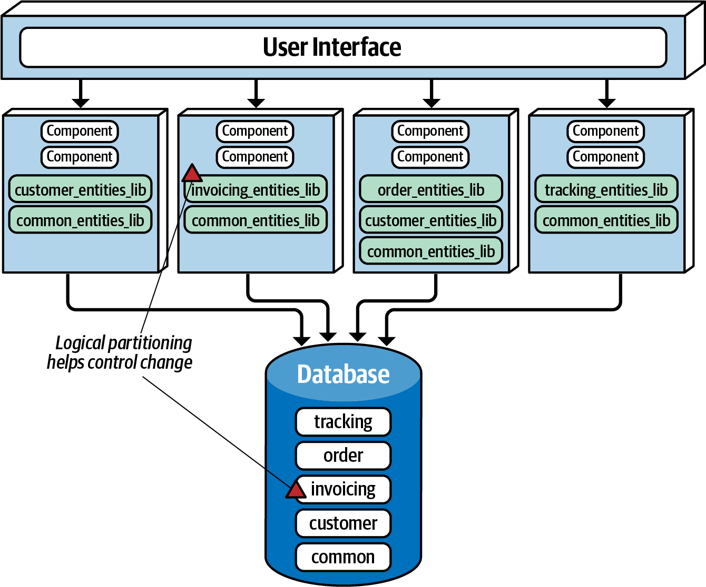

---

<!-- Page 142 -->

the recycling company will then assess the device to determine if the device is in good working
condition or not (called assessment). If the device is in good working condition, the company will
send the customer the money promised for the device (called accounting). Through this process, the
customer can go to the website at any time to check on the status of the item (called item status).
Based on the assessment, the device is then recycled by either safely destroying it or reselling it
(called recycling). Finally, the company periodically runs ad hoc and scheduled financial and
operational reports based on recycling activity (called reporting).

Figure 13-8 illustrates this system using a service-based architecture. Notice how each domain area
identified in the prior description is implemented as a separately deployed independent domain
service. Scalability can be achieved by only scaling those services needing higher throughput (in this
case, the customer-facing Quoting service and ItemStatus service). The other services do not need to
scale, and as such only require a single service instance.

Also notice in how the user interface applications are federated into their respective
domains: Customer Facing, Receiving, and Recycling and Accounting. This federation allows for fault
tolerance of the user interface, scalability, and security (external customers have no network path to
internal functionality). Finally, notice in this example that there are two separate physical databases:
one for external customer-facing operations, and one for internal operations. This allows the internal
data and operations to reside in a separate network zone from the external operations (denoted by
the vertical line), providing much better security access restrictions and data protection. One-way
access through the firewall allows internal services to access and update the customer-facing
information, but not vice versa. Alternatively, depending on the database being used, internal table
mirroring and table synchronization could also be used.

---

<!-- Page 143 -->

Figure 13-8. Electronics recycling example using service-based architecture

This example illustrates many of the benefits of the service-based architecture approach: scalability,
fault tolerance, and security (data and functionality protection and access), in addition to agility,
testability, and deployability. For example, the Assessment service is changed constantly to add
assessment rules as new products are received. This frequent change is isolated to a single domain
service, providing agility (the ability to respond quickly to change), as well as testability (the ease of
and completeness of testing) and deployability (the ease, frequency, and risk of deployment).

## Architecture Characteristics Ratings

A one-star rating in the characteristics ratings table in Figure 13-9 means the specific architecture
characteristic isn’t well supported in the architecture, whereas a five-star rating means the
architecture characteristic is one of the strongest features in the architecture style. The definition for
each characteristic identified in the scorecard can be found in Chapter 4.

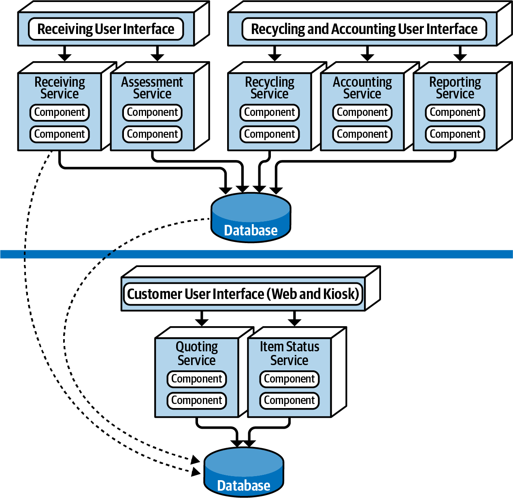

---

<!-- Page 144 -->

Figure 13-9. Service-based architecture characteristics ratings

Service-based architecture is a domain-partitioned architecture, meaning that the structure is driven
by the domain rather than a technical consideration (such as presentation logic or persistence
logic). Consider the prior example of the electronic recycling application. Each service, being a
separately deployed unit of software, is scoped to a specific domain (such as item assessment).
Changes made within this domain only impact the specific service, the corresponding user interface,
and the corresponding database. Nothing else needs to be modified to support a specific assessment
change.

Being a distributed architecture, the number of quanta can be greater than or equal to one. Even
though there may be anywhere from 4 to 12 separately deployed services, if those services all share
the same database or user interface, that entire system would be only a single quantum. However, as

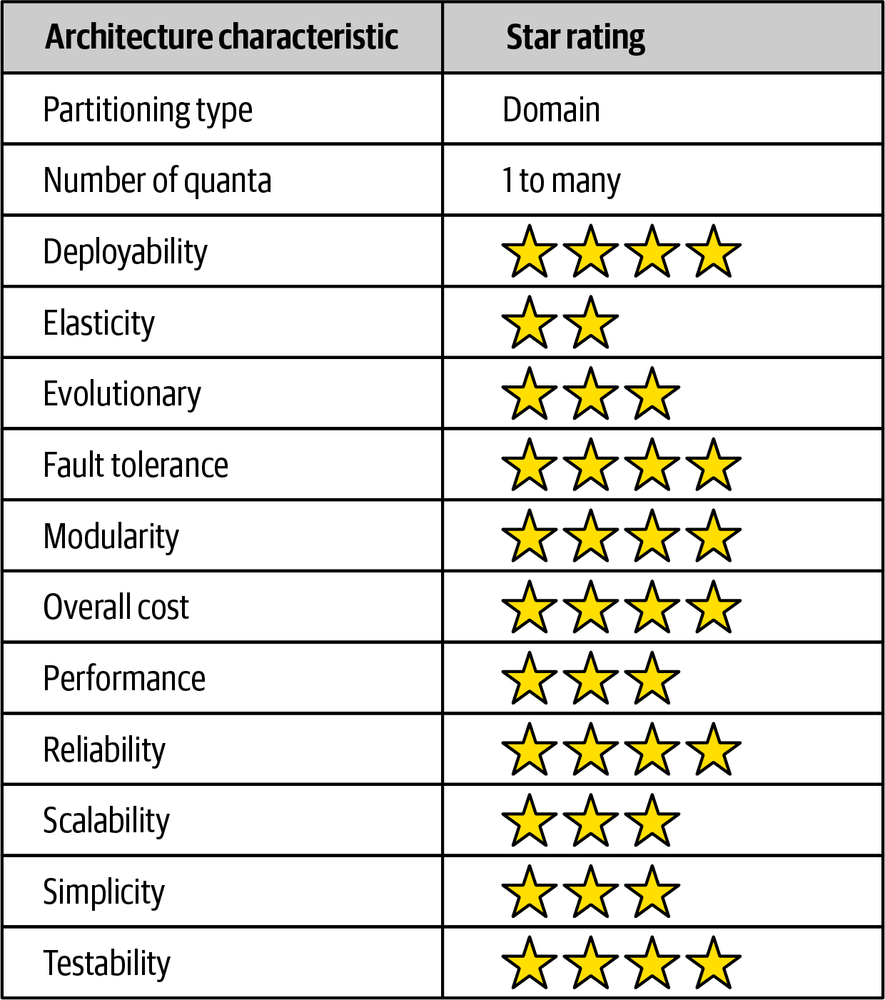

---

<!-- Page 145 -->

illustrated in “Topology Variants”, both the user interface and database can be federated, resulting in
multiple quanta within the overall system. In the electronics recycling example, the system contains
two quanta, as illustrated in Figure 13-10: one for the customer-facing portion of the application
containing a separate customer user interface, database, and set of services (Quoting and Item
Status); and one for the internal operations of receiving, assessing, and recycling the electronic
device. Notice that even though the internal operations quantum contains separately deployed
services and two separate user interfaces, they all share the same database, making the internal
operations portion of the application a single quantum.

Figure 13-10. Separate quanta in a service-based architecture

Although service-based architecture doesn’t contain any five-star ratings, it nevertheless rates high
(four stars) in many important and vital areas. Breaking apart an application into separately deployed
domain services using this architecture style allows for faster change (agility), better test coverage
due to the limited scope of the domain (testability), and the ability for more frequent deployments
carrying less risk than a large monolith (deployability). These three characteristics lead to better
time-to-market, allowing an organization to deliver new features and bug fixes at a relatively high
rate.

Fault tolerance and overall application availability also rate high for service-based architecture. Even
though domain services tend to be coarse-grained, the four-star rating comes from the fact that with

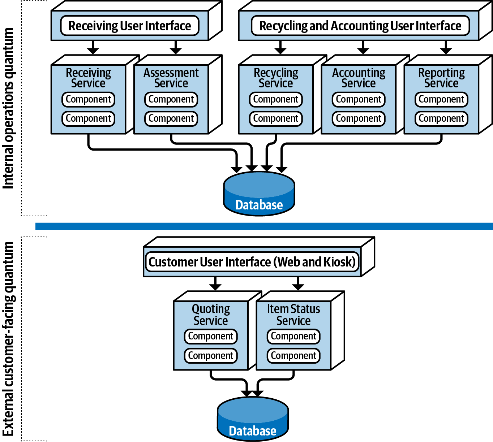

---

<!-- Page 146 -->

this architecture style, services are usually self-contained and do not leverage interservice
communication due to database sharing and code sharing. As a result, if one domain service goes
down (e.g., the Receiving service in the electronic recycling application example), it doesn’t impact
any of the other six services.

Scalability only rates three stars due to the coarse-grained nature of the services, and
correspondingly, elasticity only two stars. Although programmatic scalability and elasticity are
certainly possible with this architecture style, more functionality is replicated than with finer-grained
services (such as microservices) and as such is not as efficient in terms of machine resources and not
as cost-effective. Typically there are only single service instances with service-based architecture
unless there is a need for better throughput or failover. A good example of this is the electronics
recycling application example—only the Quoting and Item Status services need to scale to support
high customer volumes, but the other operational services only require single instances, making it
easier to support such things as single in-memory caching and database connection pooling.

Simplicity and overall cost are two other drivers that differentiate this architecture style from other,
more expensive and complex distributed architectures, such as microservices, event-driven
architecture, or even space-based architecture. This makes service-based one of the easiest and costeffective distributed architectures to implement. While this is an attractive proposition, there is a
trade-off to this cost savings and simplicity in all of the characteristics containing four-star ratings.
The higher the cost and complexity, the better these ratings become.

Service-based architectures tend to be more reliable than other distributed architectures due to the
coarse-grained nature of the domain services. Larger services mean less network traffic to and
between services, fewer distributed transactions, and less bandwidth used, therefore increasing
overall reliability with respect to the network.

## When to Use This Architecture Style

The flexibility of this architecture style (see “Topology Variants”) combined with the number of
three-star and four-star architecture characteristics ratings make service-based architecture one of
the most pragmatic architecture styles available. While there are certainly other distributed
architecture styles that are much more powerful, some companies find that power comes at too
steep of a price, while others find that they quite simply don’t need that much power. It’s like having
the power, speed, and agility of a Ferrari used only for driving back and forth to work in rush-hour
traffic at 50 kilometers per hour—sure it looks cool, but what a waste of resources and money!

Service-based architecture is also a natural fit when doing domain-driven design. Because services
are coarse-grained and domain-scoped, each domain fits nicely into a separately deployed domain
service. Each service in service-based architecture encompasses a particular domain (such as
recycling in the electronic recycling application), therefore compartmentalizing that functionality into
a single unit of software, making it easier to apply changes to that domain.

Maintaining and coordinating database transactions is always an issue with distributed architectures
in that they typically rely on eventual consistency rather than traditional ACID (atomicity,
consistency, isolation, and durability) transactions. However, service-based architecture preserves
ACID transactions better than any other distributed architecture due to the coarse-grained nature of
the domain services. There are cases where the user interface or API gateway might orchestrate two
or more domain services, and in these cases the transaction would need to rely on sagas and BASE
transactions. However, in most cases the transaction is scoped to a particular domain service,

---

<!-- Page 147 -->

allowing for the traditional commit and rollback transaction functionality found in most monolithic
applications.

Lastly, service-based architecture is a good choice for achieving a good level of architectural
modularity without having to get tangled up in the complexities and pitfalls of granularity. As services
become more fine-grained, issues surrounding orchestration and choreography start to appear. Both
orchestration and choreography are required when multiple services must be coordinated to
complete a certain business transaction. Orchestration is the coordination of multiple services
through the use of a separate mediator service that controls and manages the workflow of the
transaction (like a conductor in an orchestra). Choreography, on the other hand, is the coordination
of multiple services by which each service talks to one another without the use of a central mediator
(like dancers in a dance). As services become more fine-grained, both orchestration and
choreography are necessary to tie the services together to complete the business transaction.
However, because services within a service-based architecture tend to be more coarse-grained, they
don’t require coordination nearly as much as other distributed architectures.

You have 6 days left in your trial, Samjobara. Subscribe to

---

<!-- Page 148 -->

# Chapter 14. Event-Driven Architecture Style

The event-driven architecture style is a popular distributed asynchronous architecture style used to
produce highly scalable and high-performance applications. It is also highly adaptable and can be
used for small applications and as well as large, complex ones. Event-driven architecture is made up
of decoupled event processing components that asynchronously receive and process events. It can
be used as a standalone architecture style or embedded within other architecture styles (such as an
event-driven microservices architecture).

Most applications follow what is called a request-based model (illustrated in Figure 14-1). In this
model, requests made to the system to perform some sort of action are send to a request
orchestrator. The request orchestrator is typically a user interface, but it can also be implemented
through an API layer or enterprise service bus. The role of the request orchestrator is to
deterministically and synchronously direct the request to various request processors. The request
processors handle the request, either retrieving or updating information in a database.

A good example of the request-based model is a request from a customer to retrieve their order
history for the past six months. Retrieving order history information is a data-driven, deterministic
request made to the system for data within a specific context, not an event happening that the
system must react to.

An event-based model, on the other hand, reacts to a particular situation and takes action based on
that event. An example of an event-based model is submitting a bid for a particular item within an
online auction. Submitting the bid is not a request made to the system, but rather an event that
happens after the current asking price is announced. The system must respond to this event by
comparing the bid to others received at the same time to determine who is the current highest
bidder.

Figure 14-1. Request-based model

Topology

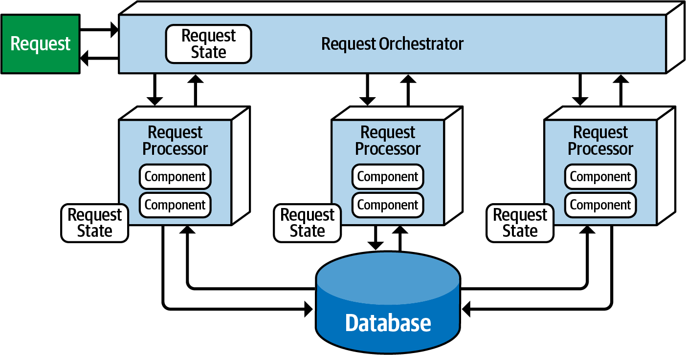

---

<!-- Page 149 -->

There are two primary topologies within event-driven architecture: the mediator topology and
the broker topology. The mediator topology is commonly used when you require control over the
workflow of an event process, whereas the broker topology is used when you require a high degree
of responsiveness and dynamic control over the processing of an event. Because the architecture
characteristics and implementation strategies differ between these two topologies, it is important to
understand each one to know which is best suited for a particular situation.

## Broker Topology

The broker topology differs from the mediator topology in that there is no central event
mediator. Rather, the message flow is distributed across the event processor components in a chainlike broadcasting fashion through a lightweight message broker (such as RabbitMQ, ActiveMQ,
HornetQ, and so on). This topology is useful when you have a relatively simple event processing flow
and you do not need central event orchestration and coordination.

There are four primary architecture components within the broker topology: an initiating event, the
event broker, an event processor, and a processing event. The initiating event is the initial event that
starts the entire event flow, whether it be a simple event like placing a bid in an online auction or
more complex events in a health benefits system like changing a job or getting married. The initiating
event is sent to an event channel in the event broker for processing. Since there is no mediator
component in the broker topology managing and controlling the event, a single event
processor accepts the initiating event from the event broker and begins the processing of that
event. The event processor that accepted the initiating event performs a specific task associated with
the processing of that event, then asynchronously advertises what it did to the rest of the system by
creating what is called a processing event. This processing event is then asynchronously sent to the
event broker for further processing, if needed. Other event processors listen to the processing event,
react to that event by doing something, then advertise through a new processing event what they
did. This process continues until no one is interested in what a final event processor did. Figure 14-
2 illustrates this event processing flow.

The event broker component is usually federated (meaning multiple domain-based clustered
instances), where each federated broker contains all of the event channels used within the event
flow for that particular domain. Because of the decoupled asynchronous fire-and-forget broadcasting
nature of the broker topology, topics (or topic exchanges in the case of AMQP) are usually used in
the broker topology using a publish-and-subscribe messaging model.

---

<!-- Page 150 -->

Figure 14-2. Broker topology

It is always a good practice within the broker topology for each event processor to advertise what it
did to the rest of the system, regardless of whether or not any other event processor cares about
what that action was. This practice provides architectural extensibility if additional functionality is
required for the processing of that event. For example, suppose as part of a complex event process,
as illustrated in Figure 14-3, an email is generated and sent to a customer notifying them of a
particular action taken. The Notification event processor would generate and send the email, then
advertise that action to the rest of the system through a new processing event sent to a topic.
However, in this case, no other event processors are listening for events on that topic, and as such
the message simply goes away.

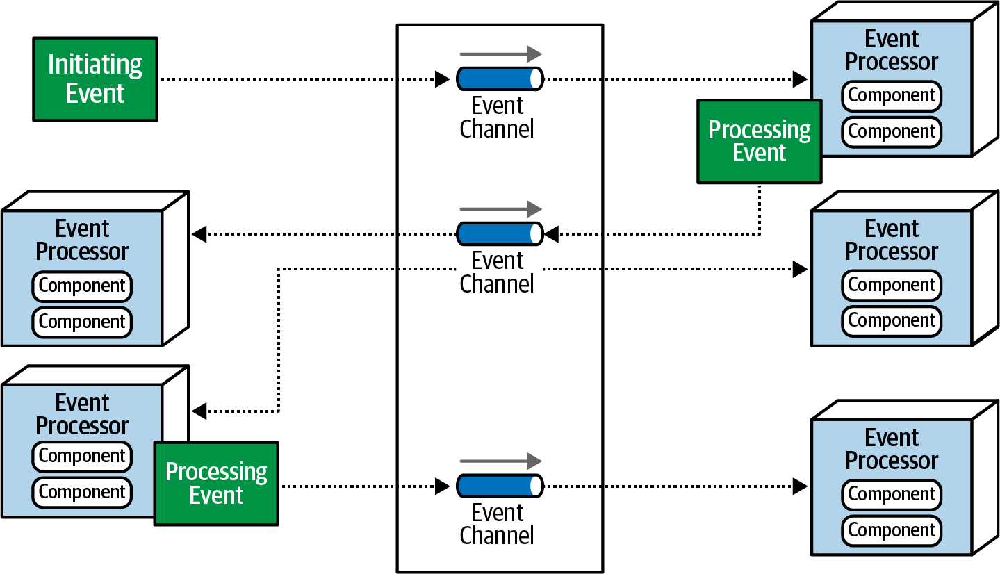

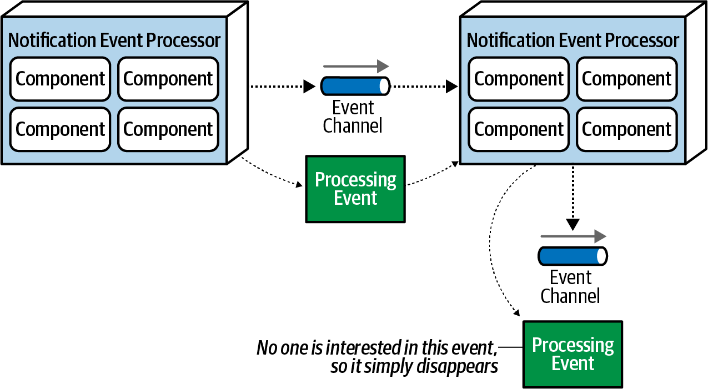

---

<!-- Page 151 -->

Figure 14-3. Notification event is sent but ignored

This is a good example of architectural extensibility. While it may seem like a waste of resources
sending messages that are ignored, it is not. Suppose a new requirement comes along to analyze
emails that have been sent to customers. This new event processor can be added to the overall
system with minimal effort because the email information is available via the email topic to the new
analyzer without having to add any additional infrastructure or apply any changes to other event
processors.

To illustrate how the broker topology works, consider the processing flow in a typical retail order
entry system, as illustrated in Figure 14-4, where an order is placed for an item (say, a book like this
one). In this example, the OrderPlacement event processor receives the initiating event (PlaceOrder),
inserts the order in a database table, and returns an order ID to the customer. It then advertises to
the rest of the system that it created an order through an order-created processing event. Notice
that three event processors are interested in that event: the Notification event processor,
the Payment event processor, and the Inventory event processor. All three of these event processors
perform their tasks in parallel.

---

<!-- Page 152 -->

Figure 14-4. Example of the broker topology

The Notification event processor receives the order-created processing event and emails the
customer. It then generates another processing event (email-sent). Notice that no other event
processors are listening to that event. This is normal and illustrates the previous example describing
architectural extensibility—an in-place hook so that other event processors can eventually tap into
that event feed, if needed.

The Inventory event processor also listens for the order-created processing event and decrements
the corresponding inventory for that book. It then advertises this action through an inventoryupdated processing event, which is in turn picked up by the Warehouse event processor to manage
the corresponding inventory between warehouses, reordering items if supplies get too low.

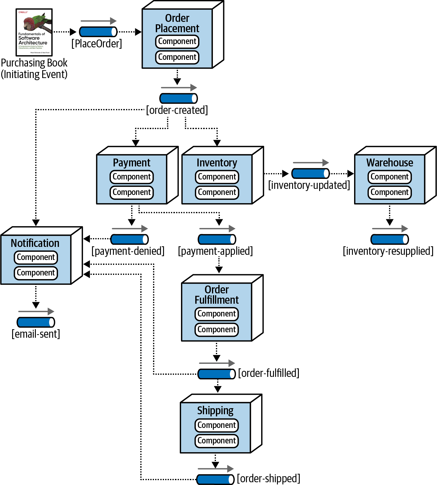

---

<!-- Page 153 -->

The Payment event processor also receives the order-created processing event and charges the
customer’s credit card for the order that was just created. Notice in Figure 14-4 that two events are
generated as a result of the actions taken by the Payment event processor: one to notify the rest of
the system that the payment was applied (payment-applied) and one processing event to notify the
rest of the system that the payment was denied (payment-denied). Notice that the Notification event
processor is interested in the payment-denied processing event, because it must, in turn, send an
email to the customer informing them that they must update their credit card information or choose
a different payment method.

The OrderFulfillment event processor listens to the payment-applied processing event and does
order picking and packing. Once completed, it then advertises to the rest of the system that it
fulfilled the order via an order-fulfilled processing event. Notice that both the Notification processing
unit and the Shipping processing unit listen to this processing event. Concurrently,
the Notification event notifies the customer that the order has been fulfilled and is ready for
shipment, and at the same time the Shipping event processor selects a shipping method.
The Shipping event processor ships the order and sends out an order-shipped processing event,
which the Notification event processor also listens for to notify the customer of the order status
change.

In analyzing the prior example, notice that all of the event processors are highly decoupled and
independent of each other. The best way to understand the broker topology is to think about it as a
relay race. In a relay race, runners hold a baton (a wooden stick) and run for a certain distance (say
1.5 kilometers), then hand off the baton to the next runner, and so on down the chain until the last
runner crosses the finish line. In relay races, once a runner hands off the baton, that runner is done
with the race and moves on to other things. This is also true with the broker topology. Once an event
processor hands off the event, it is no longer involved with the processing of that specific event and
is available to react to other initiating or processing events. In addition, each event processor can
scale independently from one other to handle varying load conditions or backups in the processing
within that event. The topics provide the back pressure point if an event processor comes down or
slows down due to some environment issue.

While performance, responsiveness, and scalability are all great benefits of the broker topology,
there are also some negatives about it. First of all, there is no control over the overall workflow
associated with the initiating event (in this case, the PlaceOrder event). It is very dynamic based on
various conditions, and no one in the system really knows when the business transaction of placing
an order is actually complete. Error handling is also a big challenge with the broker topology. Because
there is no mediator monitoring or controlling the business transaction, if a failure occurs (such as
the Payment event processor crashing and not completing its assigned task), no one in the system is
aware of that crash. The business process gets stuck and is unable to move without some sort of
automated or manual intervention. Furthermore, all other processes are moving along without
regard for the error. For example, the Inventory event processor still decrements the inventory, and
all other event processors react as though everything is fine.

The ability to restart a business transaction (recoverability) is also something not supported with the
broker topology. Because other actions have asynchronously been taken through the initial
processing of the initiating event, it is not possible to resubmit the initiating event. No component in
the broker topology is aware of the state or even owns the state of the original business request, and
therefore no one is responsible in this topology for restarting the business transaction (the initiating
event) and knowing where it left off. The advantages and disadvantages of the broker topology are
summarized in Table 14-1.

---

<!-- Page 154 -->

## Advantages                                Disadvantages

## Highly decoupled event processors           Workflow control

## High scalability                                 Error handling

## High responsiveness                            Recoverability

## High performance                              Restart capabilities

## High fault tolerance                         Data inconsistency

Table 14-1. Trade-offs of the broker topology

## Mediator Topology

The mediator topology of event-driven architecture addresses some of the shortcomings of the
broker topology described in the previous section. Central to this topology is an event mediator,
which manages and controls the workflow for initiating events that require the coordination of
multiple event processors. The architecture components that make up the mediator topology are an
initiating event, an event queue, an event mediator, event channels, and event processors.

Like in the broker topology, the initiating event is the event that starts the whole eventing
process. Unlike the broker topology, the initiating event is sent to an initiating event queue, which is
accepted by the event mediator. The event mediator only knows the steps involved in processing the
event and therefore generates corresponding processing events that are sent to dedicated event
channels (usually queues) in a point-to-point messaging fashion. Event processors then listen to
dedicated event channels, process the event, and usually respond back to the mediator that they
have completed their work. Unlike the broker topology, event processors within the mediator
topology do not advertise what they did to the rest of the system. The mediator topology is
illustrated in Figure 14-5.

---

<!-- Page 155 -->

Figure 14-5. Mediator topology

In most implementations of the mediator topology, there are multiple mediators, usually associated
with a particular domain or grouping of events. This reduces the single point of failure issue
associated with this topology and also increases overall throughput and performance. For example,
there might be a customer mediator that handles all customer-related events (such as new customer
registration and profile update), and another mediator that handles order-related activities (such as
adding an item to a shopping cart and checking out).

The event mediator can be implemented in a variety of ways, depending on the nature and
complexity of the events it is processing. For example, for events requiring simple error handling and
orchestration, a mediator such as Apache Camel, Mule ESB, or Spring Integration will usually
suffice. Message flows and message routes within these types of mediators are typically custom
written in programming code (such as Java or C#) to control the workflow of the event processing.

However, if the event workflow requires lots of conditional processing and multiple dynamic paths
with complex error handling directives, then a mediator such as Apache ODE or the Oracle BPEL
Process Manager would be a good choice. These mediators are based on Business Process Execution
Language (BPEL), an XML-like structure that describes the steps involved in processing an event. BPEL
artifacts also contain structured elements used for error handling, redirection, multicasting, and so
on. BPEL is a powerful but relatively complex language to learn, and as such is usually created using
graphical interface tools provided in the product’s BPEL engine suite.

BPEL is good for complex and dynamic workflows, but it does not work well for those event
workflows requiring long-running transactions involving human intervention throughout the event
process. For example, suppose a trade is being placed through a place-trade initiating event. The
event mediator accepts this event, but during the processing finds that a manual approval is required
because the trade is over a certain amount of shares. In this case the event mediator would have to
stop the event processing, send a notification to a senior trader for the manual approval, and wait for
that approval to occur. In these cases a Business Process Management (BPM) engine such
as jBPM would be required.

It is important to know the types of events that will be processed through the mediator in order to
make the correct choice for the implementation of the event mediator. Choosing Apache Camel for

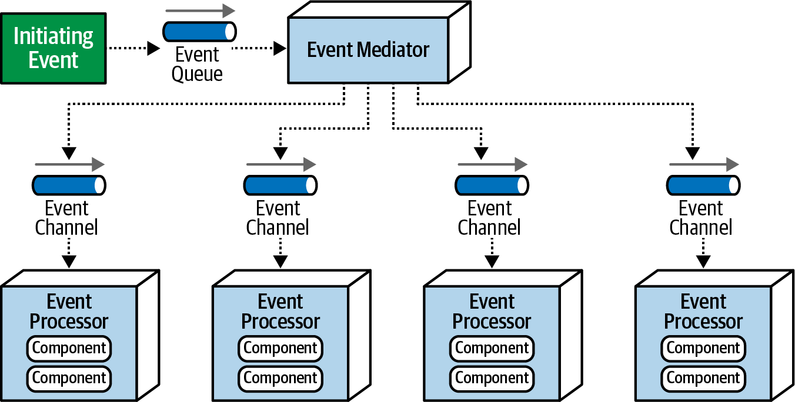

---

<!-- Page 156 -->

complex and long-running events involving human interaction would be extremely difficult to write
and maintain. By the same token, using a BPM engine for simple event flows would take months of
wasted effort when the same thing could be accomplished in Apache Camel in a matter of days.

Given that it’s rare to have all events of one class of complexity, we recommend classifying events as
simple, hard, or complex and having every event always go through a simple mediator (such as
Apache Camel or Mule). The simple mediator can then interrogate the classification of the event, and
based on that classification, handle the event itself or forward it to another, more complex, event
mediator. In this manner, all types of events can be effectively processed by the type of mediator
needed for that event. This mediator delegation model is illustrated in Figure 14-6.

Figure 14-6. Delegating the event to the appropriate type of event mediator

Notice in Figure 14-6 that the Simple Event Mediator generates and sends a processing event when
the event workflow is simple and can be handled by the simple mediator. However, notice that when
the initiating event coming into the Simple Event Mediator is classified as either hard or complex, it
forwards the original initiating event to the corresponding mediators (BPEL or BMP). The Simple
Event Mediator, having intercepted the original event, may still be responsible for knowing when
that event is complete, or it simply delegates the entire workflow (including client notification) to the
other mediators.

To illustrate how the mediator topology works, consider the same retail order entry system example
described in the prior broker topology section, but this time using the mediator topology. In this

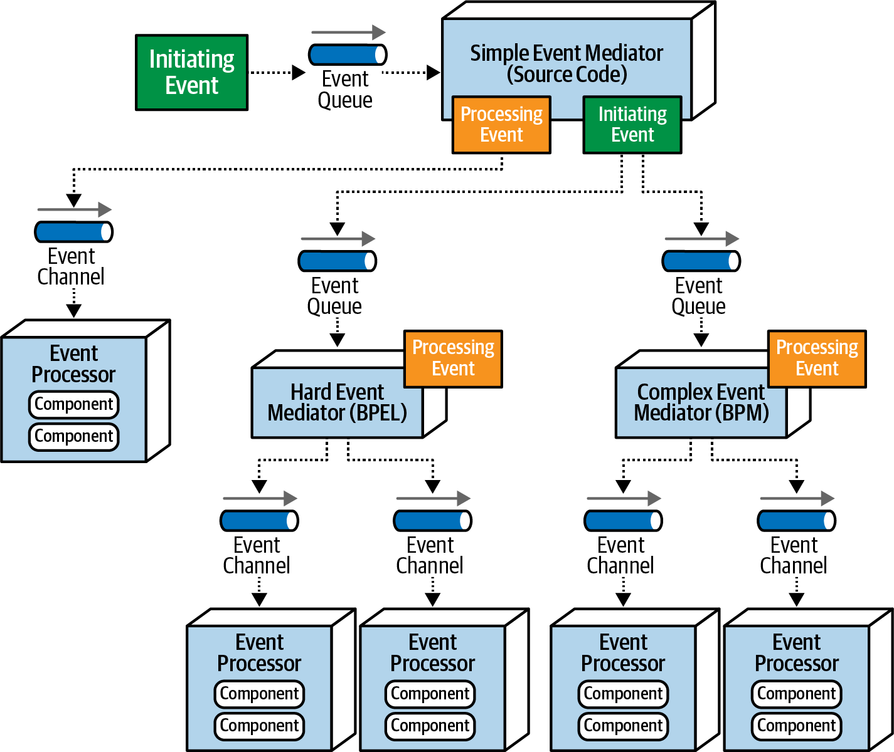

---

<!-- Page 157 -->

example, the mediator knows the steps required to process this particular event. This event flow
(internal to the mediator component) is illustrated in Figure 14-7.

Figure 14-7. Mediator steps for placing an order

In keeping with the prior example, the same initiating event (PlaceOrder) is sent to the customerevent-queue for processing. The Customer mediator picks up this initiating event and begins
generating processing events based on the flow in Figure 14-7. Notice that the multiple events shown
in steps 2, 3, and 4 are all done concurrently and serially between steps. In other words, step 3 (fulfill
order) must be completed and acknowledged before the customer can be notified that the order is
ready to be shipped in step 4 (ship order).

Once the initiating event has been received, the Customer mediator generates a createorder processing event and sends this message to the order-placement-queue (see Figure 14-8).
The OrderPlacement event processor accepts this event and validates and creates the order,
returning to the mediator an acknowledgement along with the order ID. At this point the mediator
might send that order ID back to the customer, indicating that the order was placed, or it might have
to continue until all the steps are complete (this would be based on specific business rules about
order placement).

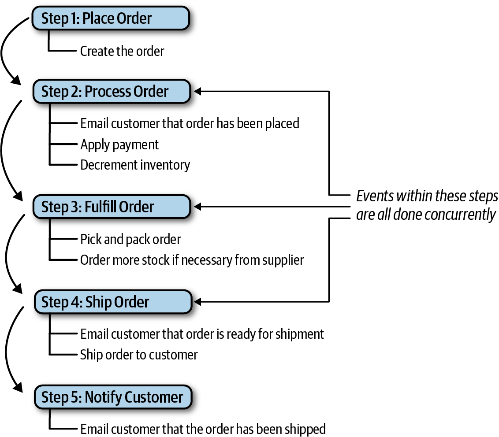

---

<!-- Page 158 -->

Figure 14-8. Step 1 of the mediator example

Now that step 1 is complete, the mediator now moves to step 2 (see Figure 14-9) and generates
three messages at the same time: email-customer, apply-payment, and adjust-inventory. These
processing events are all sent to their respective queues. All three event processors receive these
messages, perform their respective tasks, and notify the mediator that the processing has been
completed. Notice that the mediator must wait until it receives acknowledgement from all three
parallel processes before moving on to step 3. At this point, if an error occurs in one of the parallel
event processors, the mediator can take corrective action to fix the problem (this is discussed later in
this section in more detail).

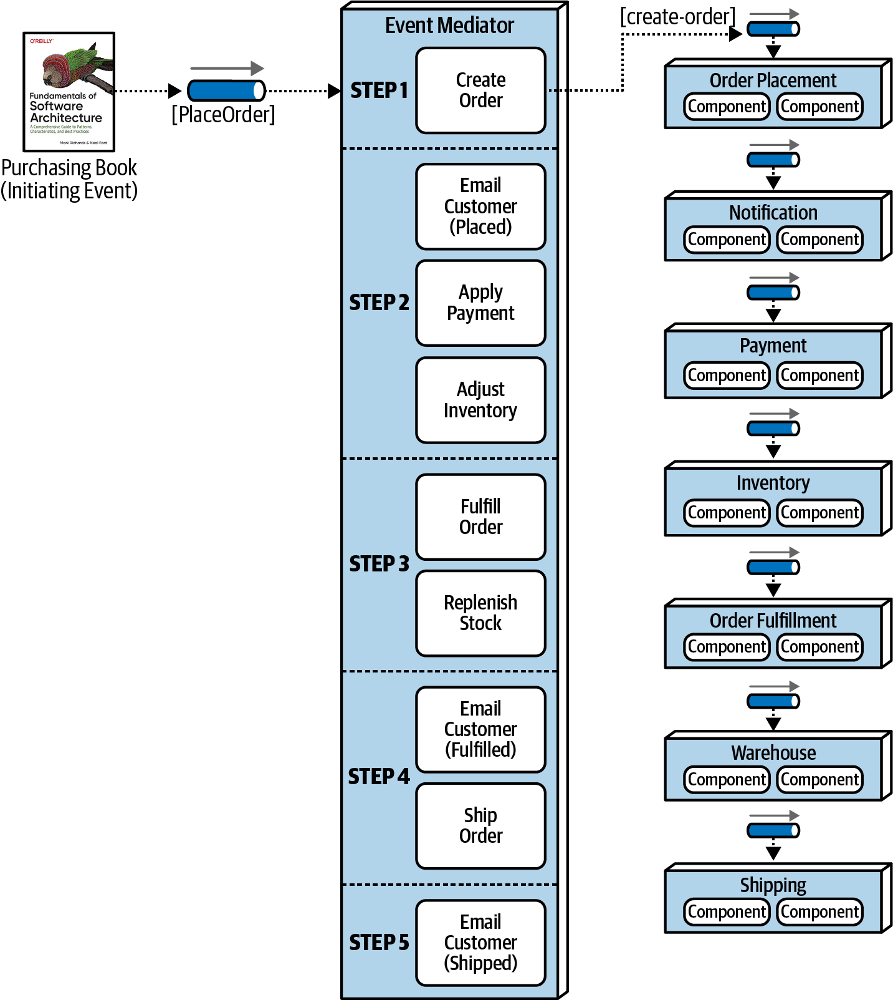

---

<!-- Page 159 -->

Figure 14-9. Step 2 of the mediator example

Once the mediator gets a successful acknowledgment from all of the event processors in step 2, it
can move on to step 3 to fulfill the order (see Figure 14-10). Notice once again that both of these
events (fulfill-order and order-stock) can occur simultaneously.
The OrderFulfillment and Warehouse event processors accept these events, perform their work, and
return an acknowledgement to the mediator.

---

<!-- Page 160 -->

Figure 14-10. Step 3 of the mediator example

Once these events are complete, the mediator then moves on to step 4 (see Figure 14-11) to ship the
order. This step generates another email-customer processing event with specific information about
what to do (in this case, notify the customer that the order is ready to be shipped), as well as a shiporder event.

---

<!-- Page 161 -->

Figure 14-11. Step 4 of the mediator example

Finally, the mediator moves to step 5 (see Figure 14-12) and generates another
contextual email_customer event to notify the customer that the order has been shipped. At this
point the workflow is done, and the mediator marks the initiating event flow complete and removes
all state associated with the initiating event.

---

<!-- Page 162 -->

Figure 14-12. Step 5 of the mediator example

The mediator component has knowledge and control over the workflow, something the broker
topology does not have. Because the mediator controls the workflow, it can maintain event state and
manage error handling, recoverability, and restart capabilities. For example, suppose in the prior
example the payment was not applied due to the credit card being expired. In this case the mediator
receives this error condition, and knowing the order cannot be fulfilled (step 3) until payment is
applied, stops the workflow and records the state of the request in its own persistent datastore.
Once payment is eventually applied, the workflow can be restarted from where it left off (in this
case, the beginning of step 3).

Another inherent difference between the broker and mediator topology is how the processing events
differ in terms of their meaning and how they are used. In the broker topology example in the

---

<!-- Page 163 -->

previous section, the processing events were published as events that had occurred in the system
(such as order-created, payment-applied, and email-sent). The event processors took some action,
and other event processors react to that action. However, in the mediator topology, processing
events such as place-order, send-email, and fulfill-order are commands (things that need to happen)
as opposed to events (things that have already happened). Also, in the mediator topology, a
processing event must be processed (command), whereas it can be ignored in the broker topology
(reaction).

While the mediator topology addresses the issues associated with the broker topology, there are
some negatives associated with the mediator topology. First of all, it is very difficult to declaratively
model the dynamic processing that occurs within a complex event flow. As a result, many workflows
within the mediator only handle the general processing, and a hybrid model combining both the
mediator and broker topologies is used to address the dynamic nature of complex event processing
(such as out-of-stock conditions or other nontypical errors). Furthermore, although the event
processors can easily scale in the same manner as the broker topology, the mediator must scale as
well, something that occasionally produces a bottleneck in the overall event processing flow. Finally,
event processors are not as highly decoupled in the mediator topology as with the broker topology,
and performance is not as good due to the mediator controlling the processing of the event. These
trade-offs are summarized in Table 14-2.

## Advantages                  Disadvantages

## Workflow control           More coupling of event processors

## Error handling              Lower scalability

## Recoverability              Lower performance

## Restart capabilities           Lower fault tolerance

## Better data consistency       Modeling complex workflows

Table 14-2. Trade-offs of the mediator topology

The choice between the broker and mediator topology essentially comes down to a trade-off
between workflow control and error handling capability versus high performance and scalability.
Although performance and scalability are still good within the mediator topology, they are not as
high as with the broker topology.

## Asynchronous Capabilities

The event-driven architecture style offers a unique characteristic over other architecture styles in
that it relies solely on asynchronous communication for both fire-and-forget processing (no response
required) as well as request/reply processing (response required from the event consumer).
Asynchronous communication can be a powerful technique for increasing the overall responsiveness
of a system.

---

<!-- Page 164 -->

Consider the example illustrated in Figure 14-13 where a user is posting a comment on a website for
a particular product review. Assume the comment service in this example takes 3,000 milliseconds to
post the comment because it goes through several parsing engines: a bad word checker to check for
unacceptable words, a grammar checker to make sure that the sentence structures are not saying
something abusive, and finally a context checker to make sure the comment is about a particular
product and not just a political rant. Notice in Figure 14-13 that the top path utilizes a synchronous
RESTful call to post the comment: 50 milliseconds in latency for the service to receive the post, 3,000
milliseconds to post the comment, and 50 milliseconds in network latency to respond back to the
user that the comment was posted. This creates a response time for the user of 3,100 milliseconds to
post a comment. Now look at the bottom path and notice that with the use of asynchronous
messaging, the response time from the end user’s perspective for posting a comment on the website
is only 25 milliseconds (as opposed to 3,100 milliseconds). It still takes 3,025 milliseconds to post the
comment (25 milliseconds to receive the message and 3,000 milliseconds to post the comment), but
from the end user’s perspective it’s already been done.

Figure 14-13. Synchronous versus asynchronous communication

This is a good example of the difference between responsiveness and performance. When the user
does not need any information back (other than an acknowledgement or a thank you message), why
make the user wait? Responsiveness is all about notifying the user that the action has been accepted
and will be processed momentarily, whereas performance is about making the end-to-end process
faster. Notice that nothing was done to optimize the way the comment service processes the text—
in both cases it is still taking 3,000 milliseconds. Addressing performance would have been optimizing
the comment service to run all of the text and grammar parsing engines in parallel with the use of
caching and other similar techniques. The bottom example in Figure 14-13 addresses the overall
responsiveness of the system but not the performance of the system.

The difference in response time between the two examples in Figure 14-13 from 3,100 milliseconds
to 25 milliseconds is staggering. There is one caveat. On the synchronous path shown on the top of
the diagram, the end user is guaranteed that the comment has been posted. However, on the
bottom path there is only the acknowledgement of the post, with a future promise that eventually
the comment will get posted. From the end user’s perspective, the comment has been posted. But
what happens if the user had typed a bad word in the comment? In this case the comment would be

---

<!-- Page 165 -->

rejected, but there is no way to get back to the end user. Or is there? In this example, assuming the
user is registered with the website (which to post a comment they would have to be), a message
could be sent to the user indicating a problem with the comment and some suggestions on how to
repair it. This is a simple example. What about a more complicated example where the purchase of
some stock is taking place asynchronously (called a stock trade) and there is no way to get back to
the user?

The main issue with asynchronous communications is error handling. While responsiveness is
significantly improved, it is difficult to address error conditions, adding to the complexity of the
event-driven system. The next section addresses this issue with a pattern of reactive architecture
called the workflow event pattern.

## Error Handling

The workflow event pattern of reactive architecture is one way of addressing the issues associated
with error handling in an asynchronous workflow. This pattern is a reactive architecture pattern that
addresses both resiliency and responsiveness. In other words, the system can be resilient in terms of
error handling without an impact to responsiveness.

The workflow event pattern leverages delegation, containment, and repair through the use of
a workflow delegate, as illustrated in Figure 14-14. The event producer asynchronously passes data
through a message channel to the event consumer. If the event consumer experiences an error while
processing the data, it immediately delegates that error to the workflow processor and moves on to
the next message in the event queue. In this way, overall responsiveness is not impacted because the
next message is immediately processed. If the event consumer were to spend the time trying to
figure out the error, then it is not reading the next message in the queue, therefore impacting the
responsiveness not only of the next message, but all other messages waiting in the queue to be
processed.

Once the workflow processor receives an error, it tries to figure out what is wrong with the message.
This could be a static, deterministic error, or it could leverage some machine learning algorithms to
analyze the message to see some anomaly in the data. Either way, the workflow processor
programmatically (without human intervention) makes changes to the original data to try and repair
it, and then sends it back to the originating queue. The event consumer sees this message as a new
one and tries to process it again, hopefully this time with some success. Of course, there are many
times when the workflow processor cannot determine what is wrong with the message. In these
cases the workflow processor sends the message off to another queue, which is then received in
what is usually called a “dashboard,” an application that looks similar to the Microsoft’s Outlook or
Apple’s Mail. This dashboard usually resides on the desktop of a person of importance, who then
looks at the message, applies manual fixes to it, and then resubmits it to the original queue (usually
through a reply-to message header variable).

---

<!-- Page 166 -->

Figure 14-14. Workflow event pattern of reactive architecture

To illustrate the workflow event pattern, suppose a trading advisor in one part of the country accepts
trade orders (instructions on what stock to buy and for how many shares) on behalf of a large trading
firm in another part of the country. The advisor batches up the trade orders (what is usually called a
basket) and asynchronously sends those to the large trading firm to be placed with a broker so the
stock can be purchased. To simplify the example, suppose the contract for the trade instructions
must adhere to the following:

## ACCOUNT(String),SIDE(String),SYMBOL(String),SHARES(Long)

Suppose the large trading firm receives the following basket of Apple (AAPL) trade orders from the
trading advisor:

12654A87FR4,BUY,AAPL,1254

87R54E3068U,BUY,AAPL,3122

6R4NB7609JJ,BUY,AAPL,5433

2WE35HF6DHF,BUY,AAPL,8756 SHARES

764980974R2,BUY,AAPL,1211

1533G658HD8,BUY,AAPL,2654

Notice the forth trade instruction (2WE35HF6DHF,BUY,AAPL,8756 SHARES) has the
word SHARES after the number of shares for the trade. When these asynchronous trade orders are
processed by the large trading firm without any error handling capabilities, the following error occurs
within the trade placement service:

Exception in thread "main" java.lang.NumberFormatException:

For input string: "8756 SHARES"

---

<!-- Page 167 -->

at java.lang.NumberFormatException.forInputString

(NumberFormatException.java:65)

at java.lang.Long.parseLong(Long.java:589)

at java.lang.Long.<init>(Long.java:965)

at trading.TradePlacement.execute(TradePlacement.java:23)

at trading.TradePlacement.main(TradePlacement.java:29)

When this exception occurs, there is nothing that the trade placement service can do, because this
was an asynchronous request, except to possibly log the error condition. In other words, there is no
user to synchronously respond to and fix the error.

Applying the workflow event pattern can programmatically fix this error. Because the large trading
firm has no control over the trading advisor and the corresponding trade order data it sends, it must
react to fix the error itself (as illustrated in Figure 14-15). When the same error occurs
(2WE35HF6DHF,BUY,AAPL,8756 SHARES), the Trade Placement service immediately delegates the
error via asynchronous messaging to the Trade Placement Error service for error handling, passing
with the error information about the exception:

## Trade Placed: 12654A87FR4,BUY,AAPL,1254

## Trade Placed: 87R54E3068U,BUY,AAPL,3122

## Trade Placed: 6R4NB7609JJ,BUY,AAPL,5433

Error Placing Trade: "2WE35HF6DHF,BUY,AAPL,8756 SHARES"

Sending to trade error processor <-- delegate the error fixing and move on

## Trade Placed: 764980974R2,BUY,AAPL,1211

...

The Trade Placement Error service (acting as the workflow delegate) receives the error and inspects
the exception. Seeing that it is an issue with the word SHARES in the number of shares field,
the Trade Placement Error service strips off the word SHARES and resubmits the trade for
reprocessing:

## Received Trade Order Error: 2WE35HF6DHF,BUY,AAPL,8756 SHARES

## Trade fixed: 2WE35HF6DHF,BUY,AAPL,8756

## Resubmitting Trade For Re-Processing

The fixed trade is then processed successfully by the trade placement service:

...

trade placed: 1533G658HD8,BUY,AAPL,2654

trade placed: 2WE35HF6DHF,BUY,AAPL,8756 <-- this was the original trade in error

---

<!-- Page 168 -->

Figure 14-15. Error handling with the workflow event pattern

One of the consequences of the workflow event pattern is that messages in error are processed out
of sequence when they are resubmitted. In our trading example, the order of messages matters,
because all trades within a given account must be processed in order (for example, a SELL for IBM
must occur before a BUY for AAPL within the same brokerage account). Although not impossible, it is
a complex task to maintain message order within a given context (in this case the brokerage account
number). One way this can be addressed is by the Trade Placement service queueing and storing the
account number of the trade in error. Any trade with that same account number would be stored in a
temporary queue for later processing (in FIFO order). Once the trade originally in error is fixed and
processed, the Trade Placement service then de-queues the remaining trades for that same account
and processes them in order.

## Preventing Data Loss

Data loss is always a primary concern when dealing with asynchronous
communications. Unfortunately, there are many places for data loss to occur within an event-driven
architecture. By data loss we mean a message getting dropped or never making it to its final
destination. Fortunately, there are basic out-of-the-box techniques that can be leveraged to prevent
data loss when using asynchronous messaging.

To illustrate the issues associated with data loss within event-driven architecture,
suppose Event Processor A asynchronously sends a message to a queue. Event Processor B accepts
the message and inserts the data within the message into a database. As illustrated in Figure 14-16,
three areas of data loss can occur within this typical scenario:

1.  The message never makes it to the queue from Event Processor A; or even if it does, the
broker goes down before the next event processor can retrieve the message.

2.  Event Processor B de-queues the next available message and crashes before it can process
the event.

---

<!-- Page 169 -->

3.  Event Processor B is unable to persist the message to the database due to some data error.

Figure 14-16. Where data loss can happen within an event-driven architecture

Each of these areas of data loss can be mitigated through basic messaging techniques. Issue 1 (the
message never makes it to the queue) is easily solved by leveraging persisted message queues, along
with something called synchronous send. Persisted message queues support what is known as
guaranteed delivery. When the message broker receives the message, it not only stores it in memory
for fast retrieval, but also persists the message in some sort of physical data store (such as a
filesystem or database). If the message broker goes down, the message is physically stored on disk so
that when the message broker comes back up, the message is available for processing. Synchronous
send does a blocking wait in the message producer until the broker has acknowledged that the
message has been persisted. With these two basic techniques there is no way to lose a message
between the event producer and the queue because the message is either still with the message
producer or persisted within the queue.

Issue 2 (Event Processor B de-queues the next available message and crashes before it can process
the event) can also be solved using a basic technique of messaging called client acknowledge
mode. By default, when a message is de-queued, it is immediately removed from the queue
(something called auto acknowledge mode). Client acknowledge mode keeps the message in the
queue and attaches the client ID to the message so that no other consumers can read the message.
With this mode, if Event Processor B crashes, the message is still preserved in the queue, preventing
message loss in this part of the message flow.

Issue 3 (Event Processor B is unable to persist the message to the database due to some data error) is
addressed through leveraging ACID (atomicity, consistency, isolation, durability) transactions via a
database commit. Once the database commit happens, the data is guaranteed to be persisted in the
database. Leveraging something called last participant support (LPS) removes the message from the
persisted queue by acknowledging that processing has been completed and that the message has
been persisted. This guarantees the message is not lost during the transit from Event Processor A all
the way to the database. These techniques are illustrated in Figure 14-17.

---

<!-- Page 170 -->

Figure 14-17. Preventing data loss within an event-driven architecture

## Broadcast Capabilities

One of the other unique characteristics of event-driven architecture is the capability to broadcast
events without knowledge of who (if anyone) is receiving the message and what they do with it. This
technique, which is illustrated in Figure 14-18, shows that when a producer publishes a message, that
same message is received by multiple subscribers.

Figure 14-18. Broadcasting events to other event processors

---

<!-- Page 171 -->

Broadcasting is perhaps the highest level of decoupling between event processors because the
producer of the broadcast message usually does not know which event processors will be receiving
the broadcast message and more importantly, what they will do with the message. Broadcast
capabilities are an essential part of patterns for eventual consistency, complex event processing
(CEP), and a host of other situations. Consider frequent changes in stock prices for instruments
traded on the stock market. Every ticker (the current price of a particular stock) might influence a
number of things. However, the service publishing the latest price simply broadcasts it with no
knowledge of how that information will be used.

## Request-Reply

So far in this chapter we’ve dealt with asynchronous requests that don’t need an immediate
response from the event consumer. But what if an order ID is needed when ordering a book? What if
a confirmation number is needed when booking a flight? These are examples of communication
between services or event processors that require some sort of synchronous communication.

In event-driven architecture, synchronous communication is accomplished through requestreply messaging (sometimes referred to as pseudosynchronous communications). Each event channel
within request-reply messaging consists of two queues: a request queue and a reply queue. The
initial request for information is asynchronously sent to the request queue, and then control is
returned to the message producer. The message producer then does a blocking wait on the reply
queue, waiting for the response. The message consumer receives and processes the message and
then sends the response to the reply queue. The event producer then receives the message with the
response data. This basic flow is illustrated in Figure 14-19.

Figure 14-19. Request-reply message processing

There are two primary techniques for implementing request-reply messaging. The first (and most
common) technique is to use a correlation ID contained in the message header. A correlation ID is a
field in the reply message that is usually set to the message ID of the original request message. This

---

<!-- Page 172 -->

technique, as illustrated in Figure 14-20, works as follows, with the message ID indicated with ID, and
the correlation ID indicated with CID:

1.  The event producer sends a message to the request queue and records the unique message
ID (in this case ID 124). Notice that the correlation ID (CID) in this case is null.

2.  The event producer now does a blocking wait on the reply queue with a message filter (also
called a message selector), where the correlation ID in the message header equals the
original message ID (in this case 124). Notice there are two messages in the reply queue:
message ID 855 with correlation ID 120, and message ID 856 with correlation ID 122. Neither
of these messages will be picked up because the correlation ID does not match what the
event consumer is looking for (CID 124).

3.  The event consumer receives the message (ID 124) and processes the request.

4.  The event consumer creates the reply message containing the response and sets the
correlation ID (CID) in the message header to the original message ID (124).

5.  The event consumer sends the new message (ID 857) to the reply queue.

6.  The event producer receives the message because the correlation ID (124) matches the
message selector from step 2.

Figure 14-20. Request-reply message processing using a correlation ID

The other technique used to implement request-reply messaging is to use a temporary queue for the
reply queue. A temporary queue is dedicated to the specific request, created when the request is
made and deleted when the request ends. This technique, as illustrated in Figure 14-21, does not
require a correlation ID because the temporary queue is a dedicated queue only known to the event
producer for the specific request. The temporary queue technique works as follows:

1.  The event producer creates a temporary queue (or one is automatically created, depending
on the message broker) and sends a message to the request queue, passing the name of the

---

<!-- Page 173 -->

temporary queue in the reply-to header (or some other agreed-upon custom attribute in the
message header).

2.  The event producer does a blocking wait on the temporary reply queue. No message selector
is needed because any message sent to this queue belongs solely to the event producer that
originally sent to the message.

3.  The event consumer receives the message, processes the request, and sends a response
message to the reply queue named in the reply-to header.

4.  The event processor receives the message and deletes the temporary queue.

Figure 14-21. Request-reply message processing using a temporary queue

While the temporary queue technique is much simpler, the message broker must create a temporary
queue for each request made and then delete it immediately afterward. Large messaging volumes
can significantly slow down the message broker and impact overall performance and responsiveness.
For this reason we usually recommend using the correlation ID technique.

## Choosing Between Request-Based and Event-Based

The request-based model and event-based model are both viable approaches for designing software
systems. However, choosing the right model is essential to the overall success of the system. We
recommend choosing the request-based model for well-structured, data-driven requests (such as
retrieving customer profile data) when certainty and control over the workflow is needed. We
recommend choosing the event-based model for flexible, action-based events that require high
levels of responsiveness and scale, with complex and dynamic user processing.

Understanding the trade-offs with the event-based model also helps decide which one is the best
fit. Table 14-3 lists the advantages and disadvantages of the event-based model of event-driven
architecture.

## Advantages over request-based                     Trade-offs

Better response to dynamic user content            Only supports eventual consistency

---

<!-- Page 174 -->

## Advantages over request-based                     Trade-offs

Better scalability and elasticity                       Less control over processing flow

Better agility and change management               Less certainty over outcome of event flow

Better adaptability and extensibility                      Difficult to test and debug

## Better responsiveness and performance

## Better real-time decision making

## Better reaction to situational awareness

Table 14-3. Trade-offs of the event-driven model

## Hybrid Event-Driven Architectures

While many applications leverage the event-driven architecture style as the primary overarching
architecture, in many cases event-driven architecture is used in conjunction with other architecture
styles, forming what is known as a hybrid architecture. Some common architecture styles that
leverage event-driven architecture as part of another architecture style include microservices and
space-based architecture. Other hybrids that are possible include an event-driven microkernel
architecture and an event-driven pipeline architecture.

Adding event-driven architecture to any architecture style helps remove bottlenecks, provides a back
pressure point in the event requests get backed up, and provides a level of user responsiveness not
found in other architecture styles. Both microservices and space-based architecture leverage
messaging for data pumps, asynchronously sending data to another processor that in turn updates
data in a database. Both also leverage event-driven architecture to provide a level of programmatic
scalability to services in a microservices architecture and processing units in a space-based
architecture when using messaging for interservice communication.

## Architecture Characteristics Ratings

A one-star rating in the characteristics ratings table in Figure 14-22 means the specific architecture
characteristic isn’t well supported in the architecture, whereas a five-star rating means the
architecture characteristic is one of the strongest features in the architecture style. The definition for
each characteristic identified in the scorecard can be found in Chapter 4.

Event-driven architecture is primarily a technically partitioned architecture in that any particular
domain is spread across multiple event processors and tied together through mediators, queues, and
topics. Changes to a particular domain usually impact many event processors, mediators, and other
messaging artifacts, hence why event-driven architecture is not domain partitioned.

---

<!-- Page 175 -->

Figure 14-22. Event-driven architecture characteristics ratings

The number of quanta within event-driven architecture can vary from one to many quanta, which is
usually based on the database interactions within each event processor and request-reply
processing. Even though all communication in an event-driven architecture is asynchronous, if
multiple event processors share a single database instance, they would all be contained within the
same architectural quantum. The same is true for request-reply processing: even though the
communication is still asynchronous between the event processors, if a request is needed right away
from the event consumer, it ties those event processors together synchronously; hence they belong
to the same quantum.

To illustrate this point, consider the example where one event processor sends a request to another
event processor to place an order. The first event processor must wait for an order ID from the other

---

<!-- Page 176 -->

event processor to continue. If the second event processor that places the order and generates an
order ID is down, the first event processor cannot continue. Therefore, they are part of the same
architecture quantum and share the same architectural characteristics, even though they are both
sending and receiving asynchronous messages.

Event-driven architecture gains five stars for performance, scalability, and fault tolerance, the
primary strengths of this architecture style. High performance is achieved through asynchronous
communications combined with highly parallel processing. High scalability is realized through the
programmatic load balancing of event processors (also called competing consumers). As the request
load increases, additional event processors can be programmatically added to handle the additional
requests. Fault tolerance is achieved through highly decoupled and asynchronous event processors
that provide eventual consistency and eventual processing of event workflows. Providing the user
interface or an event processor making a request does not need an immediate response, promises
and futures can be leveraged to process the event at a later time if other downstream processors are
not available.

Overall simplicity and testability rate relatively low with event-driven architecture, mostly due to the
nondeterministic and dynamic event flows typically found within this architecture style. While
deterministic flows within the request-based model are relatively easy to test because the paths and
outcomes are generally known, such is not the case with the event-driven model. Sometimes it is not
known how event processors will react to dynamic events, and what messages they might produce.
These “event tree diagrams” can be extremely complex, generating hundreds to even thousands of
scenarios, making it very difficult to govern and test.

Finally, event-driven architectures are highly evolutionary, hence the five-star rating. Adding new
features through existing or new event processors is relatively straightforward, particularly in the
broker topology. By providing hooks via published messages in the broker topology, the data is
already made available, hence no changes are required in the infrastructure or existing event
processors to add that new functionality.

You have 6 days left in your trial, Samjobara. Subscribe today. See pricing options.

---

<!-- Page 177 -->

# Chapter 15. Space-Based Architecture Style

Most web-based business applications follow the same general request flow: a request from a
browser hits the web server, then an application server, then finally the database server. While this
pattern works great for a small set of users, bottlenecks start appearing as the user load increases,
first at the web-server layer, then at the application-server layer, and finally at the database-server
layer. The usual response to bottlenecks based on an increase in user load is to scale out the web
servers. This is relatively easy and inexpensive, and it sometimes works to address the bottleneck
issues. However, in most cases of high user load, scaling out the web-server layer just moves the
bottleneck down to the application server. Scaling application servers can be more complex and
expensive than web servers and usually just moves the bottleneck down to the database server,
which is even more difficult and expensive to scale. Even if you can scale the database, what you
eventually end up with is a triangle-shaped topology, with the widest part of the triangle being the
web servers (easiest to scale) and the smallest part being the database (hardest to scale), as
illustrated in Figure 15-1.

In any high-volume application with a large concurrent user load, the database will usually be the
final limiting factor in how many transactions you can process concurrently. While various caching
technologies and database scaling products help to address these issues, the fact remains that
scaling out a normal application for extreme loads is a very difficult proposition.

Figure 15-1. Scalability limits within a traditional web-based topology

The space-based architecture style is specifically designed to address problems involving high
scalability, elasticity, and high concurrency issues. It is also a useful architecture style for applications
that have variable and unpredictable concurrent user volumes. Solving the extreme and variable

---

<!-- Page 178 -->

scalability issue architecturally is often a better approach than trying to scale out a database or
retrofit caching technologies into a nonscalable architecture.

## General Topology

Space-based architecture gets its name from the concept of tuple space, the technique of using
multiple parallel processors communicating through shared memory. High scalability, high elasticity,
and high performance are achieved by removing the central database as a synchronous constraint in
the system and instead leveraging replicated in-memory data grids. Application data is kept inmemory and replicated among all the active processing units. When a processing unit updates data,
it asynchronously sends that data to the database, usually via messaging with persistent queues.
Processing units start up and shut down dynamically as user load increases and decreases, thereby
addressing variable scalability. Because there is no central database involved in the standard
transactional processing of the application, the database bottleneck is removed, thus providing nearinfinite scalability within the application.

There are several architecture components that make up a space-based architecture: a processing
unit containing the application code, virtualized middleware used to manage and coordinate the
processing units, data pumps to asynchronously send updated data to the database, data
writers that perform the updates from the data pumps, and data readers that read database data
and deliver it to processing units upon startup. Figure 15-2 illustrates these primary architecture
components.

Figure 15-2. Space-based architecture basic topology

Processing Unit

---

<!-- Page 179 -->

The processing unit (illustrated in Figure 15-3) contains the application logic (or portions of the
application logic). This usually includes web-based components as well as backend business logic. The
contents of the processing unit vary based on the type of application. Smaller web-based applications
would likely be deployed into a single processing unit, whereas larger applications may split the
application functionality into multiple processing units based on the functional areas of the
application. The processing unit can also contain small, single-purpose services (as with
microservices). In addition to the application logic, the processing unit also contains an in-memory
data grid and replication engine usually implemented through such products as Hazelcast, Apache
Ignite, and Oracle Coherence.

Figure 15-3. Processing unit

## Virtualized Middleware

The virtualized middleware handles the infrastructure concerns within the architecture that control
various aspects of data synchronization and request handling. The components that make up the
virtualized middleware include a messaging grid, data grid, processing grid, and deployment
manager. These components, which are described in detail in the next sections, can be custom
written or purchased as third-party products.

## MESSAGING GRID

The messaging grid, shown in Figure 15-4, manages input request and session state. When a request
comes into the virtualized middleware, the messaging grid component determines which active

---

<!-- Page 180 -->

processing components are available to receive the request and forwards the request to one of those
processing units. The complexity of the messaging grid can range from a simple round-robin
algorithm to a more complex next-available algorithm that keeps track of which request is being
processed by which processing unit. This component is usually implemented using a typical web
server with load-balancing capabilities (such as HA Proxy and Nginx).

Figure 15-4. Messaging grid

## DATA GRID

The data grid component is perhaps the most important and crucial component in this architecture
style. In most modern implementations the data grid is implemented solely within the processing
units as a replicated cache. However, for those replicated caching implementations that require an
external controller, or when using a distributed cache, this functionality would reside in both the
processing units as well as in the data grid component within the virtualized middleware. Since the
messaging grid can forward a request to any of the processing units available, it is essential that each
processing unit contains exactly the same data in its in-memory data grid. Although Figure 15-
5 shows a synchronous data replication between processing units, in reality this is done
asynchronously and very quickly, usually completing the data synchronization in less than 100
milliseconds.

---

<!-- Page 181 -->

Figure 15-5. Data grid

Data is synchronized between processing units that contain the same named data grid. To illustrate
this point, consider the following code in Java using Hazelcast that creates an internal replicated data
grid for processing units containing customer profile information:

HazelcastInstance hz = Hazelcast.newHazelcastInstance();

Map<String, CustomerProfile> profileCache =

hz.getReplicatedMap("CustomerProfile");

All processing units needing access to the customer profile information would contain this code.
Changes made to the CustomerProfile named cache from any of the processing units would have that
change replicated to all other processing units containing that same named cache. A processing unit
can contain as many replicated caches as needed to complete its work. Alternatively, one processing
unit can make a remote call to another processing unit to ask for data (choreography) or leverage the
processing grid (described in the next section) to orchestrate the request.

Data replication within the processing units also allows service instances to come up and down
without having to read data from the database, providing there is at least one instance containing
the named replicated cache. When a processing unit instance comes up, it connects to the cache
provider (such as Hazelcast) and makes a request to get the named cache. Once the connection is
made to the other processing units, the cache will be loaded from one of the other instances.

---

<!-- Page 182 -->

Each processing unit knows about all other processing unit instances through the use of a member
list. The member list contains the IP address and ports of all other processing units using that same
named cache. For example, suppose there is a single processing instance containing code and
replicated cached data for the customer profile. In this case there is only one instance, so the
member list for that instance only contains itself, as illustrated in the following logging statements
generated using Hazelcast:

## Instance 1:

Members {size:1, ver:1} [

Member [172.19.248.89]:5701 - 04a6f863-dfce-41e5-9d51-9f4e356ef268 this

]

When another processing unit starts up with the same named cache, the member list of both
services is updated to reflect the IP address and port of each processing unit:

## Instance 1:

Members {size:2, ver:2} [

Member [172.19.248.89]:5701 - 04a6f863-dfce-41e5-9d51-9f4e356ef268 this

Member [172.19.248.90]:5702 - ea9e4dd5-5cb3-4b27-8fe8-db5cc62c7316

]

## Instance 2:

Members {size:2, ver:2} [

Member [172.19.248.89]:5701 - 04a6f863-dfce-41e5-9d51-9f4e356ef268

Member [172.19.248.90]:5702 - ea9e4dd5-5cb3-4b27-8fe8-db5cc62c7316 this

]

When a third processing unit starts up, the member list of instance 1 and instance 2 are both
updated to reflect the new third instance:

## Instance 1:

Members {size:3, ver:3} [

Member [172.19.248.89]:5701 - 04a6f863-dfce-41e5-9d51-9f4e356ef268 this

Member [172.19.248.90]:5702 - ea9e4dd5-5cb3-4b27-8fe8-db5cc62c7316

Member [172.19.248.91]:5703 - 1623eadf-9cfb-4b83-9983-d80520cef753

]

## Instance 2:

Members {size:3, ver:3} [

---

<!-- Page 183 -->

Member [172.19.248.89]:5701 - 04a6f863-dfce-41e5-9d51-9f4e356ef268

Member [172.19.248.90]:5702 - ea9e4dd5-5cb3-4b27-8fe8-db5cc62c7316 this

Member [172.19.248.91]:5703 - 1623eadf-9cfb-4b83-9983-d80520cef753

]

## Instance 3:

Members {size:3, ver:3} [

Member [172.19.248.89]:5701 - 04a6f863-dfce-41e5-9d51-9f4e356ef268

Member [172.19.248.90]:5702 - ea9e4dd5-5cb3-4b27-8fe8-db5cc62c7316

Member [172.19.248.91]:5703 - 1623eadf-9cfb-4b83-9983-d80520cef753 this

]

Notice that all three instances know about each other (including themselves). Suppose instance 1
receives a request to update the customer profile information. When instance 1 updates the cache
with a cache.put() or similar cache update method, the data grid (such as Hazelcast) will
asynchronously update the other replicated caches with the same update, ensuring all three
customer profile caches always remain in sync with one another.

When processing unit instances go down, all other processing units are automatically updated to
reflect the lost member. For example, if instance 2 goes down, the member lists of instance 1 and 3
are updated as follows:

## Instance 1:

Members {size:2, ver:4} [

Member [172.19.248.89]:5701 - 04a6f863-dfce-41e5-9d51-9f4e356ef268 this

Member [172.19.248.91]:5703 - 1623eadf-9cfb-4b83-9983-d80520cef753

]

## Instance 3:

Members {size:2, ver:4} [

Member [172.19.248.89]:5701 - 04a6f863-dfce-41e5-9d51-9f4e356ef268

Member [172.19.248.91]:5703 - 1623eadf-9cfb-4b83-9983-d80520cef753 this

]

## PROCESSING GRID

The processing grid, illustrated in Figure 15-6, is an optional component within the virtualized
middleware that manages orchestrated request processing when there are multiple processing units
involved in a single business request. If a request comes in that requires coordination between

---

<!-- Page 184 -->

processing unit types (e.g., an order processing unit and a payment processing unit), it is the
processing grid that mediates and orchestrates the request between those two processing units.

Figure 15-6. Processing grid

## DEPLOYMENT MANAGER

The deployment manager component manages the dynamic startup and shutdown of processing unit
instances based on load conditions. This component continually monitors response times and user
loads, starts up new processing units when load increases, and shuts down processing units when the
load decreases. It is a critical component to achieving variable scalability (elasticity) needs within an
application.

## Data Pumps

A data pump is a way of sending data to another processor which then updates data in a
database. Data pumps are a necessary component within space-based architecture, as processing
units do not directly read from and write to a database. Data pumps within a space-based
architecture are always asynchronous, providing eventual consistency with the in-memory cache and
the database. When a processing unit instance receives a request and updates its cache, that
processing unit becomes the owner of the update and is therefore responsible for sending that
update through the data pump so that the database can be updated eventually.

---

<!-- Page 185 -->

Data pumps are usually implemented using messaging, as shown in Figure 15-7. Messaging is a good
choice for data pumps when using a space-based architecture. Not only does messaging support
asynchronous communication, but it also supports guaranteed delivery and preserving message
order through first-in, first-out (FIFO) queueing. Furthermore, messaging provides a decoupling
between the processing unit and the data writer so that if the data writer is not available,
uninterrupted processing can still take place within the processing units.

Figure 15-7. Data pump used to send data to a database

In most cases there are multiple data pumps, each one usually dedicated to a particular domain or
subdomain (such as customer or inventory). Data pumps can be dedicated to each type of cache
(such as CustomerProfile, CustomerWishlist, and so on), or they can be dedicated to a processing unit
domain (such as Customer) containing a much larger and general cache.

Data pumps usually have associated contracts, including an action associated with the contract data
(add, delete, or update). The contract can be a JSON schema, XML schema, an object, or even
a value-driven message (map message containing name-value pairs). For updates, the data contained
in the message of the data pump usually only contains the new data values. For example, if a

---

<!-- Page 186 -->

customer changes a phone number on their profile, only the new phone number would be sent,
along with the customer ID and an action to update the data.

## Data Writers

The data writer component accepts messages from a data pump and updates the database with the
information contained in the message of the data pump (see Figure 15-7). Data writers can be
implemented as services, applications, or data hubs (such as Ab Initio). The granularity of the data
writers can vary based on the scope of the data pumps and processing units.

A domain-based data writer contains all of the necessary database logic to handle all the updates
within a particular domain (such as customer), regardless of the number of data pumps it is
accepting. Notice in Figure 15-8 that there are four different processing units and four different data
pumps representing the customer domain (Profile, WishList, Wallet, and Preferences) but only one
data writer. The single customer data writer listens to all four data pumps and contains the necessary
database logic (such as SQL) to update the customer-related data in the database.

Figure 15-8. Domain-based data writer

Alternatively, each class of processing unit can have its own dedicated data writer component, as
illustrated in Figure 15-9. In this model the data writer is dedicated to each corresponding data pump

---

<!-- Page 187 -->

and contains only the database processing logic for that particular processing unit (such as Wallet).
While this model tends to produce too many data writer components, it does provide better
scalability and agility due to the alignment of processing unit, data pump, and data writer.

Figure 15-9. Dedicated data writers for each data pump

## Data Readers

Whereas data writers take on the responsibility for updating the database, data readers take on the
responsibility for reading data from the database and sending it to the processing units via a reverse
data pump. In space-based architecture, data readers are only invoked under one of three situations:
a crash of all processing unit instances of the same named cache, a redeployment of all processing
units within the same named cache, or retrieving archive data not contained in the replicated cache.

In the event where all instances come down (due to a system-wide crash or redeployment of all
instances), data must be read from the database (something that is generally avoided in space-based
architecture). When instances of a class of processing unit start coming up, each one tries to grab a
lock on the cache. The first one to get the lock becomes the temporary cache owner; the others go
into a wait state until the lock is released (this might vary based on the type of cache implementation

---

<!-- Page 188 -->

being used, but regardless, there is one primary owner of the cache in this scenario). To load the
cache, the instance that gained temporary cache owner status sends a message to a queue
requesting data. The data reader component accepts the read request and then performs the
necessary database query logic to retrieve the data needed by the processing unit. As the data
reader queries data from the database, it sends that data to a different queue (called a reverse data
pump). The temporary cache owner processing unit receives the data from the reverse data pump
and loads the cache. Once all the data is loaded, the temporary owner releases the lock on the cache,
all other instances are then synchronized, and processing can begin. This processing flow is illustrated
in Figure 15-10.

Figure 15-10. Data reader with reverse data pump

Like data writers, data readers can also be domain-based or dedicated to a specific class of
processing unit (which is usually the case). The implementation is also the same as the data writers—
either service, application, or data hub.

The data writers and data readers essentially form what is usually known as a data abstraction
layer (or data access layer in some cases). The difference between the two is in the amount of
detailed knowledge the processing units have with regard to the structure of the tables (or schema)
in the database. A data access layer means that the processing units are coupled to the underlying
data structures in the database, and only use the data readers and writers to indirectly access the
database. A data abstraction layer, on the other hand, means that the processing unit is decoupled
from the underlying database table structures through separate contracts. Space-based architecture
generally relies on a data abstraction layer model so that the replicated cache schema in each
processing unit can be different than the underlying database table structures. This allows for
incremental changes to the database without necessarily impacting the processing units. To facilitate
this incremental change, the data writers and data readers contain transformation logic so that if a
column type changes or a column or table is dropped, the data readers and data writers can buffer
the database change until the necessary changes can be made to the processing unit caches.

Data Collisions

---

<!-- Page 189 -->

When using replicated caching in an active/active state where updates can occur to any service
instance containing the same named cache, there is the possibility of a data collision due to
replication latency. A data collision occurs when data is updated in one cache instance (cache A), and
during replication to another cache instance (cache B), the same data is updated by that cache (cache
B). In this scenario, the local update to cache B will be overridden through replication by the old data
from cache A, and through replication the same data in cache A will be overridden by the update
from cache B.

To illustrate this problem, assume there are two service instances (Service A and Service B)
containing a replicated cache of product inventory. The following flow demonstrates the data
collision problem:

•  The current inventory count for blue widgets is 500 units

•   Service A updates the inventory cache for blue widgets to 490 units (10 sold)

•   During replication, Service B updates the inventory cache for blue widgets to 495 units (5
sold)

•  The Service B cache gets updated to 490 units due to replication from Service A update

•  The Service A cache gets updates to 495 units due to replication from Service B update

•   Both caches in Service A and B are incorrect and out of sync (inventory should be 485 units)

There are several factors that influence how many data collisions might occur: the number of
processing unit instances containing the same cache, the update rate of the cache, the cache size,
and finally the replication latency of the caching product. The formula used to determine
probabilistically how many potential data collisions might occur based on these factors is as follows:

CollisionRate=N*UR2S*RLCollisionRate=N*UR2S*RL

where N represents the number of service instances using the same named cache, UR represents the
update rate in milliseconds (squared), S the cache size (in terms of number of rows), and RL the
replication latency of the caching product.

This formula is useful for determining the percentage of data collisions that will likely occur and
hence the feasibility of the use of replicated caching. For example, consider the following values for
the factors involved in this calculation:

## Update rate (UR):                         20 updates/second

## Number of instances (N):                   5

## Cache size (S):                               50,000 rows

Replication latency (RL):                    100 milliseconds

---

<!-- Page 190 -->

## Updates:                                   72,000 per hour

Collision rate:                                14.4 per hour

Percentage:                              0.02%

Applying these factors to the formula yields 72,000 updates and hour, with a high probability that 14
updates to the same data may collide. Given the low percentage (0.02%), replication would be a
viable option.

Varying the replication latency has a significant impact on the consistency of data. Replication latency
depends on many factors, including the type of network and the physical distance between
processing units. For this reason replication latency values are rarely published and must be
calculated and derived from actual measurements in a production environment. The value used in
the prior example (100 milliseconds) is a good planning number if the actual replication latency, a
value we frequently use to determine the number of data collisions, is not available. For example,
changing the replication latency from 100 milliseconds to 1 millisecond yields the same number of
updates (72,000 per hour) but produces only the probability of 0.1 collisions per hour! This scenario
is shown in the following table:

## Update rate (UR):                 20 updates/second

## Number of instances (N):           5

## Cache size (S):                     50,000 rows

## Replication latency (RL):            1 millisecond (changed from 100)

## Updates:                          72,000 per hour

Collision rate:                        0.1 per hour

Percentage:                      0.0002%

The number of processing units containing the same named cache (as represented through
the number of instances factor) also has a direct proportional relationship to the number of data
collisions possible. For example, reducing the number of processing units from 5 instances to 2
instances yields a data collision rate of only 6 per hour out of 72,000 updates per hour:

Update rate (UR):                         20 updates/second

---

<!-- Page 191 -->

## Number of instances (N):                   2 (changed from 5)

## Cache size (S):                               50,000 rows

## Replication latency (RL):                    100 milliseconds

## Updates:                                   72,000 per hour

Collision rate:                                  5.8 per hour

Percentage:                              0.008%

The cache size is the only factor that is inversely proportional to the collision rate. As the cache size
decreases, collision rates increase. In our example, reducing the cache size from 50,000 rows to
10,000 rows (and keeping everything the same as in the first example) yields a collision rate of 72 per
hour, significantly higher than with 50,000 rows:

## Update rate (UR):                20 updates/second

## Number of instances (N):          5

## Cache size (S):                    10,000 rows (changed from 50,000)

## Replication latency (RL):           100 milliseconds

## Updates:                         72,000 per hour

Collision rate:                     72.0 per hour

Percentage:                     0.1%

Under normal circumstances, most systems do not have consistent update rates over such a long
period of time. As such, when using this calculation it is helpful to understand the maximum update
rate during peak usage and calculate minimum, normal, and peak collision rates.

## Cloud Versus On-Premises Implementations

Space-based architecture offers some unique options when it comes to the environments in which it
is deployed. The entire topology, including the processing units, virtualized middleware, data pumps,

---

<!-- Page 192 -->

data readers and writers, and the database, can be deployed within cloud-based environments onpremises (“on-prem”). However, this architecture style can also be deployed between these
environments, offering a unique feature not found in other architecture styles.

A powerful feature of this architecture style (as illustrated in Figure 15-11) is to deploy applications
via processing units and virtualized middleware in managed cloud-based environments while keeping
the physical databases and corresponding data on-prem. This topology supports very effective cloudbased data synchronization due to the asynchronous data pumps and eventual consistency model of
this architecture style. Transactional processing can occur on dynamic and elastic cloud-based
environments while preserving physical data management, reporting, and data analytics within
secure and local on-prem environments.

Figure 15-11. Hybrid cloud-based and on-prem topology

## Replicated Versus Distributed Caching

Space-based architecture relies on caching for the transactional processing of an
application. Removing the need for direct reads and writes to a database is how space-based
architecture is able to support high scalability, high elasticity, and high performance. Space-based
architecture mostly relies on replicated caching, although distributed caching can be used as well.

With replicated caching, as illustrated in Figure 15-12, each processing unit contains its own inmemory data grid that is synchronized between all processing units using that same named cache.
When an update occurs to a cache within any of the processing units, the other processing units are
automatically updated with the new information.

---

<!-- Page 193 -->

Figure 15-12. Replicated caching between processing units

Replicated caching is not only extremely fast, but it also supports high levels of fault tolerance. Since
there is no central server holding the cache, replicated caching does not have a single point of failure.
There may be exceptions to this rule, however, based on the implementation of the caching product
used. Some caching products require the presence of an external controller to monitor and control
the replication of data between processing units, but most product companies are moving away from
this model.

While replicated caching is the standard caching model for space-based architecture, there are some
cases where it is not possible to use replicated caching. These situations include high data volumes
(size of the cache) and high update rates to the cache data. Internal memory caches in excess of 100
MB might start to cause issues with regard to elasticity and high scalability due to the amount of
memory used by each processing unit. Processing units are generally deployed within a virtual
machine (or in some cases represent the virtual machine). Each virtual machine only has a certain
amount of memory available for internal cache usage, limiting the number of processing unit
instances that can be started to process high-throughput situations. Furthermore, as shown in “Data
Collisions”, if the update rate of the cache data is too high, the data grid might be unable to keep up
with that high update rate to ensure data consistency across all processing unit instances. When
these situations occur, distributed caching can be used.

Distributed caching, as illustrated in Figure 15-13, requires an external server or service dedicated to
holding a centralized cache. In this model the processing units do not store data in internal memory,
but rather use a proprietary protocol to access the data from the central cache server. Distributed
caching supports high levels of data consistency because the data is all in one place and does not
need to be replicated. However, this model has less performance than replicated caching because
the cache data must be accessed remotely, adding to the overall latency of the system. Fault
tolerance is also an issue with distributed caching. If the cache server containing the data goes down,
no data can be accessed or updated from any of the processing units, rendering them
nonoperational. Fault tolerance can be mitigated by mirroring the distributed cache, but this could
present consistency issues if the primary cache server goes down unexpectedly and the data does
not make it to the mirrored cache server.

---

<!-- Page 194 -->

Figure 15-13. Distributed caching between processing units

When the size of the cache is relatively small (under 100 MB) and the update rate of the cache is low
enough that the replication engine of the caching product can keep up with the cache updates, the
decision between using a replicated cache and a distributed cache becomes one of data consistency
versus performance and fault tolerance. A distributed cache will always offer better data consistency
over a replicated cache because the cache of data is in a single place (as opposed to being spread
across multiple processing units). However, performance and fault tolerance will always be better
when using a replicated cache. Many times this decision comes down to the type of data being
cached in the processing units. The need for highly consistent data (such as inventory counts of the
available products) usually warrants a distributed cache, whereas data that does not change often
(such as reference data like name/value pairs, product codes, and product descriptions) usually
warrants a replicated cache for quick lookup. Some of the selection criteria that can be used as a
guide for choosing when to use a distributed cache versus a replicated cache are listed in Table 15-1.

Decision criteria                   Replicated cache                  Distributed cache

## Optimization                     Performance                     Consistency

Cache size                         Small (<100 MB)                  Large (>500 MB)

Type of data                          Relatively static                    Highly dynamic

Update frequency                    Relatively low                   High update rate

## Fault tolerance                    High                       Low

Table 15-1. Distributed versus replicated caching

---

<!-- Page 195 -->

When choosing the type of caching model to use with space-based architecture, remember that in
most cases both models will be applicable within any given application context. In other words,
neither replicated caching nor distributed caching solve every problem. Rather than trying to seek
compromises through a single consistent caching model across the application, leverage each for its
strengths. For example, for a processing unit that maintains the current inventory, choose a
distributed caching model for data consistency; for a processing unit that maintains the customer
profile, choose a replicated cache for performance and fault tolerance.

## Near-Cache Considerations

A near-cache is a type of caching hybrid model bridging in-memory data grids with a distributed
cache. In this model (illustrated in Figure 15-14) the distributed cache is referred to as the full
backing cache, and each in-memory data grid contained within each processing unit is referred to as
the front cache. The front cache always contains a smaller subset of the full backing cache, and it
leverages an eviction policy to remove older items so that newer ones can be added. The front cache
can be what is known as a most recently used (MRU) cache containing the most recently used items
or a most frequently used (MFU) cache containing the most frequently used items. Alternatively,
a random replacement eviction policy can be used in the front cache so that items are removed in a
random manner when space is needed to add a new item. Random replacement (RR) is a good
eviction policy when there is no clear analysis of the data with regard to keeping either the latest
used versus the most frequently used.

Figure 15-14. Near-cache topology

While the front caches are always kept in sync with the full backing cache, the front caches contained
within each processing unit are not synchronized between other processing units sharing the same
data. This means that multiple processing units sharing the same data context (such as a customer
profile) will likely all have different data in their front cache. This creates inconsistencies in
performance and responsiveness between processing units because each processing unit contains
different data in the front cache. For this reason we do not recommended using a near-cache model
for space-based architecture.

Implementation Examples

---

<!-- Page 196 -->

Space-based architecture is well suited for applications that experience high spikes in user or request
volume and applications that have throughput in excess of 10,000 concurrent users. Examples of
space-based architecture include applications like online concert ticketing systems and online
auction systems. Both of these examples require high performance, high scalability, and high levels
of elasticity.

## Concert Ticketing System

Concert ticketing systems have a unique problem domain in that concurrent user volume is relatively
low until a popular concert is announced. Once concert tickets go on sale, user volumes usually spike
from several hundred concurrent users to several thousand (possibly in the tens of thousands,
depending on the concert), all trying to acquire a ticket for the concert (hopefully, good seats!).
Tickets usually sell out in a matter of minutes, requiring the kind of architecture characteristics
supported by space-based architecture.

There are many challenges associated with this sort of system. First, there are only a certain number
of tickets available, regardless of the seating preferences. Seating availability must continually be
updated and made available as fast as possible given the high number of concurrent requests. Also,
assuming assigned seats are an option, seating availability must also be updated as fast as possible.
Continually accessing a central database synchronously for this sort of system would likely not
work—it would be very difficult for a typical database to handle tens of thousands of concurrent
requests through standard database transactions at this level of scale and update frequency.

Space-based architecture would be a good fit for a concert ticketing system due to the high elasticity
requirements required of this type of application. An instantaneous increase in the number of
concurrent users wanting to purchase concert tickets would be immediately recognized by
the deployment manager, which in turn would start up a large number of processing units to handle
the large volume of requests. Optimally, the deployment manager would be configured to start up
the necessary number of processing units shortly before the tickets went on sale, therefore having
those instances on standby right before the significant increase in user load.

## Online Auction System

Online auction systems (bidding on items within an auction) share the same sort of characteristics as
the online concert ticketing systems described previously—both require high levels of performance
and elasticity, and both have unpredictable spikes in user and request load. When an auction starts,
there is no way of determining how many people will be joining the auction, and of those people,
how many concurrent bids will occur for each asking price.

Space-based architecture is well suited for this type of problem domain in that multiple processing
units can be started as the load increases; and as the auction winds down, unused processing units
could be destroyed. Individual processing units can be devoted to each auction, ensuring consistency
with bidding data. Also, due to the asynchronous nature of the data pumps, bidding data can be sent
to other processing (such as bid history, bid analytics, and auditing) without much latency, therefore
increasing the overall performance of the bidding process.

## Architecture Characteristics Ratings

A one-star rating in the characteristics ratings table in Figure 15-15 means the specific architecture
characteristic isn’t well supported in the architecture, whereas a five-star rating means the
architecture characteristic is one of the strongest features in the architecture style. The definition for
each characteristic identified in the scorecard can be found in Chapter 4.

---

<!-- Page 197 -->

Figure 15-15. Space-based architecture characteristics ratings

Notice that space-based architecture maximizes elasticity, scalability, and performance (all five-star
ratings). These are the driving attributes and main advantages of this architecture style. High levels of
all three of these architecture characteristics are achieved by leveraging in-memory data caching and
removing the database as a constraint. As a result, processing millions of concurrent users is possible
using this architecture style.

While high levels of elasticity, scalability, and performance are advantages in this architecture style,
there is a trade-off for this advantage, specifically with regard to overall simplicity and
testability. Space-based architecture is a very complicated architecture style due to the use of
caching and eventual consistency of the primary data store, which is the ultimate system of record.

---

<!-- Page 198 -->

Care must be taken to ensure no data is lost in the event of a crash in any of the numerous moving
parts of this architecture style (see “Preventing Data Loss” in Chapter 14).

Testing gets a one-star rating due to the complexity involved with simulating the high levels of
scalability and elasticity supported in this architecture style. Testing hundreds of thousands of
concurrent users at peak load is a very complicated and expensive task, and as a result most highvolume testing occurs within production environments with actual extreme load. This produces
significant risk for normal operations within a production environment.

Cost is another factor when choosing this architecture style. Space-based architecture is relatively
expensive, mostly due to licensing fees for caching products and high resource utilization within
cloud and on-prem systems due to high scalability and elasticity.

It is difficult to identify the partitioning type of space-based architecture, and as a result we have
identified it as both domain partitioned as well as technically partitioned. Space-based architecture is
domain partitioned not only because it aligns itself with a specific type of domain (highly elastic and
scalable systems), but also because of the flexibility of the processing units. Processing units can act
as domain services in the same way services are defined in a service-based architecture or
microservices architecture. At the same time, space-based architecture is technically partitioned in
the way it separates the concerns about transactional processing using caching from the actual
storage of the data in the database via data pumps. The processing units, data pumps, data readers
and writers, and the database all form a technical layering in terms of how requests are processed,
very similar with regard to how a monolithic n-tiered layered architecture is structured.

The number of quanta within space-based architecture can vary based on how the user interface is
designed and how communication happens between processing units. Because the processing units
do not communicate synchronously with the database, the database itself is not part of the quantum
equation. As a result, quanta within a space-based architecture are typically delineated through the
association between the various user interfaces and the processing units. Processing units that
synchronously communicate with each other (or synchronously through the processing grid for
orchestration) would all be part of the same architectural quantum.

You have 6 days left in your trial, Samjobara. Subscribe today. See pricing options.

---

<!-- Page 199 -->

# Chapter 16. Orchestration-Driven Service-Oriented Architecture

Architecture styles, like art movements, must be understood in the context of the era in which they
evolved, and this architecture exemplifies this rule more than any other. The combination of external
forces that often influence architecture decisions, combined with a logical but ultimately disastrous
organizational philosophy, doomed this architecture to irrelevance. However, it provides a great
example of how a particular organizational idea can make logical sense yet hinder most important
parts of the development process.

## History and Philosophy

This style of service-oriented architecture appeared just as companies were becoming enterprises in
the late 1990s: merging with smaller companies, growing at a break-neck pace, and requiring more
sophisticated IT to accommodate this growth. However, computing resources were scarce, precious,
and commercial. Distributed computing had just become possible and necessary, and many
companies needed the variable scalability and other beneficial characteristics.

Many external drivers forced architects in this era toward distributed architectures with significant
constraints. Before open source operating systems were thought reliable enough for serious work,
operating systems were expensive and licensed per machine. Similarly, commercial database servers
came with Byzantine licensing schemes, which caused application server vendors (which offered
database connection pooling) to battle with database vendors. Thus, architects were expected to
reuse as much as possible. In fact, reuse in all forms became the dominant philosophy in this
architecture, the side effects of which we cover in “Reuse…and Coupling”.

This style of architecture also exemplifies how far architects can push the idea of technical
partitioning, which had good motivations but bad consequences.

## Topology

The topology of this type of service-oriented architecture is shown in Figure 16-1.

---

<!-- Page 200 -->

Figure 16-1. Topology of orchestration-driven service-oriented architecture

Not all examples of this style of architecture had the exact layers illustrated in Figure 16-1, but they
all followed the same idea of establishing a taxonomy of services within the architecture, each layer
with a specific responsibility.

Service-oriented architecture is a distributed architecture; the exact demarcation of boundaries isn’t
shown in Figure 16-1 because it varied based on organization.

## Taxonomy

The architect’s driving philosophy in this architecture centered around enterprise-level reuse. Many
large companies were annoyed at how much they had to continue to rewrite software, and they
struck on a strategy to gradually solve that problem. Each layer of the taxonomy supported this goal.

## Business Services

Business services sit at the top of this architecture and provide the entry point. For example, services
like ExecuteTrade or PlaceOrder represent domain behavior. One litmus test common at the time—
could an architect answer affirmatively to the question “Are we in the business of…” for each of
these services?

These service definitions contained no code—just input, output, and sometimes schema information.
They were usually defined by business users, hence the name business services.

## Enterprise Services

The enterprise services contain fine-grained, shared implementations. Typically, a team of developers
is tasked with building atomic behavior around particular business
domains: CreateCustomer, CalculateQuote, and so on. These services are the building blocks that
make up the coarse-grained business services, tied together via the orchestration engine.

This separation of responsibility flows from the reuse goal in this architecture. If developers can build
fine-grained enterprise services at just the correct level of granularity, the business won’t have to
rewrite that part of the business workflow again. Gradually, the business will build up a collection of
reusable assets in the form of reusable enterprise services.

Unfortunately, the dynamic nature of reality defies these attempts. Business components aren’t like
construction materials, where solutions last decades. Markets, technology changes, engineering
practices, and a host of other factors confound attempts to impose stability on the software world.

## Application Services

Not all services in the architecture require the same level of granularity or reuse as the enterprise
services. Application services are one-off, single-implementation services. For example, perhaps one
application needs geo-location, but the organization doesn’t want to take the time or effort to make
that a reusable service. An application service, typically owned by a single application team, solves
these problems.

## Infrastructure Services

Infrastructure services supply the operational concerns, such as monitoring, logging, authentication,
and authorization. These services tend to be concrete implementations, owned by a shared
infrastructure team that works closely with operations.

---

<!-- Page 201 -->

## Orchestration Engine

The orchestration engine forms the heart of this distributed architecture, stitching together the
business service implementations using orchestration, including features like transactional
coordination and message transformation. This architecture is typically tied to a single relational
database, or a few, rather than a database per service as in microservices architectures. Thus,
transactional behavior is handled declaratively in the orchestration engine rather than in the
database.

The orchestration engine defines the relationship between the business and enterprise services, how
they map together, and where transaction boundaries lie. It also acts as an integration hub, allowing
architects to integrate custom code with package and legacy software systems.

Because this mechanism forms the heart of the architecture, Conway’s law (see “Conway’s Law”)
correctly predicts that the team of integration architects responsible for this engine become a
political force within an organization, and eventually a bureaucratic bottleneck.

While this approach might sound appealing, in practice it was mostly a disaster. Off-loading
transaction behavior to an orchestration tool sounded good, but finding the correct level of
granularity of transactions became more and more difficult. While building a few services wrapped in
a distributed transaction is possible, the architecture becomes increasingly complex as developers
must figure out where the appropriate transaction boundaries lie between services.

## Message Flow

All requests go through the orchestration engine—it is the location within this architecture where
logic resides. Thus, message flow goes through the engine even for internal calls, as shown
in Figure 16-2.

---

<!-- Page 202 -->

Figure 16-2. Message flow with service-oriented architecture

In Figure 16-2, the CreateQuote business-level service calls the service bus, which defines the
workflow that consists of calls to CreateCustomer and CalculateQuote, each of which also has calls to
application services. The service bus acts as the intermediary for all calls within this architecture,
serving as both an integration hub and orchestration engine.

Reuse…and Coupling

A major goal of this architecture is reuse at the service level—the ability to gradually build business
behavior that can be incrementally reused over time. Architects in this architecture were instructed
to find reuse opportunities as aggressively as possible. For example, consider the situation illustrated
in Figure 16-3.

---

<!-- Page 203 -->

Figure 16-3. Seeking reuse opportunities in service-oriented architecture

In Figure 16-3, an architect realizes that each of these divisions within an insurance company all
contain a notion of Customer. Therefore, the proper strategy for service-oriented architecture entails
extracting the customer parts into a reusable service and allowing the original services to reference
the canonical Customer service, shown in Figure 16-4.

---

<!-- Page 204 -->

Figure 16-4. Building canonical representations in service-oriented architecture

In Figure 16-4, the architect has isolated all customer behavior into a single Customer service,
achieving obvious reuse goals.

However, architects only slowly realized the negative trade-offs of this design. First, when a team
builds a system primarily around reuse, they also incur a huge amount of coupling between
components. For example, in Figure 16-4, a change to the Customer service ripples out to all the
other services, making change risky. Thus, in service-oriented architecture, architects struggled with
making incremental change—each change had a potential huge ripple effect. That in turn led to the
need for coordinated deployments, holistic testing, and other drags on engineering efficiency.

Another negative side effect of consolidating behavior into a single place: consider the case of auto
and disability insurance in Figure 16-4. To support a single Customer service, it must include all the
details the organization knows about customers. Auto insurance requires a driver’s license, which is a
property of the person, not the vehicle. Therefore, the Customer service will have to include details
about driver’s licenses that the disability insurance division cares nothing about. Yet, the team that
deals with disability must deal with the extra complexity of a single customer definition.

Perhaps the most damaging revelation from this architecture came with the realization of the
impractically of building an architecture so focused on technical partitioning. While it makes sense
from a separation and reuse philosophy standpoint, it was a practical nightmare. Domain concepts
like CatalogCheckout were spread so thinly throughout this architecture that they were virtually
ground to dust. Developers commonly work on tasks like “add a new address line
to CatalogCheckout.” In a service-oriented architecture, that could entail dozens of services in several
different tiers, plus changes to a single database schema. And, if the current enterprise services
aren’t defined at the correct transactional granularity, the developers will either have to change their
design or build a new, near-identical service to change transactional behavior. So much for reuse.

Architecture Characteristics Ratings

---

<!-- Page 205 -->

Many of the modern criteria we use to evaluate architecture now were not priorities when this
architecture was popular. In fact, the Agile software movement had just started and had not
penetrated into the size of organizations likely to use this architecture.

A one-star rating in the characteristics ratings table in Figure 16-5 means the specific architecture
characteristic isn’t well supported in the architecture, whereas a five-star rating means the
architecture characteristic is one of the strongest features in the architecture style. The definition for
each characteristic identified in the scorecard can be found in Chapter 4.

Service-oriented architecture is perhaps the most technically partitioned general-purpose
architecture ever attempted! In fact, the backlash against the disadvantages of this structure lead to
more modern architectures such as microservices. It has a single quantum even though it is a
distributed architecture for two reasons. First, it generally uses a single database or just a few
databases, creating coupling points within the architecture across many different concerns. Second,
and more importantly, the orchestration engine acts as a giant coupling point—no part of the
architecture can have different architecture characteristics than the mediator that orchestrates all
behavior. Thus, this architecture manages to find the disadvantages of both
monolithic and distributed architectures.

---

<!-- Page 206 -->

Figure 16-5. Ratings for service-oriented architecture

Modern engineering goals such as deployability and testability score disastrously in this architecture,
both because they were poorly supported and because those were not important (or even
aspirational) goals during that era.

This architecture did support some goals such as elasticity and scalability, despite the difficulties in
implementing those behaviors, because tool vendors poured enormous effort into making these
systems scalable by building session replication across application servers and other
techniques. However, being a distributed architecture, performance was never a highlight of this
architecture style and was extremely poor because each business request was split across so much of
the architecture.

---

<!-- Page 207 -->

Because of all these factors, simplicity and cost have the inverse relationship most architects would
prefer. This architecture was an important milestone because it taught architects how difficult
distributed transactions can be in the real world and the practical limits of technical partitioning.

---

<!-- Page 208 -->

# Chapter 17. Microservices Architecture

Microservices is an extremely popular architecture style that has gained significant momentum in
recent years. In this chapter, we provide an overview of the important characteristics that set this
architecture apart, both topologically and philosophically.

## History

Most architecture styles are named after the fact by architects who notice a particular pattern that
keeps reappearing—there is no secret group of architects who decide what the next big movement
will be. Rather, it turns out that many architects end up making common decisions as the software
development ecosystem shifts and changes. The common best ways of dealing with and profiting
from those shifts become architecture styles that others emulate.

Microservices differs in this regard—it was named fairly early in its usage and popularized by a
famous blog entry by Martin Fowler and James Lewis entitled “Microservices,” published in March
2014. They recognized many common characteristics in this relatively new architectural style and
delineated them. Their blog post helped define the architecture for curious architects and helped
them understand the underlying philosophy.

Microservices is heavily inspired by the ideas in domain-driven design (DDD), a logical design process
for software projects. One concept in particular from DDD, bounded context, decidedly inspired
microservices. The concept of bounded context represents a decoupling style. When a developer
defines a domain, that domain includes many entities and behaviors, identified in artifacts such as
code and database schemas. For example, an application might have a domain
called CatalogCheckout, which includes notions such as catalog items, customers, and payment. In a
traditional monolithic architecture, developers would share many of these concepts, building
reusable classes and linked databases. Within a bounded context, the internal parts, such as code
and data schemas, are coupled together to produce work; but they are never coupled to anything
outside the bounded context, such as a database or class definition from another bounded context.
This allows each context to define only what it needs rather than accommodating other constituents.

While reuse is beneficial, remember the First Law of Software Architecture regarding trade-offs. The
negative trade-off of reuse is coupling. When an architect designs a system that favors reuse, they
also favor coupling to achieve that reuse, either by inheritance or composition.

However, if the architect’s goal requires high degrees of decoupling, then they favor duplication over
reuse. The primary goal of microservices is high decoupling, physically modeling the logical notion of
bounded context.

## Topology

The topology of microservices is shown in Figure 17-1.

---

<!-- Page 209 -->

Figure 17-1. The topology of the microservices architecture style

As illustrated in Figure 17-1, due to its single-purpose nature, the service size in microservices is
much smaller than other distributed architectures, such as the orchestration-driven service-oriented
architecture. Architects expect each service to include all necessary parts to operate independently,
including databases and other dependent components. The different characteristics appear in the
following sections.

## Distributed

Microservices form a distributed architecture: each service runs in its own process, which originally
implied a physical computer but quickly evolved to virtual machines and containers. Decoupling the
services to this degree allows for a simple solution to a common problem in architectures that
heavily feature multitenant infrastructure for hosting applications. For example, when using an
application server to manage multiple running applications, it allows operational reuse of network
bandwidth, memory, disk space, and a host of other benefits. However, if all the supported
applications continue to grow, eventually some resource becomes constrained on the shared
infrastructure. Another problem concerns improper isolation between shared applications.

Separating each service into its own process solves all the problems brought on by sharing. Before
the evolutionary development of freely available open source operating systems, combined with
automated machine provisioning, it was impractical for each domain to have its own infrastructure.
Now, however, with cloud resources and container technology, teams can reap the benefits of
extreme decoupling, both at the domain and operational level.

Performance is often the negative side effect of the distributed nature of microservices. Network
calls take much longer than method calls, and security verification at every endpoint adds additional

---

<!-- Page 210 -->

processing time, requiring architects to think carefully about the implications of granularity when
designing the system.

Because microservices is a distributed architecture, experienced architects advise against the use of
transactions across service boundaries, making determining the granularity of services the key to
success in this architecture.

## Bounded Context

The driving philosophy of microservices is the notion of bounded context: each service models a
domain or workflow. Thus, each service includes everything necessary to operate within the
application, including classes, other subcomponents, and database schemas. This philosophy drives
many of the decisions architects make within this architecture. For example, in a monolith, it is
common for developers to share common classes, such as Address, between disparate parts of the
application. However, microservices try to avoid coupling, and thus an architect building this
architecture style prefers duplication to coupling.

Microservices take the concept of a domain-partitioned architecture to the extreme. Each service is
meant to represent a domain or subdomain; in many ways, microservices is the physical embodiment
of the logical concepts in domain-driven design.

## Granularity

Architects struggle to find the correct granularity for services in microservices, and often make the
mistake of making their services too small, which requires them to build communication links back
between the services to do useful work.

The term “microservice” is a label, not a description.

## Martin Fowler

In other words, the originators of the term needed to call this new style something, and they chose
“microservices” to contrast it with the dominant architecture style at the time, service-oriented
architecture, which could have been called “gigantic services”. However, many developers take the
term “microservices” as a commandment, not a description, and create services that are too finegrained.

The purpose of service boundaries in microservices is to capture a domain or workflow. In some
applications, those natural boundaries might be large for some parts of the system—some business
processes are more coupled than others. Here are some guidelines architects can use to help find the
appropriate boundaries:

## Purpose

The most obvious boundary relies on the inspiration for the architecture style, a domain. Ideally,
each microservice should be extremely functionally cohesive, contributing one significant behavior
on behalf of the overall application.

## Transactions

Bounded contexts are business workflows, and often the entities that need to cooperate in a
transaction show architects a good service boundary. Because transactions cause issues in
distributed architectures, if architects can design their system to avoid them, they generate better
designs.

---

<!-- Page 211 -->

## Choreography

If an architect builds a set of services that offer excellent domain isolation yet require extensive
communication to function, the architect may consider bundling these services back into a larger
service to avoid the communication overhead.

Iteration is the only way to ensure good service design. Architects rarely discover the perfect
granularity, data dependencies, and communication styles on their first pass. However, after
iterating over the options, an architect has a good chance of refining their design.

## Data Isolation

Another requirement of microservices, driven by the bounded context concept, is data
isolation. Many other architecture styles use a single database for persistence. However,
microservices tries to avoid all kinds of coupling, including shared schemas and databases used as
integration points.

Data isolation is another factor an architect must consider when looking at service
granularity. Architects must be wary of the entity trap (discussed in “Entity trap”) and not simply
model their services to resemble single entities in a database.

Architects are accustomed to using relational databases to unify values within a system, creating a
single source of truth, which is no longer an option when distributing data across the architecture.
Thus, architects must decide how they want to handle this problem: either identifying one domain as
the source of truth for some fact and coordinating with it to retrieve values or using database
replication or caching to distribute information.

While this level of data isolation creates headaches, it also provides opportunities. Now that teams
aren’t forced to unify around a single database, each service can choose the most appropriate tool,
based on price, type of storage, or a host of other factors. Teams have the advantage in a highly
decoupled system to change their mind and choose a more suitable database (or other dependency)
without affecting other teams, which aren’t allowed to couple to implementation details.

## API Layer

Most pictures of microservices include an API layer sitting between the consumers of the system
(either user interfaces or calls from other systems), but it is optional. It is common because it offers a
good location within the architecture to perform useful tasks, either via indirection as a proxy or a tie
into operational facilities, such as a naming service (covered in “Operational Reuse”).

While an API layer may be used for variety of things, it should not be used as a mediator or
orchestration tool if the architect wants to stay true to the underlying philosophy of this architecture:
all interesting logic in this architecture should occur inside a bounded context, and putting
orchestration or other logic in a mediator violates that rule. This also illustrates the difference
between technical and domain partitioning in architecture: architects typically use mediators in
technically partitioned architectures, whereas microservices is firmly domain partitioned.

## Operational Reuse

Given that microservices prefers duplication to coupling, how do architects handle the parts
of architecture that really do benefit from coupling, such as operational concerns like monitoring,
logging, and circuit breakers? One of the philosophies in the traditional service-oriented architecture

---

<!-- Page 212 -->

was to reuse as much functionality as possible, domain and operational alike. In microservices,
architects try to split these two concerns.

Once a team has built several microservices, they realize that each has common elements that
benefit from similarity. For example, if an organization allows each service team to implement
monitoring themselves, how can they ensure that each team does so? And how do they handle
concerns like upgrades? Does it become the responsibility of each team to handle upgrading to the
new version of the monitoring tool, and how long will that take?

The sidecar pattern offers a solution to this problem, illustrated in Figure 17-2.

Figure 17-2. The sidecar pattern in microservices

In Figure 17-2, the common operational concerns appear within each service as a separate
component, which can be owned by either individual teams or a shared infrastructure team. The
sidecar component handles all the operational concerns that teams benefit from coupling together.
Thus, when it comes time to upgrade the monitoring tool, the shared infrastructure team can update
the sidecar, and each microservices receives that new functionality.

Once teams know that each service includes a common sidecar, they can build a service mesh,
allowing unified control across the architecture for concerns like logging and monitoring. The
common sidecar components connect to form a consistent operational interface across all
microservices, as shown in Figure 17-3.

---

<!-- Page 213 -->

Figure 17-3. The service plane connects the sidecars in a service mesh

In Figure 17-3, each sidecar wires into the service plane, which forms the consistent interface to each
service.

The service mesh itself forms a console that allows developers holistic access to services, which is
shown in Figure 17-4.

---

<!-- Page 214 -->

Figure 17-4. The service mesh forms a holistic view of the operational aspect of microservices

Each service forms a node in the overall mesh, as shown in Figure 17-4. The service mesh forms a
console that allows teams to globally control operational coupling, such as monitoring levels, logging,
and other cross-cutting operational concerns.

Architects use service discovery as a way to build elasticity into microservices architectures. Rather
than invoke a single service, a request goes through a service discovery tool, which can monitor the
number and frequency of requests, as well as spin up new instances of services to handle scale or
elasticity concerns. Architects often include service discovery in the service mesh, making it part of
every microservice. The API layer is often used to host service discovery, allowing a single place for
user interfaces or other calling systems to find and create services in an elastic, consistent way.

## Frontends

Microservices favors decoupling, which would ideally encompass the user interfaces as well as
backend concerns. In fact, the original vision for microservices included the user interface as part of
the bounded context, faithful to the principle in DDD. However, practicalities of the partitioning
required by web applications and other external constraints make that goal difficult. Thus, two styles
of user interfaces commonly appear for microservices architectures; the first appears in Figure 17-5.

Figure 17-5. Microservices architecture with a monolithic user interface

In Figure 17-5, the monolithic frontend features a single user interface that calls through the API
layer to satisfy user requests. The frontend could be a rich desktop, mobile, or web application. For
example, many web applications now use a JavaScript web framework to build a single user
interface.

The second option for user interfaces uses microfrontends, shown in Figure 17-6.

---

<!-- Page 215 -->

Figure 17-6. Microfrontend pattern in microservices

In Figure 17-6, this approach utilizes components at the user interface level to create a synchronous
level of granularity and isolation in the user interface as the backend services. Each service emits the
user interface for that service, which the frontend coordinates with the other emitted user interface
components. Using this pattern, teams can isolate service boundaries from the user interface to the
backend services, unifying the entire domain within a single team.

Developers can implement the microfrontend pattern in a variety of ways, either using a componentbased web framework such as React or using one of several open source frameworks that support
this pattern.

## Communication

In microservices, architects and developers struggle with appropriate granularity, which affects both
data isolation and communication. Finding the correct communication style helps teams keep
services decoupled yet still coordinated in useful ways.

## Fundamentally, architects must decide
on synchronous or asynchronous communication. Synchronous communication requires the caller to
wait for a response from the callee. Microservices architectures typically utilize protocol-aware
heterogeneous interoperability. We’ll break down that term for you:

## Protocol-aware

Because microservices usually don’t include a centralized integration hub to avoid operational
coupling, each service should know how to call other services. Thus, architects commonly
standardize on how particular services call each other: a certain level of REST, message queues, and
so on. That means that services must know (or discover) which protocol to use to call other services.

---

<!-- Page 216 -->

## Heterogeneous

Because microservices is a distributed architecture, each service may be written in a different
technology stack. Heterogeneous suggests that microservices fully supports polyglot environments,
where different services use different platforms.

## Interoperability

Describes services calling one another. While architects in microservices try to discourage
transactional method calls, services commonly call other services via the network to collaborate and
send/receive information.

## ENFORCED HETEROGENEITY

A well-known architect who was a pioneer in the microservices style was the chief architecture at a
personal information manager startup for mobile devices. Because they had a fast-moving problem
domain, the architect wanted to ensure that none of the development teams accidentally created
coupling points between each other, hindering the teams’ ability to move independently. It turned
out that this architect had a wide mix of technical skills on the teams, thus mandating that each
development team use a different technology stack. If one team was using Java and the other was
using .NET, it was impossible to accidentally share classes!

This approach is the polar opposite of most enterprise governance policies, which insist on
standardizing on a single technology stack. The goal in the microservices world isn’t to create the
most complex ecosystem possible, but rather to choose the correct scale technology for the narrow
scope of the problem. Not every service needs an industrial-strength relational database, and forcing
it on small teams slows them rather than benefitting them. This concept leverages the highly
decoupled nature of microservices.

For asynchronous communication, architects often use events and messages, thus internally utilizing
an event-driven architecture, covered in Chapter 14; the broker and mediator patterns manifest in
microservices as choreography and orchestration.

## Choreography and Orchestration

Choreography utilizes the same communication style as a broker event-driven architecture. In other
words, no central coordinator exists in this architecture, respecting the bounded context philosophy.
Thus, architects find it natural to implement decoupled events between services.

Domain/architecture isomorphism is one key characteristic that architects should look for when
assessing how appropriate an architecture style is for a particular problem. This term describes how
the shape of an architecture maps to a particular architecture style. For example, in Figure 8-7, the
Silicon Sandwiches’ technically partitioned architecture structurally supports customizability, and the
microkernel architecture style offers the same general structure. Therefore, problems that require a
high degree of customization become easier to implement in a microkernel.

Similarly, because the architect’s goal in a microservices architecture favors decoupling, the shape of
microservices resembles the broker EDA, making these two patterns symbiotic.

In choreography, each service calls other services as needed, without a central mediator. For
example, consider the scenario shown in Figure 17-7.

---

<!-- Page 217 -->

Figure 17-7. Using choreography in microservices to manage coordination

In Figure 17-7, the user requests details about a user’s wish list. Because
the CustomerWishList service doesn’t contain all the necessary information, it makes a call
to CustomerDemographics to retrieve the missing information, returning the result to the user.

Because microservices architectures don’t include a global mediator like other service-oriented
architectures, if an architect needs to coordinate across several services, they can create their own
localized mediator, as shown in Figure 17-8.

---

<!-- Page 218 -->

Figure 17-8. Using orchestration in microservices

In Figure 17-8, the developers create a service whose sole responsibility is coordinating the call to get
all information for a particular customer. The user calls the ReportCustomerInformation mediator,
which calls the necessary other services.

The First Law of Software Architecture suggests that neither of these solutions is perfect—each has
trade-offs. In choreography, the architect preserves the highly decoupled philosophy of the
architecture style, thus reaping maximum benefits touted by the style. However, common problems
like error handling and coordination become more complex in choreographed environments.

Consider an example with a more complex workflow, shown in Figure 17-9.

---

<!-- Page 219 -->

Figure 17-9. Using choreography for a complex business process

In Figure 17-9, the first service called must coordinate across a wide variety of other services,
basically acting as a mediator in addition to its other domain responsibilities. This pattern is called
the front controller pattern, where a nominally choreographed service becomes a more complex
mediator for some problem. The downside to this pattern is added complexity in the service.

Alternatively, an architect may choose to use orchestration for complex business processes,
illustrated in Figure 17-10.

---

<!-- Page 220 -->

Figure 17-10. Using orchestration for a complex business process

In Figure 17-10, the architect builds a mediator to handle the complexity and coordination required
for the business workflow. While this creates coupling between these services, it allows the architect
to focus coordination into a single service, leaving the others less affected. Often, domain workflows
are inherently coupled—the architect’s job entails finding the best way to represent that coupling in
ways that support both the domain and architectural goals.

## Transactions and Sagas

Architects aspire to extreme decoupling in microservices, but then often encounter the problem of
how to do transactional coordination across services. Because the decoupling in the architecture
encourages the same level for the databases, atomicity that was trivial in monolithic applications
becomes a problem in distributed ones.

Building transactions across service boundaries violates the core decoupling principle of the
microservices architecture (and also creates the worst kind of dynamic connascence, connascence of
value). The best advice for architects who want to do transactions across services is: don’t! Fix the
granularity components instead. Often, architects who build microservices architectures who then
find a need to wire them together with transactions have gone too granular in their design.
Transaction boundaries is one of the common indicators of service granularity.

---

<!-- Page 221 -->

## TIP

Don’t do transactions in microservices—fix granularity instead!

Exceptions always exist. For example, a situation may arise where two different services need vastly
different architecture characteristics, requiring distinct service boundaries, yet still need
transactional coordination. In those situations, patterns exist to handle transaction orchestration,
with serious trade-offs.

A popular distributed transactional pattern in microservices is the saga pattern, illustrated
in Figure 17-11.

Figure 17-11. The saga pattern in microservices architecture

In Figure 17-11, a service acts a mediator across multiple service calls and coordinates the
transaction. The mediator calls each part of the transaction, records success or failure, and
coordinates results. If everything goes as planned, all the values in the services and their contained
databases update synchronously.

In an error condition, the mediator must ensure that no part of the transaction succeeds if one part
fails. Consider the situation shown in Figure 17-12.

---

<!-- Page 222 -->

Figure 17-12. Saga pattern compensating transactions for error conditions

In Figure 17-12, if the first part of the transaction succeeds, yet the second part fails, the mediator
must send a request to all the parts of the transaction that were successful and tell them to undo the
previous request. This style of transactional coordination is called a compensating transaction
framework. Developers implement this pattern by usually having each request from the mediator
enter a pending state until the mediator indicates overall success. However, this design becomes
complex if asynchronous requests must be juggled, especially if new requests appear that are
contingent on pending transactional state. This also creates a lot of coordination traffic at the
network level.

Another implementation of a compensating transaction framework has developers
build do and undo for each potentially transactional operation. This allows less coordination during
transactions, but the undo operations tend to be significantly more complex than the do operations,
more than doubling the design, implementation, and debugging work.

While it is possible for architects to build transactional behavior across services, it goes against the
reason for choosing the microservices pattern. Exceptions always exist, so the best advice for
architects is to use the saga pattern sparingly.

TIP

---

<!-- Page 223 -->

A few transactions across services is sometimes necessary; if it’s the dominant feature of the
architecture, mistakes were made!

## Architecture Characteristics Ratings

The microservices architecture style offers several extremes on our standard ratings scale, shown
in Figure 17-13. A one-star rating means the specific architecture characteristic isn’t well supported
in the architecture, whereas a five-star rating means the architecture characteristic is one of the
strongest features in the architecture style. The definition for each characteristic identified in the
scorecard can be found in Chapter 4.

Notable is the high support for modern engineering practices such as automated deployment,
testability, and others not listed. Microservices couldn’t exist without the DevOps revolution and the
relentless march toward automating operational concerns.

As microservices is a distributed architecture, it suffers from many of the deficiencies inherent in
architectures made from pieces wired together at runtime. Thus, fault tolerance and reliability are
impacted when too much interservice communication is used. However, these ratings only point to
tendencies in the architecture; developers fix many of these problems by redundancy and scaling via
service discovery. Under normal circumstances, however, independent, single-purpose services
generally lead to high fault tolerance, hence the high rating for this characteristic within a
microservices architecture.

---

<!-- Page 224 -->

Figure 17-13. Ratings for microservices

The high points of this architecture are scalability, elasticity, and evolutionary. Some of the most
scalable systems yet written have utilized this style to great success. Similarly, because the
architecture relies heavily on automation and intelligent integration with operations, developers can
also build elasticity support into the architecture. Because the architecture favors high decoupling at
an incremental level, it supports the modern business practice of evolutionary change, even at the
architecture level. Modern business move fast, and software development has struggled to keep
apace. By building an architecture that has extremely small deployment units that are highly
decoupled, architects have a structure that can support a faster rate of change.

Performance is often an issue in microservices—distributed architectures must make many network
calls to complete work, which has high performance overhead, and they must invoke security checks

---

<!-- Page 225 -->

to verify identity and access for each endpoint. Many patterns exist in the microservices world to
increase performance, including intelligent data caching and replication to prevent an excess of
network calls. Performance is another reason that microservices often use choreography rather than
orchestration, as less coupling allows for faster communication and fewer bottlenecks.

Microservices is decidedly a domain-centered architecture, where each service boundary should
correspond to domains. It also has the most distinct quanta of any modern architecture—in many
ways, it exemplifies what the quantum measure evaluates. The driving philosophy of extreme
decoupling creates many headaches in this architecture but yields tremendous benefits when done
well. As in any architecture, architects must understand the rules to break them intelligently.

## Additional References

While our goal in this chapter was to touch on some of the significant aspects of this architecture
style, many excellent resources exist to get further and more detailed about this architecture style.
Additional and more detailed information can be found about microservices in the following
references:

---

<!-- Page 226 -->

# Chapter 18. Choosing the Appropriate Architecture Style

It depends! With all the choices available (and new ones arriving almost daily), we would like to tell
you which one to use—but we cannot. Nothing is more contextual to a number of factors within an
organization and what software it builds. Choosing an architecture style represents the culmination
of analysis and thought about trade-offs for architecture characteristics, domain considerations,
strategic goals, and a host of other things.

However contextual the decision is, some general advice exists around choosing an appropriate
architecture style.

Shifting “Fashion” in Architecture

Preferred architecture styles shift over time, driven by a number of factors:

## Observations from the past

New architecture styles generally arise from observations and pain points from past experiences.
Architects have experience with systems in the past that influence their thoughts about future
systems. Architects must rely on their past experience—it is that experience that allowed that person
to become an architect in the first place. Often, new architecture designs reflect specific deficiencies
from past architecture styles. For example, architects seriously rethought the implications of code
reuse after building architectures that featured it and then realizing the negative trade-offs.

## Changes in the ecosystem

Constant change is a reliable feature of the software development ecosystem—everything changes
all the time. The change in our ecosystem is particularly chaotic, making even the type of change
impossible to predict. For example, a few years ago, no one knew what Kubernetes was, and now
there are multiple conferences around the world with thousands of developers. In a few more years,
Kubernetes may be replaced with some other tool that hasn’t been written yet.

## New capabilities

When new capabilities arise, architecture may not merely replace one tool with another but rather
shift to an entirely new paradigm. For example, few architects or developers anticipated the tectonic
shift caused in the software development world by the advent of containers such as Docker. While it
was an evolutionary step, the impact it had on architects, tools, engineering practices, and a host of
other factors astounded most in the industry. The constant change in the ecosystem also delivers a
new collection of tools and capabilities on a regular basis. Architects must keep a keen eye open to
not only new tools but new paradigms. Something may just look like a new one-of-something-wealready-have, but it may include nuances or other changes that make it a game changer. New
capabilities don’t even have to rock the entire development world—the new features may be a
minor change that aligns exactly with an architect’s goals.

## Acceleration

Not only does the ecosystem constantly change, but the rate of change also continues to rise. New
tools create new engineering practices, which lead to new design and capabilities. Architects live in a
constant state of flux because change is both pervasive and constant.

Domain changes

---

<!-- Page 227 -->

The domain that developers write software for constantly shifts and changes, either because the
business continues to evolve or because of factors like mergers with other companies.

## Technology changes

As technology continues to evolve, organizations try to keep up with at least some of these changes,
especially those with obvious bottom-line benefits.

## External factors

Many external factors only peripherally associated with software development may drive change
within an organizations. For example, architects and developers might be perfectly happy with a
particular tool, but the licensing cost has become prohibitive, forcing a migration to another option.

Regardless of where an organization stands in terms of current architecture fashion, an architect
should understand current industry trends to make intelligent decisions about when to follow and
when to make exceptions.

## Decision Criteria

When choosing an architectural style, an architect must take into account all the various factors that
contribute to the structure for the domain design. Fundamentally, an architect designs two things:
whatever domain has been specified, and all the other structural elements required to make the
system a success.

Architects should go into the design decision comfortable with the following things:

## The domain

Architects should understand many important aspects of the domain, especially those that affect
operational architecture characteristics. Architects don’t have to be subject matter experts, but they
must have at least a good general understanding of the major aspects of the domain under design.

## Architecture characteristics that impact structure

Architects must discover and elucidate the architecture characteristics needed to support the
domain and other external factors.

## Data architecture

Architects and DBAs must collaborate on database, schema, and other data-related concerns. We
don’t cover much about data architecture in this book; it is its own specialization. However,
architects must understand the impact that data design might have on their design, particularly if the
new system must interact with an older and/or in-use data architecture.

## Organizational factors

Many external factors may influence design. For example, the cost of a particular cloud vendor may
prevent the ideal design. Or perhaps the company plans to engage in mergers and acquisitions,
which encourages an architect to gravitate toward open solutions and integration architectures.

## Knowledge of process, teams, and operational concerns

Many specific project factors influence an architect’s design, such as the software development
process, interaction (or lack of) with operations, and the QA process. For example, if an organization

---

<!-- Page 228 -->

lacks maturity in Agile engineering practices, architecture styles that rely on those practices for
success will present difficulties.

## Domain/architecture isomorphism

Some problem domains match the topology of the architecture. For example, the microkernel
architecture style is perfectly suited to a system that requires customizability—the architect can
design customizations as plug-ins. Another example might be genome analysis, which requires a large
number of discrete operations, and space-based architecture, which offers a large number of
discrete processors.

Similarly, some problem domains may be particularly ill-suited for some architecture styles. For
example, highly scalable systems struggle with large monolithic designs because architects find it
difficult to support a large number of concurrent users in a highly coupled code base. A problem
domain that includes a huge amount of semantic coupling matches poorly with a highly decoupled,
distributed architecture. For instance, an insurance company application consisting of multipage
forms, each of which is based on the context of previous pages, would be difficult to model in
microservices. This is a highly coupled problem that will present architects with design challenges in a
decoupled architecture; a less coupled architecture like service-based architecture would suit this
problem better.

Taking all these things into account, the architect must make several determinations:

## Monolith versus distributed

Using the quantum concepts discussed earlier, the architect must determine if a single set of
architecture characteristics will suffice for the design, or do different parts of the system need
differing architecture characteristics? A single set implies that a monolith is suitable (although other
factors may drive an architect toward a distributed architecture), whereas different architecture
characteristics imply a distributed architecture.

Where should data live?

If the architecture is monolithic, architects commonly assume a single relational databases or a few
of them. In a distributed architecture, the architect must decide which services should persist data,
which also implies thinking about how data must flow throughout the architecture to build
workflows. Architects must consider both structure and behavior when designing architecture and
not be fearful of iterating on the design to find better combinations.

What communication styles between services—synchronous or asynchronous?

Once the architect has determined data partitioning, their next design consideration is the
communication between services—synchronous or asynchronous? Synchronous communication is
more convenient in most cases, but it can lead to scalability, reliability, and other undesirable
characteristics. Asynchronous communication can provide unique benefits in terms of performance
and scale but can present a host of headaches: data synchronization, deadlocks, race conditions,
debugging, and so on.

Because synchronous communication presents fewer design, implementation, and debugging
challenges, architects should default to synchronous when possible and use asynchronous when
necessary.

TIP

---

<!-- Page 229 -->

Use synchronous by default, asynchronous when necessary.

The output of this design process is architecture topology, taking into account what architecture style
(and hybridizations) the architect chose, architecture decision records about the parts of the design
which required the most effort by the architect, and architecture fitness functions to protect
important principles and operational architecture characteristics.

## Monolith Case Study: Silicon Sandwiches

In the Silicon Sandwiches architecture kata, after investigating the architecture characteristics, we
determined that a single quantum was sufficient to implement this system. Plus, this is a simple
application without a huge budget, so the simplicity of a monolith appeals.

However, we created two different component designs for Silicon Sandwiches: one domain
partitioned and another technically partitioned. Given the simplicity of the solution, we’ll create
designs for each and cover trade-offs.

## Modular Monolith

A modular monolith builds domain-centric components with a single database, deployed as a single
quantum; the modular monolith design for Silicon Sandwiches appears in Figure 18-1.

This is a monolith with a single relational database, implemented with a single web-based user
interface (with careful design considerations for mobile devices) to keep overall cost down. Each of
the domains the architect identified earlier appear as components. If time and resources are
sufficient, the architect should consider creating the same separation of tables and other database
assets as the domain components, allowing for this architecture to migrate to a distributed
architecture more easily if future requirements warrant it.

---

<!-- Page 230 -->

Figure 18-1. A modular monolith implementation of Silicon Sandwiches

Because the architecture style itself doesn’t inherently handle customization, the architect must
make sure that that feature becomes part of domain design. In this case, the architect designs
an Override endpoint where developers can upload individual customizations. Correspondingly, the
architect must ensure that each of the domain components references the Override component for
each customizable characteristic—this would make a perfect fitness function.

## Microkernel

One of the architecture characteristics the architect identified in Silicon Sandwiches was
customizability. Looking at domain/architecture isomorphism, an architect may choose to implement
it using a microkernel, as illustrated in Figure 18-2.

---

<!-- Page 231 -->

Figure 18-2. A microkernel implementation of Silicon Sandwiches

In Figure 18-2, the core system consists of the domain components and a single relational database.
As in the previous design, careful synchronization between domains and data design will allow future
migration of the core to a distributed architecture. Each customization appears in a plug-in, the
common ones in a single set of plug-ins (with a corresponding database), and a series of local ones,
each with their own data. Because none of the plug-ins need to be coupled to the other plug-ins,
they can each maintain their data, leaving the plug-ins decoupled.

---

<!-- Page 232 -->

The other unique design element here utilizes the Backends for Frontends (BFF) pattern, making the
API layer a thin microkernel adaptor. It supplies general information from the backend, and the BFF
adaptors translate the generic information into the suitable format for the frontend device. For
example, the BFF for iOS will take the generic output from the backend and customize it for what the
iOS native application expects: the data format, pagination, latency, and other factors. Building each
BFF adaptor allows for the richest user interfaces and the ability to expand to support other devices
in the future—one of the benefits of the microkernel style.

Communication within either Silicon Sandwich architecture can be synchronous—the architecture
doesn’t require extreme performance or elasticity requirements—and none of the operations will be
lengthy.

## Distributed Case Study: Going, Going, Gone

The Going, Going, Gone (GGG) kata presents more interesting architecture challenges. Based on the
component analysis in “Case Study: Going, Going, Gone: Discovering Components”, this architecture
needs differing architecture characteristics for different parts of the architecture. For example,
architecture characteristics like availability and scalability will differ between roles like auctioneer
and bidder.

The requirements for GGG also explicitly state certain ambitious levels of scale, elasticity,
performance, and a host of other tricky operational architecture characteristics. The architect needs
to choose a pattern that allows for a high degree of customization at a fine-grained level within the
architecture. Of the candidate distributed architectures, either low-level event-driven or
microservices match most of the architecture characteristics. Of the two, microservices better
supports differing operational architecture characteristics—purely event-driven architectures
typically don’t separate pieces because of these operational architecture characteristics but are
rather based on communication style, orchestrated versus choreographed.

Achieving the stated performance will provide a challenge in microservices, but architects can often
address any weak point of an architecture by designing to accommodate it. For example, while
microservices offers a high degrees of scalability naturally, architects commonly have to address
specific performance issues caused by too much orchestration, too aggressive data separation, and
so on.

An implementation of GGG using microservices is shown in Figure 18-3.

---

<!-- Page 233 -->

Figure 18-3. A microservices implementation of Going, Going, Gone

In Figure 18-3, each identified component became services in the architecture, matching component
and service granularity. GGG has three distinct user interfaces:

## Bidder

The numerous bidders for the online auction.

## Auctioneer

One per auction.

## Streamer

Service responsible for streaming video and bid stream to the bidders. Note that this is a read-only
stream, allowing optimizations not available if updates were necessary.

The following services appear in this design of the GGG architecture:

## BidCapture

Captures online bidder entries and asynchronously sends them to Bid Tracker. This service needs no
persistence because it acts as a conduit for the online bids.

---

<!-- Page 234 -->

## BidStreamer

Streams the bids back to online participants in a high performance, read-only stream.

## BidTracker

Tracks bids from both Auctioneer Capture and Bid Capture. This is the component that unifies the
two different information streams, ordering the bids as close to real time as possible. Note that both
inbound connections to this service are asynchronous, allowing the developers to use message
queues as buffers to handle very different rates of message flow.

## Auctioneer Capture

Captures bids for the auctioneer. The result of quanta analysis in “Case Study: Going, Going, Gone:
Discovering Components” led the architect to separate Bid Capture and Auctioneer Capture because
they have quite different architecture characteristics.

## Auction Session

This manages the workflow of individual auctions.

## Payment

Third-party payment provider that handles payment information after the Auction Session has
completed the auction.

## Video Capture

Captures the video stream of the live auction.

## Video Streamer

Streams the auction video to online bidders.

The architect was careful to identify both synchronous and asynchronous communication styles in
this architecture. Their choice for asynchronous communication is primarily driven by
accommodating differing operational architecture characteristics between services. For example, if
the Payment service can only process a new payment every 500 ms and a large number of auctions
end at the same time, synchronous communication between the services would cause time outs and
other reliability headaches. By using message queues, the architect can add reliability to a critical
part of the architecture that exhibits fragility.

In the final analysis, this design resolved to five quanta, identified in Figure 18-4.

---

<!-- Page 235 -->

Figure 18-4. The quanta boundaries for GGG

In Figure 18-4, the design includes quanta for Payment, Auctioneer, Bidder, Bidder Streams, and Bid
Tracker, roughly corresponding to the services. Multiple instances are indicated by stacks of
containers in the diagram. Using quantum analysis at the component design stage allowed the
architect to more easily identify service, data, and communication boundaries.

Note that this isn’t the “correct” design for GGG, and it’s certainly not the only one. We don’t even
suggest that it’s the best possible design, but it seems to have the least worst set of trade-offs.
Choosing microservices, then intelligently using events and messages, allows the architecture to
leverage the most out of a generic architecture pattern while still building a foundation for future
development and expansion.

You have 6 days left in your trial, Samjobara. Subscribe today. See pricing options.

---

<!-- Page 236 -->

# Chapter 20. Analyzing Architecture Risk

Every architecture has risk associated with it, whether it be risk involving availability, scalability, or
data integrity. Analyzing architecture risk is one of the key activities of architecture. By continually
analyzing risk, the architect can address deficiencies within the architecture and take corrective
action to mitigate the risk. In this chapter we introduce some of the key techniques and practices for
qualifying risk, creating risk assessments, and identifying risk through an activity called risk storming.

## Risk Matrix

The first issue that arises when assessing architecture risk is determining whether the risk should be
classified as low, medium, or high. Too much subjectiveness usually enters into this classification,
creating confusion about which parts of the architecture are really high risk versus medium risk.
Fortunately, there is a risk matrix architects can leverage to help reduce the level of subjectiveness
and qualify the risk associated with a particular area of the architecture.

The architecture risk matrix (illustrated in Figure 20-1) uses two dimensions to qualify risk: the overall
impact of the risk and the likelihood of that risk occurring. Each dimensions has a low (1), medium
(2), and high (3) rating. These numbers are multiplied together within each grid of the matrix,
providing an objective numerical number representing that risk. Numbers 1 and 2 are considered low
risk (green), numbers 3 and 4 are considered medium risk (yellow), and numbers 6 through 9 are
considered high risk (red).

Figure 20-1. Matrix for determining architecture risk

To see how the risk matrix can be used, suppose there is a concern about availability with regard to a
primary central database used in the application. First, consider the impact dimension—what is the

---

<!-- Page 237 -->

overall impact if the database goes down or becomes unavailable? Here, an architect might deem
that high risk, making that risk either a 3 (medium), 6 (high), or 9 (high). However, after applying the
second dimension (likelihood of risk occurring), the architect realizes that the database is on highly
available servers in a clustered configuration, so the likelihood is low that the database would
become unavailable. Therefore, the intersection between the high impact and low likelihood gives an
overall risk rating of 3 (medium risk).

## TIP

When leveraging the risk matrix to qualify the risk, consider the impact dimension first and the
likelihood dimension second.

## Risk Assessments

The risk matrix described in the previous section can be used to build what is called a risk
assessment. A risk assessment is a summarized report of the overall risk of an architecture with
respect to some sort of contextual and meaningful assessment criteria.

Risk assessments can vary greatly, but in general they contain the risk (qualified from the risk matrix)
of some assessment criteria based on services or domain areas of an application. This basic risk
assessment report format is illustrated in Figure 20-2, where light gray (1-2) is low risk, medium gray
(3-4) is medium risk, and dark gray (6-9) is high risk. Usually these are color-coded as green (low),
yellow (medium), and red (high), but shading can be useful for black-and-white rendering and for
color blindness.

Figure 20-2. Example of a standard risk assessment

The quantified risk from the risk matrix can be accumulated by the risk criteria and also by the
service or domain area. For example, notice in Figure 20-2 that the accumulated risk for data
integrity is the highest risk area at a total of 17, whereas the accumulated risk for Availability is only
10 (the least amount of risk). The relative risk of each domain area can also be determined by the
example risk assessment. Here, customer registration carries the highest area of risk, whereas order
fulfillment carries the lowest risk. These relative numbers can then be tracked to demonstrate either
improvements or degradation of risk within a particular risk category or domain area.

---

<!-- Page 238 -->

Although the risk assessment example in Figure 20-2 contains all the risk analysis results, rarely is it
presented as such. Filtering is essential for visually indicating a particular message within a given
context. For example, suppose an architect is in a meeting for the purpose of presenting areas of the
system that are high risk. Rather than presenting the risk assessment as illustrated in Figure 20-2,
filtering can be used to only show the high risk areas (shown in Figure 20-3), improving the overall
signal-to-noise ratio and presenting a clear picture of the state of the system (good or bad).

Figure 20-3. Filtering the risk assessment to only high risk

Another issue with Figure 20-2 is that this assessment report only shows a snapshot in time; it does
not show whether things are improving or getting worse. In other words, Figure 20-2 does not show
the direction of risk. Rendering the direction of risk presents somewhat of an issue. If an up or down
arrow were to be used to indicate direction, what would an up arrow mean? Are things getting
better or worse? We’ve spent years asking people if an up arrow meant things were getting better or
worse, and almost 50% of people asked said that the up arrow meant things were progressively
getting worse, whereas almost 50% said an up arrow indicated things were getting better. The same
is true for left and right arrows. For this reason, when using arrows to indicate direction, a key must
be used. However, we’ve also found this doesn’t work either. Once the user scrolls beyond the key,
confusion happens once again.

We usually use the universal direction symbol of a plus (+) and minus (-) sign next to the risk rating to
indicate direction, as illustrated in Figure 20-4. Notice in Figure 20-4 that although performance for
customer registration is medium (4), the direction is a minus sign (red), indicating that it is
progressively getting worse and heading toward high risk. On the other hand, notice that scalability
of catalog checkout is high (6) with a plus sign (green), showing that it is improving. Risk ratings
without a plus or minus sign indicate that the risk is stable and neither getting better nor worse.

---

<!-- Page 239 -->

Figure 20-4. Showing direction of risk with plus and minus signs

Occasionally, even the plus and minus signs can be confusing to some people. Another technique for
indicating direction is to leverage an arrow along with the risk rating number it is trending toward.
This technique, as illustrated in Figure 20-5, does not require a key because the direction is
clear. Furthermore, the use of colors (red arrow for worse, green arrow for better) makes it even
more clear where the risk is heading.

Figure 20-5. Showing direction of risk with arrows and numbers

The direction of risk can be determined by using continuous measurements through fitness functions
described earlier in the book. By objectively analyzing each risk criteria, trends can be observed,
providing the direction of each risk criteria.

Risk Storming

---

<!-- Page 240 -->

No architect can single-handedly determine the overall risk of a system. The reason for this is twofold. First, a single architect might miss or overlook a risk area, and very few architects have full
knowledge of every part of the system. This is where risk storming can help.

Risk storming is a collaborative exercise used to determine architectural risk within a specific
dimension. Common dimensions (areas of risk) include unproven technology, performance,
scalability, availability (including transitive dependencies), data loss, single points of failure, and
security. While most risk storming efforts involve multiple architects, it is wise to include senior
developers and tech leads as well. Not only will they provide an implementation perspective to the
architectural risk, but involving developers helps them gain a better understanding of the
architecture.

The risk storming effort involves both an individual part and a collaborative part. In the individual
part, all participants individually (without collaboration) assign risk to areas of the architecture using
the risk matrix described in the previous section. This noncollaborative part of risk storming is
essential so that participants don’t influence or direct attention away from particular areas of the
architecture. In the collaborative part of risk storming, all participants work together to gain
consensus on risk areas, discuss risk, and form solutions for mitigating the risk.

An architecture diagram is used for both parts of the risk storming effort. For holistic risk
assessments, usually a comprehensive architecture diagram is used, whereas risk storming within
specific areas of the application would use a contextual architecture diagram. It is the responsibility
of the architect conducting the risk storming effort to make sure these diagrams are up to date and
available to all participants.

Figure 20-6 shows an example architecture we’ll use to illustrate the risk storming process. In this
architecture, an Elastic Load Balancer fronts each EC2 instance containing the web servers (Nginx)
and application services. The application services make calls to a MySQL database, a Redis cache, and
a MongoDB database for logging. They also make calls to the Push Expansion Servers. The expansion
servers, in turn, all interface with the MySQL database, Redis cache, and MongoDB logging facility.

---

<!-- Page 241 -->

Figure 20-6. Architecture diagram for risk storming example

Risk storming is broken down into three primary activities:

1.  Identification

2.  Consensus

3.  Mitigation

Identification is always an individual, noncollaborative activity, whereas consensus and mitigation are
always collaborative and involve all participants working together in the same room (at least
virtually). Each of these primary activities is discussed in detail in the following sections.

## Identification

The identification activity of risk storming involves each participant individually identifying areas of
risk within the architecture. The following steps describe the identification part of the risk storming
effort:

1.  The architect conducting the risk storming sends out an invitation to all participants one to
two days prior to the collaborative part of the effort. The invitation contains the architecture
diagram (or the location of where to find it), the risk storming dimension (area of risk being

---

<!-- Page 242 -->

analyzed for that particular risk storming effort), the date when the collaborative part of risk
storming will take place, and the location.

2.  Using the risk matrix described in the first section of this chapter, participants individually
analyze the architecture and classify the risk as low (1-2), medium (3-4), or high (6-9).

3.  Participants prepare small Post-it notes with corresponding colors (green, yellow, and red)
and write down the corresponding risk number (found on the risk matrix).

Most risk storming efforts only involve analyzing one particular dimension (such as performance), but
there might be times, due to the availability of staff or timing issues, when multiple dimensions are
analyzed within a single risk storming effort (such as performance, scalability, and data loss). When
multiple dimensions are analyzed within a single risk storming effort, the participants write the
dimension next to the risk number on the Post-it notes so that everyone is aware of the specific
dimension. For example, suppose three participants found risk within the central database. All three
identified the risk as high (6), but one participant found risk with respect to availability, whereas two
participants found risk with respect to performance. These two dimensions would be discussed
separately.

## TIP

Whenever possible, restrict risk storming efforts to a single dimension. This allows participants to
focus their attention to that specific dimension and avoids confusion about multiple risk areas being
identified for the same area of the architecture.

## Consensus

The consensus activity in the risk storming effort is highly collaborative with the goal of gaining
consensus among all participants regarding the risk within the architecture. This activity is most
effective when a large, printed version of the architecture diagram is available and posted on the
wall. In lieu of a large printed version, an electronic version can be displayed on a large screen.

Upon arrival at the risk storming session, participants begin placing their Post-it notes on the
architecture diagram in the area where they individually found risk. If an electronic version is used,
the architect conducting the risk storming session queries every participant and electronically places
the risk on the diagram in the area of the architecture where the risk was identified (see Figure 20-7).

---

<!-- Page 243 -->

Figure 20-7. Initial identification of risk areas

Once all of the Post-it notes are in place, the collaborative part of risk storming can begin. The goal of
this activity of risk storming is to analyze the risk areas as a team and gain consensus in terms of the
risk qualification. Notice several areas of risk were identified in the architecture, illustrated
in Figure 20-7:

1.  Two participants individually identified the Elastic Load Balancer as medium risk (3), whereas
one participant identified it as high risk (6).

2.  One participant individually identified the Push Expansion Servers as high risk (9).

3.  Three participants individually identified the MySQL database as medium risk (3).

4.  One participant individually identified the Redis cache as high risk (9).

5.  Three participants identified MongoDB logging as low risk (2).

6.   All other areas of the architecture were not deemed to carry any risk, hence there are no
Post-it notes on any other areas of the architecture.

Items 3 and 5 in the prior list do not need further discussion in this activity since all participants
agreed on the level and qualification of risk. However, notice there was a difference of opinion in

---

<!-- Page 244 -->

item 1 in the list, and items 2 and 4 only had a single participant identifying the risk. These items
need to be discussed during this activity.

Item 1 in the list showed that two participants individually identified the Elastic Load Balancer as
medium risk (3), whereas one participant identified it as high risk (6). In this case the other two
participants ask the third participant why they identified the risk as high. Suppose the third
participant says that they assigned the risk as high because if the Elastic Load Balancer goes down,
the entire system cannot be accessed. While this is true and in fact does bring the overall impact
rating to high, the other two participants convince the third participant that there is low risk of this
happening. After much discussion, the third participant agrees, bringing that risk level down to a
medium (3). However, the first and second participants might not have seen a particular aspect of
risk in the Elastic Load Balancer that the third did, hence the need for collaboration within this
activity of risk storming.

Case in point, consider item 2 in the prior list where one participant individually identified the Push
Expansion Servers as high risk (9), whereas no other participant identified them as any risk at all. In
this case, all other participants ask the participant who identified the risk why they rated it as high.
That participant then says that they have had bad experiences with the Push Expansion Servers
continually going down under high load, something this particular architecture has. This example
shows the value of risk storming—without that participant’s involvement, no one would have seen
the high risk (until well into production of course!).

Item 4 in the list is an interesting case. One participant identified the Redis cache as high risk (9),
whereas no other participant saw that cache as any risk in the architecture. The other participants
ask what the rationale is for the high risk in that area, and the one participant responds with, “What
is a Redis cache?” In this case, Redis was unknown to the participant, hence the high risk in that area.

## TIP

For unproven or unknown technologies, always assign the highest risk rating (9) since the risk matrix
cannot be used for this dimension.

The example of item 4 in the list illustrates why it is wise (and important) to bring developers into risk
storming sessions. Not only can developers learn more about the architecture, but the fact that one
participant (who was in this case a developer on the team) didn’t know a given technology provides
the architect with valuable information regarding overall risk.

This process continues until all participants agree on the risk areas identified. Once all the Post-it
notes are consolidated, this activity ends, and the next one can begin. The final outcome of this
activity is shown in Figure 20-8.

---

<!-- Page 245 -->

Figure 20-8. Consensus of risk areas

## MITIGATION

Once all participants agree on the qualification of the risk areas of the architecture, the final and
most important activity occurs—risk mitigation. Mitigating risk within an architecture usually
involves changes or enhancements to certain areas of the architecture that otherwise might have
been deemed perfect the way they were.

This activity, which is also usually collaborative, seeks ways to reduce or eliminate the risk identified
in the first activity. There may be cases where the original architecture needs to be completely
changed based on the identification of risk, whereas others might be a straightforward architecture
refactoring, such as adding a queue for back pressure to reduce a throughput bottleneck issue.

Regardless of the changes required in the architecture, this activity usually incurs additional cost. For
that reason, key stakeholders typically decide whether the cost outweighs the risk. For example,
suppose that through a risk storming session the central database was identified as being medium
risk (4) with regard to overall system availability. In this case, the participants agreed that clustering
the database, combined with breaking the single database into separate physical databases, would
mitigate that risk. However, while risk would be significantly reduced, this solution would cost
$20,000. The architect would then conduct a meeting with the key business stakeholder to discuss
this trade-off. During this negotiation, the business owner decides that the price tag is too high and

---

<!-- Page 246 -->

that the cost does not outweigh the risk. Rather than giving up, the architect then suggests a
different approach—what about skipping the clustering and splitting the database into two parts?
The cost in this case is reduced to $8,000 while still mitigating most of the risk. In this case, the
stakeholder agrees to the solution.

The previous scenario shows the impact risk storming can have not only on the overall architecture,
but also with regard to negotiations between architects and business stakeholders. Risk storming,
combined with the risk assessments described at the start of this chapter, provide an excellent
vehicle for identifying and tracking risk, improving the architecture, and handling negotiations
between key stakeholders.

## Agile Story Risk Analysis

Risk storming can be used for other aspects of software development besides just architecture. For
example, we’ve leveraged risk storming for determining overall risk of user story completion within a
given Agile iteration (and consequently the overall risk assessment of that iteration) during story
grooming. Using the risk matrix, user story risk can be identified by the first dimension (the overall
impact if the story is not completed within the iteration) and the second dimension (the likelihood
that the story will not be completed). By utilizing the same architecture risk matrix for stories, teams
can identify stories of high risk, track those carefully, and prioritize them.

## Risk Storming Examples

To illustrate the power of risk storming and how it can improve the overall architecture of a system,
consider the example of a call center system to support nurses advising patients on various health
conditions. The requirements for such a system are as follows:

•  The system will use a third-party diagnostics engine that serves up questions and guides the
nurses or patients regarding their medical issues.

•   Patients can either call in using the call center to speak to a nurse or choose to use a self-
service website that accesses the diagnostic engine directly, bypassing the nurses.

•  The system must support 250 concurrent nurses nationwide and up to hundreds of
thousands of concurrent self-service patients nationwide.

•   Nurses can access patients’ medical records through a medical records exchange, but
patients cannot access their own medical records.

•  The system must be HIPAA compliant with regard to the medical records. This means that it
is essential that no one but nurses have access to medical records.

•   Outbreaks and high volume during cold and flu season need to be addressed in the system.

•   Call routing to nurses is based on the nurse’s profile (such as bilingual needs).

•  The third-party diagnostic engine can handle about 500 requests a second.

The architect of the system created the high-level architecture illustrated in Figure 20-9. In this
architecture there are three separate web-based user interfaces: one for self-service, one for nurses
receiving calls, and one for administrative staff to add and maintain the nursing profile and
configuration settings. The call center portion of the system consists of a call accepter which receives
calls and the call router which routes calls to the next available nurse based on their profile (notice
how the call router accesses the central database to get nurse profile information). Central to this

---

<!-- Page 247 -->

architecture is a diagnostics system API gateway, which performs security checks and directs the
request to the appropriate backend service.

Figure 20-9. High-level architecture for nurse diagnostics system example

There are four main services in this system: a case management service, a nurse profile management
service, an interface to the medical records exchange, and the external third-party diagnostics
engine. All communications are using REST with the exception of proprietary protocols to the
external systems and call center services.

The architect has reviewed this architecture numerous times and believes it is ready for
implementation. As a self-assessment, study the requirements and the architecture diagram
in Figure 20-9 and try to determine the level of risk within this architecture in terms of availability,
elasticity, and security. After determining the level of risk, then determine what changes would be
needed in the architecture to mitigate that risk. The sections that follow contain scenarios that can
be used as a comparison.

## Availability

During the first risk storming exercise, the architect chose to focus on availability first since system
availability is critical for the success of this system. After the risk storming identification and
collaboration activities, the participants came up with the following risk areas using the risk matrix
(as illustrated in Figure 20-10):

•  The use of a central database was identified as high risk (6) due to high impact (3) and
medium likelihood (2).

•  The diagnostics engine availability was identified as high risk (9) due to high impact (3) and
unknown likelihood (3).

•  The medical records exchange availability was identified as low risk (2) since it is not a
required component for the system to run.

•   Other parts of the system were not deemed as risk for availability due to multiple instances
of each service and clustering of the API gateway.

---

<!-- Page 248 -->

Figure 20-10. Availability risk areas

During the risk storming effort, all participants agreed that while nurses can manually write down
case notes if the database went down, the call router could not function if the database were not
available. To mitigate the database risk, participants chose to break apart the single physical
database into two separate databases: one clustered database containing the nurse profile
information, and one single instance database for the case notes. Not only did this architecture
change address the concerns about availability of the database, but it also helped secure the case
notes from admin access. Another option to mitigate this risk would have been to cache the nurse
profile information in the call router. However, because the implementation of the call router was
unknown and may be a third-party product, the participants went with the database approach.

Mitigating the risk of availability of the external systems (diagnostics engine and medical records
exchange) is much harder to manage due to the lack of control of these systems. One way to mitigate
this sort of availability risk is to research if there is a published service-level agreement (SLA) or
service-level objective (SLO) for each of these systems. An SLA is usually a contractual agreement and
is legally binding, whereas an SLO is usually not. Based on research, the architect found that the SLA
for the diagnostics engine is guaranteed to be 99.99% available (that’s 52.60 minutes of downtime
per year), and the medical records exchange is guaranteed at 99.9% availability (that’s 8.77 hours of
downtime per year). Based on the relative risk, this information was enough to remove the identified
risk.

The corresponding changes to the architecture after this risk storming session are illustrated
in Figure 20-11. Notice that two databases are now used, and also the SLAs are published on the
architecture diagram.

---

<!-- Page 249 -->

Figure 20-11. Architecture modifications to address availability risk

## Elasticity

On the second risk storming exercise, the architect chose to focus on elasticity—spikes in user load
(otherwise known as variable scalability). Although there are only 250 nurses (which provides an
automatic governor for most of the services), the self-service portion of the system can access the
diagnostics engine as well as nurses, significantly increasing the number of requests to the
diagnostics interface. Participants were concerned about outbreaks and flu season, when anticipated
load on the system would significantly increase.

During the risk storming session, the participants all identified the diagnostics engine interface as
high risk (9). With only 500 requests per second, the participants calculated that there was no way
the diagnostics engine interface could keep up with the anticipated throughput, particularly with the
current architecture utilizing REST as the interface protocol.

One way to mitigate this risk is to leverage asynchronous queues (messaging) between the API
gateway and the diagnostics engine interface to provide a back-pressure point if calls to the
diagnostics engine get backed up. While this is a good practice, it still doesn’t mitigate the risk,
because nurses (as well as self-service patients) would be waiting too long for responses from the
diagnostics engine, and those requests would likely time out. Leveraging what is known as
the Ambulance Pattern would give nurses a higher priority over self-service. Therefore two message
channels would be needed. While this technique helps mitigate the risk, it still doesn’t address the
wait times. The participants decided that in addition to the queuing technique to provide backpressure, caching the particular diagnostics questions related to an outbreak would remove outbreak
and flu calls from ever having to reach the diagnostics engine interface.

The corresponding architecture changes are illustrated in Figure 20-12. Notice that in addition to two
queue channels (one for the nurses and one for self-service patients), there is a new service called
the Diagnostics Outbreak Cache Server that handles all requests related to a particular outbreak or
flu-related question. With this architecture in place, the limiting factor was removed (calls to the

---

<!-- Page 250 -->

diagnostics engine), allowing for tens of thousands of concurrent requests. Without a risk storming
effort, this risk might not have been identified until an outbreak or flu season happened.

Figure 20-12. Architecture modifications to address elasticity risk

## Security

Encouraged by the results and success of the first two risk storming efforts, the architect decides to
hold a final risk storming session on another important architecture characteristic that must be
supported in the system to ensure its success—security. Due to HIPAA regulatory requirements,
access to medical records via the medical record exchange interface must be secure, allowing only
nurses to access medical records if needed. The architect believes this is not a problem due to
security checks in the API gateway (authentication and authorization) but is curious whether the
participants find any other elements of security risk.

During the risk storming, the participants all identified the Diagnostics System API gateway as a high
security risk (6). The rationale for this high rating was the high impact of admin staff or self-service
patients accessing medical records (3) combined with medium likelihood (2). Likelihood of risk
occurring was not rated high because of the security checks for each API call, but still rated medium
because all calls (self-service, admin, and nurses) are going through the same API gateway. The
architect, who only rated the risk as low (2), was convinced during the risk storming consensus
activity that the risk was in fact high and needed mitigation.

The participants all agreed that having separate API gateways for each type of user (admin, selfservice/diagnostics, and nurses) would prevent calls from either the admin web user interface or the
self-service web user interface from ever reaching the medical records exchange interface. The
architect agreed, creating the final architecture, as illustrated in Figure 20-13.

---

<!-- Page 251 -->

Figure 20-13. Final architecture modifications to address security risk

The prior scenario illustrates the power of risk storming. By collaborating with other architects,
developers, and key stakeholders on dimensions of risk that are vital to the success of the system,
risk areas are identified that would otherwise have gone unnoticed. Compare figures Figure 20-
9 and Figure 20-13 and notice the significant difference in the architecture prior to risk storming and
then after risk storming. Those significant changes address availability concerns, elasticity concerns,
and security concerns within the architecture.

Risk storming is not a one-time process. Rather, it is a continuous process through the life of any
system to catch and mitigate risk areas before they happen in production. How often the risk
storming effort happens depends on many factors, including frequency of change, architecture
refactoring efforts, and the incremental development of the architecture. It is typical to undergo a
risk storming effort on some particular dimension after a major feature is added or at the end of
every iteration.

# Chapter 24. Developing a Career Path

Becoming an architect takes time and effort, but based on the many reasons we’ve outlined
throughout this book, managing a career path after becoming an architect is equally tricky. While we
can’t chart a specific career path for you, we can point you to some practices that we have seen work
well.

---

<!-- Page 252 -->

An architect must continue to learn throughout their career. The technology world changes at a
dizzying pace. One of Neal’s former coworkers was a world-renowned expert in Clipper. He lamented
that he couldn’t take the enormous body of (now useless) Clipper knowledge and replace it with
something else. He also speculated (and this is still an open question): has any group in history
learned and thrown away so much detailed knowledge within their lifetimes as software developers?

Each architect should keep an eye out for relevant resources, both technology and business, and add
them to their personal stockpile. Unfortunately, resources come and go all too quickly, which is why
we don’t list any in this book. Talking to colleagues or experts about what resources they use to keep
current is one good way of seeking out the latest newsfeeds, websites, and groups that are active in
a particular area of interest. Architects should also build into their day some time to maintain
breadth utilizing those resources.

## The 20-Minute Rule

As illustrated in Figure 2-6, technology breadth is more important to architects than depth. However,
maintaining breadth takes time and effort, something architects should build into their day. But how
in the world does anyone have the time to actually go to various websites to read articles, watch
presentations, and listen to podcasts? The answer is…not many do. Developers and architects alike
struggle with the balance of working a regular job, spending time with the family, being available for
our children, carving out personal time for interests and hobbies, and trying to develop careers, while
at the same time trying to keep up with the latest trends and buzzwords.

One technique we use to maintain this balance is something we call the 20-minute rule. The idea of
this technique, as illustrated in Figure 24-1, is to devote at least 20 minutes a day to your career as
an architect by learning something new or diving deeper into a specific topic. Figure 24-1 illustrates
examples of some of the types of resources to spend 20 minutes a day on, such as InfoQ, DZone
Refcardz, and the ThoughtWorks Technology Radar. Spend that minimum of 20 minutes to Google
some unfamiliar buzzwords (“the things you don’t know you don’t know” from Chapter 2) to learn a
little about them, promoting that knowledge into the “things you know you don’t know.” Or maybe
spend the 20 minutes going deeper into a particular topic to gain a little more knowledge about it.
The point of this technique is to be able to carve out some time for developing a career as an
architect and continuously gaining technical breadth.

---

<!-- Page 253 -->

Figure 24-1. The 20-minute rule

Many architects embrace this concept and plan to spend 20 minutes at lunch or in the evening after
work to do this. What we have experienced is that this rarely works. Lunchtime gets shorter and
shorter, becoming more of a catch-up time at work rather than a time to take a break and eat.
Evenings are even worse—situations change, plans get made, family time becomes more important,
and the 20-minute rule never happens.

We strongly recommend leveraging the 20-minute rule first thing in the morning, as the day is
starting. However, there is a caveat to this advice as well. For example, what is the first thing an
architect does after getting to work in the morning? Well, the very first thing the architect does is to
get that wonderful cup of coffee or tea. OK, in that case, what is the second thing every architect
does after getting that necessary coffee or tea—check email. Once an architect checks email,
diversion happens, email responses are written, and the day is over. Therefore, our strong
recommendation is to invoke the 20-minute rule first thing in the morning, right after grabbing that
cup of coffee or tea and before checking email. Go in to work a little early. Doing this will increase an
architect’s technical breadth and help develop the knowledge required to become an effective
software architect.

## Developing a Personal Radar

For most of the ’90s and the beginning of the ’00s, Neal was the CTO of a small training and
consulting company. When he started there, the primary platform was Clipper, which was a rapidapplication development tool for building DOS applications atop dBASE files. Until one day it
vanished. The company had noticed the rise of Windows, but the business market was still DOS…until
it abruptly wasn’t. That lesson left a lasting impression: ignore the march of technology at your peril.

It also taught an important lesson about technology bubbles. When heavily invested in a technology,
a developer lives in a memetic bubble, which also serves as an echo chamber. Bubbles created by
vendors are particularly dangerous, because developers never hear honest appraisals from within the
bubble. But the biggest danger of Bubble Living comes when it starts collapsing, which developers
never notice from the inside until it’s too late.

---

<!-- Page 254 -->

What they lacked was a technology radar: a living document to assess the risks and rewards of
existing and nascent technologies. The radar concept comes from ThoughtWorks; first, we’ll describe
how this concept came to be and then how to use it to create a personal radar.

## The ThoughtWorks Technology Radar

The ThoughtWorks Technology Advisory Board (TAB) is a group of senior technology leaders within
ThoughtWorks, created to assist the CTO, Dr. Rebecca Parsons, in deciding technology directions and
strategies for the company and its clients. This group meets face-to-face twice a year. One of the
outcomes of the face to face meeting was the Technology Radar. Over time, it gradually grew into
the biannual Technology Radar.

The TAB gradually settled into a twice-a-year rhythm of Radar production. Then, as often happens,
unexpected side effects occurred. At some of the conferences Neal spoke at, attendees sought him
out and thanked him for helping produce the Radar and said that their company had started
producing their own version of it.

Neal also realized that this was the answer to a pervasive question at conference speaker panels
everywhere: “How do you (the speakers) keep up with technology? How do you figure out what
things to pursue next?” The answer, of course, is that they all have some form of internal radar.

## PARTS

The ThoughtWorks Radar consists of four quadrants that attempt to cover most of the software
development landscape:

## Tools

Tools in the software development space, everything from developers tools like IDEs to enterprisegrade integration tools

## Languages and frameworks

## Computer languages, libraries, and frameworks, typically open source

## Techniques

Any practice that assists software development overall; this may include software development
processes, engineering practices, and advice

## Platforms

Technology platforms, including databases, cloud vendors, and operating systems

## RINGS

The Radar has four rings, listed here from outer to inner:

## Hold

The original intent of the hold ring was “hold off for now,” to represent technologies that were too
new to reasonably assess yet—technologies that were getting lots of buzz but weren’t yet proven.
The hold ring has evolved into indicating “don’t start anything new with this technology.” There’s no
harm in using it on existing projects, but developers should think twice about using it for
new development.

---

<!-- Page 255 -->

## Assess

The assess ring indicates that a technology is worth exploring with the goal of understanding how it
will affect an organization. Architects should invest some effort (such as development spikes,
research projects, and conference sessions) to see if it will have an impact on the organization. For
example, many large companies visibly went through this phase when formulating a mobile strategy.

## Trial

The trial ring is for technologies worth pursuing; it is important to understand how to build up this
capability. Now is the time to pilot a low-risk project so that architects and developers can really
understand the technology.

## Adopt

For technologies in the adopt ring, ThoughtWorks feels strongly that the industry should adopt those
items.

An example view of the Radar appears in Figure 24-2.

Figure 24-2. A sample ThoughtWorks Technology Radar

In Figure 24-2, each blip represents a different technology or technique, with associated short writeups. While ThoughtWorks uses the radar to broadcast their opinions about the software world, many
developers and architects also use it as a way of structuring their technology assessment process.
Architects can use the tool described in “Open Source Visualization Bits” to build the same visuals
used by ThoughtWorks as a way to organize their thinking about what to invest time in.

---

<!-- Page 256 -->

When using the radar for personal use, we suggest altering the meanings of the quadrants to the
following:

## Hold

An architect can include not only technologies and techniques to avoid, but also habits they are
trying to break. For example, an architect from the .NET world may be accustomed to reading the
latest news/gossip on forums about team internals. While entertaining, it may be a low-value
information stream. Placing that in hold forms a reminder for an architect to avoid problematic
things.

## Assess

Architects should use assess for promising technologies that they have heard good things about but
haven’t had time to assess for themselves yet—see “Using Social Media”. This ring forms a staging
area for more serious research at some time in the future.

## Trial

The trial ring indicates active research and development, such as an architect performing spike
experiments within a larger code base. This ring represents technologies worth spending time on to
understand more deeply so that an architect can perform an effective trade-off analysis.

## Adopt

The adopt ring represents the new things an architect is most excited about and best practices for
solving particular problems.

It is dangerous to adopt a laissez-faire attitude toward a technology portfolio. Most technologists
pick technologies on a more or less ad hoc basis, based on what’s cool or what your employer is
driving. Creating a technology radar helps an architect formalize their thinking about technology and
balance opposing decision criteria (such as the “more cool” technology factor and being less likely to
get a new job versus a huge job market but with less interesting work). Architects should treat their
technology portfolio like a financial portfolio: in many ways, they are the same thing. What does a
financial planner tell people about their portfolio? Diversify!

Architects should choose some technologies and/or skills that are widely in demand and track that
demand. But they might also want to try some technology gambits, like open source or mobile
development. Anecdotes abound about developers who freed themselves from cubicle-dwelling
servitude by working late at night on open source projects that became popular, purchasable, and
eventually, career destinations. This is yet another reason to focus on breadth rather than depth.

Architects should set aside time to broaden their technology portfolio, and building a radar provides
a good scaffolding. However, the exercise is more important than the outcome. Creating the
visualization provides an excuse to think about these things, and, for busy architects, finding an
excuse to carve out time in a busy schedule is the only way this kind of thinking can occur.

## Open Source Visualization Bits

By popular demand, ThoughtWorks released a tool in November 2016 to assist technologists in
building their own radar visualization. When ThoughtWorks does this exercise for companies, they
capture the output of the meeting in a spreadsheet, with a page for each quadrant. The
ThoughtWorks Build Your Own Radar tool uses a Google spreadsheet as input and generates the

---

<!-- Page 257 -->

radar visualization using an HTML 5 canvas. Thus, while the important part of the exercise is the
conversations it generates, it also generates useful visualizations.

## Using Social Media

Where can an architect find new technologies and techniques to put in the assess ring of their
radar? In Andrew McAfee’s book Enterprise 2.0 (Harvard Business Review Press), he makes an
interesting observation about social media and social networks in general. When thinking about a
person’s network of contact between people, three categories exist, as illustrated in Figure 24-3.

Figure 24-3. Social circles of a person’s relationships

In Figure 24-3, strong links represent family members, coworkers, and other people whom a person
regularly contacts. One litmus test for how close these connections are: they can tell you what a
person in their strong links had for lunch at least one day last week. Weak links are casual
acquaintances, distant relatives, and other people seen only a few times a year. Before social media,
it was difficult to keep up with this circle of people. Finally, potential links represent people you
haven’t met yet.

---

<!-- Page 258 -->

McAfee’s most interesting observation about these connections was that someone’s next job is more
likely to come from a weak link than a strong one. Strongly linked people know everything within the
strongly linked group—these are people who see each other all the time. Weak links, on the other
hand, offer advice from outside someone’s normal experience, including new job offers.

Using the characteristics of social networks, architects can utilize social media to enhance their
technical breadth. Using social media like Twitter professionally, architects should find technologists
whose advice they respect and follow them on social media. This allows an architect to build a
network on new, interesting technologies to assess and keep up with the rapid changes in the
technology world.

## Parting Words of Advice

How do we get great designers? Great designers design, of course.

## Fred Brooks

So how are we supposed to get great architects, if they only get the chance to architect fewer than a
half-dozen times in their career?

## Ted Neward

Practice is the proven way to build skills and become better at anything in life…including
architecture. We encourage new and existing architects to keep honing their skills, both for individual
technology breadth but also for the craft of designing architecture. To that end, check out
the architecture katas on the companion website for the book. Modeled after the katas used as
examples here, we encourage architects to use these to practice building skills in architecture.

A common question we get about katas: is there an answer guide somewhere? Unfortunately such
an answer key does not exist. To quote your author, Neal:

There are not right or wrong answers in architecture—only trade-offs.

When we started using the architecture katas exercise during live training classes, we initially kept
the drawings the students produced with the goal of creating an answer repository. We quickly gave
up, though, because we realized that we had incomplete artifacts. In other words, the teams had
captured the topology and explained their decisions in class but didn’t have the time to create
architecture decision records. While how they implemented their solutions was interesting, the why
was much more interesting because it contains the trade-offs they considered in making that
decision. Keeping just the how was only half of the story. So, our last parting words of advice: always
learn, always practice, and go do some architecture!

---

<!-- Page 259 -->

Appendix. Self-Assessment Questions

## Chapter 1: Introduction

1.  What are the four dimensions that define software architecture?

2.  What is the difference between an architecture decision and a design principle?

3.   List the eight core expectations of a software architect.

4.  What is the First Law of Software Architecture?

## Chapter 2: Architectural Thinking

1.  Describe the traditional approach of architecture versus development and explain why that
approach no longer works.

2.   List the three levels of knowledge in the knowledge triangle and provide an example of each.

3. Why is it more important for an architect to focus on technical breadth rather than technical
depth?

4.  What are some of the ways of maintaining your technical depth and remaining hands-on as
an architect?

## Chapter 3: Modularity

1.  What is meant by the term connascence?

2.  What is the difference between static and dynamic connascence?

3.  What does connascence of type mean? Is it static or dynamic connascence?

4.  What is the strongest form of connascence?

5.  What is the weakest form of connascence?

6.  Which is preferred within a code base—static or dynamic connascence?

## Chapter 4: Architecture Characteristics Defined

1.  What three criteria must an attribute meet to be considered an architecture characteristic?

2.  What is the difference between an implicit characteristic and an explicit one? Provide an
example of each.

3.  Provide an example of an operational characteristic.

4.  Provide an example of a structural characteristic.

5.  Provide an example of a cross-cutting characteristic.

6.  Which architecture characteristic is more important to strive for—availability or
performance?

Chapter 5: Identifying Architecture Characteristics

---

<!-- Page 260 -->

1.  Give a reason why it is a good practice to limit the number of characteristics (“-ilities”) an
architecture should support.

2.  True or false: most architecture characteristics come from business requirements and user
stories.

3.   If a business stakeholder states that time-to-market (i.e., getting new features and bug fixes
pushed out to users as fast as possible) is the most important business concern, which
architecture characteristics would the architecture need to support?

4.  What is the difference between scalability and elasticity?

5.  You find out that your company is about to undergo several major acquisitions to
significantly increase its customer base. Which architectural characteristics should you be
worried about?

## Chapter 6: Measuring and Governing Architecture Characteristics

1. Why is cyclomatic complexity such an important metric to analyze for architecture?

2.  What is an architecture fitness function? How can they be used to analyze an architecture?

3.  Provide an example of an architecture fitness function to measure the scalability of an
architecture.

4.  What is the most important criteria for an architecture characteristic to allow architects and
developers to create fitness functions?

## Chapter 7: Scope of Architecture Characteristics

1.  What is an architectural quantum, and why is it important to architecture?

2.  Assume a system consisting of a single user interface with four independently deployed
services, each containing its own separate database. Would this system have a single
quantum or four quanta? Why?

3.  Assume a system with an administration portion managing static reference data (such as the
product catalog, and warehouse information) and a customer-facing portion managing the
placement of orders. How many quanta should this system be and why? If you envision
multiple quanta, could the admin quantum and customer-facing quantum share a database?
If so, in which quantum would the database need to reside?

## Chapter 8: Component-Based Thinking

1. We define the term component as a building block of an application—something the
application does. A component usually consist of a group of classes or source files. How are
components typically manifested within an application or service?

2.  What is the difference between technical partitioning and domain partitioning? Provide an
example of each.

3.  What is the advantage of domain partitioning?

4.  Under what circumstances would technical partitioning be a better choice over domain
partitioning?

---

<!-- Page 261 -->

5.  What is the entity trap? Why is it not a good approach for component identification?

6. When might you choose the workflow approach over the Actor/Actions approach when
identifying core components?

## Chapter 9: Architecture Styles

1.   List the eight fallacies of distributed computing.

2. Name three challenges that distributed architectures have that monolithic architectures
don’t.

3.  What is stamp coupling?

4.  What are some ways of addressing stamp coupling?

## Chapter 10: Layered Architecture Style

1.  What is the difference between an open layer and a closed layer?

2.  Describe the layers of isolation concept and what the benefits are of this concept.

3.  What is the architecture sinkhole anti-pattern?

4.  What are some of the main architecture characteristics that would drive you to use a layered
architecture?

5. Why isn’t testability well supported in the layered architecture style?

6. Why isn’t agility well supported in the layered architecture style?

## Chapter 11: Pipeline Architecture

1.  Can pipes be bidirectional in a pipeline architecture?

2. Name the four types of filters and their purpose.

3.  Can a filter send data out through multiple pipes?

4.   Is the pipeline architecture style technically partitioned or domain partitioned?

5.  In what way does the pipeline architecture support modularity?

6.  Provide two examples of the pipeline architecture style.

## Chapter 12: Microkernel Architecture

1.  What is another name for the microkernel architecture style?

2.  Under what situations is it OK for plug-in components to be dependent on other plug-in
components?

3.  What are some of the tools and frameworks that can be used to manage plug-ins?

4.  What would you do if you had a third-party plug-in that didn’t conform to the standard plug-
in contract in the core system?

5.  Provide two examples of the microkernel architecture style.

6.   Is the microkernel architecture style technically partitioned or domain partitioned?

---

<!-- Page 262 -->

7. Why is the microkernel architecture always a single architecture quantum?

8.  What is domain/architecture isomorphism?

## Chapter 13: Service-Based Architecture

1. How many services are there in a typical service-based architecture?

2.  Do you have to break apart a database in service-based architecture?

3.  Under what circumstances might you want to break apart a database?

4.  What technique can you use to manage database changes within a service-based
architecture?

5.  Do domain services require a container (such as Docker) to run?

6.  Which architecture characteristics are well supported by the service-based architecture
style?

7. Why isn’t elasticity well supported in a service-based architecture?

8. How can you increase the number of architecture quanta in a service-based architecture?

## Chapter 14: Event-Driven Architecture Style

1.  What are the primary differences between the broker and mediator topologies?

2.  For better workflow control, would you use the mediator or broker topology?

3.  Does the broker topology usually leverage a publish-and-subscribe model with topics or a
point-to-point model with queues?

4. Name two primary advantage of asynchronous communications.

5.  Give an example of a typical request within the request-based model.

6.  Give an example of a typical request in an event-based model.

7.  What is the difference between an initiating event and a processing event in event-driven
architecture?

8.  What are some of the techniques for preventing data loss when sending and receiving
messages from a queue?

9.  What are three main driving architecture characteristics for using event-driven architecture?

10. What are some of the architecture characteristics that are not well supported in event-driven
architecture?

## Chapter 15: Space-Based Architecture

1.  Where does space-based architecture get its name from?

2.  What is a primary aspect of space-based architecture that differentiates it from other
architecture styles?

3. Name the four components that make up the virtualized middleware within a space-based
architecture.

---

<!-- Page 263 -->

4.  What is the role of the messaging grid?

5.  What is the role of a data writer in space-based architecture?

6.  Under what conditions would a service need to access data through the data reader?

7.  Does a small cache size increase or decrease the chances for a data collision?

8.  What is the difference between a replicated cache and a distributed cache? Which one is
typically used in space-based architecture?

9.   List three of the most strongly supported architecture characteristics in space-based
architecture.

10. Why does testability rate so low for space-based architecture?

## Chapter 16: Orchestration-Driven Service-Oriented Architecture

1.  What was the main driving force behind service-oriented architecture?

2.  What are the four primary service types within a service-oriented architecture?

3.   List some of the factors that led to the downfall of service-oriented architecture.

4.   Is service-oriented architecture technically partitioned or domain partitioned?

5. How is domain reuse addressed in SOA? How is operational reuse addressed?

## Chapter 17: Microservices Architecture

1. Why is the bounded context concept so critical for microservices architecture?

2.  What are three ways of determining if you have the right level of granularity in a
microservice?

3.  What functionality might be contained within a sidecar?

4.  What is the difference between orchestration and choreography? Which does microservices
support? Is one communication style easier in microservices?

5.  What is a saga in microservices?

6. Why are agility, testability, and deployability so well supported in microservices?

7.  What are two reasons performance is usually an issue in microservices?

8.   Is microservices a domain-partitioned architecture or a technically partitioned one?

9.  Describe a topology where a microservices ecosystem might be only a single quantum.

10. How was domain reuse addressed in microservices? How was operational reuse addressed?

## Chapter 18: Choosing the Appropriate Architecture Style

1.  In what way does the data architecture (structure of the logical and physical data models)
influence the choice of architecture style?

2. How does it influence your choice of architecture style to use?

---

<!-- Page 264 -->

3.  Delineate the steps an architect uses to determine style of architecture, data partitioning,
and communication styles.

4.  What factor leads an architect toward a distributed architecture?

## Chapter 19: Architecture Decisions

1.  What is the covering your assets anti-pattern?

2.  What are some techniques for avoiding the email-driven architecture anti-pattern?

3.  What are the five factors Michael Nygard defines for identifying something as architecturally
significant?

4.  What are the five basic sections of an architecture decision record?

5.  In which section of an ADR do you typically add the justification for an architecture decision?

6.  Assuming you don’t need a separate Alternatives section, in which section of an ADR would
you list the alternatives to your proposed solution?

7.  What are three basic criteria in which you would mark the status of an ADR as Proposed?

## Chapter 20: Analyzing Architecture Risk

1.  What are the two dimensions of the risk assessment matrix?

2.  What are some ways to show direction of particular risk within a risk assessment? Can you
think of other ways to indicate whether risk is getting better or worse?

3. Why is it necessary for risk storming to be a collaborative exercise?

4. Why is it necessary for the identification activity within risk storming to be an individual
activity and not a collaborative one?

5.  What would you do if three participants identified risk as high (6) for a particular area of the
architecture, but another participant identified it as only medium (3)?

6.  What risk rating (1-9) would you assign to unproven or unknown technologies?

## Chapter 21: Diagramming and Presenting Architecture

1.  What is irrational artifact attachment, and why is it significant with respect to documenting
and diagramming architecture?

2.  What do the 4 C’s refer to in the C4 modeling technique?

3. When diagramming architecture, what do dotted lines between components mean?

4.  What is the bullet-riddled corpse anti-pattern? How can you avoid this anti-pattern when
creating presentations?

5.  What are the two primary information channels a presenter has when giving a presentation?

## Chapter 22: Making Teams Effective

1.  What are three types of architecture personalities? What type of boundary does each
personality create?

---

<!-- Page 265 -->

2.  What are the five factors that go into determining the level of control you should exhibit on
the team?

3.  What are three warning signs you can look at to determine if your team is getting too big?

4.   List three basic checklists that would be good for a development team.

## Chapter 23: Negotiation and Leadership Skills

1. Why is negotiation so important as an architect?

2. Name some negotiation techniques when a business stakeholder insists on five nines of
availability, but only three nines are really needed.

3.  What can you derive from a business stakeholder telling you “I needed it yesterday”?

4. Why is it important to save a discussion about time and cost for last in a negotiation?

5.  What is the divide-and-conquer rule? How can it be applied when negotiating architecture
characteristics with a business stakeholder? Provide an example.

6.   List the 4 C’s of architecture.

7.  Explain why it is important for an architect to be both pragmatic and visionary.

8.  What are some techniques for managing and reducing the number of meetings you are
invited to?

## Chapter 24: Developing a Career Path

1.  What is the 20-minute rule, and when is it best to apply it?

2.  What are the four rings in the ThoughtWorks technology radar, and what do they mean?
How can they be applied to your radar?

3.  Describe the difference between depth and breadth of knowledge as it applies to software
architects. Which should architects aspire to maximize?
