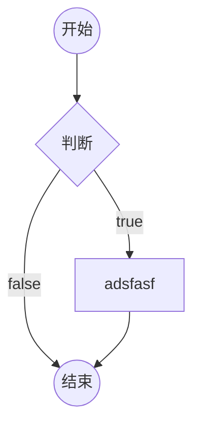
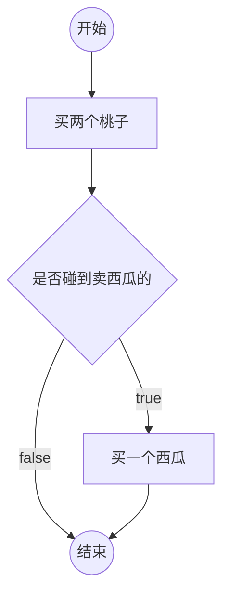
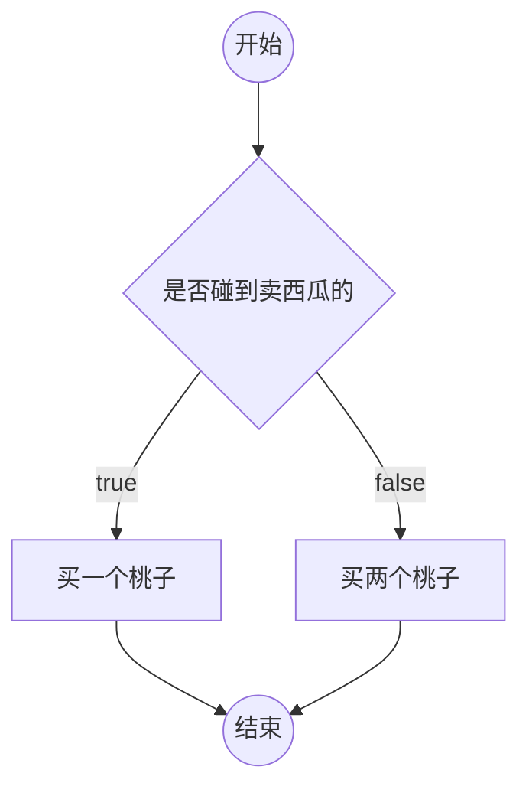
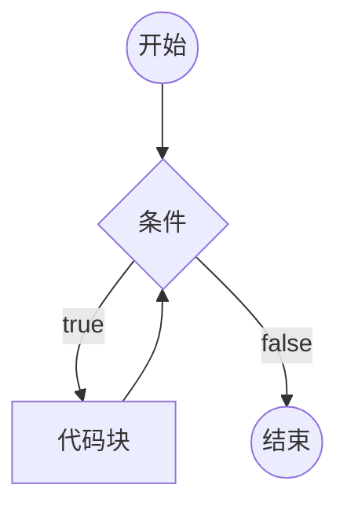
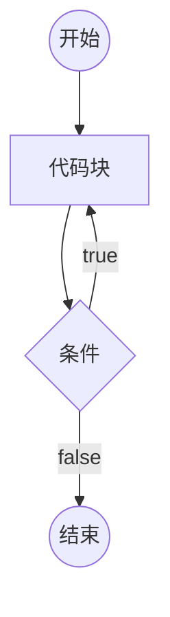
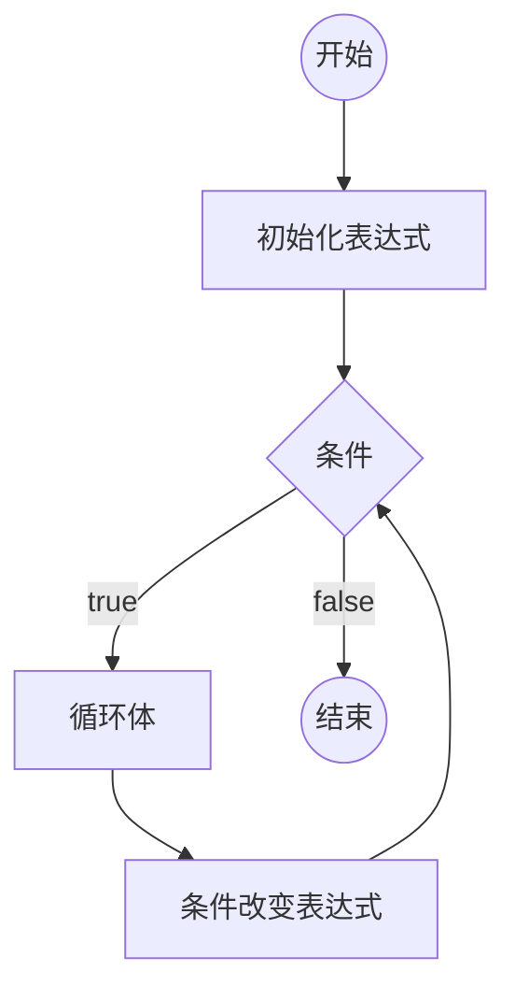

# 第4章 流程控制

---

## 1. 流程图

一套标准的图形，用于描述程序的逻辑。通常用流程图分析程序的流程。

### 在 Markdown 中画流程图

使用 Mermaid 语法：



### 例子：买桃子问题

邓哥的思维：



成哥的思维：



---

## 2. if 判断

### 语法结构

```js
if(条件1){
    // 代码块
}
else if(条件2){
    // 代码块
}
else if(条件3){
    // 代码块
}
//....
else{
    // 以上条件都不满足执行的代码块
}
```

### 要点

1. 如果某个条件满足，则直接忽略后面的所有条件
2. else if 可以有多个（包含0个）
3. else 可以有1个或0个
4. else 可以换行，可以不换行
5. 如果代码块只有一条语句，可以省略花括号（不推荐）
6. if 只能出现一次

### 补充知识

**用户输入：`prompt("提示文本")`**

该表达式返回结果：
- `null`：表示用户点击了取消
- 用户输入的字符串：表示用户点击了确定，得到用户输入的结果

返回类型：`null` 或 `字符串`

**将字符串转换成数字：`+字符串`**

**得到一个随机数：**

`Math.random()` 该表达式返回一个 0~1 之间的随机数字（无法取到1）

### 示例：成绩等级判断

```js
var score = 95;
// A：>=90  B: >=70 <90  C: >=50 <70  D: <50
if (score >= 90) {
    console.log("A");
} else if (score >= 70) {
    console.log("B");
} else if (score >= 50) {
    console.log("C");
} else {
    console.log("D");
}
```

### 示例：if 练习（变量作用域与自增）

```js
if (!x) {
    x = 0;
}
if (x++ >= 1) {
    var x;
    x++;
} else if (++x >= 2) {
    x++;
} else {
    x--;
}
console.log(x);
```

### 示例：用户输入与类型判断

```js
var result = prompt("请输入你的年龄");
if (result === null) {
    console.log("点击了取消");
} else {
    result = +result; //转换为数字
    if (isNaN(result)) {
        //不是正常的数字
        console.log("输入有误");
    } else {
        console.log(result, typeof result);
    }
}
```

### 示例：随机数

```js
console.log(Math.random());
```

### if 判断作业

1. 提示用户输入一个三位数，若不是三位数，则提示用户输入有误；若是三位数，则判断该数能否被13整除。
2. 让用户输入一个成绩（0-100），判断这个成绩属于哪个范围并输出结果（A:90-100 B:70-89 C:60-69 D:40-59 E:0-39），若用户输入的不是0-100的数字，则输出输入有误。
3. 根据世界卫生组织推荐的计算方法：
   - 男性标准体重计算方法为（身高cm－80）x 70%
   - 女性标准体重计算方法为（身高cm－70）x 60%
   - 标准体重正负10%为正常体重，低于标准体重的10%为过瘦，高于标准体重的10%为过重
   - 编写程序，让用户输入性别、身高、体重，判断用户的健康状况
4. 某理财公司推出一种理财服务，服务规则如下：
   - 若用户的理财金额在50万元以下，则每年的收益按照4%计算
   - 若用户的理财金额在50万元以上（包括50万），则每年收益按照4.5%计算
   - 若用户的理财金额超过200万，除了理财收益外，还要额外给予用户收益金额的10%
   - 编写程序，让用户输入理财金额和理财年限，计算到期后的收益
5. 编写一个用户和计算机猜拳的游戏，用户输入剪刀、石头或布，与计算机的出拳进行比较，判断胜负

---

## 3. [作业讲解] if 判断

### 作业1：三位数判断是否能被13整除

```js
var number = +prompt("请输入一个三位数");
if (isNaN(number) || number < 100 || number > 999) {
    console.log("输入有误");
} else {
    if (number % 13 === 0) {
        console.log("能被13整除");
    } else {
        console.log("不能被13整除");
    }
}
```

### 作业2：成绩等级判断

```js
var score = +prompt("请输入一个成绩（0~100）");
if (isNaN(score) || score < 0 || score > 100) {
    console.log("输入有误");
} else {
    if (score >= 90) {
        console.log("A");
    } else if (score >= 70) {
        console.log("B");
    } else if (score >= 60) {
        console.log("C");
    } else if (score >= 40) {
        console.log("D");
    } else {
        console.log("E");
    }
}
```

### 作业3：健康状况判断

```js
var height = +prompt("请输入身高(cm)");
var weight = +prompt("请输入体重(kg)");
var gender = prompt("请输入性别（男，女）");
if (isNaN(height) || isNaN(weight) || gender !== "男" && gender !== "女") {
    console.log("输入有误");
} else {
    var standardWeight; //标准体重
    if (gender === "男") {
        standardWeight = (height - 80) * 0.7;
    } else {
        standardWeight = (height - 70) * 0.6;
    }

    if (weight < standardWeight * 0.9) {
        console.log("你的身体偏瘦，请加强营养");
    } else if (weight > standardWeight * 1.1) {
        console.log("你的身体偏胖，请加强锻炼");
    } else {
        console.log("你的体重正常，请继续保持");
    }
}
```

### 作业4：理财收益计算

```js
var money = +prompt("请输入理财金额");
var year = +prompt("请输入理财年限");
if (isNaN(money) || isNaN(year) || money <= 0 || year <= 0) {
    console.log("输入有误");
} else {
    var rate = 0.04; // 年利率4%
    if (money >= 500000) {
        rate = 0.045;
    }
    var earnMoney = money * rate * year; // 收益
    if (money >= 2000000) {
        earnMoney += earnMoney * 0.1;
    }
    console.log(`总收益为：${earnMoney}`);
}
```

### 作业5：猜拳游戏

```js
var fist = prompt("请出拳（剪刀、石头、布）");
if (fist === "剪刀" || fist === "石头" || fist === "布") {
    //正确
    //1. 模拟计算机出拳
    var rad = Math.random(); // 0~1
    var pcFist; //计算机出拳结果
    if (rad < 0.333) {
        pcFist = "剪刀";
    } else if (rad < 0.6666) {
        pcFist = "石头";
    } else {
        pcFist = "布";
    }
    //2. 比较胜负
    console.log(`你的出拳：${fist}, 电脑出拳：${pcFist}`);
    if (fist === "剪刀" && pcFist === "布" ||
        fist === "布" && pcFist === "石头" ||
        fist === "石头" && pcFist === "剪刀") {
        console.log("你胜利了！");
    } else if (fist === pcFist) {
        console.log("平局");
    } else {
        console.log("电脑胜利！");
    }
} else {
    console.log("输入有误");
}
```

---

## 4. switch 开关

switch 的语法始终可以使用 if 结构替代。

### 语法结构

```js
switch(表达式){
    case 数据1:
        代码块
    case 数据2:
        代码块
    //...
    default:
        代码块
}
```

### 要点

1. 计算表达式的返回值，依次和 case 后面的数据进行严格相等的比较，如果某个相等，停止比较，然后运行其内部的代码块，再然后，依次运行之后的所有代码块。
2. 在 case 分支内部，使用 `break` 语句，可以立即停止 switch 结构。
3. `default` 表示前面的所有 case 都不匹配时运行。可以省略。

### 示例

```js
var x = 20;
switch (x) {
    case 1:
        console.log("1");
        break;
    case 20:
        console.log("20");
        break;
    case 30:
        console.log("30");
        break;
    default:
        console.log("default");
        break;
}
```

---

## 5. 循环

重复地运行一段代码。JS 支持3种循环结构：while 循环、do-while 循环、for 循环。

### while 循环

```js
while(条件){
    代码块（循环体）
}
```



**死循环**：条件永远满足，永远无法退出循环。

### do-while 循环

```js
do{
    循环体
} while(条件);
```



### for 循环

```js
for(初始化表达式; 条件; 条件改变表达式){
    循环体
}
```



### 循环中的关键字

循环控制语句：

- `break;` -- 跳出循环
- `continue;` -- 停止当前循环体，进入下一次循环

### 示例：for 循环输出 100 次

```js
for (var i = 0; i < 100; i++) {
    console.log("hello world");
}
console.log("循环结束", i);
```

### 示例：do-while 循环输出 100 次

```js
var i = 0; //当前输出的次数
do {
    console.log("hello world");
    i++;
} while (i < 100);
console.log("循环结束");
```

### 示例：输出数字与奇数

```js
// 输出 1-100 的所有数字
for (var i = 1; i <= 100; i++) {
    console.log(i);
}

// 输出 1-100 的所有奇数
for (var i = 1; i <= 100; i += 2) {
    console.log(i);
}
```

### 示例：break 和 continue

```js
// continue 跳过当前循环
for (var i = 0; i < 10; i++) {
    if (i === 3) {
        continue;
    }
    console.log(i);
}

// break 跳出嵌套循环
for (var i = 0; i < 3; i++) {
    for (var j = 0; j < 3; j++) {
        console.log(i, j);
        if (i + j >= 2) {
            break;
        }
    }
}
```

---

## 6. 循环应用

### 累计

**举例**：将1-100的所有数字相加之和

思路：准备一个变量，初始值为0，然后1-100循环，每次循环，将数字累加到变量中。

```js
// 1-100 数字相加
var sum = 0; //最终的和
for (var i = 1; i <= 100; i++) {
    sum += i;
}
console.log(sum);

// 1-10 数字相乘
var sum = 1;
for (var i = 1; i <= 10; i++) {
    sum *= i;
}
console.log(sum);

// 1-100 所有奇数相加
var sum = 0;
for (var i = 1; i <= 100; i++) {
    if (i % 2 !== 0) {
        sum += i;
    }
}
console.log(sum);
```

### 查找

**举例**：135~145 之间是否存在能整除26的数字

思路：准备一个变量，记录 false，表示没有找到，然后135-145进行循环，如果发现满足条件的数字，重新记录变量为 true，表示找到了，然后退出循环。

```js
// 135-145 之间是否存在能整除26的数字
var isFind = false;
var min = 135, max = 145;
for (var i = min; i <= max; i++) {
    if (i % 26 === 0) {
        isFind = true;
        break;
    }
}
if (isFind) {
    console.log("存在");
} else {
    console.log("不存在");
}

// 判断一个数是不是素数（质数）
// 素数：一个大于1的整数，只能被1和自身整除
var num = 1;
var isFind = false;
for (var i = 2; i < num - 1; i++) {
    if (num % i === 0) {
        isFind = true;
        break;
    }
}
if (num <= 1 || isFind) {
    console.log("不是素数");
} else {
    console.log("是素数");
}
```

### 嵌套的循环

分开分析两层循环。

```js
// 打印1-100的所有素数
for (var i = 1; i <= 100; i++) {
    var isFind = false;
    for (var j = 2; j < i - 1; j++) {
        if (i % j === 0) {
            isFind = true;
            break;
        }
    }
    if (i > 1 && !isFind) {
        console.log(i);
    }
}
```

### 循环应用作业

1. 在控制台中输出100个 `*`
2. 让用户输入 `*` 号的数量，然后输出对应数量的 `*`
3. 输出一个3行5列的 `*` 号
4. 用 `*` 号输出一个5行的直角三角形：

```
*
**
***
****
*****
```

5. 用 `*` 号输出一个5行的等腰三角形：

```
    *
   ***
  *****
 *******
*********
```

6. 输出1-100的所有数字
7. 输出1-100的所有奇数
8. 求1-100之间所有数字之和
9. 求1-100之间所有奇数之和
10. 求1-10之间所有数字的积
11. 判断数字233是不是素数（素数是指一个数（大于1）仅能被1和自身整除）
12. 输出1-100中的所有素数
13. 求1-100之间的所有素数之和
14. 输出99乘法表：

```
1*1=1
1*2=2	2*2=4
1*3=3	2*3=6	3*3=9
1*4=4	2*4=8	3*4=12	4*4=16
1*5=5	2*5=10	3*5=15	4*5=20	5*5=25
1*6=6	2*6=12	3*6=18	4*6=24	5*6=30	6*6=36
1*7=7	2*7=14	3*7=21	4*7=28	5*7=35	6*7=42	7*7=49
1*8=8	2*8=16	3*8=24	4*8=32	5*8=40	6*8=48	7*8=56	8*8=64
1*9=9	2*9=18	3*9=27	4*9=36	5*9=45	6*9=54	7*9=63	8*9=72	9*9=81
```

15. 将猜拳游戏升级，记录系统和玩家的积分，获胜者加1分，平局和输者不计分

---

## 7. [作业讲解] 循环应用

### 作业1：输出100个星号

```js
for (var i = 0; i < 100; i++) {
    console.log("*");
}
```

### 作业2：用户指定数量输出星号

```js
var num = +prompt("请输入*的数量");
for (var i = 0; i < num; i++) {
    console.log("*");
}
```

### 作业3：3行5列星号矩阵

```js
var r = 3, c = 5;
for (var i = 0; i < r; i++) {
    var str = "";
    for (var j = 0; j < c; j++) {
        str += "*";
    }
    console.log(str);
}
```

### 作业4：直角三角形

```js
var r = 15;
for (var i = 1; i <= r; i++) {
    var str = "";
    for (var j = 0; j < i; j++) {
        str += "*";
    }
    console.log(str);
}
```

### 作业5：等腰三角形

```js
var r = 15;
for (var i = 1; i <= r; i++) {
    var str = "";
    // 1. 拼接空格，数量为r-i
    for (var j = 0; j < r - i; j++) {
        str += " ";
    }
    // 2. 拼接星号，数量为2*i-1
    for (var j = 0; j < 2 * i - 1; j++) {
        str += "*";
    }
    console.log(str);
}
```

### 作业13：求1-100之间的所有素数之和

```js
var sum = 0;
for (var i = 2; i <= 100; i++) {
    var isFind = false;
    for (var j = 2; j < i - 1; j++) {
        if (i % j === 0) {
            isFind = true;
            break;
        }
    }
    if (!isFind) {
        sum += i;
    }
}
console.log(sum);
```

### 作业14：99乘法表

```js
for (var i = 1; i <= 9; i++) {
    var str = "";
    for (var j = 1; j <= i; j++) {
        str += `${j}*${i}=${i*j}\t`;
    }
    console.log(str);
}
```

### 作业15：猜拳游戏升级版（带积分）

```js
console.log("游戏开始");
var round = 1, pcScore = 0, playerScore = 0;
while (true) {
    console.log(`==============第${round}轮==============`);
    console.log(`系统：${pcScore}分，玩家：${playerScore}分`);
    var fist = prompt("请出拳（剪刀、石头、布）");
    if (fist === null) {
        break;
    }
    if (fist !== "剪刀" && fist !== "石头" && fist !== "布") {
        console.log("出拳无效，请重新出拳！");
        continue;
    }
    console.log(`你的出拳：${fist}`);
    var pcFist = Math.random();
    if (pcFist < 0.3333) {
        pcFist = "剪刀";
    } else if (pcFist < 0.6666) {
        pcFist = "石头";
    } else {
        pcFist = "布";
    }
    console.log(`系统出拳：${pcFist}`);
    if (fist === "剪刀" && pcFist === "布" ||
        fist === "布" && pcFist === "石头" ||
        fist === "石头" && pcFist === "剪刀") {
        playerScore++;
        console.log("你赢了！");
    } else if (fist === pcFist) {
        console.log("平局");
    } else {
        pcScore++;
        console.log("系统胜利！");
    }
    round++;
}
console.log("==============游戏结束==============");
console.log(`系统：${pcScore}分，玩家：${playerScore}分`);
```

---

## 8. 数组

数组用于存放多个数据。

### 创建一个数组

**方式一：new Array()**

- `new Array(长度)` -- 长度，数组里面的数据总数，长度一定是一个非负整数
- `new Array(数据, 数据, 数据....)` -- 创建一个数组，并初始化其每一项的值

**方式二：字面量**

- `[数据, 数据, 数据, ....]` -- 创建一个数组，并初始化其每一项的值

```js
var arr1 = new Array(20);              // 创建长度为20的数组
var arr2 = new Array(1, 5, 354, 234);  // 创建并初始化
var arr3 = [1, 5, 354, 234];           // 字面量方式
var arr4 = [34, "asdf", true, null, undefined, { x: 1, y: 34 }]; // 混合类型
```

### 认识数组的本质

数组的本质是一个对象。

- **length 属性**：数组的长度，会自动变化，值为最大下标+1
- **数字字符串属性**：叫做下标（索引），相当于数组中每个数据的编号，下标从0开始排列

连续下标的取值范围：`0 ~ length - 1`，如果给 length 直接赋值，会导致数组可能被截断。

> 实际开发中，不要给 length 赋值。

### 下标

通常情况下，下标是连续的。下标不连续的数组，叫做**稀松数组**。

```js
var arr = [3, 6, 7, 82, 2, 1];
arr[10] = "abc"; // 产生稀松数组
```

### 数组的常见操作

#### 添加数组项

- `数组[长度] = 数据`：向数组末尾添加一个数据
- `数组.push(数据)`：向数组末尾添加一个数据
- `数组.unshift(数据)`：向数组起始位置添加一个数据，会导致数组每一项的下标向后移动
- `数组.splice(下标, 0, 添加的数据)`：从指定下标位置开始，删除0个，然后在该位置插入添加的数据

> push、unshift、splice 可以添加多个数据

```js
var arr = [1, 2, 3, 4];
arr[arr.length] = "afasf";  // 向末尾添加一项
arr.push("abc", "bcd");     // push添加
arr.unshift(1, 2, 3);       // unshift添加到起始
arr.splice(2, 0, "abc", "bcd"); // splice插入
```

#### 删除数据

- `delete 数组[下标]`：不推荐，会导致产生稀松数组
- `数组.pop()`：删除数组的最后一项，返回最后一项的数据
- `数组.shift()`：删除数组第一项，返回第一项的数据
- `数组.splice(下标, 删除的数量, 添加的数据)`：返回一个新数组，记录被删除的数据

```js
var arr = [1, 2, 3, 4, 5, 6, 7];
var n = arr.pop();          // 删除最后一项
var n = arr.shift();        // 删除第一项
var n = arr.splice(1, 1000); // 从下标1开始删除
```

#### 其他操作

**slice 切片**

`数组.slice(起始位置下标, 结束位置下标)`：将起始位置到结束位置之间的数据拿出来，得到一个新的数组，不会改变原数组。结束下标取不到。下标可以写负数，从末尾开始计算。不写结束下标则取到末尾。

```js
var arr = [1, 2, 3, 4, 5, 6, 7];
var newArr = arr.slice(-4); // 取最后4项
```

**数组清空**

```js
数组.splice(0, 数组.length);
// 或
数组.length = 0;
```

**查找下标**

- `数组.indexOf(数据)`：从数组中依次查找对应的数据，使用严格相等进行比较。找到第一个匹配的下标返回。如果没有找到，则得到 -1。
- `数组.lastIndexOf(数据)`：功能和 indexOf 类似，查找最后一个匹配的下标。

```js
var arr = [1, 2, 3, 4, 3, 6, 3];
var index = arr.lastIndexOf(3);
```

**fill 填充**

- `数组.fill(数据)`：将数组的所有项填充为指定的数据
- `数组.fill(数据, 开始下标)`：从开始下标起到末尾填充
- `数组.fill(数据, 开始下标, 结束下标)`：从开始下标起到结束下标（取不到）填充

```js
var arr = new Array(100);
arr.fill("abc"); // 填充所有项
```

### 语法补充

#### in 关键字

判断某个属性在对象中是否存在。

```js
属性名 in 对象

// 示例
var arr = [23, 65, 7, 7];
console.log(23 in arr); // 判断下标23是否存在
```

#### for-in 循环

```js
for(var prop in 对象){
    //循环体
}
```

取出对象的所有属性名，每次循环将其中一个属性名赋值给变量 prop，运行循环体。

```js
var arr = ["abc", "bcd", "234", , , , 54, 2, 1];
for (var index in arr) {
    console.log(index, typeof index, arr[index]);
}
```

---

## 9. 数组应用

### 数组求和

```js
var arr = [34, 6, 7, 122, 3];
var sum = 0;
for (var i = 0; i < arr.length; i++) {
    sum += arr[i];
}
console.log(sum);
```

### 二维数组

二维数组：数组中的每一项是一个数组。

```js
var arr = [
    [1, 2, 34],
    [345, 1, 1],
    [44, 4, 7]
];

// 输出二维数组的每一项
for (var i = 0; i < arr.length; i++) {
    for (var j = 0; j < arr[i].length; j++) {
        console.log(arr[i][j]);
    }
}

// 对二维数组求和
var sum = 0;
for (var i = 0; i < arr.length; i++) {
    for (var j = 0; j < arr[i].length; j++) {
        sum += arr[i][j];
    }
}
console.log(sum);
```

### 数组拼接字符串

```js
var arr = [3, 4, 6, 1, 3];
// 方法一：手动拼接
var str = "";
for (var i = 0; i < arr.length; i++) {
    str += arr[i];
    if (i < arr.length - 1) {
        str += ",";
    }
}

// 方法二：join方法
var str = arr.join(",");
console.log(str);
```

### 数组合并 concat

```js
var arr1 = [34, 5, 2, 1];
var arr2 = ["abc", "bcd"];
arr1 = arr1.concat(arr2);
console.log(arr1);
// 将数组2的所有元素拼接到数组1的末尾，产生一个新数组返回，不会影响原数组
```

### 数组复制（克隆）

数组的本质是对象（引用类型），直接赋值只是复制地址。

```js
var arr1 = [3, 5, 7, 8, 2];
var arr2 = arr1.slice(); // 使用slice()进行复制
arr2[0] = 5;
console.log(arr1 === arr2);   // false
console.log(arr1[0], arr2[0]); // 3 5
```

### 数组应用作业

1. 提示用户输入数组的长度，以及数组每一项的值，然后输出该数组
2. 初始化一个数字数组，然后求该数组所有项之和
3. 初始化一个数字数组，然后输出数组中所有的奇数
4. 初始化一个数字数组，然后输出数组中所有的素数
5. 斐波拉契数列：1 1 2 3 5 8 13......（数列前两位为1，第n位=第n-1位+第n-2位），让用户输入斐波拉契数列的长度，在控制台中打印该长度的斐波拉契数列
6. 定义一个用户数组，数组的每一项是一个用户对象（包含账号和密码），然后提示用户输入账号和密码，判断是否登录成功
7. 初始化一个5x5的二维数组，计算对角线之和
8. 初始化一个数字数组，使用冒泡排序算法进行升序排序
9. 有一个数组，存放了一些数字，找出出现频率最高的数字

---

## 10. [作业讲解] 数组应用

### 作业1：用户输入创建数组

```js
var len = +prompt("请输入数组的长度");
if (isNaN(len) || len < 0) {
    console.log("输入有误");
} else {
    var arr = [];
    for (var i = 0; i < len; i++) {
        arr[i] = prompt("请输入数组第" + (i + 1) + "项的值");
    }
    console.log(arr);
}
```

### 作业3：输出数组中的奇数

```js
var arr = [234, 6, 23, 211, 23];
for (var index in arr) {
    if (arr[index] % 2 !== 0) {
        console.log(arr[index]);
    }
}
```

### 作业4：输出数组中的素数

```js
var arr = [234, 2, 6, 23, 211, 23];
for (var index in arr) {
    var isFind = false;
    for (var i = 2; i < arr[index] - 1; i++) {
        if (arr[index] % i === 0) {
            isFind = true;
            break;
        }
    }
    if (!isFind && arr[index] >= 2) {
        console.log(arr[index]);
    }
}
```

### 作业5：斐波拉契数列

```js
var len = +prompt("请输入斐波拉契数列的长度");
if (isNaN(len) || len < 0) {
    console.log("输入有误");
} else {
    var arr = [];
    for (var i = 0; i < len; i++) {
        if (i === 0 || i === 1) {
            arr[i] = 1;
        } else {
            arr[i] = arr[i - 1] + arr[i - 2];
        }
    }
    console.log(arr);
}
```

### 作业6：用户登录验证

```js
var users = [
    { loginId: "abc",  loginPwd: "123" },
    { loginId: "abc1", loginPwd: "1234" },
    { loginId: "abc2", loginPwd: "1235" },
    { loginId: "abc3", loginPwd: "1236" }
];

var loginId = prompt("请输入账号");
var loginPwd = prompt("请输入密码");

var isFind = false;
for (var i = 0; i < users.length; i++) {
    var u = users[i];
    if (u.loginId === loginId && u.loginPwd === loginPwd) {
        isFind = true;
        break;
    }
}

if (isFind) {
    console.log("登录成功");
} else {
    console.log("登录失败");
}
```

### 作业7：二维数组对角线之和

```js
var arr = [
    [5, 2, 3, 1, 7],
    [8, 0, 6, 7, 8],
    [4, 0, 6, 2, 0],
    [3, 0, 6, 8, 1],
    [2, 0, 4, 5, 9]
];

var sum = 0;
for (var i = 0; i < arr.length; i++) {
    for (var j = 0; j < arr[i].length; j++) {
        if (i === j || i + j === arr.length - 1) {
            sum += arr[i][j];
        }
    }
}
console.log(sum);
```

### 求最大值

```js
var nums = [23, 6, 1, 1, 666, 324];
var max = nums[0];
for (var i = 1; i < nums.length; i++) {
    if (nums[i] > max) {
        max = nums[i];
    }
}
console.log(max);
```

### 作业8：冒泡排序

冒泡排序算法原理：
- 比较相邻的元素。如果第一个比第二个大，就交换他们两个。
- 对每一对相邻元素做同样的工作，从开始第一对到结尾的最后一对。最后的元素应该是最大的数。
- 针对所有的元素重复以上的步骤，除了已排好序的元素。

```js
var nums = [23, 2, -34, 3563, 111, 44, 5, 8, 1];

for (var i = 1; i < nums.length; i++) {
    // 第i次排序
    for (var j = 0; j < nums.length - i; j++) {
        // 比较 j 和 j+1 两个位置的数字
        if (nums[j] > nums[j + 1]) {
            //交换
            var temp = nums[j];
            nums[j] = nums[j + 1];
            nums[j + 1] = temp;
        }
    }
}

console.log(nums);
```

排序过程详解：

```
第1次：排了5次，比较的位置从0~4
2, 23, 44, 5, 8, 1
2, 23, 44, 5, 8, 1
2, 23, 5, 44, 8, 1
2, 23, 5, 8, 44, 1
2, 23, 5, 8, 1, 44

第2次：排了4次，比较的位置从0~3
2, 5, 8, 1, 23, 44

第3次：排了3次
2, 5, 1, 8, 23, 44

第4次：排了2次
2, 1, 5, 8, 23, 44

第5次：排了1次
1, 2, 5, 8, 23, 44
```

### 作业9：找出出现频率最高的数字

```js
var nums = [2, 3, 4, 5, 234, 5, 5, 5, 5, 5, 5, 5, 5, 2, 2, 2, 2, 3, 3, 3, 5];

// 得到记录对象
var record = {};
for (var i = 0; i < nums.length; i++) {
    var n = nums[i];
    if (record[n]) {
        record[n]++;
    } else {
        record[n] = 1;
    }
}

// 找出频率最高的
var result;
for (var prop in record) {
    if (!result || record[prop] > result.frequency) {
        result = {
            number: prop,
            frequency: record[prop]
        };
    }
}

console.log(`${result.number}出现频率最高，出现${result.frequency}次`);
```
