# NodeJS

## 1. Node核心

### 1-1. Node概述

- 什么是Node
  - Node是一个JS的运行环境
  - 它比浏览器拥有更多的能力
    - 浏览器中的JS
      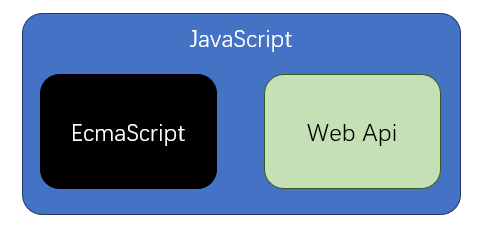
      - web api 提供了操作浏览器窗口和页面的能力
        - BOM
        - DOM
        - AJAX
      - 这种能力是非常有限的
        - 跨域问题
        - 文件读写
    - Node中的JS
      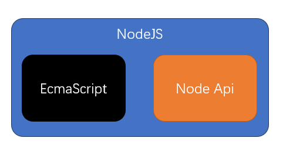
      - Node Api 几乎提供了所有能做的事
    - 分层结构对比图
      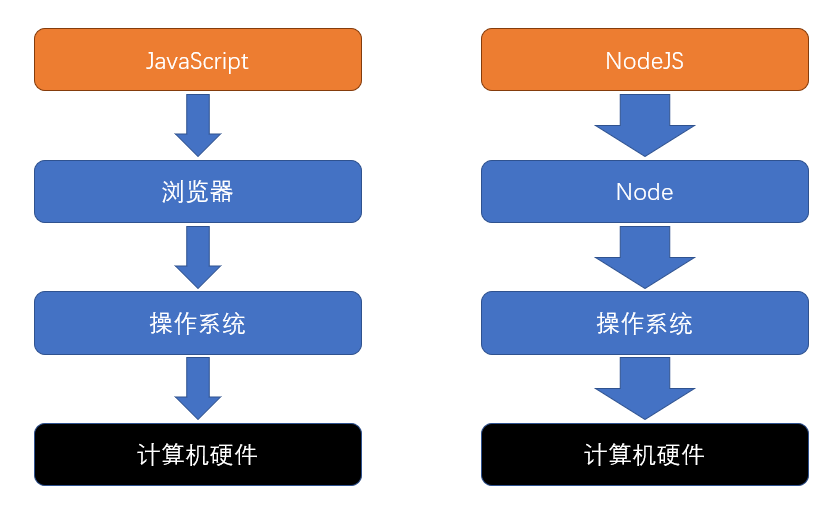
      - 浏览器提供了有限的能力，JS只能使用浏览器提供的功能做有限的操作
      - Node提供了完整的控制计算机的能力，NodeJS几乎可以通过Node提供的接口，实现对整个操作系统的控制
  - Node的官网
  - Node民间中文网
- 我们通常用Node干什么
  - 开发桌面应用程序
  - 开发服务器应用程序
    - 结构1
      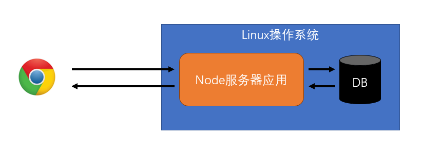
      - 这种结构通常应用在微型的站点上
      - Node服务器要完成请求的处理、响应、和数据库交互、各种业务逻辑
    - 结构2
      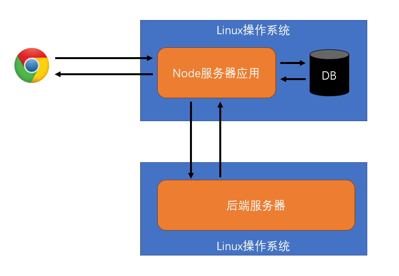
      - 这种结构非常常见，应用在各种规模的站点上
      - Node服务器不做任何与业务逻辑有关的事情。绝大部分时候，只是简单的转发请求。但可能会有一些额外的功能
        - 简单的信息记录
          - 请求日志
          - 用户偏好
          - 广告信息
        - 静态资源托管
        - 缓存
- 前置课程
  - 网络通信
  - ES6
  - 模块化
  - 包管理器

### 1-2. 全局对象

- setTimeout
- setInterval
- setImmediate
  - 类似于 setTimeout 0
- console
- __dirname
  - 获取当前模块所在的目录
  - 并非global属性
- __filename
  - 获取当前模块的文件路径
  - 并非global属性
- Buffer
  - 类型化数组
  - 继承自 UInt8Array
  - 计算机中存储的基本单位：字节
  - 使用时、输出时可能需要用十六进制表示
- process
  - cwd()
    - 返回当前nodejs进程的工作目录
    - 绝对路径
  - exit()
    - 强制退出当前node进程
    - 可传入退出码，0表示成功退出，默认为0
  - argv
    - String[]
    - 获取命令中的所有参数
  - platform
    - 获取当前的操作系统
  - kill(pid)
    - 根据进程ID杀死进程
  - env
    - 获取环境变量对象

### 1-3. Node的模块化细节

- 模块的查找
  - 绝对路径
    - 根据绝对路径直接加载模块
  - 相对路径  ./  或 ../
    - 相对于当前模块
    - 转换为绝对路径
    - 加载模块
  - 相对路径
    - 检查是否是内置模块，如：fs、path等
    - 检查当前目录中的node_modules
    - 检查上级目录中的node_modules
    - 转换为绝对路径
    - 加载模块
  - 关于后缀名
    - 如果不提供后缀名，自动补全
    - js、json、node、mjs
  - 关于文件名
    - 如果仅提供目录，不提供文件名，则自动寻找该目录中的index.js
    - package.json中的main字段
      - 表示包的默认入口
      - 导入或执行包时若仅提供目录，则使用main补全入口
      - 默认值为index.js
- module对象
  - 记录当前模块的信息
- require函数
- 当执行一个模块或使用require时，会将模块放置在一个函数环境中

### 1-4. 【扩展】Node中的ES模块化

- 目前，Node中的ES模块化仍然处于试验阶段
- 模块要么是commonjs，要么是ES
  - commonjs
    - 默认情况下，都是commonjs
  - ES
    - 文件后缀名为.mjs
    - 最近的package.json中type的值是module
- 当使用ES模块化运行时，必须添加 --experimental-modules标记

### 1-5. 基本内置模块

- os
  - EOL
  - arch()
  - cpus()
  - freeman()
  - homedir()
  - hostname()
  - tmpdir()
- path
  - basename
  - sep
  - delimiter
  - dirname
  - extname
  - join
  - normalize
  - relative
  - resolve
- url
- util
  - callbackify
  - inherits
  - isDeepStrictEqual
  - promisify

### 1-6. 文件I/O

- I/O：input output
  - 对外部设备的输入输出
  - 外部设备
    - 磁盘
    - 网卡
    - 显卡
    - 打印机
    - 其他...
  - IO的速度往往低于内存和CPU的交互速度
- fs模块
  - 读取一个文件 fs.readFile
  - 向文件写入内容 fs.writeFile
  - 获取文件或目录信息 fs.stat
    - size: 占用字节
    - atime：上次访问时间
    - mtime：上次文件内容被修改时间
    - ctime：上次文件状态被修改时间
    - birthtime：文件创建时间
    - isDirectory()：判断是否是目录
    - isFile()：判断是否是文件
  - 获取目录中的文件和子目录 fs.readdir
  - 创建目录 fs.mkdir
  - 判断文件或目录是否存在 fs.exists
- 练习：读取一个目录中的所有子目录和文件
  - 每个目录或文件都是一个对象
    - 属性
      - name：文件名
      - ext：后缀名，目录为空字符串
      - isFile：是否是一个文件
      - size：文件大小
      - createTime：日期对象，创建时间
      - updateTime：日期对象，修改时间
    - 方法
      - getChildren()：得到目录的所有子文件对象，如果是文件，则返回空数组
      - getContent(isBuffer = false)：读取文件内容，如果是目录，则返回null

### 1-7. 文件流

- 什么是流
  - 流是指数据的流动，数据从一个地方缓缓的流动到另一个地方
    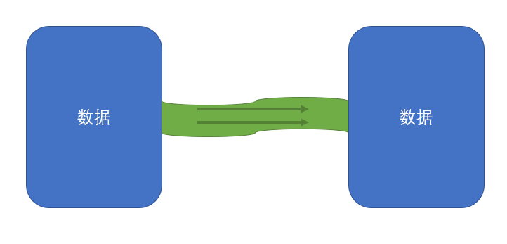
  - 流是有方向的
    - 可读流: Readable
      - 数据从源头流向内存
    - 可写流: Writable
      - 数据从内存流向源头
    - 双工流：Duplex
      - 数据即可从源头流向内存 又可从内存流向源头
- 为什么需要流
  - 其他介质和内存的数据规模不一致
    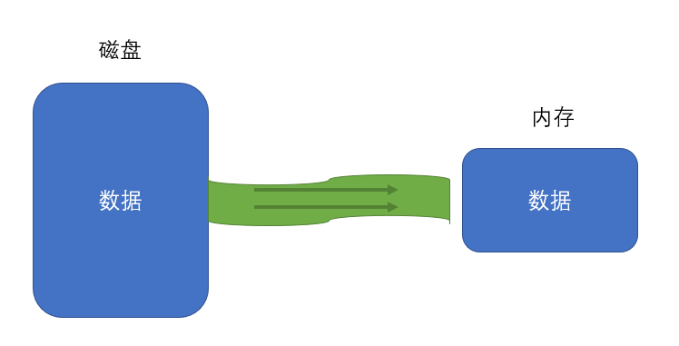
  - 其他介质和内存的数据处理能力不一致
    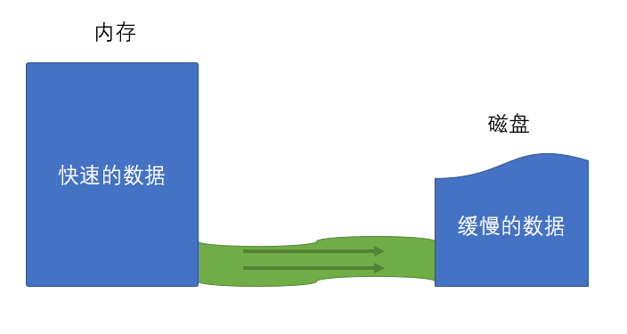
- 文件流
  - 什么是文件流
    - 内存数据和磁盘文件数据之间的流动
  - 文件流的创建
    - fs.createReadStream(path[, options])
      - 含义：创建一个文件可读流，用于读取文件内容
      - path：读取的文件路径
      - options：可选配置
        - encoding：编码方式
        - start：起始字节
        - end：结束字节
        - highWaterMark：每次读取数量
          - 如果encoding有值，该数量表示一个字符数
          - 如果encoding为null，该数量表示字节数
      - 返回：Readable的子类ReadStream
        - 事件：rs.on(事件名, 处理函数)
          - open
            - 文件打开事件
            - 文件被打开后触发
          - error
            - 发生错误时触发
          - close
            - 文件被关闭后触发
            - 可通过rs.close手动关闭
            - 或文件读取完成后自动关闭
              - autoClose配置项默认为true
          - data
            - 读取到一部分数据后触发
            - 注册data事件后，才会真正开始读取
            - 每次读取highWaterMark指定的数量
            - 回调函数中会附带读取到的数据
              - 若指定了编码，则读取到的数据会自动按照编码转换为字符串
              - 若没有指定编码，读取到的数据是Buffer
          - end
            - 所有数据读取完毕后触发
        - rs.pause()
          - 暂停读取， 会触发pause事件
        - rs.resume()
          - 恢复读取，会触发resume事件
    - fs.createWriteStream(path[, options])
      - 创建一个写入流
      - path：写入的文件路径
      - options
        - flags：操作文件的方式
          - w：覆盖
          - a：追加
          - 其他
        - encoding：编码方式
        - start：起始字节
        - highWaterMark：每次最多写入的字节数
      - 返回：Writable的字类WriteStream
        - ws.on(事件名, 处理函数)
          - open
          - error
          - close
        - ws.write(data)
          - 写入一组数据
          - data可以是字符串或Buffer
          - 返回一个boolean值
            - true：写入通道没有被填满，接下来的数据可以直接写入，无须排队
              
            - false：写入通道目前已被填满，接下来的数据将进入写入队列
              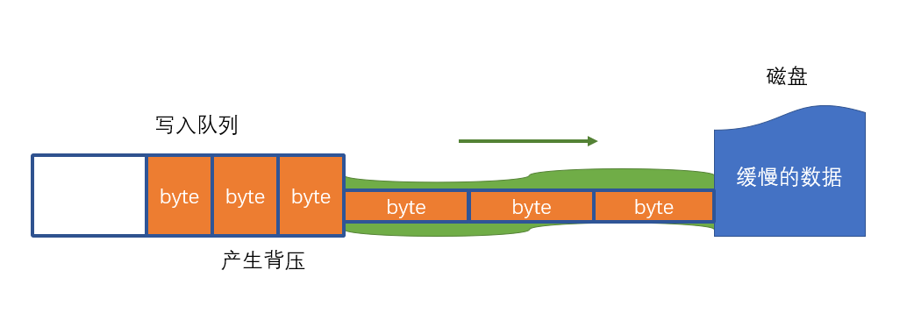
              - 要特别注意背压问题，因为写入队列是内存中的数据，是有限的
          - 当写入队列清空时，会触发drain事件
        - ws.end([data])
          - 结束写入，将自动关闭文件
            - 是否自动关闭取决于autoClose配置
            - 默认为true
          - data是可选的，表示关闭前的最后一次写入
    - rs.pipe(ws)
      - 将可读流连接到可写流
      - 返回参数的值
      - 该方法可解决背压问题

### 1-8. net模块

- 回顾http请求
  - 普通模式
    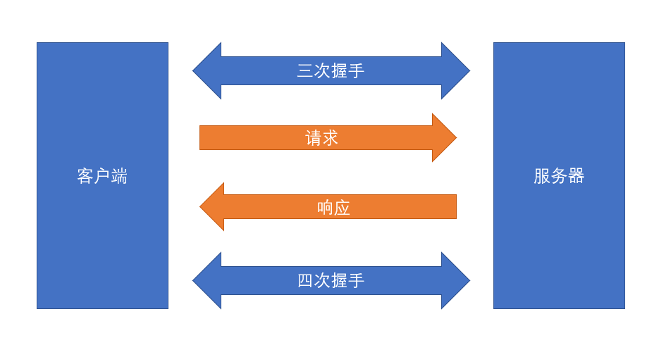
  - 长连接模式
    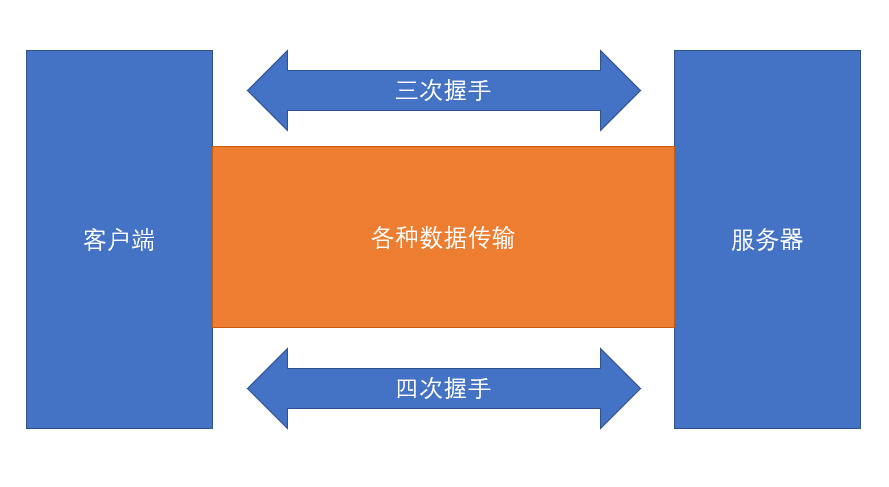
- net模块能干什么
  - net是一个通信模块
  - 利用它，可以实现
    - 进程间的通信 IPC
    - 网络通信 TCP/IP
- 创建客户端
  - net.createConnection(options[, connectListener])
  - 返回：socket
    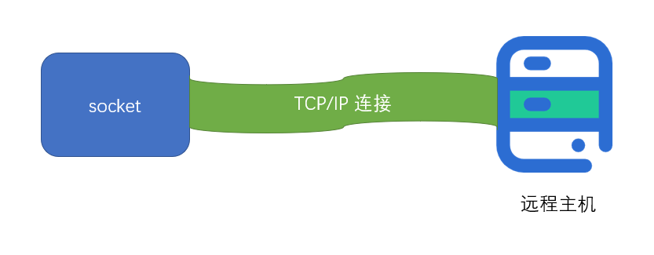
    - socket是一个特殊的文件
    - 在node中表现为一个双工流对象
    - 通过向流写入内容发送数据
    - 通过监听流的内容获取数据
- 创建服务器
  - net.createServer()
  - 返回：server对象
    - server.listen(port)
      - 监听当前计算机中某个端口
    - server.on("listening", ()=>{})
      - 开始监听端口后触发的事件
    - server.on("connection", socket=>{})
      - 当某个连接到来时，触发该事件
      - 事件的监听函数会获得一个socket对象
        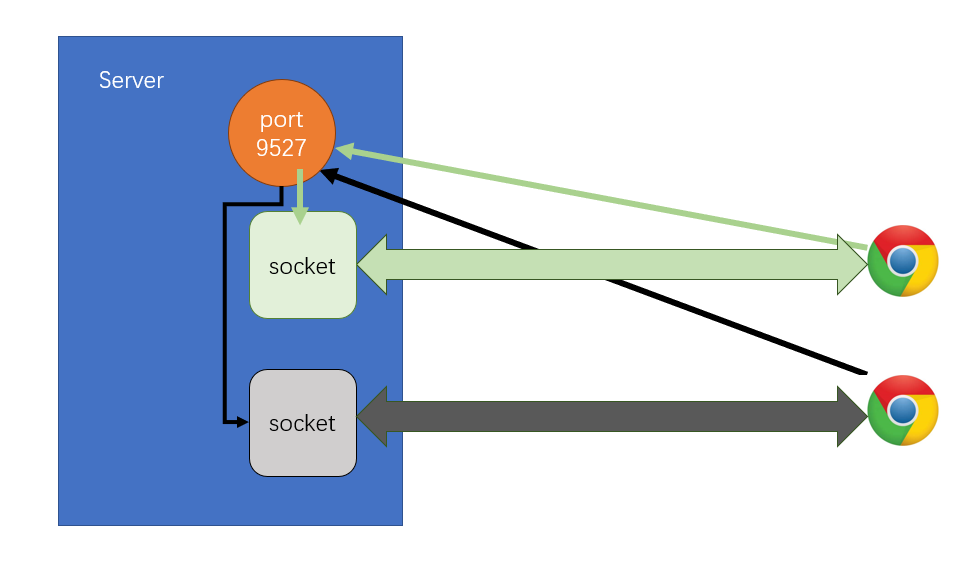

### 1-9. http模块

- http模块建立在net模块之上
  - 无须手动管理socket
  - 无须手动组装消息格式
- http.request(url[, options][, callback])
- http.createServer([options][, requestListener])
- 总结
  - 我是客户端
    - 请求：ClientRequest对象
    - 响应：IncomingMessage对象
  - 我是服务器
    - 请求：IncomingMessage对象
    - 响应：ServerResponse对象

### 1-10. https协议

- 见源码中的ppt

### 1-11. https模块

- 服务器结构
  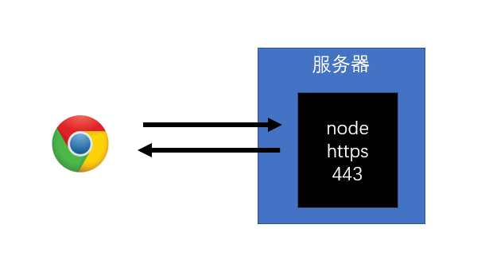
  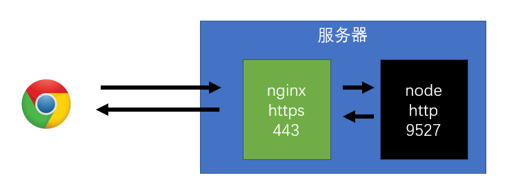
- 证书准备
  - 方式1：网上购买权威机构证书
    - 准备好money
    - 准备好服务器
    - 准备好域名
    - 该方式应用在部署环境中
  - 方案2：本地产生证书
    - 自己作为权威机构发布证书
    - 具体方法
      - 安装openssl
        - 下载源码，自行构建
        - 下载windows安装包
        - mac下自带
        - 通过输入命令openssl测试
      - 生成CA私钥
        - openssl genrsa -des3 -out ca-pri-key.pem 1024
        - genrsa：密钥对生成算法
        - -des3：使用对称加密算法des3对私钥进一步加密
          - 命令运行过程中会让用户输入密码，该密码将作为des3算法的key
        - -out ca-pri-key.pem：将加密后的私钥保存到当前目录的ca-pri-key.pem文件中
          - pem：Privacy-Enhanced Mail (PEM)
        - 1024：私钥的字节数
      - 生成CA公钥（证书请求）
        - openssl req -new -key ca-pri-key.pem -out ca-pub-key.pem
        - 通过私钥文件ca-pri-key.pem中的内容，生成对应的公钥，保存到ca-pub-key.pem中
        - 运行过程中要使用之前输入的密码来实现对私钥文件的解密
        - 其他输入信息
          - Country Name：国家名  CN
          - Province Name：省份名 Sichuan
          - Local Name：城市名
          - Company Name：公司名
          - Unit Name：部门名
          - Common Name：站点名
          - ...
      - 生成CA证书
        - openssl x509 -req -in ca-pub-key.pem -signkey ca-pri-key.pem -out ca-cert.crt
        - 使用X.509证书标准，通过证书请求文件ca-pub-key.pem生成证书，并使用私钥ca-pri-key.pem加密，然后把证书保存到ca-cert.crt文件中
      - ------华丽的分割线-------
      - 生成服务器私钥
        - openssl genrsa -out server-key.pem 1024
      - 生成服务器公钥
        - openssl req -new -key server-key.pem -out server-scr.pem
      - 生成服务器证书
        - openssl x509 -req -CA ca-cert.crt -CAkey ca-pri-key.pem -CAcreateserial -in server-scr.pem -out server-cert.crt
- https模块

### 1-12. node生命周期

- 见源码中的ppt
- 笔记
  - timers：存放计时器的回调函数
  - poll：轮询队列
    - 除了timers、checks
    - 绝大部分回调都会放入该队列
    - 比如：文件的读取、监听用户请求
    - 运作方式
      - 如果poll中有回调，依次执行回调，直到清空队列
      - 如果poll中没有回调
        - 等待其他队列中出现回调，结束该阶段，进入下一阶段
        - 如果其他队列也没有回调，持续等待，直到出现回调为止
  - check：检查阶段
    - 使用setImmediate的回调会直接进入这个队列
  - 事件循环中，每次打算执行一个回调之前，必须要先清空nextTick和promise队列

### 1-13. [扩展]EventEmitter

- node事件管理的通用机制
- 内部维护多个事件队列

## 2. MySql

### 2-1. 数据库简介

- 数据库的能干什么
  - 持久的存储数据
    - 数据存储在硬盘文件中
  - 备份和恢复数据
  - 快速的存取数据
  - 权限控制
- 数据库的类型
  - 关系数据库
    - 特点
      - 以表和表的关联构成的数据结构
    - 优点
      - 能表达复杂的数据关系
      - 强大的查询语言，能精确查找想要的数据
    - 缺点
      - 读写性能比较差，尤其是海量数据的读写
      - 数据结构比较死板
    - 用途
      - 存储结构复杂的数据
    - 代表
      - Oracle
      - MySql
      - Sql Server
  - 非关系型数据库
    - 特点
      - 以极其简单的结构存储数据
      - 文档型
      - 键值对
    - 优点
      - 格式灵活
      - 海量数据读写效率很高
    - 缺点
      - 难以表示复杂的数据结构
      - 对于复杂查询效率不好
    - 用途
      - 存储结构简单的数据
    - 代表
      - MongoDB
      - Redis
      - Membase
  - 面向对象数据库
    - 略
- 术语
  - DB： database 数据库
  - DBA：database administrator 数据库管理员
  - DBMS：database management system  数据库管理系统
  - DBS：database system 数据库系统
    - DBS包含DB、DBA、DBMS

### 2-2. MySql的安装

- MySql特点
  - 关系型数据库
  - 瑞典MySQL AB
    - 已被Oracle收购
  - 开源
  - 轻量
  - 快速
- 安装MySql
  - 下载
    - 官方下载源
    - 腾讯下载源
  - 安装
- 使用
  - mysql -uroot -p：进入mysql命令交互
  - show variables like 'character\_set\_%'：查看当前数据库字符编码
  - 修改my.ini文件中的默认字符编码
    - C:\ProgramData\MySQL\MySQL Server 8.0
  - net stop mysql80
  - net start mysql80
  - show databases：查看当前拥有的数据库
- navicat

### 2-3. 数据库设计

- SQL
  - Structured Query Language 结构化查询语言
  - 大部分关系型数据，拥有着基本一致的SQL语法
  - 分支
    - DDL
      - Data Definition Language 数据定义语言
      - 操作数据库对象
        - 库
        - 表
        - 视图
        - 存储过程
    - DML
      - Data Manipulation Language 数据操控语言
      - 操作数据库中的记录
    - DCL
      - Data Control Language 数据控制语句
      - 操作用户权限
- 管理库
  - 创建库
  - 切换当前库
  - 删除库
- 管理表
  - 创建表
    - 字段
      - 字段名
      - 字段类型
        - bit：占1位，0或1，false或true
        - int：占32位，整数
        - decimal(M,N)：能精确计算的实数，M是总的数字位数，N是小数位数
        - char(n)：固定长度位n的字符
        - varchar(n)：长度可变，最大长度位n的字符
        - text：大量的字符
        - date：仅日期
        - datetime：日期和时间
        - time：仅时间
      - 是不是null
      - 自增
      - 默认值
  - 修改表
  - 删除表
- 主键和外键
  - 主键
    - 根据设计原则，每张表都要有主键
    - 主键必须满足的要求
      - 唯一
      - 不能更改
      - 无业务含义
  - 外键
    - 用于产生表关系的列
    - 外键列会连接到另一张表（或自己）的主键
- 表关系
  - 一对一
    - 一个A对应一个B，一个B对应一个A
    - 例如：用户和用户信息
    - 把任意一张表的主键同时设置为外键
  - 一对多
    - 一个A对应多个B，一个B对应一个A，A和B是一对多，B和A是多对一
    - 例如：班级和学生，用户和文章
    - 在多一端的表上设置外键，对应到另一张表的主键
  - 多对多
    - 一个A对应多个B，一个B对应多个A
    - 例如：学生和老师
    - 需要新建一张关系表，关系表至少包含两个外键，分别对应到两张表
- 三大设计范式
  - 1. 要求数据库表的每一列都是不可分割的原子数据项
  - 2. 非主键列必须依赖于主键列
  - 3. 非主键列必须直接依赖主键列

### 2-4. 表记录的增删改

- DML Data Manipulation Language 数据操控语言
  - 增 CREATE
  - 查 Retrieve
  - 改 UPDATE
  - 删 DELETE
  - CRUD

### 2-5. 单表基本查询

- select ... from ... where ... order by ... limit ...
- select
  - 别名
  - *
  - case
  - distinct
- from
- where
  - =
  - in
  - is
  - is not
  - > < >= <=
  - between
  - like
  - and
  - or
- order by
  - asc
  - desc
- limit
  - n,m 跳过n条数据，取出m条数据
- 运行顺序
  - from
  - where
  - select
  - order by
  - limit

### 2-6. 联表查询

- 笛卡尔积
- 左连接，左外连接，left join
- 右连接，右外连接，right join
- 内连接，inner join

### 2-7. 函数和分组

- 函数
  - 内置函数
    - 数学
      - ABS(x)   返回x的绝对值
      - CEILING(x)   返回大于x的最小整数值
      - FLOOR(x)   返回小于x的最大整数值
      - MOD(x,y)    返回x/y的模（余数）
      - PI() 返回pi的值（圆周率）
      - RAND() 返回０到１内的随机值
      - ROUND(x,y) 返回参数x的四舍五入的有y位小数的值
      - TRUNCATE(x,y)  返回数字x截短为y位小数的结果
    - 聚合
      - AVG(col) 返回指定列的平均值
      - COUNT(col) 返回指定列中非NULL值的个数
      - MIN(col) 返回指定列的最小值
      - MAX(col) 返回指定列的最大值
      - SUM(col) 返回指定列的所有值之和
    - 字符
      - CONCAT(s1,s2...,sn) 将s1,s2...,sn连接成字符串
      - CONCAT_WS(sep,s1,s2...,sn) 将s1,s2...,sn连接成字符串，并用sep字符间隔
      - TRIM(str) 去除字符串首部和尾部的所有空格
      - LTRIM(str) 从字符串str中切掉开头的空格
      - RTRIM(str) 返回字符串str尾部的空格
    - 日期
      - CURDATE()或CURRENT_DATE() 返回当前的日期
      - CURTIME()或CURRENT_TIME() 返回当前的时间
      - TIMESTAMPDIFF(part,  date1,date2) 返回date1到date2之间相隔的part值，part是用于指定的相隔的年或月或日等
        - MICROSECOND
        - SECOND
        - MINUTE
        - HOUR
        - DAY
        - WEEK
        - MONTH
        - QUARTER
        - YEAR
  - 自定义函数
- 分组
  - 运行顺序
    - from
    - join ... on ...
    - where
    - group by
    - select
    - having
    - order by
    - limit
  - 分组后，只能查询分组的列和聚合列

### 2-8. 视图

- 操作视图属于DDL

## 3. 数据驱动和ORM

### 3-1. mysql驱动程序

- 什么是驱动程序
  - 驱动程序是连接内存和其他存储介质的桥梁
  - mysql驱动程序是连接内存数据和mysql数据的桥梁
  - mysql驱动程序通常使用
    - mysql
    - mysql2
      - mysql-native
- mysql2的使用
- 防止sql注入
  - sql注入
    - 用户通过注入sql语句到最终查询中，导致了整个sql与预期行为不符
  - mysql支持变量
    - 变量的内容不作为任何sql关键字

### 3-2. Sequelize简介

- ORM
  - Object Relational Mapping 对象关系映射
  - 通过ORM框架，可以自动的把程序中的对象和数据库关联
  - ORM框架会隐藏具体的数据库底层细节，让开发者使用同样的数据操作接口，完成对不同数据库的操作
    - 见源码中的「ORM原理图」
  - ORM的优势
    - 开发者不用关心数据库，仅需关心对象
    - 可轻易的完成数据库的移植
    - 无须拼接复杂的sql语句即可完成精确查询
- Node中的ORM
  - Sequelize
    - JS
    - TS
    - 成熟
  - TypeORM
    - TS
    - 不成熟

### 3-3. 模型定义和同步

- 案例：学校数据库
  - 管理员
    - id
    - 账号
    - 密码
    - 姓名
  - 班级
    - id
    - 名称
    - 开班时间
  - 学生
    - id
    - 姓名
    - 出生日期
    - 性别
    - 联系电话
    - 所属班级
  - 书籍
    - id
    - 名称
    - 图片
    - 出版时间
    - 作者

### 3-4. 模型的增删改

### 3-5. 模拟数据

### 3-6. 数据抓取

- 抓取豆瓣读书中的书籍信息
- 涉及到的库
  - axios
    - 发送一个http请求，得到服务器的响应结果
    - 客户端和服务器通用
  - cheerio
    - Jquery的核心库
    - 与dom无关

### 3-7. 数据查询

- 查询单个数据：findOne
- 按照主键查询单个数据：findByPK
- 查询多个数据：findAll
- 查询数量：count
- 包含关系：include

### 3-8. MD5加密

- md5加密的特点
  - hash加密算法的一种
  - 可以将任何一个字符串，加密成一个固定长度的字符串
  - 单向加密：只能加密无法解密
  - 同样的源字符串加密后得到的结果固定

### 3-9. moment

- 官网
- 民间中文网
- 概念
  - utc和北京时间
    - utc：世界协调时
    - 以英国格林威治时间为标准
    - utc时间和北京时间相差8小时
    - utc的凌晨相当于北京时间的上午8点
  - 时间戳 timestamp
    - 某个utc时间到utc1970-1-1凌晨经过的毫秒数
      - 也可以是秒数，用小数部分记录毫秒
    - 注意点
      - 时间戳表示的是utc时间的差异
  - 对于服务器的影响
    - 服务器可能会部署到世界的任何位置
    - 服务器内部应该统一使用utc时间或时间戳，包括数据库
  - 对于客户端的影响
    - 客户端要给不同地区的客户友好的显示时间
    - 客户端应该把时间戳或utc时间转换为本地时间显示
  - 见源码中的图例

### 3-10. 数据验证

- 数据验证的位置
  - 前端（客户端）：为了用户体验
  - 路由层：验证接口格式是否正常
  - 业务逻辑层：保证业务完整性
  - 数据库验证（约束）：保证数据完整性
- 相关库
  - validator
    - 用于验证某个字符串是否满足某个规则
  - validate.js
    - 用于验证某个对象的树形是否满足某些规则

### 3-11. 访问器和虚拟字段

### 3-12. 日志记录

- log4js
- 概念
  - level：日志级别
    - 例如调试日志、信息日志、错误日志等等
    - 见源码中的示意图
  - category：日志分类
    - 例如：sql日志、请求日志等等
  - appender：日志出口
    - 应该把日志写到哪？
    - 日志的书写格式是什么（layouts）

## 4. express

### 4-1. express的基本使用

- 官网
- 民间中文网

### 4-2. nodemon

- nodemon是一个监视器，用于监控工程中的文件变化，如果发现文件有变化，可以执行一段脚本

### 4-3. express中间件

- 当匹配到了请求后
  - 交给第一个处理函数处理
  - 函数中需要手动的交给后续中间件处理
- 中间件处理的细节
  - 如果后续已经没有了中间件
    - express发现如果响应没有结束
    - express会响应404
  - 如果中间件发生了错误
    - 不会停止服务器
    - 相当于调用了 next(错误对象)
    - 寻找后续的错误处理中间件
      - 如果没有，则响应500

### 4-4. 常用中间件

- express.static()
- express.json()
- express.urlencoded()

### 4-5. express路由

### 4-6. cookie的基本概念

- 见课件

### 4-7. 实现登录和认证

- 使用 cookie-parser
- 登录成功后给予token
  - 通过cookie给予：适配浏览器
  - 通过header给予：适配其他终端
- 对后续请求进行认证
  - 解析cookie或header中的token
  - 验证token
    - 通过：继续后续处理
    - 未通过：给予错误

### 4-8. 断点调试

- node --inspect 启动模块
  - node进程会监听9229端口

### 4-9. 跨域之JSONP

- 同源策略
  - 同源
    - 协议
    - 端口
    - 主机名
    - 完全相同
  - 浏览器不允许使用非同源的数据
- 解决方案
  - JSONP
  - CORS
- JSONP
  - 1. 浏览器端生成一个script元素，访问数据接口
  - 2. 服务器响应一段JS代码，调用某个函数，并把响应的数据传入
- JSONP的缺陷
  - 会严重影响服务器的正常响应格式
  - 只能使用GET请求

### 4-10. 跨域之CORS

- 见课件

### 4-11. CORS中间件

### 4-12. session

- cookie
  - 存储在客户端
  - 优点
    - 存储在客户端，不占用服务器资源
  - 缺点
    - 只能是字符串格式
    - 存储量有限
      - sessionStorage
      - localStorage
    - 数据容易被获取
    - 数据容易被篡改
    - 容易丢失
- session
  - 存储在服务器端
  - 优点
    - 可以是任何格式
    - 存储量理论上是无限的
    - 数据难以被获取
    - 数据难以篡改
    - 不易丢失
  - 缺点
    - 占用服务器资源
- uuid
  - universal unique identity

### 4-13. jwt

- 见课件

### 4-14. 登录和认证-服务器开发

- jsonwebtoken库
  - express-jwt
- 颁发jwt
  - 确定过期时间
  - 确定主体
  - 确定密钥
  - 确定传输方式
    - cookie
    - authorization
- 认证jwt
  - 获取jwt
    - 从cookie中
    - 从authorization中
      - 带bearer
      - 不带bearer
  - 验证jwt
- 添加whoami接口

### 4-15. 登录和认证-客户端开发

- history api fallback

### 4-16. 场景 - 日志记录

### 4-17. 场景 - 文件上传

- 文件上传使用的http报文格式
- 服务器解析处理请求体
  - multer

### 4-18. 场景 - 文件下载

### 4-19. 场景 - 图片水印

- Jimp

### 4-20. 场景 - 图片防盗链

### 4-21. 重要场景 - 代理

- 原理图，见课件
- http-proxy-middleware

### 4-22. 扩展场景 - 模板引擎

- 概念
  - 见源码中的图片
- 模板引擎
  - 在静态内容中插入动态内容
  - 常见模板引擎
    - mustache
    - ejs

### 4-23. 场景 - 生成二维码

- 二维码的概念
  
  - 矩阵点
    - 通常是白色或黑色的小点
    - 深色表示1
    - 白色表示0
  - 位置探测组
    - 三个位于角落的嵌套矩形
    - 用于定位二维码图片的方向
  - Version
    - 1~40的数字
    - 数字越大，表示整个二维码的矩阵越大
      - 1是21*21
      - 40是177*177
  - mode
    - 字符编码方式
      - Numeric
      - Alphanumeric
      - Kanji
      - Byte
  - 纠错等级
    - L
    - M
    - Q
    - H
    - 纠错等级越高，能够表达的字符量越少
- 生成二维码

### 4-24. 场景 - 生成验证码

- 验证码作用
  - 防止机器提交
- 验证码类型
  - 普通验证码
  - 行为验证码
- 流程
  - 获取验证码图片
    - 客户端通过img元素的src地址获取验证码图片
    - 服务器生成随机图片
    - 服务器保存随机图片中的文字
  - 验证
    - 服务器判断是否对验证码进行验证
    - 验证客户端传递的验证码是否和服务器保存的一致

### 4-25. 场景 - 客户端缓存

- 缓存原理：见课件

### 4-26. 场景 - 富文本框

- 富文本框的本质
  - 一个可以被编辑的div
  - 编辑后得到的结果是一个html字符串
- wangEditor
